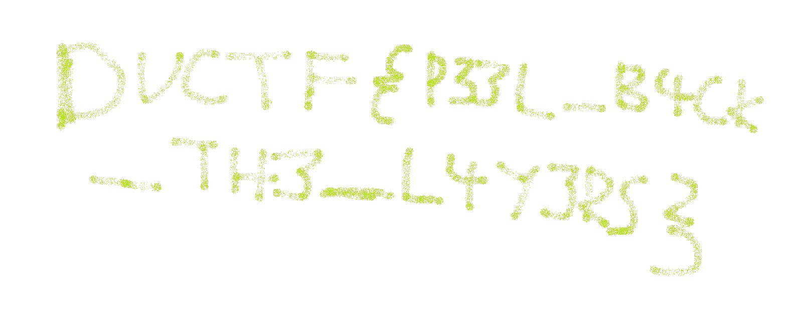

# DownUnderCTF 2022 ogres are like onions Writeup

## 题目简述

题目要求运行 `downunderctf/onions` 容器镜像。容器对外提供一个 Shrek 梗图画廊，但最后一张 `memes/flag.jpg` 加载失败；进入正在运行的容器也只能看到前四张图片。

决定性线索是题名中的“onions have layers”。Docker 镜像不是最终文件系统的单层压缩包，而是按构建步骤叠加的多个只读层。上层删除文件通常只会用 whiteout 标记把下层路径遮住，旧层中的文件数据仍然存在于镜像归档里。

## 解题过程

先检查运行中容器及其文件：

```sh
docker ps
docker exec -it <container-name> /bin/sh
ls /app/memes
```

最终文件系统只有 `1.jpg` 至 `4.jpg`。镜像内的 Dockerfile 同时说明删除发生在单独的构建步骤：

```dockerfile
# oops that meme is only for me
RUN rm memes/flag.jpg
```

因此应检查镜像历史层，而不是继续请求 Web 路径。先将完整镜像导出并解包：

```sh
docker image save -o onions.tar downunderctf/onions
mkdir onions-image
tar -xf onions.tar -C onions-image
```

`manifest.json` 的 `Layers` 数组给出从底层到顶层的 layer tar 顺序。逐个查看这些 tar 的文件列表，可以在执行删除命令之前的层找到 `app/memes/flag.jpg`；后续层只负责让该路径在合并视图中消失。将旧层中的文件直接导出：

```sh
tar -xOf <layer-directory>/layer.tar app/memes/flag.jpg > recovered-flag.jpg
```

恢复出的手写图片是本题的关键视觉证据：



图中文字为：

```text
DUCTF{P33L_B4CK_TH3_L4Y3RS}
```

## 方法总结

容器当前视图只能说明文件在合并后的文件系统中不可见，不能证明数据从镜像历史中消失。遇到镜像取证题，应导出镜像、按 `manifest.json` 还原层顺序，并检查旧层和 whiteout 记录。敏感文件若在某层加入、在后续层删除，仍可能随镜像分发；正确做法是从构建上下文和历史中彻底移除后重新构建。
