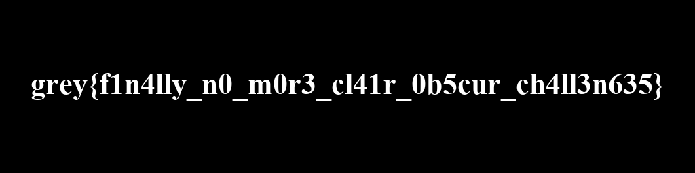

# Our Drafts Unite

## 题目简述

题目提供一份损坏的 ZIP、对应证据说明，以及一块被扣押笔记本的 E01 镜像。第一份草稿藏在损坏归档中；第二份草稿需要从镜像中的浏览器历史追踪到云端文件，再通过 OpenStego 提取。两张草稿单独看都是彩色噪声，逐像素 XOR 后才会显出 flag。

本题虽然包含 LSB 隐写，但主线先后依赖归档修复、E01/NTFS 文件恢复和 Edge 历史数据库取证，因此归入 Forensics。

## 解题过程

`broken_draft.zip` 的中央目录已被破坏，本地文件头中的 CRC 和大小也被清零，但开头仍有 `PK\x03\x04`，压缩方法字段为 8，即 DEFLATE。根据本地头中的文件名长度和扩展字段长度定位压缩数据：

```python
header = blob.index(b"PK\x03\x04")
name_len = struct.unpack_from("<H", blob, header + 26)[0]
extra_len = struct.unpack_from("<H", blob, header + 28)[0]
data_start = header + 30 + name_len + extra_len
```

ZIP 中的 DEFLATE 数据不带 zlib 包装头，因此用 `wbits=-15` 直接解压原始流：

```python
inflater = zlib.decompressobj(-15)
draft1 = inflater.decompress(blob[data_start:]) + inflater.flush()
```

证据清单给出预期长度 `787840` 和 CRC32 `a5f66b45`。同时核对 PNG 签名后，恢复出第一张草稿 `a_life_to_love.png`。

第二条线索在 `saved_c_image.E01`。解析 EWF 分段和块表，定位 NTFS 分区后遍历 `$MFT`，目标文件路径为：

```text
Users/verso/AppData/Local/Microsoft/Edge/User Data/Default/History
```

也可以用 `ewfmount` 配合 Sleuth Kit 的 `mmls`、`fls`、`icat` 完成同样提取。`History` 是 SQLite 数据库，查询 `urls` 表中的 Dropbox 访问记录：

```sql
SELECT url
FROM urls
WHERE url LIKE '%dropbox.com/scl/fi/%';
```

历史中有多条分享记录。把链接的 `dl` 参数改为 `1` 下载文件，关键载体名为 `a_life_to_paint.png`。这些赛时分享地址只承担文件传递作用，WP 已完整保留其来源、筛选方法和目标文件名，因此无需依赖外链继续理解解法。

用空密码和 OpenStego 的 `randomlsb` 算法提取载荷：

```bash
java -jar openstego.jar extract -a randomlsb \
  -sf a_life_to_paint.png -xd extracted -p ""
```

得到第二张同尺寸 RGB PNG。两张草稿各自没有可读内容，真正的合成规则来自题面中的 “unite”：先按 PNG 过滤器还原扫描行，再对对应 RGB 字节异或：

$$
I_{flag}(x,y,c)=I_1(x,y,c)\oplus I_2(x,y,c)
$$

```python
flag_rgb = bytes(a ^ b for a, b in zip(draft1_rgb, draft2_rgb))
```

最终图像如下：



读取得到：

```text
grey{f1n4lly_n0_m0r3_cl41r_0b5cur_ch4ll3n635}
```

## 方法总结

本题要求保留一条跨载体证据链：损坏 ZIP 仍可从本地头和原始 DEFLATE 流恢复；E01 中的 Edge History 指向第二载体；OpenStego 提取隐藏草稿；最后才是像素 XOR。每一层都应验证输出格式、尺寸或校验值后再进入下一层。两张噪声草稿本身没有独立视觉价值，因此正文只保留真正揭示结果的 XOR 图。
