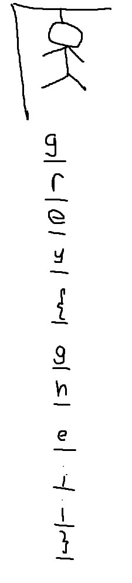

# Greycademy2025 solved_hangman

## 题目简述

题目给出一个名为 `flag.png` 的损坏文件，描述称断电导致保存结果不完整。目标是根据 PNG 的结构与校验信息恢复图片，而不是凭题面中的最终答案猜测内容。

## 解题过程

文件开头是：

```text
47 52 45 59 0d 0a 1a 0a 00 00 00 0d 49 48 44 52
G  R  E  Y                         I  H  D  R
```

前四字节 `GREY` 覆盖了 PNG 签名的开头；将完整签名恢复为 `89 50 4e 47 0d 0a 1a 0a` 后，校验器继续报告 IHDR CRC 错误。当前 IHDR 声明宽 225、高 430、RGBA 8 位，但 IDAT 解压长度为 891089：

```text
891089 = 989 × (1 + 225 × 4)
```

因此真实高度是 989。更直接的证据是：把高度改为 989 后计算出的 IHDR CRC 恰好等于文件原有值 `0x7ce30f31`，说明 CRC 未损坏，只有高度字段被改过。修复脚本如下：

```python
from pathlib import Path

data = bytearray(Path("flag.png").read_bytes())
data[:8] = b"\x89PNG\r\n\x1a\n"
data[20:24] = (989).to_bytes(4, "big")
Path("recovered-hangman.png").write_bytes(data)
```

修复后的图片完整呈现已经解出的 hangman 字符序列：



沿纵向读取字符，得到：

```text
grey{gheiii}
```

## 方法总结

本题有两处独立损坏：伪签名让工具拒绝识别，错误高度又让解码行数不匹配。CRC 不仅用于报错，也能反向验证修复候选；结合 IDAT 解压长度、颜色类型和每像素字节数，可以唯一恢复真实尺寸。恢复图的纵向布局是解题证据的一部分，因此保留并使用语义文件名，而不是把它降为一行无上下文截图。
