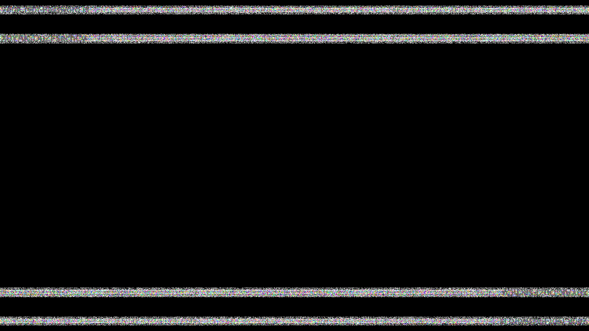

# 日常

## 题目简述

附件包含原图、盲水印图和一个可正常播放的 OGG。盲水印给出 VeraCrypt 密码，OGG 尾部藏有加密容器；容器内又保存 Chrome Cookies、Windows DPAPI Protect 目录和 mimikatz 主机信息。最终需要恢复 Windows 登录密码与 DPAPI Master Key，解密 Cookie 中的 flag。

## 解题过程

`Origin_pixivArtwork75992170.png` 与 `Blind.png` 分别是盲水印所需的原图和含水印图。使用 BlindWaterMark 的解码模式：

```powershell
python bwm.py decode Origin_pixivArtwork75992170.png Blind.png wm.png
```

提取图中的正文字符容易受噪声边框干扰，因此保留这张具有实际视觉辨识价值的结果：



放大后可读出：

```text
VeraCrypt Password is X0YAlGDuZF$echCy
```

另一个附件虽然能正常播放，但 `binwalk` 能在 OGG 后部识别 ZIP 数据：

```bash
binwalk -e suspicious.ogg
```

提取出的压缩包包含名为 `Container` 的 VeraCrypt 容器。用上面的密码挂载后可见：

```text
Cookies
ObjectNF-PC.txt
SID.zip / Protect 目录
```

`ObjectNF-PC.txt` 是 mimikatz 输出，其中的 NTLM 为：

```text
1563a49a3d594ba9c034eee831161dfde
```

按 NTLM 模式进行字典恢复，明文为：

```text
happy2020
```

接下来有两条等价路径。图形化方案是在 ChromeCookiesView 的高级选项中指定外置 `Cookies` 数据库、对应的 `Protect` 目录和登录密码 `happy2020`，让工具代为完成 DPAPI 解密。

命令行方案先用 mimikatz 解出 Master Key：

```text
dpapi::masterkey /in:C:\Users\ObjectNotFound\Downloads\protect\S-1-5-21-3375469711-1363829938-1291733684-1001\20dfa1c6-d232-40cd-89ec-5678b380920b /password:happy2020
```

恢复出的 Master Key 为：

```text
d96b6c13bda8659a94dc8993a14f7ec53395848eff271999d734adbc7880633f9684c38789c67b57f14b9834c852f11f80c14ad15f755ab990691fc9fd710b4d
```

再解密 Chrome Cookie：

```text
dpapi::chrome /in:I:\Cookies /masterkey:d96b6c13bda8659a94dc8993a14f7ec53395848eff271999d734adbc7880633f9684c38789c67b57f14b9834c852f11f80c14ad15f755ab990691fc9fd710b4d
```

两种方式均得到：

```text
hgame{EOTYNvv&Hxf!ZoCKCY!K14hK1kQ*cgP4}
```

## 方法总结

- 完整链路：原图差分盲水印、OGG 尾部 ZIP、VeraCrypt、NTLM 口令恢复、DPAPI Master Key、Chrome Cookie 解密。
- 关键细节：DPAPI 离线解密需要匹配的用户 SID、Protect 目录和登录凭据；只有 Cookies 数据库本身不够。
- 分类依据：题目虽然包含图片隐写开端，但决定性工作是从容器、凭据和浏览器数据库中恢复证据，因此归入 Forensics。
