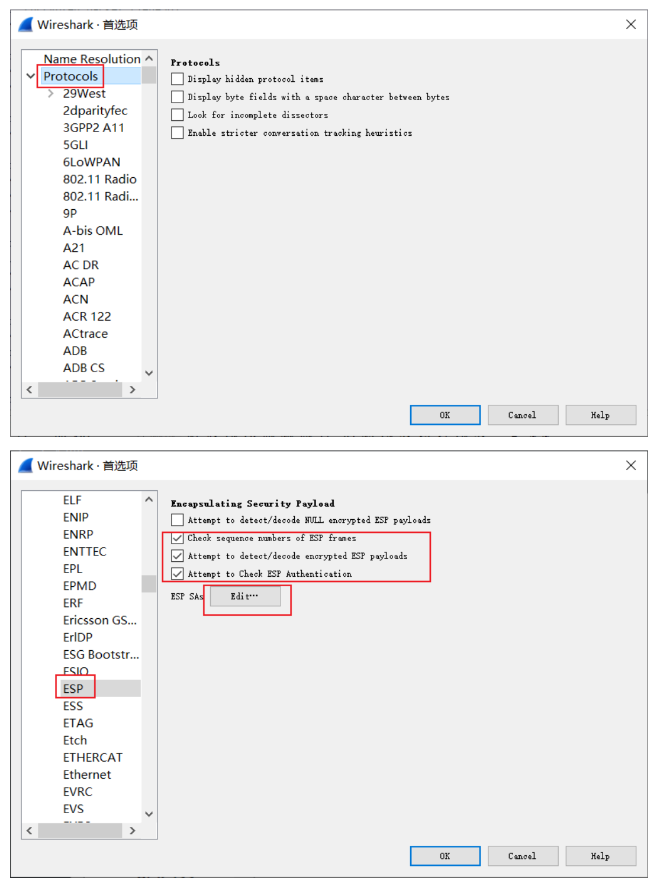
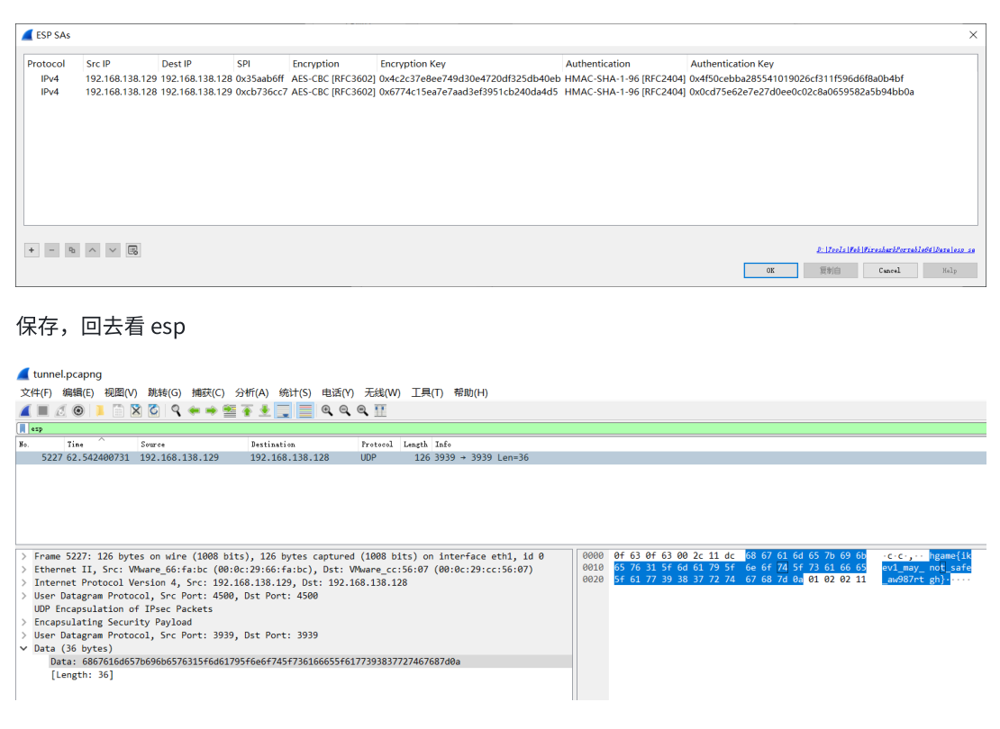

# Tunnel Revenge

## 题目简述

Revenge 版本修复了 `strings` 直接检出 flag 的非预期。附件是一份网络抓包，其中包含大量 TFTP 流量以及 IKEv1/IPsec 的 ISAKMP、ESP 数据。TFTP 传输的对象并不是普通文件，而是 Sysdig 捕获；其中记录了 strongSwan `charon` 进程写入日志时的系统调用。目标是从系统捕获恢复 IKE/ESP 的安全关联参数，再让 Wireshark 解密 UDP 载荷。

本题跨越 PCAP、Sysdig 与 IPsec，但决定性步骤仍是从既有数字证据中恢复配置、密钥和通信内容，因此归入 Forensics。

## 解题过程

### 从 TFTP 流量提取 Sysdig 捕获

在 Wireshark 中选择“文件 → 导出对象 → TFTP”，可见约 25 MiB 的 `ipsec.scap`。把对象保存后，使用 `file` 或直接让 Sysdig读取；有的复现把它重命名为 `charon.scap`，文件名不影响分析：

```bash
file ipsec.scap
sysdig -r ipsec.scap -A -c echo_fds > fds.txt
sysdig -r ipsec.scap -c spy_logs > logs.txt
```

`echo_fds` 输出进程的文件描述符读写，适合恢复 shell 历史、配置文件等上下文；`spy_logs` 聚合写入日志文件的数据，适合直接搜索 strongSwan 的密钥调试日志。

从 `/root/.zsh_history` 的痕迹可以确认操作者启动了 IPsec、在 UDP 3939 端口监听，并用 Sysdig 的 `spy_logs` 记录运行过程。恢复出的 `/etc/ipsec.conf` 核心配置为：

```ini
conn test
    authby=secret
    auto=start
    keyexchange=ikev1
    ike=aes128-sha1-modp1024!
    esp=aes128-sha1!
    left=192.168.138.132
    right=192.168.138.128
    type=transport
    leftprotoport=17/3939
    rightprotoport=17/3939
```

这说明目标是使用 AES-128-CBC 与 HMAC-SHA1-96 的 IKEv1 transport-mode IPsec，会话明文在解密后表现为 UDP/3939。

### 恢复 IKEv1 参数

在 `fds.txt` 中搜索 `checkout`，可取得 initiator cookie：

```text
620270aca82ca7ad
```

在 `logs.txt` 中搜索 `encryption key`，可取得 IKEv1 解密密钥：

```text
99EF15AC696A5CC9442E8A8A54038674
```

把二者填入 Wireshark 的“首选项 → Protocols → ISAKMP → IKEv1 Decryption Table”，即可展开 ISAKMP 协商内容。这个步骤用于验证会话和协商算法；真正解密 flag 所在的数据包，还需要配置 ESP SA。

### 恢复 ESP SA

从抓包可见目标 ESP SPI 为 `0xcefea138`。在 `logs.txt` 中按该 SPI 定位，可以同时找到协商算法、流量方向、加密密钥和完整性密钥。两条方向的参数如下：

| 源地址 | 目的地址 | SPI | 加密密钥（AES-128-CBC） | 完整性密钥（HMAC-SHA1-96） |
| --- | --- | --- | --- | --- |
| `192.168.138.132` | `192.168.138.128` | `0x0347745e` | `861C6AAC7AC8CCA9FD5AEC0A2C140B77` | `20317DCB964A34CC2F9552BD514A93EA17F5CE68` |
| `192.168.138.128` | `192.168.138.132` | `0xcefea138` | `C2A6380A104C87C19993140DA597451F` | `37D1431255CCE7A6A53C8E1C113C3EC045007287` |

这些值来自日志中的 `initiator/responder SA seed`、`encryption ... key`、`integrity ... key` 与 `adding inbound ESP SA` 行。录入时必须保持源/目的地址和 SPI 的方向一致，不能只交换两个 IP 而复用同一组密钥。

打开“编辑 → 首选项 → Protocols → ESP”，启用加密 ESP 载荷检测和 ESP 完整性校验，再进入 `ESP SAs` 编辑表：



为每个方向分别选择 `IPv4`、`AES-CBC [RFC3602]` 和 `HMAC-SHA-1-96 [RFC2404]`，填入上表的地址、SPI 与密钥。保存后，以 `esp` 或 `udp.port == 3939` 过滤流量，原 ESP 数据就会被解析为 UDP。

官方 PDF 明确说明其界面截图来自旧版题目。下面的图片只用于展示 SA 表和解密后 UDP 载荷在 Wireshark 中的位置；图中的地址、SPI、密钥和旧版 flag 不能替代 Revenge 的上表参数：



使用 Revenge 参数解密后，UDP 载荷为：

```text
hgame{ikev1_m4y_n0t_5af3_3kogsr9w5k}
```

缺失于官方简版 PDF 的新版 SPI、两组密钥和最终 flag，可由[出题人的完整中文复现](https://crazymanarmy.github.io/2023/01/31/Hgame-2023-week3-Tunnel-%26%26-Tunnel-Revenge-Writeup-CN/)交叉核验；外链中的关键数据和操作已经全部概括在正文中。

## 方法总结

这道题的证据链是“PCAP 中的 TFTP 对象 → Sysdig 系统捕获 → strongSwan 配置与调试日志 → IKE/ESP SA → UDP 明文”。难点不在单一工具，而在识别每一层工件的语义并保持方向信息一致。遇到无法直接解密的 IPsec 抓包时，除了寻找预共享密钥，还应检查端点日志、调试捕获和 `CHILD_SA` 安装记录；ESP 解密真正需要的是每个方向各自的 SPI、算法、加密密钥和完整性密钥。
