# [REDACTED]

## 题目简述

题面说一份机密 PDF 被做了“完美”脱敏，要求恢复四段敏感字符串，提交格式是把四段去掉序号后用下划线连接并包裹为 `hgame{...}`。附件是 `manual.pdf`，其中包含黑条遮挡、特殊字体映射和 PDF 增量保存残留。关键题目信息是：视觉遮挡不代表文本对象被删除，字体 ToUnicode/CMap 也可能被用来制造复制出的乱码。

## 解题过程

推荐阅读：
- [https://pdfa.org/a-case-study-in-pdf-forensics-the-epstein-pdfs/](https://pdfa.org/a-case-study-in-pdf-forensics-the-epstein-pdfs/)
- [https://pdfa.org/presentation/in-defense-of-the-incremental-save/](https://pdfa.org/presentation/in-defense-of-the-incremental-save/)
- [PDF COS Syntax 插件](https://marketplace.visualstudio.com/items?itemName=pdfassociation.pdf-cos-syntax)
第一块黑条可以直接选中复制。

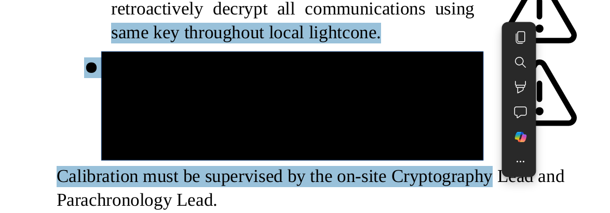

```
1
 In case of an undampened local
chrono-logical  shift, initiate
the SCRAMBLE protocol with
passphrase 1:PAR4D0X before
notifying the o
```

第二段也可以选中，但是复制会得到看似随机的内容。

```
4. Engage aperture containment field at 4.2e14 ± 0.1 T. Start chronon
injection sequence by entering the confirmation  token as follows:
...ZJH/;CZ`+CV;]xXD;+CZD+rHCZ... FoT?&/$U+UT;s6;aCU;*;#]g$`;};h>LI`T,jFoTE&[a
_)gh;ERUxE>J&/2i&iC?$-]'sP;K_[I-1`T,j|
1~0H>+U$|V/'!~S+US0zs2UJr,okm*]$"UhC2L2#*_ ...ZHCiZ`+CV;]xXD;+CZD+rHCZ...
```

1. 解法一：使用Word打开PDF，发现该处字体与其他区域字体不相同，名为FreeMono Trimmed
Scrambled：

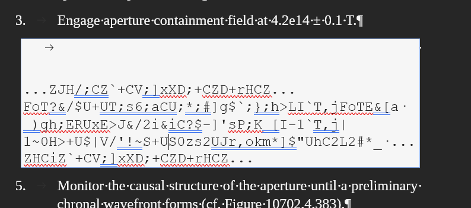


推测使用了字体映射反复制。猜测该字体的family name也以FreeMono开头，在PDF对象中找到相应
的TTF字体与映射表：

```
97 0 obj
<</Type/FontDescriptor/FontName/IAAAAA+FreeMonoTrimmedScrambled/Flags
5/FontBBox[0 -186 600 669]/ItalicAngle 0/Ascent 668/Descent -186/CapHeight
668/StemV 80/FontFile2 95 0 R>>
endobj
...
99 0 obj
<</Type/Font/Subtype/TrueType/BaseFont/IAAAAA+FreeMonoTrimmedScrambled/FirstCha
r 0/LastChar 57/Widths[0 600 600 600 600 600 600 600 600 600 600 600 600 600
600 600 600 600 600 600 600 600 600 600 600 600 600 600 600 600 600 600 600
600 600 600 600 600 600 600 600 600 600 600 600 600 600 600 600 600 600 600
600 600 600 600 600 600]/FontDescriptor 97 0 R/ToUnicode 98 0 R>>
endobj
```

分别使用zlib解压缩两个deflate流：
[Charmap CyberChef](https://gchq.github.io/CyberChef/#recipe=From_Base64('A-Za-z0-9%2B/%3D',true,true)Zlib_Inflate(0,0,'Adaptive',true,true)&input=ZUp4ZGs4Mk9tekFVaGZjOGhaZlR4UWg4SFdCR2lwQXl5VVRLb2o5cXBnOUF3RW1SR2tBT1dlVHQ2M09QMjBwZEpQb3d4NWZQVjc3NTlyQTdqTU9TZnd0VGQvU0xPUTlqSC94dHVvZk9tNU8vREdObXhmUkR0NlFuL2UrdTdaemxjZS94Y1Z2ODlUQ2VwL1U2eTcvSGQ3Y2xQTXpUcHA5Ty9sT1dmdzI5RDhONE1VOC90c2Y0Zkx6UDh5OS85ZU5paXF4cFRPL1BzYzduZHY3U1huMnV1NTRQZlh3OUxJL251T1ZmNE9NeGV5UDZiS25TVGIyL3pXM25RenRlZkxZdWlzYXM5L3NtODJQLzM3dXk1cGJUdWZ2WmhoaTFNVm9VOHQ1RUZ1VnlBM2JLSytVVitRVmNNcjhIVjhydURWd3o0OEF2eWxVQmZtVmVNeHZXcjhCdjVCMTRxMXhyL1IzWGxkOVpjd1hlTXlPUmJjRjExTEgwcitCamt6L3lsdjVPMStrdm1rLyttcUYvV1lMcFg4UGYwdDlwbnY2VkJkTmYwQk5MZjlFOC9hc2FUUDhhNTdMMHIzQVdTMytIUGt2eTM0THB2M29GMDE5MG5mNFZ2aVdwLy9BVStwZm9wOUJmMEdlaGY0bnpDdjFGYTlLL1JOK0UvazZaL3BWbTZDOXdGdm9MemlMMEw3VSsvVmY0cnFPL1EwOGMvV3M0Ty9yWE9LTkwvY2RlbC9xditlU1B2am42MXppam8zK2w5ZFA5Z1k5TDkwZjBNcWRiaTJ1TnVmc3pMcWE3aHhCSFJZZFRad1RUTVl6Kzcvek8wNHhkK3ZzTnhEWHc3Zz09)
[Font CyberChef](https://gchq.github.io/CyberChef/#recipe=From_Base64('A-Za-z0-9%2B/%3D',true,true)Zlib_Inflate(0,0,'Adaptive',true,true)&input=ZUp6ZFdYbDBXOVdadi9mSnRtVFpjYXhZOHBJcko4OTJ2TVcyYkd1eHZNWDdKdSt4WlJNblRtTEplcGJrYUVPUzdUaFFRa2xnVWlobGF6SUprRUttd0xRemNPaXd6TkFPWjZaMFdscm0wTEpNeXg5RHlqbFQ1Z3gwRHVjTUtRZEtCeUxQZCs5N2twKzh0QjE2NXAreHlIdDMvN2JmdDl4SE5Md2tvSFIwSzFLZzdIbS9JL1RqSnk2ZVF3ZzlqQkRlNWZhdExuUS9FYnNYMnQ5QktQZWNSM0M0dnZGUVpUVkMrWTJ3cHNFREE4MXJSUXJvaDZDL3orT1BudnlSTW91RC90ZWh2K3dMemp2T1h0bC9DYUdDVE5yM08wNkdtcEVOUS84czlQbUF3eS9Zemp6MlB2UWZReWpuYjBQQlNOU0l2cnVHVU0wc25ZZC9HSDcwRC9iak5Ocm5GQ21wYVVwVnVqb2pjMGZXem16TnJoeXRMamN2djJBMzBSZnUyY3NYRlpmc0t5MHJyNmpjWDFWZFk2aXRxemVhekpZR2EyTVQrdi95bDRJcTFyN0QxWEZuVUNHcVJEV29IalRYeHBtTXVUcHRtbEtuTFNrK2dOdXd4VnhXVXN4NmxoeVkwcVpWNGVJeWM0TlNVNlFwTGRJVTNhRnVhNjhZZC9ZZjArb09qWXkzSGVqUjZpNlIzWHY1QW5qcy9TV25paFhnbDJQTm5FWlJtRDNWMnpoY1hVbElUMmx2bGJHOUdGcXhjL3BxUGZ6M09QY3YxMnVLdVBzUXRkSUE1cmhzWEFWSVFyaW8yR0kyRlJsMVd2eHhMRUFJdnA5Z1RxZlY2aEJnckFvaHJwQXpvVnkwRisxSHlLb3BFUmNEOTBvcVFRbmJERHczZ0FoVkdKc05YQlhXUWZmbUJqaUpzem1uVGp0NllqOGo1UGdESFJPRDFzZndtS1pzcE9IODY1YkJTdnh2T3UxazI2Q2h4dFYrR0dobnR4cXFXMkwzNk1wSzg5N3JaRHhTMmlxZ1hRa2EweFVCR1dNaDQ3VUZTMXlJMml2U21jUTUxbnNjTit1MHNUWkNHaWdEVDBINzdmdW9NRGo3dlJWQ0hnVkNRUFl1UXB4djFCQnlocEFheEdpMXIzM0lHYmtPVkF1ZDRpd09Ec3MxR2EyV0VrWU9WQU5DcFpVVWx4M0E1Z2FUTVM5QnI5eUFjVXZiNGNwZE4vdjZiSERxRC9UNnJNT09teDY0MnovZkRWUnpzR0tPeTJzWTdjaTFMU3dWWDZCOFBHWCsydktnOTFKREZpRkhTRUZaQTlDK0VXaStCM0xtd1Z0akFtSWxTVkxTQWR4eGwxNGZlNG1RdTRBSWJ0ZnJPWFZzcjFZblNrTXRSV1hJQlgwWjRaeGloSXBLeEpNQVJvbVRXbkQ4elNid3grYllhME9FWENDa0dGUzFpT3NIOWZyejBNR2Z4dXJqUjhkVStEV0pnS2lqWE5BUjJDWEgzS2JZb0llUzRqUlJhdzNXQmtvNml3TjlXZG96aW8ySG00UUJuVmEzaTFPNHV5ZVhienRrbnFoSVQ5ZnlabnYxd21YY20yTWRiSzNxTFNRa1JQSU5QYWRuK2cvZnZyOU9uWk5lVnNWZkZvQXVoMHhBdHhUb3FoSHdnWm5qbEZEdnlDdE9ZL1FBZWJoNjhaNzczWjc3N3ZOTW56bzFQWFhUS3RmeDFPblZ2Mzd5MHljckw3eDU0YnpiZDBHR3AzS0twNDNhMlFaTmQrcjF2NWF3OUFOUXg4djNNYzFrdnhkWFVES1NPRVpqQkdqc0EwOUgxazFVV2hqN3lqMDRUNXd4NEZvYzk1M0h3UmgvSmRMNjFIYmlydHFPQTNzSmFlcWFham9iSHZSTU5WejY3TTA0MGFQdGpqcCs0b1JXZDhxOXU3S25ycVpYdEg4RzBENEl0Q0hlbDVZb1NyWUFBTUhpV1BJVTdqTThvcEtNWDBESS9PVUhYWVFVRkJNQ0E0T3FiMlBIT3RSaWorRlpyUzdlQjNraGZuQmpRSk1IaVZGcGtWSjJjSTVJTTBjMlZLNG9VZUFuWTU4MGpCSHk1NFRzZmZZa0lhLytxSlNRaHdrWjdnL3Q5TDM0UUp6UzlVOW82MFZjR251YnhTdWdrdzEwOUVBbGlmbTQxYlRNTzB0d3A1ZVF6d2p4L2lVYzh4TnRldVlUbGVLSk5rTENZYkl6MDRZU3NhVVZ6ak51WXlYbThhV3lqdHhtNVRKVHdXc0k1OWZvOWN0NmZmWTd0dkhHUmtKdXNFNzMvL0s1ZGZmODNlL284K1U5L251MXVvc3JlUlFuMUpkVStHbncrVUtxdHoxWThoc0ozQllhWm5KVGl3eTRPQTNDKzF4RzRHQ3RjNDg2VFpWeFQ0OXc5OWs1NGRiWUhGN09YTGpmOWVPeDQzdnlsWm1xM1kzbkhFZHVPdDNSTTNHUXltZGE2K05LOFJWVUNyRkFJUk9EWUhrSWtBbU9kNytZVFVpRUVQTmpWMEFzeUFOWmE2aVRFRUQvYVh5UzhoOTdIZy9SOS9YZlVzbUFoaDFrNkFjZEZ0SzR4ZGd1RjEySE9hVThlcjBhSEttYmJ0QnBoMndIcGg0QlY2b2dCQUxZUTRNbkt1c0JZN2YxVERSallUMk9VZHVVYzdQVWd6RE5pMms3OFJZbTByUUIrN21GU1RJODMyUGRiNjNNQUd1Y0pjUUFZaHd2NnpQMHpVQ2YraWZtYTVxSzZuYXNVZlk1TllCNXpWQTJkdUMvbVRUVUpya2dUeUhRelVjbEVDRTBDV3VVNjBwa2NTSjFQZXJjYXp0eDVKYlRod045eDZVUW9SbjBlQVp0WGpjM0cvdkFmZXZSWTJjOWgwUlNieTFlUExFNE9IcUN5VWYxbGdlMkI5dVVTbUZ5VTFZQnFYVXNCVFVZYzdtOFl1dmhXdWZwMjF4SDIwRkx1eFNLbysyVGJzK0VmMVNkblhFb3ZXamY3cHZuNW0rMTd0RHJqNUQ4Q3F0N1lrd1lVR2NnSmhQVVpmaHpMb1IyMGV5d1JYYXg2a29zdU9OUlNDN2dqNDh1RTNLNUJWK0puV1BZSGROcFgvTjRSSnRVQU05MVlPdlNoSzB0Y2xmUmFOZHR6b1pLOEVjUisxUllDaUpIdXJ0bUIxa1R6UDcwVkRReWpROHlTRDNkTTN1MFcyeUxkQ0x3K0RYZ05nZmVPaHhQK2hZcytUbisxOWdiR0hpTDNZbHJQb09rZm1WZjdFbHdPTWMrYkxjU01pZWVJZVpUMTJhSmxhSnJ0V1BjQ1hFNzlwSmVmOWVOcWgycWpJeXpuT3Y2anhnc1VtRkFuWjV4bHA3alh2c1FYd003TllDZHpBYkZOa2JhbzVCQXdoZ1VaNmt5OEE5NzV1WjZISU5UWm1hemxJR214a0U2RXB5YU8wQkpIZTdvT3JSVVdwR1ZiYXl1N3pDazZQVzlKSys0b29yZncrL0lhYXByR21ySUlHU1M1Q3FMNjgzQWk0WFdZY0JMUGF0UFVwVmJPSVJ1czBQUXpOaStxNmhRbTVlZWcybVcwdXRyd0NSRFZWMjEzWWVoNFllSTM0bnZVTzdja1o5UmdLL0hyZDViVnpMYUhLTzkzMWExaURxZFc3dUdQd0xmS0dQMGFSRFJGSWxCTXVFbUJvNHFhSStVejNCcmVWc1pVTjJ0MTErenRZeTRJalBsSXlZK1U2WGNQMnEwelk1aEoxd0Q4QTRhRlFQMlk2ZnlpL2pzekxJeTUxaTNYY1R0T2FBWDR4WWh0bFJUaWhBRnNxQW16ZHNZSWFHTjR4UmhpUUsvcnlqU1Y5aUg2N2tEM3A1NWwyMG05TzJiK05xTTJJOTFnNjJOUTBQbWd2bzlKZW1jS2F1MEo5cWZXbllxTUh3dzlNU1o4Myt2eTFKbHhyNXk4T0NoanBicC9JTDZiS2ttWkxYdkxLMC9yZklRQUMrclBEUGt5VFBjZDZWWWNQeXBYSWhzaE5SZWZrMHNEL1RQUGZlY0ZIZSs4Z0FGL0psWHFZYWZRVkxzNldQMkxVUVZ0RHBocGhSaHRhbFFTV1doUVF4QUZSTk5SNzkweTJ5bzIwbklTN0lnOUhYUEFyNHlZYTVlZmViVTNHY00yT2s2TFpudjY1OTM5dG1jMUorQktQVm5Fd2lheEw4OGcxdkxaV0xteVdYR3ZmK29JUVNDYk52amozVXc4VFF2UHJ1VHBZMnFoeTZCd0VGQ2RtS2VaWXEzM21KSStrOHE4eXV2TUZmSGlicUJiTWhQT2FZY1dVK0JNMzZ5bDVVS0k5OVR2RFRLaXRXOWIxQWQwaUpFVEs3WFA5bUVGNnNSSExDTnM1akxrNUFpdHZGNmNHMVRmR05MdU9BbU9Wd3F0a0lMWHBHakJhTmZBZjFsRktVMVdLbnNBb2ZMMVlVVkZZWDBFUzF0TEN0ckxBVmVsOWI2OEpNUWszTll4UyttU1EzYndRUnZzQ2hvVUQ1ekRXeTUrNGFlTHhOeXE3RlQwVUtUY0t5N0R4SktsNG43YWp3dWc3dmdkMER1WWxxVFMzSkN1a3dFVHF0MHQweGpzYy9qSDdFRkxVZGVZM2VrNVEvNnFxYWJUSk9aYVR1Vm1maXRHcmVucDJaczZpWEZQdEIyNnp1OWJjWG0wZFlhYllhVWt5RVdmc1RxV2lRVmRKcEVyUi9YcmVRY2xMVHVlMWNKdWRwcTNuKzhVSjJtelB5empuNDdGSmlERUY2dWdPVStMalBrYWRJeVZiazEzWTE0aDA0TEZ6TldzNEFoUzRFR3hKaFNPZXd0aW0xaDJDVlZlOC9tTThpVlhUeGZvZGNEQ1BOanY2Q2crd1hPcEJCNTk5M0VIUVl5UGRmRDZsVmtTcTZMVEVtbGthSWtBNTlxQlVTZjErdVBOb2JhL0UxekRIMDcyenBDRVFtQSsvQzUyRWw4VlFRaHZqY1dBdHNPUUo3TUJqL09ZTmxIQnJ1a3k4cmMyVHVPSGIvOTl1T2pmdi9vU01DSG56NXpmUGJMdHgyYlBWUEo2b1N4UlpUUUIrUkNlSmQrRVIrMXZaRE9mTFR6b2NzOWhOeE9TUG9MMzFReVBSbnUrRW9kYzFibDI4OVFQWjAvejBMUlpTcktiYmVKeXVJUzk2VWN1UHRMTjM5NmY0SDhKbUxWSk43Mk5WUXFEMlNUcTQ3YmIzZUEzZkdsWGVVSExmZGNHQWl4Ty80RGk0MG5JT0JobmJiVlpvcnR2WG1jeWliV0piTlFsMnhWbGF4WEpFdFFNc3hlLzJtOFpHTjYyUU44TllOZWFPd28yVDU0NFBHK2IxVkM4TkRyT3kva1BBQWF1RWhJcFZUSy9nMU5jL0dhdzhMcVRURVdGbTE3R1NpU2Z3elFKRldkc2Q5QTNQMHE1RmE0UGNHTnBnRm5OYkJHZ1lHUXUybC8vYjZvMWIzeGhoaTlwTEpUSmc5UDVjbkFKUnR3bVpjazFIZU5SMlpNOWh4bVJzdkF0R21tMThqYU9WZ1J1eTVKOTMyMHRvWTdFcGgzdytNYXlBZTlTbXpCbHNSTlY0b1RPbnd0dG93SFloOUJRWFUwOWdKdTF1cGE4S3NLdU5BODBod3pwOXhOdlZPOHMvUngvWUJ0UGIxQlk4dm1xNlJGdkplYmpFb1oySDhxSlVSSVQ4N3VHMmR2dWVWb01EamtkZzhOZXQxNGJDSituZmhzN3RRenE1WE9yNG41aVdHUHhadDhWTFRkUFJvOHF6eHhkMTYvcDM4NDdsK2VPbk5INTdHcGx2UHYvVU5jNzhlLzZxZ2NOSnRzOGJ0WFAyQXZqOWI1Y1FFU3ZPY3hPNXVVVW81Z01ueENFM3AvY09iMDZabkFBTFMvQkNsMmFORGpGcUU1NHozN3doblBCN1RLSHg1WlhCd2FYUlR0T2dzeDgzT3VBMWxaL1ppeVhmMllzcUYrekdNRkRYN2RQSEpreE93ZG0yNEZRMnF4WXFLNTdTQWJpaDVlaEd1QUxnZHp6cDYrbzVmMm16VzZ2SFpqMTB3TGdNSk44bXRhdStyTDZ6UjUrZDBtMjdFQjhidEtmWThONVBheVhFSGxKdlRPYWNreFNiSW5CVnNOWE5GUHhxNzl1eDA4dXJpWUpkL2gvTmUvWFl2UHhwWjEybHVwUXVrbmdVZmtOWklKRmRBYjArWnZkT0pkNEYyc2dYeHpBQXIwT1hhaHBCK3ZIaVhrbGNUbks1WmZvUDRSZmNBaXp5WXN6Y1NEanhncDhOL1puYTAyYWhKTG1Xc1M4a29FMk95YUdHakJxVURtelRMellkWTRKL3EzQXQwSXVmazl5SkVhQ2JrMEtOT1liS1Z4bVlib3NuVmJ5NUc3RWdvOEdBZ3RlTy8xbmd5UGpUVTFqcDg3TURWMW9IWGFqcHRNZ3MzdHRybk01a1BkVG1mM29aL2JMUFc5UGZXV040ZERZMlBXcG1IWjl4andGMnU4b2hQTFYwbnBHdmJKZDZ1T0xCQ0dDdXI0amlKcmMxVWJpRGhZc2R2WVFOL2x1NDFXV3IzdlpnYkNWOHo3OXZUM2QxVEgvZ01jdUYxZk5SSDdHQnF0aFRXc0laYjBsQitrdW9yUTRTZSsrZTd4bmEwZm93ekYrNVROZjNwbjVyL1dQMWFEaHgva3prQkRCWGdSLzJDZmdsOXJsSDNSeGh1K2NHUHVFTlNUQTlDcWdsODczTDl5NFdsaXZReW85QWJZcUFscWxTcVlzVVBzcjRCNzNvMFFseXhvRHAyRHVWd1lTWWZXcjlBU1cyV0NQRDNBVHBpRjZHaUJmMjVZUlUrWkJSVFQxbzJJRlNab0VCMkQzOFBvVFp5TnpkaUZIOFUveEo5d1ppN0EvUVgzendxMW9sbmhVMXhVL0R4RmxkS1c0a3k1a1BKQ3l0WFU0bFJuNm9PcFY5TjJwUTJtM1puMlROcHZsQ3FsUWVsVWZsMzVzdklUbFY0MXE3cFQ5UzNWNituWjZSM3BydlFIMDMrUy9ybTZSeDFRMzYvK3Z2cnpqQjVKQTgyb0VhVWdNVExTZm5xU1luSnhWcUo3UzBKbkdPMkdIcFoycGFDTFVsc0JkOHlIcFhZS3JIbFRhcWVDWDMwZ3RkTlFQazZWMmlxa3dJVlNPd05WWVY1cTcwaDVCUTlKN1N5MEwwMExKK01VNEF4OW50WW90VEV5SzgxU20wTXFwVWRxSzVCUEdaTGFLYkRtcXRST1JVWlZ0dFJPUTNXcUxxbXRRbW1xc05UT1FOT3FrMUo3Ui9yOXFwOUo3U3cwc0d1dU94aGFEWHZkbmlodnJLc3pWdE9uaVQwdDdObkluazMwV1YvSG5rYStmM1NLN3dzTHdrSXdFT1huNFJIMk9wZWl3WERFb0phZlptemdKNElCTjkvbENQS3RZV2dabkk1Z3gzekU3d2hFZllJaEdneTFHZWd4SThGQWtMZUh2WDYvNE9JbjU4TU92OU1udUxxQ3dSTjljSFpmTU93V2VLT2hqbS9tdDE4Tms2YjZtdm9hU25YN1ZkTkNPT0lOQnZoOUU4S3lsN2FhZWFPeG9aSGZGOThpN1Voc0FFazkwV2dvMGx4YkczRXNPd0lCaDhmZ0Rpd1pnS2ZhVURpNEtNeEhJN1VMa2lwcTdSNXZCUFRoRHkxRmhURFB0QU1ESVVjNHlnY1hFbHFqUWhsNDNzWW02VjQrRWx5SXJqakNRak8vR2x6aTV4MEJQaXk0dkJGUnJRTHZqZktPZ0tzMkdPYjlRWmQzWVpVT0xBVmNRQ0xxRVhnZzVZL1E4Mm1IMHVnWEFrTFk0ZVBIbDV3Kzd6dy83SjBYQWhHQmR3QW5kQ1RpQVkwNFY5bHl5ZzQvS1ZIbis0SndxaU1LYXFubUJTL01oL2xsU1dHbU9BSHB0R29ldUtsd1JDbkRZVDRZb3BzcWdjdFYzdWVJcnU4enFOVk1KM0ZWckF2bDRyMEJkcUFuR0FJWlBIQVVTTFhpOWZsNHA4QXZSWVNGSlY4MUR5djVHMnoyZ2JFcE85ODVPc1BmMERreDBUbHFuMm1CbFZGUEVHYUZaVUU4eCtzUCtieHdMRWdTQm55dFVvWkhlaWU2QjJCOVo1ZHQyR2Fmb1R6MzJleWp2Wk9UZk4vWUJOL0pqM2RPMkczZFU4T2RFL3o0MU1UNDJHUXZHR1pTRVA2UUxoZVlMVUJsTGlIcThQb0E5K29ac0Z3RVdQSzVlSTlqV1FBTHpndmVaV0RJQVlnSXJmNHhCdkpSWjZHQ3dVcEphUlFuQzN3Z0dLM21JOENXbW9jL0NrakE0OHJLU2dLS1B2R0lTSzFhM1JrQmlwR1FNTzhGQ3NMSmVTRWtHdFM3SUlJckxJQ0JZSWtyT0wva0Y4QXNLeDd2dklkcVBMSk90cG9DamhmOFR1QS9NVWpWdHhSdytNQytNQndLaHVuQkV2SVNOZzVFZzB6TytQSFZza2xYRUdpQUxCUjkzbWhFOEMwQTFvRXcyeEFXSWt1K3FCYzBrT0FNamdJc3pBZVhHVUVKc3RzcjBNQXpyQ1ZrWHFmbkNhNEFUc0xBM2JMRDUzVXhCUUJVZ3d6aW9KQUlsV1BGczVyRU9lOW5ZZXgveDRGTjFMTGtweko5c2xISEtuQVhGUUtTVXRjNUJVbVpJOFhkVFFLTHVKVTZBZDFPWFpSS0V3U1NiZ2QxSWRqbUNrTDBTTkNGSGwyeEFrNmVtS3dHa1BxRXFMQ1JaaVFLWnpCQkY4SkJmeEo5d3hZUW95RDJDUXZSV25mSUIvTitIK3BHUVJSQ3F5Z01PZCtOUENnSzFhRVIxY0hQaUtvVGJaT3NiWkcxRzJYdHBrUzdIdjZ0dDQzUTZrZWphQXJlZlVCSGdOOENVQTB3V3ZOU2k5SjNRbVVTaFg0WUtoY0RVbS9MbXhFeU9ZOG0yRTQzdExxUUE5bzhhb1dWNHBnQnpxSmpIWEIrQlBtaFRXbjRnTEtCVVFpaE5takZ1UmxodStnSmRrYkxEejhCdWFBL0NmdkRzTnNQNS9uWVdCZXNDNklUc0Zma3U0L3g2NFk1eXBzQnVPT2hhdUcvME5uaVRoUG9ySWI5aTh2NlJjNmFoaWZWbzVmdG9mL25jQUpHbHFFZkgydG1ITlB6RzluOFJpckpORFpURUcxS3JSSUZmVWJndkZyNFJXRE5NdE4zQUo0ZTBJZ2JXa3Z3RnZWVUMydXBsUmJoakhuWUdZR1JoUTJvcUFYYUhzYXBpQTgvN0tISW9CTHhNdXlJSzBKQUo4ejZRWmpiakxXNHBRd3d4aU9iYkdlY0xnODl1amVLVnRoWkF0UE5Lb3d0TVE0Y1RJTmhKalhkS1VlcndFNmpaOUpWTHVBOXlMajB3NXV1WG9CejRpdVcyQXBSaWloSUtMQTM3ZnNaUHlMLzhabTRIUDNRQzdCVkR0QThqOGJoSEdvREwzREdvMkgycGlzaWJKZEQwa2w4VFlTZFJqSGlaSnpFVCs5THlENjVRWGFlYVV6azFRSGpJbHFvUHd0TURvOGt3ZklHaEprMlNaRE1XeldicHpzcjJMbHhEWWZaZUNoQnFWTFNKZVhXeDFadVJZL0dCN1VNSnh0UnNaV2xYR3cySU9QUXd5Z0wwb2hEMmsrZksvRDJNWDA3MmZ3U2syRUIzajRtaVhnbWoyNEFSTm5oSGpVR3RySkR2eE9zTnNQR084SGpKbGpmRGlNdDBwbFJSbFBjS3pDWjVQeDRHZGFwM1VSdVJadUVwZmkxbXREd0NPcUZzN3VCcm5oK0o4UWxHK2pieG1qRjlkekgrcU93ZGhKK3REOEd1eWlQRkVXVVB6dXM2QWJPaDFtUGprN0JleHpXVGNJdTBXTW1KWno4YWJoY2tQbUZpRExxQ1ZIWVMvVWNrZXc1SS9sY1JOS1NqMm5CdzJLS0lQbmdQTVBoc3FRaGh4UWpRakx0L0trZTVFdGtscmpGeERPVGtSYVBKNVFpalpkUmhvdUlwQzAxbStVWjkyS0VGT1BqQ3Z0dGpvcStKQzVvVktUNjZHUVVIZXpjRUpQZEs4a2dvSk5zZlNqSlE3Mk1tL1hJUmZYbGtLS1VnK2s4Q0tOTExLWUhKSng3R0dWUEF1T1JMYVd0VGtRNFN0dlB2TUsxNWNvNCtwWllCdkJKL2l1dURyRzVPTWZKTVcrekh3ZFlybDYzNTBidXE3ZlpTZGVKY29oMmljYytMOHMzQXZDMElNWDFKY25tY1FwaHRtK0pjZTJWTUxCWlp5SlhZbHlnMkZ1V1NaZ2NaYjhJQWltdTF1UGFaanR2SlIvMWxoVXBub1FsM1MweldsNHBpZ3V5cUJxVVJYRVJJWkdFUFNnZVZuK1B6cWtIcjFkai81YzZzQ1ZoT1RtZmJvM1A5YlVPdG9ycUxzck9URWJxVmpvVmJicWVrVFptdCtUSUlxY2F6d1J4NnZFc0dyZE5VSkxTTGRuQmxhRG1ZaytxKzgzeWluUHhNMWFrVEw1NVo3VVVTWDBzbWdwL1VNNElpN2xSNXNOeGl5Nndpc3ovZStRMy9KRlJMQjZKZlN4WDBrck96ZktadU44UExmb2RUdndLK2p6VW5odS9jc0xmL3dBQWVVUUI)

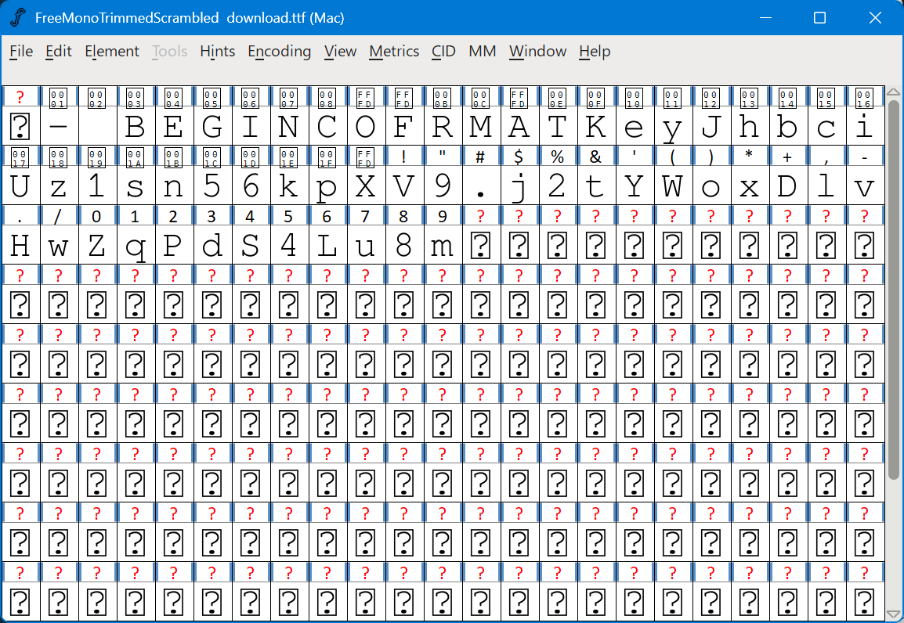

```python
/CIDInit/ProcSet findresource begin
12 dict begin
begincmap
/CIDSystemInfo<<
/Registry (Adobe)
/Ordering (UCS)
/Supplement 0
>> def
/CMapName/Adobe-Identity-UCS def
/CMapType 2 def
1 begincodespacerange
<00> <FF>
endcodespacerange
57 beginbfchar
<01> <002E>
<02> <005A>
<03> <004A>
<04> <0048>
<05> <002F>
<06> <003B>
<07> <0043>
<08> <0060>
<09> <002B>
<0A> <0056>
<0B> <005D>
<0C> <0078>
<0D> <0058>
<0E> <0044>
<0F> <0072>
<10> <0046>
<11> <006F>
<12> <0054>
<13> <003F>
<14> <0026>
<15> <0024>
<16> <0055>
<17> <0073>
<18> <0036>
<19> <0061>
<1A> <002A>
<1B> <0023>
<1C> <0067>
<1D> <007D>
<1E> <0068>
<1F> <003E>
<20> <004C>
<21> <0049>
<22> <002C>
<23> <006A>
<24> <0045>
<25> <005B>
<26> <0020>
<27> <005F>
<28> <0029>
<29> <0052>
<2A> <0032>
<2B> <0069>
<2C> <002D>
<2D> <0027>
<2E> <0050>
<2F> <004B>
<30> <0031>
<31> <007C>
<32> <007E>
<33> <0030>
<34> <0021>
<35> <0053>
<36> <007A>
<37> <006B>
<38> <006D>
<39> <0022>
endbfchar
endcmap
CMapName currentdict /CMap defineresource pop
end
end
```

下载后使用FontForge打开字体文件，编写Python脚本进行反混淆：

```python
import sys
FONT_MAP = "\u0000- BEGINCOFRMATKeyJhbciUz1sn56kpXV9.j2tYWoxDlvHwZqPdS4Lu8m"
CHAR_MAP = "".join(chr(x) for x in [
    0x00, 0x2e, 0x5a, 0x4a, 0x48, 0x2f, 0x3b, 0x43,
    0x60, 0x2b, 0x56, 0x5d, 0x78, 0x58, 0x44, 0x72,
    0x46, 0x6f, 0x54, 0x3f, 0x26, 0x24, 0x55, 0x73,
    0x36, 0x61, 0x2a, 0x23, 0x67, 0x7d, 0x68, 0x3e,
    0x4c, 0x49, 0x2c, 0x6a, 0x45, 0x5b, 0x20, 0x5f,
    0x29, 0x52, 0x32, 0x69, 0x2d, 0x27, 0x50, 0x4b,
    0x31, 0x7c, 0x7e, 0x30, 0x21, 0x53, 0x7a, 0x6b,
    0x6d, 0x22,
])
descramble_map = str.maketrans(CHAR_MAP, FONT_MAP)
if __name__ == "__main__":
    if len(sys.argv) != 2:
        print("usage: python3 descramble.py <input_file>")
        sys.exit(1)
    input_file = sys.argv[1]
    with open(input_file, "r", encoding="utf-8") as f:
        print(f.read().translate(descramble_map), end="")
```

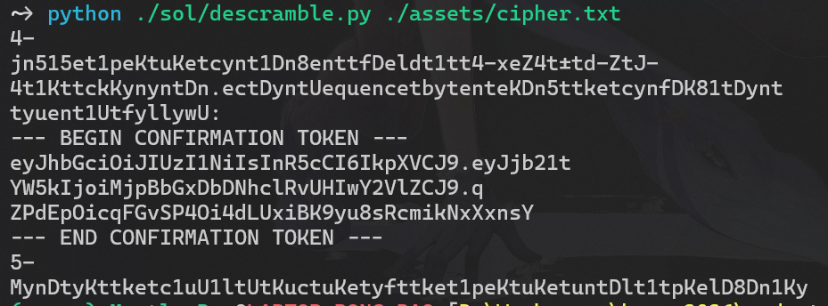

2. 解法二：如果愿意接受OCR的不精确性，可以使用该方法。使用Inkscape打开PDF，导入时选择
Draw missing fonts。发现黑框可以移除，同时下方还有一个白色框：

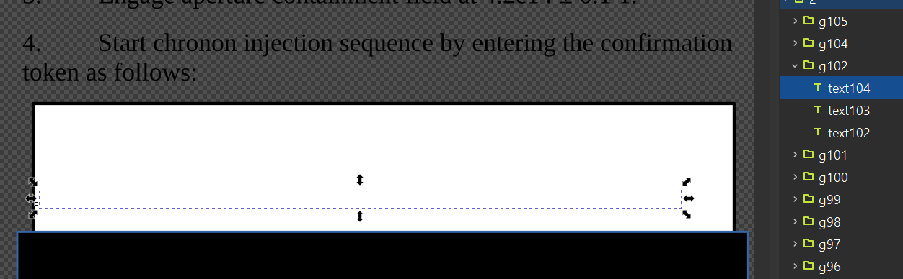

将白色框设为不可见后，使用OCR识别内容。

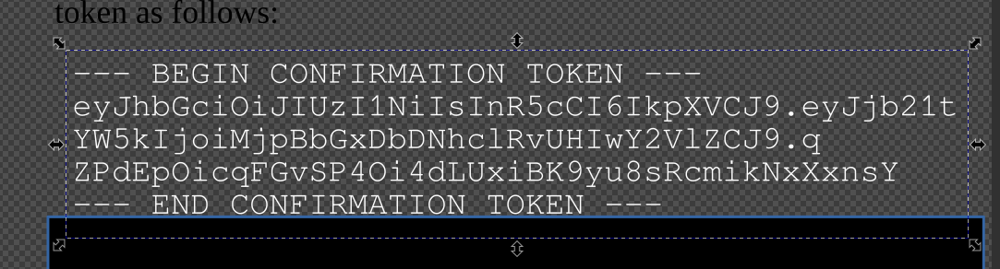

解 Base64 得到字符串 2，可用 [CyberChef Base64 解码](<https://gchq.github.io/CyberChef/#recipe=From_Base64('A-Za-z0-9%2B/%3D',true,false)&input=ZXlKaGJHY2lPaUpJVXpJMU5pSXNJblI1Y0NJNklrcFhWQ0o5LmV5SmpiMjF0CllXNWtJam9pTWpwQmJHeERiRE5oY2xSdlVISXdZMlZsWkNKOS5xClpQZEVwT2ljcUZHdlNQNE9pNGRMVXhpQks5eXU4c1JjbWlrTnhYeG5zWQ&oeol=NEL>) 验证。

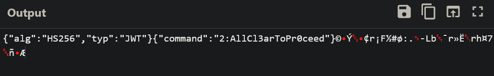

使用Inkscape提取图片：

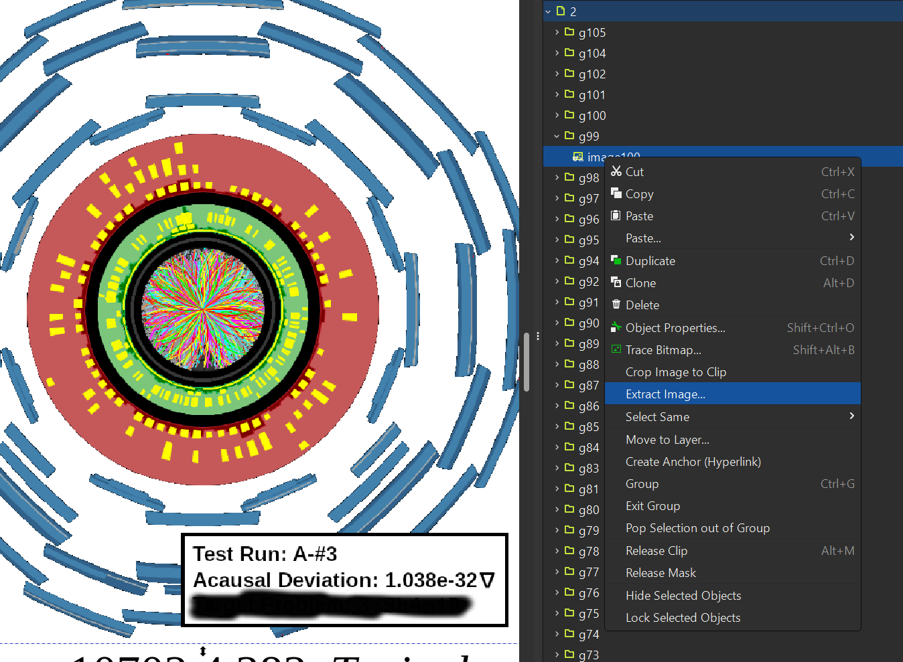

然后使用Inkscape进行有偏二值化：

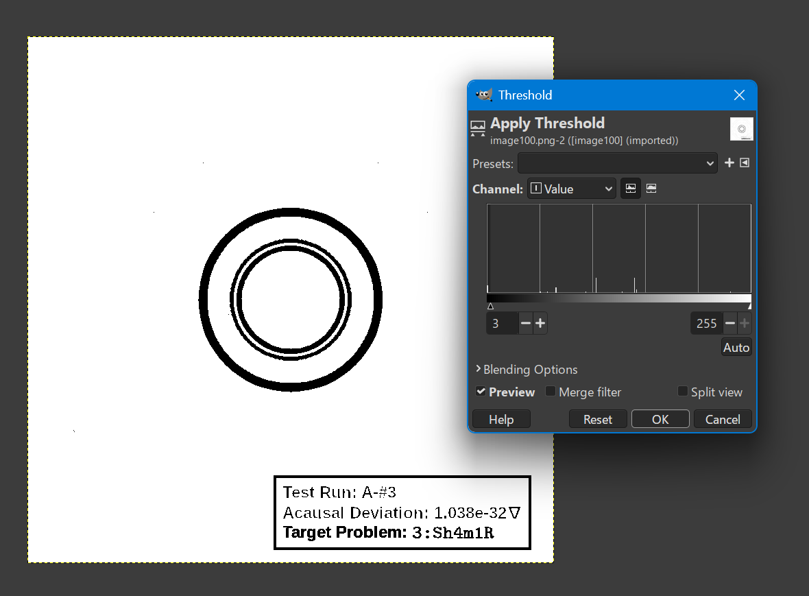

得到字符串3。

观察到PDF尾部有两个文件结束标记%%EOF ：

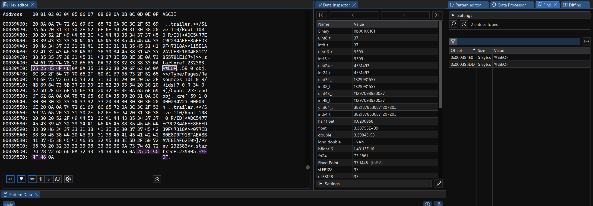

这是PDF的增量式修改功能，基本原理是在每次更新只追加新的/更改过的对象和一个新的引用表。因
此只要恢复先前版本的引用表即可实现回滚的效果。
使用 [pdfresurrect](https://github.com/enferex/pdfresurrect) 进行版本拆分：

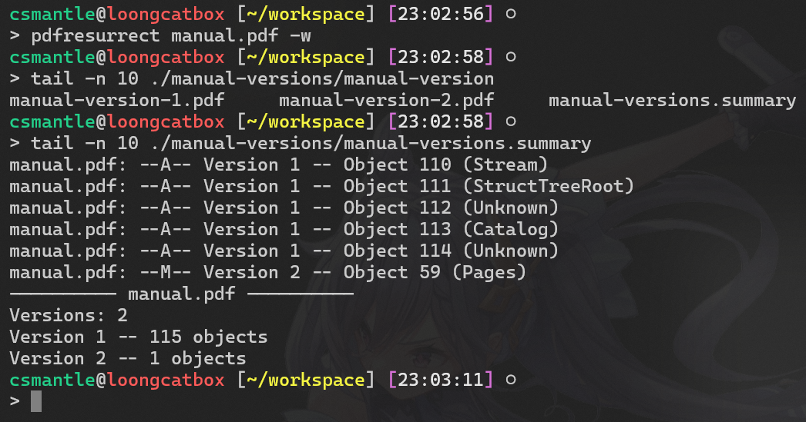

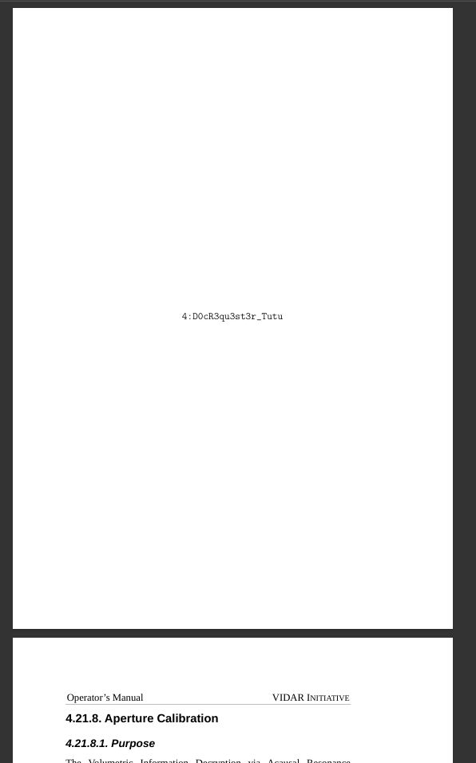

## 方法总结

PDF 取证题要区分“视觉遮挡”“文本对象仍存在”“字体映射篡改”和“增量保存残留”。优先检查可选中文本、嵌入字体、ToUnicode CMap、对象流和历史版本；工具上可结合 PDF COS 查看器、zlib 解流和 pdfresurrect。

