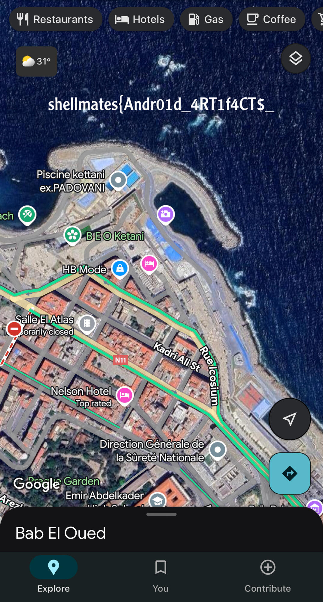

# dad jokes

## 题目简述

题目要求从一份 Android 设备数据中追查失踪人员使用的聊天应用和会面线索。关键证据来自 MeWe 应用私有目录、消息数据库、共享偏好中的会话令牌，以及外部存储中保存过的图片。flag 被拆在两张聊天图片中：一张仍保存在设备下载目录，另一张需要从消息记录恢复远程照片标识并通过 MeWe API 下载。

## 解题过程

### 定位聊天应用与消息数据库

MeWe 的应用数据位于：

```text
/data/data/com.mewe/
```

题目相关的 Tes Ter 与 Anes 聊天记录保存在：

```text
/data/data/com.mewe/databases/app_v3.db
```

用 SQLite 打开数据库并检查 `MESSAGE` 表，可以恢复消息文本、媒体记录和远程照片标识。对话还说明 Tes Ter 曾把一张会面地点图片保存到下载目录：

```text
/sdcard/Download/where.jpeg
```

该图片既显示 Bab El Oued 一带的地图位置，也包含 flag 前半段：



### 使用会话工件恢复未保存图片

最后发送的图片没有落盘，但 `MESSAGE` 表保留了照片 URL 或照片 ID。直接访问媒体接口需要认证；MeWe 会话令牌可从下列共享偏好文件提取：

```text
/data/data/com.mewe/shared_prefs/SGSession.xml
```

取得 `access-token` 和 `refresh-token` 后，按消息中恢复的照片 ID 请求 `/api/v2/photo/<photo-id>/full/image`：

```bash
curl 'https://mewe.com/api/v2/photo/<photo-id>/full/image' \
  -H 'Cookie: access-token=<ACCESS_TOKEN>; refresh-token=<REFRESH_TOKEN>' \
  --output last-joke.jpg
```

这里真正需要长期保留的是“数据库媒体 ID + 共享偏好令牌 + 带认证的照片 API”这条证据链；仓库中的一次性照片 ID 和令牌不应写成可复用凭据。

下载结果是一张阿拉伯语笑话梗图，左上角直接印有 flag 后半段 `4RE_pR1c3L3$sSS}`。这部分只有文字结果，没有需要依赖画面布局才能理解的证据，因此直接转写为文本，不再保留结果截图。

拼接两张图片中的文本，得到：

```text
shellmates{Andr01d_4RT1f4CT$_4RE_pR1c3L3$sSS}
```

## 方法总结

- 核心技巧：关联 Android 应用私有数据库、共享偏好令牌、外部存储和远程媒体 API，恢复已删除或未保存的聊天图片。
- 识别信号：聊天数据库只留下媒体 ID、图片本地缺失，但应用目录仍含 session XML 时，应沿认证状态重放官方媒体请求。
- 复用要点：保留数据库行、文件路径和下载结果之间的证据链；令牌属于敏感工件，只说明提取位置和使用方式，不在长期 WP 中公开实际值。
