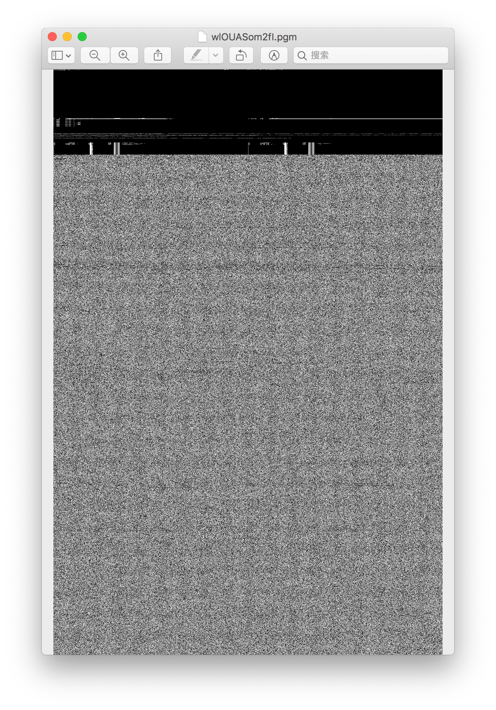
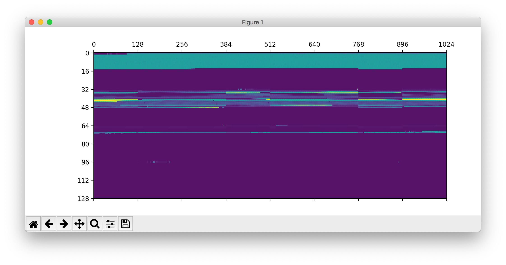
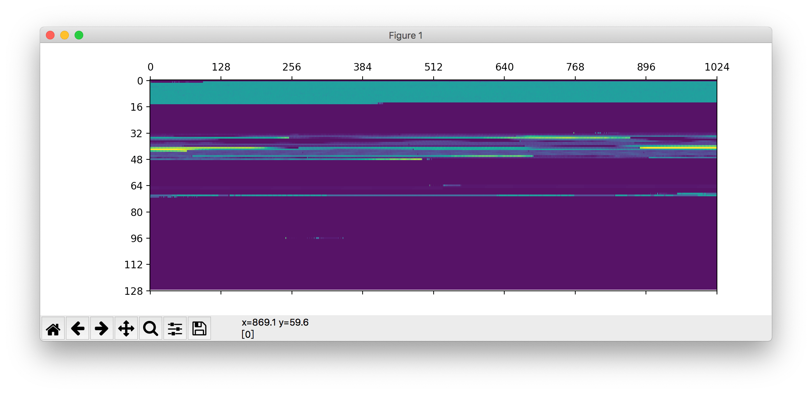
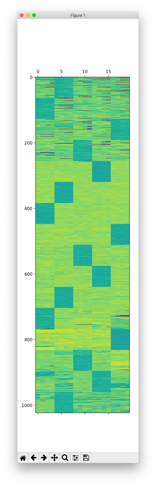
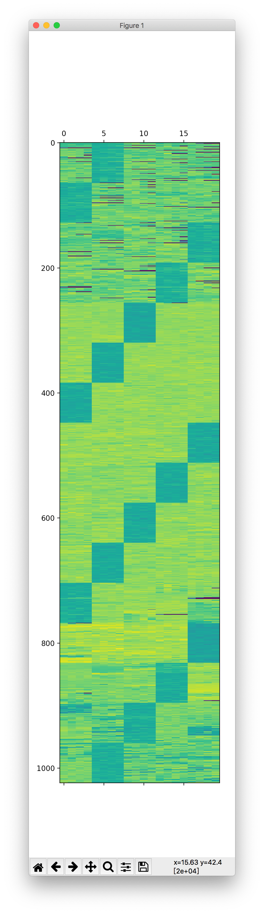

# 阵列恢复大师

## 题目简述

题目给出两组丢失阵列元数据的磁盘成员：一组是 8 盘 RAID 0，另一组是 5 盘 RAID 5。需要从 GPT、文件系统超级块、条带连续性和奇偶校验布局中恢复盘序、chunk size 与 RAID 级别，再只读重组文件系统。附件删除后仍需保留的关键参数是：RAID 0 使用 8 盘、128 KiB chunk；RAID 5 使用 5 盘、64 KiB chunk、left-symmetric 布局。

## 解题过程

### 将二进制结构可视化

把固定大小的连续字节块求和或直接映射为灰度，可以让 GPT、超级块、空洞和文件数据在图上形成条带。单盘的二进制布局可见开头存在明显结构化区域，后部更像高熵数据：



这种图不是凭颜色“猜”文件，而是用边界连续性比较候选盘序：正确相邻的两个成员在条带交界处变化更平滑。

### 恢复 RAID 0

GPT 主表只会出现在逻辑阵列开头，因此可确定第一盘为 `wlOUASom2fI.img`；备份 GPT 位于阵列末尾，确定最后一盘为 `ID7sM2RWkyI.img`。分区从 1 MiB 开始，XFS 超级块和数据连续性表明 chunk size 为 128 KiB。

初始乱序下，横向结构在多个边界处断裂：



对候选顺序计算相邻 128 KiB 条带的差异，得到正确盘序：

```text
wlOUASom2fI.img
jCC60mutgoE.img
1GHGGrmaMM0.img
5qiSQnlrA4Y.img
d3Be7V0EVKo.img
eRL2MQSdOjo.img
RApjvIxRlu0.img
ID7sM2RWkyI.img
```

正确排列后元数据线条连续：



在磁盘副本或只读 loop 设备上重组：

```bash
sudo mdadm --build /dev/md0 \
  --assume-clean --level=0 --raid-devices=8 --chunk=128 \
  /dev/loop0 /dev/loop1 /dev/loop2 /dev/loop3 \
  /dev/loop4 /dev/loop5 /dev/loop6 /dev/loop7
```

只读挂载阵列中的分区后得到：

```text
flag{4857cdeac07d8456fcaedb61d07b0b7d}
```

### 恢复 RAID 5

第二组 5 盘采用 64 KiB chunk 和 left-symmetric parity。错误盘序下，深色的 parity/低变化区块呈不连续的阶梯：



结合 GPT、ext 文件系统超级块位置以及旋转校验块的斜向规律，正确顺序为：

```text
3RlmViivyG8.img
IrYp6co7Gos.img
3D8qN9DH91Q.img
QjTgmgmwXAM.img
60kE0MQisyY.img
```

此时 parity 阶梯与数据连续性一致：



官方解法用只读 FUSE 视图恢复逻辑盘。对每个 stripe，先按 left-symmetric 规则确定该行 parity 所在成员，再把逻辑数据 chunk 依次映射到其余四盘；读取跨 chunk 数据时重复这一映射，完全不需要重算 parity。逻辑分区偏移仍为 1 MiB，挂载后得到：

```text
flag{a18325a1ec0f58292908455c2df8ffcd}
```

也可用 `mdadm --build --level=5 --layout=left-symmetric --chunk=64` 在镜像副本上尝试，但错误盘序或写入式文件系统检查可能破坏证据，优先使用只读 loop、FUSE 和 `mount -o ro,norecovery`。

## 方法总结

- 核心技巧：用 GPT 首尾位置确定边界盘，用文件系统超级块和条带连续性确定 chunk 与盘序，再按 RAID 布局只读重组。
- 识别信号：成员盘没有 md metadata，但各盘在固定间隔出现互补的结构区；RAID 5 还会出现随 stripe 旋转的 parity 模式。
- 复用要点：先复制证据并全程只读；RAID 级别、盘序、chunk 和 layout 缺一不可。图像只是盘序假设的视觉验证，最终仍应以分区表、超级块和可挂载性校验。
