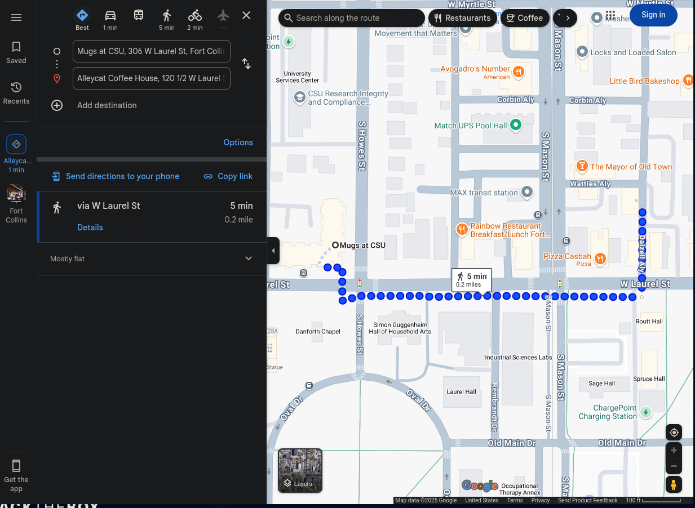

# L3akCTF 2025 Wi-Fight A Ghost Writeup

## 题目简述

附件是 KAPE 收集的 Windows 工件，包含注册表 hive、事件日志、Edge/Chrome History、NTFS `$MFT` 和快捷方式。目标是重建设备先后连接的两家咖啡馆、连接时间和地址，以及用户在两段网络活动中的浏览、下载和记事行为。

当前仓库的 `build/server.py` 一共询问 14 项。官方 PDF 来自较早版本，另外包含 DHCP hostname 和 Wi-Fi 密码问题；归档时必须以当前服务端源码为准。

## 解题过程

### 注册表中的主机和 DHCP 证据

用 RegRipper 分析 `SYSTEM`：

```bash
rip.pl -r SYSTEM -a
```

`ComputerName` 给出：

```text
99PHOENIXDOWNS
```

TCP/IP 接口键中有两个关键租约。

第一家：

```text
DhcpNetworkHint  mugs_guest_5G
LeaseObtainedTime  2025-05-14 00:13:36Z
DhcpIPAddress  192.168.0.114
```

第二家：

```text
DhcpNetworkHint  AlleyCat
LeaseObtainedTime  2025-05-14 00:35:07Z
DhcpIPAddress  10.0.6.28
DhcpDomain  myrtle.solutions
```

PDF 还从第二份 DHCP option 中读出：

```text
99PhoenixDowns.myrtle.solutions
```

这是有效的辅助证据，但当前服务端不再询问，不应把它插进 14 项提交序列。

### 浏览器历史和下载记录

第一段活动使用 Edge。打开：

```text
Users\NotVi\AppData\Local\Microsoft\Edge\User Data\Default\History
```

查询 `urls`：

```sql
SELECT url, title, last_visit_time
FROM urls
ORDER BY last_visit_time;
```

可见用户访问了 [DFIR Blue Book](https://github.com/dbissell6/dfir/blob/main/blue_book/blue_book.md)。这个页面是一份数字取证学习笔记；URL 本身也是题目要求提交的答案，因此保留链接。

随后访问 Google Chrome 下载页。`downloads` 表中的目标路径和 `SYSTEM` 的 BAM 记录共同确认：

```text
ChromeSetup.exe
```

第二段活动已经安装并使用 Chrome。其 `History` 位于：

```text
Users\NotVi\AppData\Local\Google\Chrome\User Data\Default\History
```

`urls` 表显示登录站点：

```text
https://www.l3ak.team
```

当前服务端答案只要求域名：

```text
l3ak.team
```

### 从 RecentDocs、LNK 和 MFT 恢复笔记

分析用户 `NTUSER.DAT` 的 RecentDocs：

```bash
rip.pl -r NTUSER.DAT -p recentdocs
```

得到文件名：

```text
HowToHackTheWorld.txt
```

对应 `.lnk` 指向：

```text
C:\Users\NotVi\OneDrive\Desktop\HowToHackTheWorld.txt
```

KAPE 文件树中没有正文，但 LNK 记录目标大小只有 550 字节。小文件的 `$DATA` 很可能直接驻留在 MFT record 内，而不是占用外部数据簇。用 Chainsaw 解码 `$MFT` 中的 data stream：

```bash
chainsaw dump '$MFT' --output mft.output --decode-data-streams
```

对应记录的 `stream_data` 为：

```text
Practice and take good notes.
```

当前服务端答案包含句号，旧版 `solution/solver.py` 少了句号，不能直接照抄旧 solver。

### 确认无线网卡 MAC

`SYSTEM` 的 network setup 记录列出 Intel Wireless-AC 9560：

```text
PermanentAddress  48:51:c5:35:ea:53
```

DHCP Client/Admin 事件日志还能独立验证。第一家网络的 Event ID 50065、第二家网络的 Event ID 50067 都记录：

```text
HWAddress 4851C535EA53
```

格式化为：

```text
48:51:c5:35:ea:53
```

### 由两个 SSID 定位城市

注册表时区为 Mountain Standard Time，只能把范围缩到北美山地时区。SSID `mugs_guest_5G` 可对应 Mugs at CSU，`AlleyCat` 对应 Alleycat Coffee House；两家店都位于 Colorado 的 Fort Collins，且在 W Laurel Street 一带相距约 0.2 英里。



因此城市为：

```text
fort collins
```

### 当前服务端的 14 项答案

| 题号 | 答案 |
| --- | --- |
| 1 | `99phoenixdowns` |
| 2 | `mugs_guest_5g` |
| 3 | `2025-05-14 00:13:36` |
| 4 | `192.168.0.114` |
| 5 | `https://github.com/dbissell6/dfir/blob/main/blue_book/blue_book.md` |
| 6 | `chromesetup.exe` |
| 7 | `howtohacktheworld.txt` |
| 8 | `practice and take good notes.` |
| 9 | `alleycat` |
| 10 | `2025-05-14 00:35:07` |
| 11 | `10.0.6.28` |
| 12 | `l3ak.team` |
| 13 | `48:51:c5:35:ea:53` |
| 14 | `fort collins` |

全部回答正确后得到：

```text
L3AK{Gh057_R!d!ng_7h3_W4v35}
```

官方 PDF 的早期版本还列出“第一家 Wi-Fi 密码”，并明确标注需要 DPAPI 解密、尚未回答；当前 `server.py` 已删除该题。仓库 `solution/solver.py` 又保留了 DHCP hostname 等 15 个旧答案，与当前 14 问服务不一致。归档 WP 应记录这种版本漂移，但提交时必须按当前 `build/server.py`。

## 方法总结

这题要求把不同 Windows 工件拼成一条活动时间线：`SYSTEM` 给主机、SSID、租约和网卡；浏览器 SQLite 给访问与下载；`NTUSER.DAT` 和 LNK 给文件名与目标路径；`$MFT` 的 resident data 补回缺失正文；事件日志交叉验证 MAC；最后用两个 SSID 和时区定位 Fort Collins。旧 PDF、旧 solver 与当前服务端存在题目数量差异，源码核对是不可省略的最后一步。
