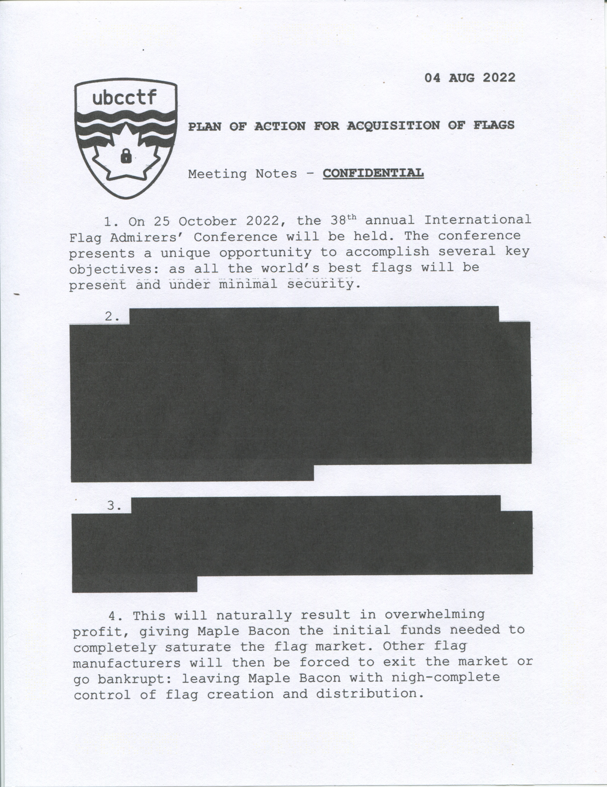
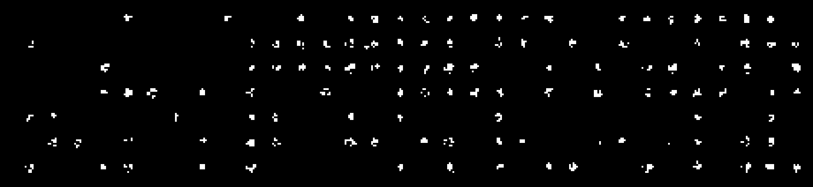

# flag-hoarding

## 题目简述

题目给出一张泄露的内部会议记录扫描件，要求从数字证据中识别泄密者。文件表面是普通黑白文档，但页面顶部和底部存在规律、重复的极淡点阵。这些点并非 JPEG 压缩噪声，而是彩色激光打印机用于溯源的黄色追踪点。



## 解题过程

先检查 EXIF、ICC 和文件尾，没有直接包含 flag；主要元数据只表明图片经过 GIMP 和 sRGB 配置处理。追踪点在 RGB 图中接近黄色，即红、绿通道强而蓝通道弱。分离蓝色通道后反相并拉伸对比度，点阵会变成黑底白点。



常见 DocuColor 追踪点表会编码日期和打印机序列号，但本题对格式做了改造，不能机械套用标准模板。观察左上方的一组点阵，可确定采样起点约为 $(381,128)$，横纵间距均约 14 像素。将七个数据行自上而下赋权 $64,32,16,8,4,2,1$，对每一列把存在的点权相加并解释为 7 位 ASCII：

```python
weights = [64, 32, 16, 8, 4, 2, 1]
text = ""
for column in columns:
    value = sum(weight for weight, present in zip(weights, column) if present)
    text += chr(value)
```

略去两端的填充列后，点阵直接解出：

```text
maple{tw0_D3C4D35_0f_st3g0}
```

## 方法总结

这题的决定性证据来自已取得的扫描件，因此归入取证而非单纯隐写。处理打印机黄点时，优先查看蓝通道或计算“黄度”能够显著提高信噪比；识别出规则网格后应先验证行列方向和 ASCII 可打印性，再决定是否采用公开厂商模板。本题实际载荷是自定义 7 位 ASCII，套用标准日期/序列号表反而会走偏。
