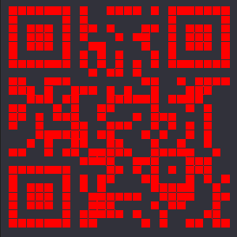

# MiniLCTF2020 - EasyVmem

## 题目简述

附件是一份 Windows 7 x64 内存镜像。关键证据位于剪贴板：一段假 flag 提示关注每个细节，随后是大量 `s3cR3t:x y` 坐标。把坐标作为像素重绘后会形成二维码，因此本题按内存证据恢复归入 Forensics。

## 解题过程

使用 Volatility 的 Windows 7 SP1 x64 profile 导出剪贴板：

```sh
volatility -f challenge.vmem --profile=Win7SP1x64 clipboard -v > clipboard.txt
```

工具输出中先出现带 `MiniLCTF` 的 Base64 假线索，后面则连续出现从约 `(10,10)` 延伸到 `(289,289)` 的坐标。清理 Volatility 十六进制列后，把恢复的明文保存为 `res.txt`，再提取坐标并画点：

```python
import re
from pathlib import Path
from PIL import Image

text = Path('res.txt').read_text(encoding='utf-8', errors='ignore')
points = [(int(x), int(y)) for x, y in re.findall(r's3cR3t:(\d+)\s+(\d+)', text)]

width = max(x for x, _ in points) + 1
height = max(y for _, y in points) + 1
img = Image.new('RGB', (width, height), (44, 44, 50))
for x, y in points:
    img.putpixel((x, y), (255, 0, 0))
img.save('clipboard-coordinates-qr.png')
```

重绘结果如下。该图的二维码模块空间关系无法由一段普通文字等价替代，因此作为唯一图片证据保留：



扫码得到：

```text
miniLCTF{mAst3R_0F_v0Lat1l1tY!}
```

## 方法总结

内存取证中的“看似文本”也可能是图像的中间表示。先保留剪贴板原始顺序，再识别重复前缀和坐标范围；坐标上界能反推出画布尺寸。假 flag 的作用是提示继续检查同一剪贴板对象，而不是提交其 Base64 内容。
