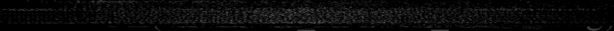
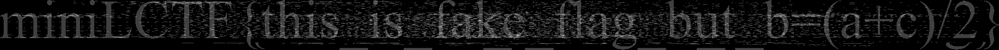

# MiniForensics I

## 题目简述

题目是一条跨 Windows 虚拟机、RAR5、TLS 流量和 BitLocker 卷的取证链。初始材料包括桌面的坐标文件 `b.txt` 与一份 PCAP；隐藏目录中还能找到 `ai.rar` 和提示密码为七位数字的 `pwd.txt`。恢复归档中的 `ssl.log` 后，可以解密 PCAP 中的 TLS 会话并取得 48 位 BitLocker 恢复密钥；解锁数据卷后得到第二组坐标 `c.txt`，最后根据两组点的线性关系还原真正的 flag 图像。

## 解题过程

### 识别坐标诱饵与隐藏文件

`b.txt` 中每行是一对浮点坐标。直接将坐标归一化后绘制，可以看到一条疑似 flag 的点阵，但底部下划线和右侧花括号尖端表明它只是残缺或经过线性变换的结果。



开启“显示隐藏项目”和“显示受保护的系统文件”后，在文档目录下能找到 `nihao/ai.rar` 与 `pwd.txt`。根据七位数字提示对 RAR5 密码做有界枚举，官方材料得到密码 `1846287`。

### 从损坏的 RAR5 条目恢复 TLS 密钥日志

新版 WinRAR 可以直接识别归档中的 `ssl.log`。如果使用的工具看不到该条目，需要检查 RAR5 block header：材料中的 `ssl.log` 被标成了 service header（类型 `0x03`），而正常文件条目应为 file header（类型 `0x02`）。修复时应先定位该条目的 header type，再把 `0x03` 改为 `0x02` 并重新计算该 block 的 header CRC32，不能对整个文件盲目替换字节。

得到 `ssl.log` 后，在 Wireshark 中配置：

```text
Edit -> Preferences -> Protocols -> TLS
    (Pre)-Master-Secret log filename = <ssl.log 的路径>
```

重新载入流量后，TLS Application Data 会被解密。跟踪解密后的 `/upload` 会话，可以从上传内容中读到 BitLocker 恢复密钥：

```text
521433-074470-317097-543499-149259-301488-189849-252032
```

### 解锁卷并恢复真实坐标

用上述 48 位密钥解锁 D 盘后得到 `c.txt`。绘制它会出现点阵提示 `b=(a+c)/2`：



于是逐点计算：

$$
a=2b-c.
$$

下面的脚本保留点的顺序，计算真实坐标并绘图：

```python
from pathlib import Path
from PIL import Image

def read_points(path):
    points = []
    for token in Path(path).read_text(encoding="utf-8").split():
        x, y = token.split(",")
        points.append((float(x), float(y)))
    return points

b = read_points("b.txt")
c = read_points("c.txt")
assert len(b) == len(c)

a = [
    (round(2 * bx - cx), round(2 * by - cy))
    for (bx, by), (cx, cy) in zip(b, c)
]

min_x = min(x for x, _ in a)
max_x = max(x for x, _ in a)
min_y = min(y for _, y in a)
max_y = max(y for _, y in a)

image = Image.new("1", (max_x - min_x + 1, max_y - min_y + 1), 0)
for x, y in a:
    image.putpixel((x - min_x, y - min_y), 1)
image.save("flag.png")
```

最终点阵对应 `miniLCTF{forens1c5_s0ooooo_1nt4resting}`。当前仓库只保留官方题解和截图，没有原始 VM、PCAP、RAR 或坐标文件，因此这里没有伪称重新跑通整条链；命令、密钥和结果均来自官方材料的证据链。

## 方法总结

- 核心技巧：依次恢复隐藏文件、修复 RAR5 条目、使用 NSS/SSL key log 解密 TLS、从流量取得 BitLocker 密钥，再用坐标线性关系还原点阵。
- 识别信号：Windows 隐藏目录、损坏归档、`SSLKEYLOGFILE`、TLS PCAP、48 位数字密钥和成对坐标共同指向跨载体取证，而不是单一文件格式题。
- 复用要点：先保持证据链顺序，每一步只提取下一步所需 artifact；修复归档头时必须同步校验 CRC，绘制坐标时则要保持点序对应并在最终结果上验证公式。
