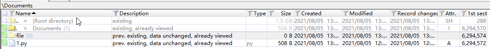

# easyForensics

## 题目简述

附件是一个 E01 取证镜像。E01 属于 EnCase/EWF 证据镜像格式，可在保存介质数据的同时携带分段、压缩和完整性校验等取证信息，不能把它当作普通压缩包直接解开。

本题需要先从镜像中恢复已删除的脚本和目录，再根据脚本揭示的命名规则重组一个 DOCX 文档。

## 解题过程

使用 X-Ways Forensics、FTK 等支持 E01/EWF 的工具加载镜像并展开文件系统。在 `Documents` 目录中可以找到被删除的 `file` 文件夹和 `1.py`，将二者按原目录结构恢复出来。



恢复出的 `1.py` 执行了以下变换：

```python
from base64 import b64encode
import os
import re

with open("file.in", "rb") as fin:
    data = fin.read()

data = b64encode(data).decode()
data = data.replace("/", "_")
data = re.findall(r".{40}", data)

base = os.getcwd() + "\\file\\"
count = 1
for item in data:
    folder = str(count) + " " + item
    if count < 10:
        path = base + "00" + folder
    elif count < 100:
        path = base + "0" + folder
    else:
        path = base + folder
    os.mkdir(path)
    count += 1
```

也就是说，原文件先经过 Base64 编码，其中的 `/` 被替换为 `_`；编码串再按 40 字符分块，每块被写进形如 `001 <数据>` 的文件夹名。

恢复时必须按数字编号排序。文件系统的枚举顺序没有保证，直接按 `os.walk` 返回顺序拼接会悄悄打乱数据。下面的脚本同时检查编号连续性、Base64 合法性和 DOCX 的 ZIP 文件头：

```python
from base64 import b64decode
from pathlib import Path

source = Path("file")
chunks = []

for entry in source.iterdir():
    if not entry.is_dir():
        continue

    ordinal_text, chunk = entry.name.split(" ", 1)
    chunks.append((int(ordinal_text), chunk))

if not chunks:
    raise RuntimeError("file 目录中没有找到数据文件夹")

chunks.sort(key=lambda item: item[0])
ordinals = [ordinal for ordinal, _ in chunks]
expected = list(range(1, len(chunks) + 1))
if ordinals != expected:
    raise RuntimeError("分块编号缺失或重复")

encoded = "".join(chunk for _, chunk in chunks)
encoded = encoded.replace("_", "/")
recovered = b64decode(encoded, validate=True)

if not recovered.startswith(b"PK\x03\x04"):
    raise RuntimeError("恢复结果不是预期的 ZIP/DOCX 文件")

Path("recovered.docx").write_bytes(recovered)
```

恢复数据以十六进制 `50 4B 03 04` 开头，包内还能看到 `[Content_Types].xml` 和 `word/` 等条目，因此它是基于 ZIP 的 Office Open XML 文档。把结果保存为 `recovered.docx` 并用 Word 打开即可看到 flag。

现存官方文字材料没有保留 flag 的具体值，因此这里不凭空补写结果；可复现的终点是恢复并打开该 DOCX。

## 方法总结

这题包含两层证据恢复：先在 E01 文件系统镜像中恢复已删除对象，再逆转脚本对文件内容的编码和分块。重组此类数据时，目录名既是载荷也是顺序信息，必须显式按编号排序并检查连续性。用文件头和容器内部结构共同确认文件类型，也比仅凭扩展名改名更可靠。
