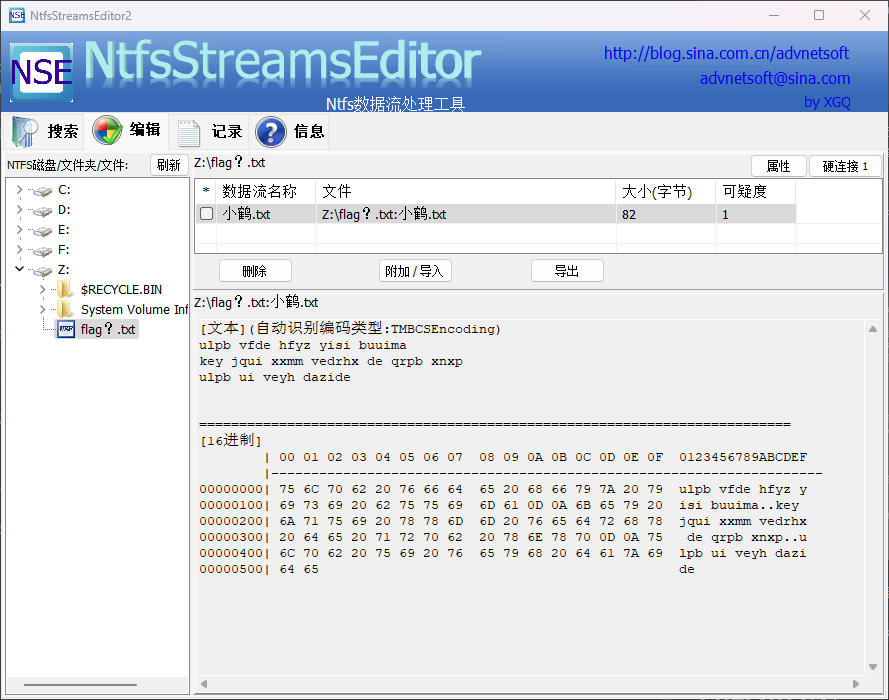

# ctfer2077②

## 题目简述

题目把三种不同载体串在一起：社会主义核心价值观编码给出 VeraCrypt 卷密码，NTFS 备用数据流隐藏下一段文本，最后再用小鹤双拼还原明文。决定性取证点是识别 NTFS Alternate Data Stream（ADS），而不是只查看目录中的普通文件。

## 解题过程

题面字符串

```text
法治富强自由富强和谐平等和谐平等法治法治和谐富强法治文明公正自由
```

按社会主义核心价值观编码解码后得到卷密码：

```text
p@55w0rd
```

用 VeraCrypt 挂载卷后只能看到 `flag？.txt`，但题目提示要求关注文件系统。该卷为 NTFS，而 NTFS 文件可通过 `普通文件名:流名` 额外挂接数据；这类 ADS 不会作为普通目录项显示。用 NtfsStreamsEditor 检查后可见：

```text
Z:\flag？.txt:小鹤.txt
```



导出的文本为小鹤双拼编码：

```text
ulpb vfde hfyz yisi buuima
key jqui xxmm vedrhx de qrpb xnxp
ulpb ui veyh dazide
```

按小鹤双拼键位还原后，完整提示为：

```text
双拼真的很有意思不是吗
key 就是下面这段话的全拼小写
双拼是这样打字的
```

因此最终提交为：

```text
moectf{shuangpinshizheyangdazide}
```

## 方法总结

面对“卷内只有一个可疑文件”的情况，应先确认文件系统并检查文件系统特有的隐藏载体。NTFS ADS 的识别信号是文件存在但目录内容与题面不匹配，可用 `dir /r`、PowerShell 的 `Get-Item -Stream *` 或专用工具列出。双拼只是最后的表示层转换；关键证据链应完整记录为“题面编码 → 卷密码 → ADS → 双拼文本”。
