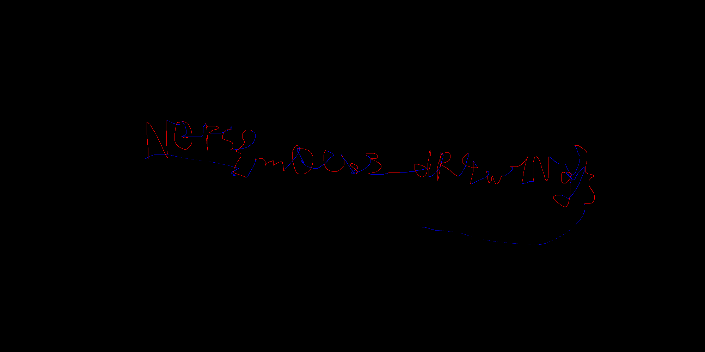

# HID

## 题目简述

附件 `capture.pcapng` 是 USB HID 鼠标流量。题目询问“写了什么”，因此需要从抓包中识别鼠标端点、提取 HID report，再累计相对位移重建绘图轨迹。

抓包统计显示 `3.11.1` 是主要发送端点，共产生约 13,000 个包。有效报告均为 7 字节，其中既包含坐标位移，也包含主键按下状态；若忽略按键状态，移动轨迹与真正书写会混在一起。

## 解题过程

### 提取 HID 字段

在 Wireshark 中检查端点和任意一条鼠标包，可以确认：

- 显示过滤器：`usb.src == 3.11.1`
- HID 数据字段：`usbhid.data`

使用 `tshark` 直接导出该字段：

```bash
tshark \
  -r capture.pcapng \
  -Y "usb.src == 3.11.1" \
  -T fields \
  -e usbhid.data > extracted_data
```

每条 7 字节 report 的布局为：

| 偏移 | 长度 | 含义 |
| --- | ---: | --- |
| 0 | 1 | Report ID，固定为 `0x01` |
| 1 | 1 | 按键位图，最低位是主键 |
| 2 | 2 | X 轴相对位移，有符号小端整数 |
| 4 | 2 | Y 轴相对位移，有符号小端整数 |
| 6 | 1 | 滚轮，本次采集固定为 0 |

例如 `0101ffff000000` 表示主键按下、X 位移为 $-1$、Y 位移为 0。

### 累计坐标并按按键状态着色

官方代码把少数位移值硬编码到字典中。更稳妥的做法是直接按有符号小端 16 位整数解析，能够覆盖全部合法 report：

```python
from PIL import Image


width, height = 2000, 1000
image = Image.new("RGB", (width, height), (0, 0, 0))
x, y = width // 3, height // 2

with open("extracted_data", encoding="ascii") as stream:
    for line in stream:
        text = line.strip().replace(":", "")
        if not text:
            continue

        report = bytes.fromhex(text)
        if len(report) != 7 or report[0] != 0x01:
            continue

        primary_pressed = bool(report[1] & 1)
        dx = int.from_bytes(report[2:4], "little", signed=True)
        dy = int.from_bytes(report[4:6], "little", signed=True)
        x += dx
        y += dy

        if 0 <= x < width and 0 <= y < height:
            color = (255, 0, 0) if primary_pressed else (0, 0, 255)
            image.putpixel((x, y), color)

image.save("mouse-drawing.png")
```

红色部分对应按住主键时的实际书写，蓝色部分对应松开主键后的移动。重建结果如下：



从红色笔迹可读出：

```text
N0PS{m0Us3_dR4w1Ng}
```

## 方法总结

- 核心技巧：从 PCAPNG 中提取 USB HID report，按有符号小端格式累计相对坐标，并利用主键状态区分落笔与移动。
- 识别信号：大量固定长度 USB 数据包、稳定 Report ID、连续的小幅 X/Y 位移以及规律变化的按键位。
- 复用要点：HID report 布局应以抓包字段和描述符为准，不能假定所有鼠标格式相同。绘图时必须保留按键语义；只画所有移动点会显著增加干扰线。
