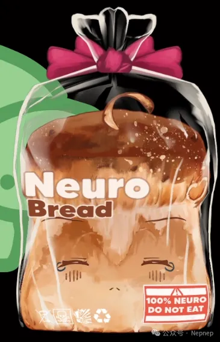
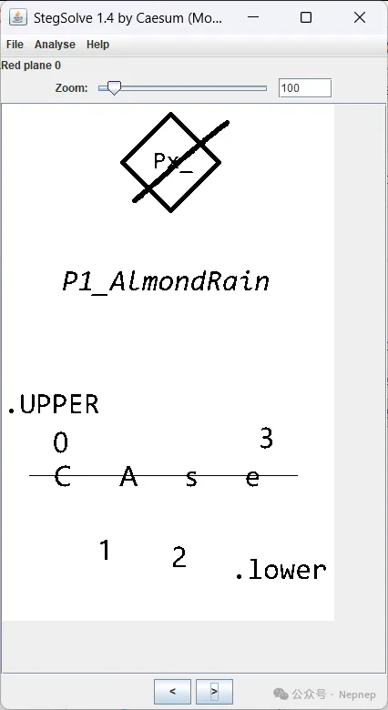

# NepCTF2026 GhostInTheMirror Writeup

## 题目简述

附件是旧式 GHOST 系统镜像，内部串联了镜像密码、ASCII art、VeraCrypt、NTFS ADS、浏览器数据、Windows LM hash、键盘记录和空白字符隐写。目标是恢复四段 `P0` 至 `P3`，按提示规定的顺序与大小写派生第二层 VeraCrypt 密码，最终取得 flag。

## 解题过程

### 恢复镜像与第一层密码

使用支持旧 GHO 格式的工具查看镜像元数据，可以取得镜像密码：

```text
P0_MIRROR
```

不要通过 CRC 碰撞绕过密码校验；那样虽然可能解出镜像，却会跳过后续派生需要的 `P0`。镜像最初在 QEMU 环境制作，直接在 VMware 启动可能蓝屏，因此更稳妥的方式是离线挂载文件系统。

桌面文件：

```text
C:\Documents and Settings\Neuro\桌面\art.txt
```

调整等宽显示宽度后，ASCII art 给出：

```text
5tudySama!1
```

它可打开 VeraCrypt 外层卷，取得一段故事与下一阶段线索。

### 提取 ADS 与 P1

`art.txt` 存在 NTFS Alternate Data Stream：

```text
art.txt:bread.png
```

提取出的面包图片如下：



在 StegSolve 中检查颜色通道和位平面，可看到隐藏顺序提示并得到：



```text
P1_AlmondRain
```

### 恢复派生规则与其余分段

浏览器 cookie 中保存了故事 2、3。再从：

```text
C:\WINDOWS\system32\config\
```

提取 SAM/SYSTEM 相关数据，恢复出的 LM hash 分为：

```text
ba33ca19239e0964
13cfb49c0144c579
```

LM hash 每 7 字节独立处理，可分别用 Hashcat 的 `-m 3000` 模式破解。得到的提示不是普通登录密码，而是：

```text
SM3(P2013)UP20
```

其含义是按 `P2, P0, P1, P3` 排列，按隐藏图提示调整大小写，计算 SM3，并取大写十六进制摘要前 20 个字符。

旧 IE 主页和浏览器数据可定位到故事 4，其中直接给出：

```text
P2_White7iles
```

系统还内置了键盘记录程序。逆向其写入逻辑后，在：

```text
C:\WINDOWS\Temp\SKSConfig.txt
```

按按键事件和 Shift/Caps Lock 状态恢复出一段外部故事内容。原 Pastebin 已失效，因此归档时不再保留死链；故事中关键的空白字符序列按点、划解析为 Morse，得到：

```text
P3_KEEP5MILE
```

### 生成第二层 VeraCrypt 密码

去掉 `P0_` 至 `P3_` 前缀。根据图片提示，`P0`、`P3` 保持大写，`P1`、`P2` 转为小写，再按 `P2013` 拼接：

```text
white7ilesMIRRORalmondrainKEEP5MILE
```

对该 ASCII 字符串计算 SM3：

```text
SM3(...).hexdigest().upper()[:20]
= DD22A101DF845BC3172D
```

用 `DD22A101DF845BC3172D` 打开 VeraCrypt 隐藏卷，得到最终故事和：

```text
NepCTF{I_m_5tarting_With_The_m4n_IN_the_Mirror_Unended_StreaM}
```

## 方法总结

本题是一条典型的多证据载体取证链。每个密码既可能用于解锁，也可能是后续派生材料，因此不能用绕过校验代替恢复原值。处理时应建立证据表，记录 `P0..P3` 的来源、原始大小写、排列顺序和用途；同时优先离线挂载旧系统镜像，避免虚拟硬件差异导致蓝屏或修改证据。
