# SUCTF2026-forensics

## 题目简述
题目是 Windows 磁盘/系统取证综合题，载体为 AD1 系统盘镜像。题干要求从系统日志、记事本 TabState、聊天/客户端记录和 Ollama 相关痕迹中回答一组时间、消息 id 与密钥问题：设备上次关闭时间、记事本删除内容 MD5、第一密钥、第二密钥对应的对话 id 与时间、完整密钥、ollama 客户端 `no such host` 时间，以及获得固定格式 prompt 的 message id。

最终 flag 不是某个单独文件内容，而是将这些答案按题目指定顺序拼接后取 MD5。WP 需要保留每个答案对应的证据位置、工具链和恢复脚本，例如 FTK Imager 导出文件系统、解析 Windows Notepad `TabState`、检索日志与数据库记录，而不是只留下最终字符串。

## 解题过程
ad1格式 取证软件没啥用 直接用FTK imager把硬盘文件系统目录全导出来在分析

1.

设备上次关闭时间是什么时候？请以 UTC+8 时区提供您的答案。（YYYY/MM/DDTHH:MM:SS）

```
2026/03/05T17:23:06
```

2.

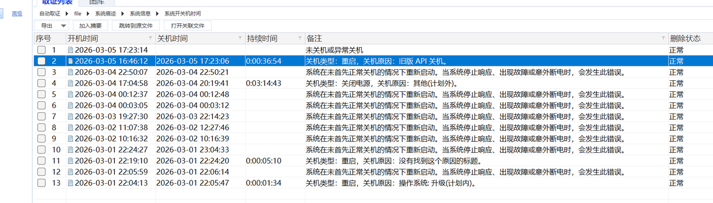

记事本删除内容的MD5值(32位小写)。

```
Key instructions:
1.Key must not be entirely stored on disk
2.The key has four parts
3.The key requires reshuffling order:1-4-3-2
4.There is a Key generted by AI
complete
```

c1c4c50f51afc97a58385457af43e169

要恢复的记事本记录是

```
\abc\Users\Administrator\AppData\Local\Packages\Microsoft.WindowsNotepad_8wekyb
```

$$
3d8bbwe\LocalState\TabState\992ff4a3-c3e9-401e-9320-82ddc5fa9d31.bin
$$

恢复脚本看https://github.com/ogmini/Notepad-Tabstate-Buffer

```python
from __future__ import annotations

import argparse
import json
import zlib
from dataclasses import asdict, dataclass
from pathlib import Path
from typing import Any

ROOT = Path(__file__).resolve().parents[1]
DEFAULT_TABSTATE_DIR = (
ROOT
/ "Users"
/ "Administrator"
/ "AppData"
/ "Local"
/ "Packages"
/ "Microsoft.WindowsNotepad_8wekyb3d8bbwe"
/ "LocalState"
/ "TabState"
)
DEFAULT_OUTPUT_DIR = ROOT / "recovery_reports" / "notepad_tabstate"

class ParseError(Exception):
pass

@dataclass
class ChunkRecord:
state_index: int
offset: int
position: int
delete_count: int
add_count: int
added_text: str
deleted_text: str
crc32_be: str
crc32_valid: bool
result_length: int

@dataclass
class StateRecord:
index: int
length: int
text: str

@dataclass
class DeleteRun:
run_index: int
start_state_index: int
end_state_index: int
start_chunk_offset: int
end_chunk_offset: int
chunk_count: int
deleted_char_count: int
is_backspace_run: bool
deleted_text_recovered: str | None
before_text: str
after_text: str

def read_uleb128(data: bytes, offset: int) -> tuple[int, int]:
value = 0
shift = 0
start = offset
while offset < len(data):
byte = data[offset]
offset += 1
value |= (byte & 0x7F) << shift
if byte < 0x80:
return value, offset

shift += 7
if shift > 56:
break
raise ParseError(f"invalid uleb128 at offset {start}")

def decode_utf16_units(data: bytes, offset: int, char_count: int) ->
tuple[str, int]:
byte_count = char_count * 2
end = offset + byte_count
if end > len(data):
raise ParseError("utf-16 content exceeds file size")
return data[offset:end].decode("utf-16le", errors="replace"), end

def crc32_be(data: bytes) -> int:
return zlib.crc32(data) & 0xFFFFFFFF

def preview_text(text: str, limit: int = 120) -> str:
normalized = text.replace("\r", "\\r").replace("\n", "\\n")
if len(normalized) <= limit:
return normalized
return normalized[: limit - 3] + "..."

def parse_unsaved_tab(data: bytes, input_path: Path) -> dict[str, Any]:
offset = 2
format_version, offset = read_uleb128(data, offset)
tab_kind = data[offset]
offset += 1
unknown_byte_1 = data[offset]
offset += 1

selection_start, offset = read_uleb128(data, offset)
selection_end, offset = read_uleb128(data, offset)

if offset + 3 > len(data):
raise ParseError("truncated configuration block")

word_wrap = data[offset]
right_to_left = data[offset + 1]
show_unicode = data[offset + 2]
offset += 3

more_options_length, offset = read_uleb128(data, offset)
if offset + more_options_length > len(data):
raise ParseError("truncated more_options block")
more_options = data[offset : offset + more_options_length]
offset += more_options_length

base_text_length, offset = read_uleb128(data, offset)
base_text, offset = decode_utf16_units(data, offset, base_text_length)

if offset + 5 > len(data):
raise ParseError("truncated unsaved header tail")

has_unsaved_chunks = data[offset]
offset += 1

header_crc_offset = offset
header_crc_be_value = int.from_bytes(data[offset : offset + 4], "big")
offset += 4

header_crc_valid = crc32_be(data[3:header_crc_offset]) ==
header_crc_be_value
chunks_offset = offset

states = [StateRecord(index=0, length=len(base_text), text=base_text)]
chunks: list[ChunkRecord] = []
current_text = base_text

while offset < len(data):
chunk_offset = offset
position, offset = read_uleb128(data, offset)
delete_count, offset = read_uleb128(data, offset)
add_count, offset = read_uleb128(data, offset)

added_text, offset = decode_utf16_units(data, offset, add_count)
crc_offset = offset
if crc_offset + 4 > len(data):
raise ParseError(f"truncated chunk crc at offset {chunk_offset}")

chunk_crc_be_value = int.from_bytes(data[crc_offset : crc_offset + 4],
"big")
chunk_crc_valid = crc32_be(data[chunk_offset:crc_offset]) ==
chunk_crc_be_value
offset += 4

if position > len(current_text):
raise ParseError(
f"chunk at offset {chunk_offset} points past current text
```

length "

```
f"({position} > {len(current_text)})"
)
if position + delete_count > len(current_text):
raise ParseError(

f"chunk at offset {chunk_offset} deletes past current text
```

length "

```
f"({position}+{delete_count} > {len(current_text)})"
)

deleted_text = current_text[position : position + delete_count]
current_text = current_text[:position] + added_text +
current_text[position + delete_count :]

state_index = len(states)
chunks.append(
ChunkRecord(
state_index=state_index,
offset=chunk_offset,
position=position,
delete_count=delete_count,
add_count=add_count,
added_text=added_text,
deleted_text=deleted_text,
crc32_be=f"{chunk_crc_be_value:08x}",
crc32_valid=chunk_crc_valid,
result_length=len(current_text),
)
)
states.append(StateRecord(index=state_index, length=len(current_text),
text=current_text))

delete_runs = build_delete_runs(states, chunks)
longest_state = max(states, key=lambda item: item.length)
non_empty_states = [state for state in states if state.text]
last_non_empty_state = non_empty_states[-1] if non_empty_states else None
largest_delete_run = max(delete_runs, key=lambda item:
item.deleted_char_count) if delete_runs else None

summary = {
"chunk_count": len(chunks),
"state_count": len(states),
"final_state_index": states[-1].index,
"final_length": states[-1].length,
"final_text": states[-1].text,
"longest_state_index": longest_state.index,
"longest_length": longest_state.length,
"longest_text": longest_state.text,
"last_non_empty_state_index": last_non_empty_state.index if
last_non_empty_state else None,
"last_non_empty_text": last_non_empty_state.text if
last_non_empty_state else "",

"delete_run_count": len(delete_runs),
"largest_delete_run_index": largest_delete_run.run_index if
largest_delete_run else None,
"largest_delete_run_deleted_char_count": (
largest_delete_run.deleted_char_count if largest_delete_run else 0
),
"largest_delete_run_start_state_index": (
largest_delete_run.start_state_index if largest_delete_run else
```

None

```python
),
"largest_delete_run_before_text": largest_delete_run.before_text if
largest_delete_run else "",
"largest_delete_run_recovered_deleted_text": (
largest_delete_run.deleted_text_recovered if largest_delete_run
else None
),
}

return {
"input_file": str(input_path.resolve()),
"file_size": len(data),
"magic": data[:2].decode("ascii", errors="replace"),
"format_version": format_version,
"tab_kind": tab_kind,
"tab_kind_name": "unsaved_tab",
"unknown_byte_1": unknown_byte_1,
"selection": {
"start": selection_start,
"end": selection_end,
},
"display_flags": {
"word_wrap": word_wrap,
"right_to_left": right_to_left,
"show_unicode": show_unicode,
"more_options_length": more_options_length,
"more_options_hex": more_options.hex(),
},
"base_text_length": base_text_length,
"base_text": base_text,
"has_unsaved_chunks": bool(has_unsaved_chunks),
"header_crc32_be": f"{header_crc_be_value:08x}",
"header_crc32_valid": header_crc_valid,
"chunks_offset": chunks_offset,
"summary": summary,
"delete_runs": [asdict(item) for item in delete_runs],
"chunks": [asdict(item) for item in chunks],
"states": [asdict(item) for item in states],

}

def parse_file_tab(data: bytes, input_path: Path) -> dict[str, Any]:
offset = 2
format_version, offset = read_uleb128(data, offset)
tab_kind = data[offset]
offset += 1

path_length, offset = read_uleb128(data, offset)
file_path, offset = decode_utf16_units(data, offset, path_length)
file_path = file_path.rstrip("\x00")

if len(data) < 4:
raise ParseError("file too small to contain crc32")

body_end = len(data) - 4
if body_end < offset:
raise ParseError("header exceeds file size")

trailing_bytes = data[offset:body_end]
header_crc_be_value = int.from_bytes(data[body_end:], "big")
header_crc_valid = crc32_be(data[3:body_end]) == header_crc_be_value

return {
"input_file": str(input_path.resolve()),
"file_size": len(data),
"magic": data[:2].decode("ascii", errors="replace"),
"format_version": format_version,
"tab_kind": tab_kind,
"tab_kind_name": "file_tab",
"file_path": file_path,
"path_length": path_length,
"trailing_bytes_hex": trailing_bytes.hex(),
"header_crc32_be": f"{header_crc_be_value:08x}",
"header_crc32_valid": header_crc_valid,
"summary": {
"note": "This file stores tab metadata for a saved file. Unsaved
edit chunks were not present.",
},
}

def parse_generic_record(data: bytes, input_path: Path, note: str) ->
dict[str, Any]:
if not data:
return {
"input_file": str(input_path.resolve()),
"file_size": 0,

"magic": "",
"format_version": None,
"tab_kind": None,
"tab_kind_name": "empty_record",
"header_crc32_be": None,
"header_crc32_valid": False,
"summary": {
"note": note,
},
}

format_version = None
tab_kind = None
try:
offset = 2
format_version, offset = read_uleb128(data, offset)
if offset < len(data):
tab_kind = data[offset]
except Exception:
pass

header_crc_valid = False
header_crc_be_value = None
if len(data) >= 8:
header_crc_be_value = int.from_bytes(data[-4:], "big")
header_crc_valid = crc32_be(data[3:-4]) == header_crc_be_value

return {
"input_file": str(input_path.resolve()),
"file_size": len(data),
"magic": data[:2].decode("ascii", errors="replace") if len(data) >= 2
else "",
"format_version": format_version,
"tab_kind": tab_kind,
"tab_kind_name": "generic_record",
"payload_hex": data.hex(),
"header_crc32_be": f"{header_crc_be_value:08x}" if header_crc_be_value
is not None else None,
"header_crc32_valid": header_crc_valid,
"summary": {
"note": note,
},
}

def parse_notepad_tabstate(input_path: Path) -> dict[str, Any]:
data = input_path.read_bytes()
if not data:

return parse_generic_record(data, input_path, "Empty auxiliary
record.")
if len(data) < 4:
return parse_generic_record(data, input_path, "Record too small for
structured parsing.")
if data[:2] != b"NP":
return parse_generic_record(data, input_path, "Missing NP signature.")

offset = 2
try:
_, offset = read_uleb128(data, offset)
except Exception:
return parse_generic_record(data, input_path, "Unable to decode format
version.")
if offset >= len(data):
return parse_generic_record(data, input_path, "Missing tab kind.")
tab_kind = data[offset]

if tab_kind == 0:
return parse_unsaved_tab(data, input_path)
if tab_kind in {1, 2, 3}:
return parse_file_tab(data, input_path)
return parse_generic_record(data, input_path, f"Unsupported tab kind
{tab_kind}.")

def build_delete_runs(states: list[StateRecord], chunks: list[ChunkRecord]) ->
list[DeleteRun]:
runs: list[DeleteRun] = []
index = 0
run_index = 1

while index < len(chunks):
chunk = chunks[index]
if not (chunk.delete_count > 0 and chunk.add_count == 0):
index += 1
continue

run_chunks = [chunk]
index += 1
while index < len(chunks):
next_chunk = chunks[index]
if next_chunk.delete_count > 0 and next_chunk.add_count == 0:
run_chunks.append(next_chunk)
index += 1
continue
break

before_text = states[run_chunks[0].state_index - 1].text
after_text = states[run_chunks[-1].state_index].text
deleted_char_count = sum(item.delete_count for item in run_chunks)

current_length = len(before_text)
is_backspace_run = True
deleted_pieces: list[str] = []
for item in run_chunks:
if item.position + item.delete_count != current_length:
is_backspace_run = False
current_length -= item.delete_count
deleted_pieces.append(item.deleted_text)

deleted_text_recovered = "".join(reversed(deleted_pieces)) if
```

is_backspace_run else None

```python
runs.append(
DeleteRun(
run_index=run_index,
start_state_index=run_chunks[0].state_index - 1,
end_state_index=run_chunks[-1].state_index,
start_chunk_offset=run_chunks[0].offset,
end_chunk_offset=run_chunks[-1].offset,
chunk_count=len(run_chunks),
deleted_char_count=deleted_char_count,
is_backspace_run=is_backspace_run,
deleted_text_recovered=deleted_text_recovered,
before_text=before_text,
after_text=after_text,
)
)
run_index += 1

return runs

def build_markdown(report: dict[str, Any]) -> str:
lines: list[str] = []
lines.append("# Notepad TabState Recovery")
lines.append("")
lines.append("## Overview")
lines.append(f"- Input file: `{report['input_file']}`")
lines.append(f"- File size: `{report['file_size']}`")
lines.append(f"- Magic: `{report['magic']}`")
lines.append(f"- Format version: `{report['format_version']}`")
lines.append(f"- Tab kind: `{report['tab_kind']}` /
`{report['tab_kind_name']}`")
lines.append(f"- Header CRC valid: `{report['header_crc32_valid']}`")

if report["tab_kind_name"] == "unsaved_tab":
summary = report["summary"]
selection = report["selection"]
flags = report["display_flags"]
lines.append(f"- Selection: `{selection['start']},{selection['end']}`")
lines.append(
"- Display flags: "
f"`wrap={flags['word_wrap']}` "
f"`rtl={flags['right_to_left']}` "
f"`show_unicode={flags['show_unicode']}` "
f"`more_options={flags['more_options_hex']}`"
)
lines.append(f"- Base text length: `{report['base_text_length']}`")
lines.append(f"- Chunk count: `{summary['chunk_count']}`")
lines.append(f"- State count: `{summary['state_count']}`")
lines.append(f"- Delete run count: `{summary['delete_run_count']}`")
lines.append(f"- Largest delete run:
`{summary['largest_delete_run_index']}`")
lines.append("")
lines.append("## Base Text")
lines.append("")
lines.append("```text")
lines.append(report["base_text"])
lines.append("```")
lines.append("")
lines.append("## Longest State")
lines.append(f"- State index: `{summary['longest_state_index']}`")
lines.append(f"- Length: `{summary['longest_length']}`")
lines.append("")
lines.append("```text")
lines.append(summary["longest_text"])
lines.append("```")
lines.append("")
lines.append("## Largest Delete Run")
lines.append(f"- Run index: `{summary['largest_delete_run_index']}`")
lines.append(
f"- Start state index:
`{summary['largest_delete_run_start_state_index']}`"
)
lines.append(
f"- Deleted chars:
`{summary['largest_delete_run_deleted_char_count']}`"
)
lines.append("")
lines.append("Text before this delete run:")
lines.append("```text")
lines.append(summary["largest_delete_run_before_text"])

lines.append("```")
if summary["largest_delete_run_recovered_deleted_text"] is not None:
lines.append("")
lines.append("Recovered deleted text from this run:")
lines.append("```text")
lines.append(summary["largest_delete_run_recovered_deleted_text"])
lines.append("```")
lines.append("")
lines.append("## Last Non-Empty State")
lines.append(f"- State index:
`{summary['last_non_empty_state_index']}`")
lines.append("")
lines.append("```text")
lines.append(summary["last_non_empty_text"])
lines.append("```")
lines.append("")
lines.append("## Delete Runs")
for run in report["delete_runs"]:
lines.append(
f"### Run {run['run_index']} | states
{run['start_state_index']} -> {run['end_state_index']}"
)
lines.append(f"- Chunk count: `{run['chunk_count']}`")
lines.append(f"- Deleted chars: `{run['deleted_char_count']}`")
lines.append(f"- Backspace run: `{run['is_backspace_run']}`")
lines.append(f"- Chunk offsets: `0x{run['start_chunk_offset']:x}` -
> `0x{run['end_chunk_offset']:x}`")
if run["deleted_text_recovered"] is not None:
lines.append("")
lines.append("Recovered deleted text:")
lines.append("```text")
lines.append(run["deleted_text_recovered"])
lines.append("```")
lines.append("")
lines.append("Before:")
lines.append("```text")
lines.append(run["before_text"])
lines.append("```")
lines.append("")
lines.append("After:")
lines.append("```text")
lines.append(run["after_text"])
lines.append("```")
lines.append("")
lines.append("## First 20 Chunks")
for chunk in report["chunks"][:20]:
lines.append(

f"- state={chunk['state_index']} "
f"offset=0x{chunk['offset']:x} "
f"pos={chunk['position']} "
f"del={chunk['delete_count']} "
f"add={chunk['add_count']} "
f"added={chunk['added_text']!r} "
f"deleted={chunk['deleted_text']!r}"
)
else:
if "file_path" in report:
lines.append(f"- File path: `{report['file_path']}`")
lines.append("")
lines.append(report["summary"]["note"])

return "\n".join(lines).rstrip() + "\n"

def export_report(report: dict[str, Any], output_dir: Path) -> tuple[Path,
Path]:
output_dir.mkdir(parents=True, exist_ok=True)
stem = Path(report["input_file"]).name
json_path = output_dir / f"{stem}.json"
md_path = output_dir / f"{stem}.md"
json_path.write_text(json.dumps(report, ensure_ascii=False, indent=2),
encoding="utf-8")
md_path.write_text(build_markdown(report), encoding="utf-8")
return json_path, md_path

def iter_input_files(input_path: Path) -> list[Path]:
if input_path.is_file():
return [input_path]
if input_path.is_dir():
return sorted(path for path in input_path.glob("*.bin") if
path.is_file())
raise FileNotFoundError(input_path)

def print_summary(report: dict[str, Any]) -> None:
summary = report.get("summary", {})
print(f"[+] {Path(report['input_file']).name}")
print(f" tab_kind : {report['tab_kind']} /
{report['tab_kind_name']}")
print(f" header_crc_ok : {report['header_crc32_valid']}")
if report["tab_kind_name"] == "unsaved_tab":
print(f" base_preview : {preview_text(report['base_text'])}")
print(f" chunk_count : {summary['chunk_count']}")
print(f" longest_state : {summary['longest_state_index']}
({summary['longest_length']} chars)")
print(f" last_nonempty : {summary['last_non_empty_state_index']}")

print(f" final_length : {summary['final_length']}")
if report["delete_runs"]:
print(
" largest_delete: "
f"run {summary['largest_delete_run_index']} "
f"({summary['largest_delete_run_deleted_char_count']} chars)"
)
print(
" delete_start : "
f"state {summary['largest_delete_run_start_state_index']}"
)
elif "file_path" in report:
print(f" file_path : {report['file_path']}")
else:
print(f" note : {report['summary']['note']}")

def parse_args() -> argparse.Namespace:
parser = argparse.ArgumentParser(
description="Recover edit history from Windows Notepad TabState .bin
```

files."

```python
)
parser.add_argument(
"input",
nargs="?",
default=str(DEFAULT_TABSTATE_DIR),
help="Path to a .bin file or a TabState directory.",
)
parser.add_argument(
"--output-dir",
default=str(DEFAULT_OUTPUT_DIR),
help="Directory for generated json/md reports.",
)
return parser.parse_args()

def main() -> None:
args = parse_args()
input_path = Path(args.input)
output_dir = Path(args.output_dir)

files = iter_input_files(input_path)
if not files:
raise FileNotFoundError(f"no .bin files found under {input_path}")

for file_path in files:
try:
report = parse_notepad_tabstate(file_path)
json_path, md_path = export_report(report, output_dir)

print_summary(report)
print(f" json : {json_path}")
print(f" markdown : {md_path}")
except Exception as exc:
print(f"[!] {file_path.name}: {exc}")

if __name__ == "__main__":
main()
```

当然算的时候是要把换行符转成16进制0x0d来算

3.

第一密钥是什么？

给了提示 说是第一密钥要看utools 那就找utools剪切板记录 全在这里面

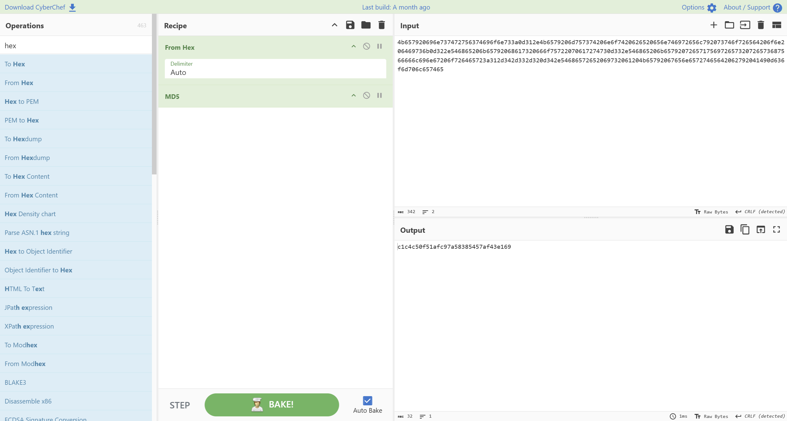

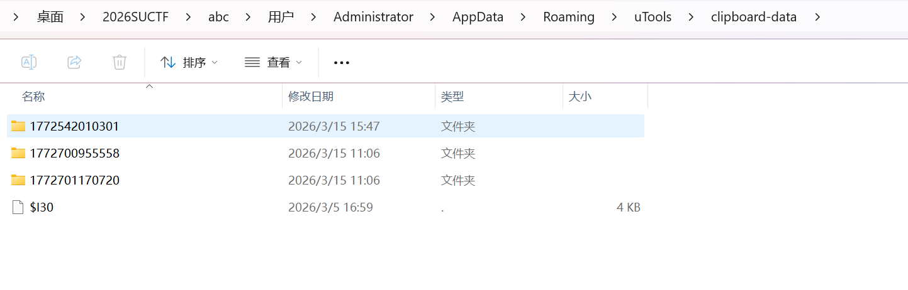

恢复脚本

```python
from __future__ import annotations

import json
import re
import subprocess
from collections import Counter
from datetime import datetime, timedelta, timezone
from pathlib import Path

ROOT = Path(__file__).resolve().parents[1]
ROAMING_UTOOLS = ROOT / "Users" / "Administrator" / "AppData" / "Roaming" /
"uTools"
LOCAL_UTOOLS = ROOT / "Users" / "Administrator" / "AppData" / "Local" /
"Programs" / "utools"
CLIPBOARD_DATA = ROAMING_UTOOLS / "clipboard-data"
TIMELINE_REPORT = ROAMING_UTOOLS / "clipboard_report_timeline.txt"
OUT_DIR = ROOT / "recovery_reports" / "utools_clipboard"

SHANGHAI = timezone(timedelta(hours=8))

ENTRY_PATTERN = re.compile(
r"^\[(\d+)\] (.*?) \| (.*?) \| (.*?)\n"
r"timestamp_ms: (\d+)\n"
r"hash: ([0-9a-f]+)\n"
r"value:\n(.*?)(?=\n\n\[|\Z)",
re.S | re.M,
)

def read_text(path: Path) -> str:
return path.read_text(encoding="utf-8", errors="ignore")

def iso_from_ms(timestamp_ms: int) -> str:
return datetime.fromtimestamp(timestamp_ms / 1000, tz=SHANGHAI).isoformat()

def detect_exe_version(exe_path: Path) -> dict[str, str]:
info: dict[str, str] = {}
try:
import pefile # type: ignore

pe = pefile.PE(str(exe_path))
for file_info in getattr(pe, "FileInfo", []) or []:
key = getattr(file_info, "Key", b"")
if key != b"StringFileInfo":

continue
for string_table in getattr(file_info, "StringTable", []) or []:
entries = getattr(string_table, "entries", {})
for raw_key, raw_value in entries.items():
key_text = raw_key.decode("utf-8", errors="ignore")
value_text = raw_value.decode("utf-8", errors="ignore")
info[key_text] = value_text
except Exception:
info = {}

if info:
return info

escaped_path = str(exe_path).replace("'", "''")
command = (
"$i=(Get-Item '"
+ escaped_path
+ "').VersionInfo; "
+ "[pscustomobject]@{"
+ "FileVersion=$i.FileVersion;"
+ "ProductVersion=$i.ProductVersion;"
+ "ProductName=$i.ProductName;"
+ "CompanyName=$i.CompanyName"
+ "} | ConvertTo-Json -Compress"
)
try:
result = subprocess.run(
["powershell", "-NoProfile", "-Command", command],
check=True,
capture_output=True,
text=True,
encoding="utf-8",
errors="ignore",
)
parsed = json.loads(result.stdout)
if isinstance(parsed, dict):
return {str(key): str(value) for key, value in parsed.items()}
except Exception:
pass
return {}

def detect_tags(entry_type: str, value: str) -> list[str]:
lower_value = value.lower()
tags: list[str] = []
if entry_type == "image":
tags.append("image")
if entry_type == "files":

tags.append("files")
if value.startswith("http://") or value.startswith("https://"):
tags.append("url")
if re.fullmatch(r"[0-9a-f]{64,}", value.strip()):
tags.append("hex_blob")
if re.fullmatch(r"[A-Za-z0-9_-]{40,}={0,2}", value.strip()):
tags.append("base64url_token")
if "\\\\" in value or re.search(r"[A-Za-z]:\\", value):
tags.append("windows_path")
if value.startswith("python3 -c ") or value.startswith("openssl ") or
value.startswith("KEY1=$("):
tags.append("command")
if any(keyword in lower_value for keyword in ("key", "api key",
"timestamp", "time stamp")):
tags.append("key_related")
if "\u5bc6\u94a5" in value or "\u65f6\u95f4\u6233" in value:
tags.append("key_related")
if re.fullmatch(r"\d{13}", value.strip()):
tags.append("timestamp_ms_value")
if "\n" in value.strip():
tags.append("multiline")
return sorted(set(tags))

def parse_file_items(value: str) -> list[dict] | None:
try:
parsed = json.loads(value)
except json.JSONDecodeError:
return None
if isinstance(parsed, list):
return parsed
return None

def find_image_attachment(folder_name: str, entry_hash: str) -> str | None:
folder = CLIPBOARD_DATA / folder_name
direct_candidate = folder / entry_hash
if direct_candidate.exists():
return str(direct_candidate.resolve())

png_candidate = folder / f"{entry_hash}.png"
if png_candidate.exists():
return str(png_candidate.resolve())

for candidate in sorted(folder.glob(f"{entry_hash}.*")):
if candidate.is_file():
return str(candidate.resolve())
return None

def parse_timeline() -> list[dict]:
entries: list[dict] = []
text = read_text(TIMELINE_REPORT)
for match in ENTRY_PATTERN.finditer(text):
index, dt_text, entry_type, source, timestamp_ms, entry_hash, value =
match.groups()
source_file, source_line = source.rsplit(":", 1)
folder_name = source_file.split("\\", 1)[0]
attachment_path = None
extra_attachment_path = None
parsed_files = None

if entry_type == "image":
attachment_path = find_image_attachment(folder_name, entry_hash)
ocr_candidate = CLIPBOARD_DATA / folder_name /
"ocr_preprocessed.png"
if ocr_candidate.exists():
extra_attachment_path = str(ocr_candidate.resolve())
elif entry_type == "files":
parsed_files = parse_file_items(value.rstrip("\n"))

clean_value = value.rstrip("\n")
entry = {
"index": int(index),
"datetime_shanghai": dt_text,
"timestamp_ms": int(timestamp_ms),
"timestamp_iso_from_ms": iso_from_ms(int(timestamp_ms)),
"type": entry_type,
"hash": entry_hash,
"value": clean_value,
"source": source,
"source_file": source_file,
"source_line": int(source_line),
"source_folder": folder_name,
"tags": detect_tags(entry_type, clean_value),
}
if attachment_path:
entry["attachment_path"] = attachment_path
if extra_attachment_path:
entry["ocr_preprocessed_path"] = extra_attachment_path
if parsed_files is not None:
entry["file_items"] = parsed_files
entries.append(entry)
return entries

def collect_source_folders() -> list[dict]:
folders: list[dict] = []

if not CLIPBOARD_DATA.exists():
return folders

for folder in sorted(p for p in CLIPBOARD_DATA.iterdir() if p.is_dir()):
data_file = folder / "data"
data_line_count = 0
if data_file.exists():
data_line_count = len(data_file.read_text(encoding="utf-8",
errors="ignore").splitlines())
attachments = []
for child in sorted(folder.iterdir()):
if child.name == "data":
continue
attachments.append(
{
"name": child.name,
"path": str(child.resolve()),
"size": child.stat().st_size,
}
)
folder_record = {
"folder_name": folder.name,
"path": str(folder.resolve()),
"data_file": str(data_file.resolve()) if data_file.exists() else
None,
"data_line_count": data_line_count,
"folder_timestamp_ms": int(folder.name) if folder.name.isdigit()
else None,
"folder_datetime_shanghai": iso_from_ms(int(folder.name)) if
folder.name.isdigit() else None,
"attachments": attachments,
}
folders.append(folder_record)
return folders

def merge_entries(entries: list[dict]) -> list[dict]:
merged_map: dict[tuple[str, str, str], dict] = {}
ordered_keys: list[tuple[str, str, str]] = []

for entry in entries:
key = (entry["type"], entry["hash"], entry["value"])
occurrence = {
"index": entry["index"],
"datetime_shanghai": entry["datetime_shanghai"],
"timestamp_ms": entry["timestamp_ms"],
"source": entry["source"],
}

if key not in merged_map:
merged = {
"type": entry["type"],
"hash": entry["hash"],
"value": entry["value"],
"tags": entry["tags"],
"first_seen_index": entry["index"],
"first_seen_datetime_shanghai": entry["datetime_shanghai"],
"first_seen_timestamp_ms": entry["timestamp_ms"],
"first_seen_source": entry["source"],
"last_seen_datetime_shanghai": entry["datetime_shanghai"],
"last_seen_timestamp_ms": entry["timestamp_ms"],
"occurrence_count": 0,
"occurrences": [],
}
if "attachment_path" in entry:
merged["attachment_path"] = entry["attachment_path"]
if "ocr_preprocessed_path" in entry:
merged["ocr_preprocessed_path"] =
entry["ocr_preprocessed_path"]
if "file_items" in entry:
merged["file_items"] = entry["file_items"]
merged_map[key] = merged
ordered_keys.append(key)

merged_entry = merged_map[key]
merged_entry["occurrence_count"] += 1
merged_entry["last_seen_datetime_shanghai"] =
entry["datetime_shanghai"]
merged_entry["last_seen_timestamp_ms"] = entry["timestamp_ms"]
merged_entry["occurrences"].append(occurrence)

return [merged_map[key] for key in ordered_keys]

def select_notable_entries(merged_entries: list[dict]) -> list[dict]:
notable: list[dict] = []
for entry in merged_entries:
value = entry["value"]
tags = set(entry["tags"])
if entry["type"] != "text":
notable.append(entry)
continue
if tags & {"key_related", "command", "base64url_token",
"timestamp_ms_value"}:
notable.append(entry)
continue
if any(

keyword in value.lower()
for keyword in (
"ollama",
"db.sqlite",
"clipboard-data",
"app.asar",
"unallocated",
"api key",
)
):
notable.append(entry)
return notable

def fence(value: str) -> str:
return "```text\n" + value + "\n```"

def build_markdown(
raw_entries: list[dict],
merged_entries: list[dict],
source_folders: list[dict],
exe_version: dict[str, str],
) -> str:
summary_counts = Counter(entry["type"] for entry in raw_entries)
merged_counts = Counter(entry["type"] for entry in merged_entries)
notable_entries = select_notable_entries(merged_entries)

lines: list[str] = []
lines.append("# uTools Clipboard Detailed Report")
lines.append("")
lines.append("## Overview")
lines.append(f"- Generated at: {datetime.now(tz=SHANGHAI).isoformat()}")
lines.append(f"- Roaming root: `{ROAMING_UTOOLS}`")
lines.append(f"- Program root: `{LOCAL_UTOOLS}`")
lines.append(f"- Clipboard data root: `{CLIPBOARD_DATA}`")
lines.append(f"- Raw timeline entries: {len(raw_entries)}")
lines.append(f"- Merged records: {len(merged_entries)}")
lines.append(f"- Raw type counts: {dict(summary_counts)}")
lines.append(f"- Merged type counts: {dict(merged_counts)}")
if exe_version:
lines.append(
"- uTools version: "
+ exe_version.get("FileVersion", "")
+ " / "
+ exe_version.get("ProductVersion", "")
)
lines.append("- Encryption verified from local code:")
lines.append(" - algorithm: `AES-256-CBC`")

lines.append(" - IV: `UTOOLS0123456789`")
lines.append(" - key source: `addon.getLocalSecretKey()`")
lines.append(f" - evidence file: `{ROAMING_UTOOLS / '_asar_main_tmp' /
'main.js'}`")
lines.append("")
lines.append("## Source Folders")
for folder in source_folders:
lines.append(f"- Folder: `{folder['folder_name']}`")
lines.append(f" - Path: `{folder['path']}`")
lines.append(f" - Datetime (+08):
`{folder['folder_datetime_shanghai']}`")
lines.append(f" - Data lines: `{folder['data_line_count']}`")
if folder["attachments"]:
for attachment in folder["attachments"]:
lines.append(
f" - Attachment: `{attachment['name']}` |
`{attachment['size']}` bytes | `{attachment['path']}`"
)
lines.append("")
lines.append("## Notable Records")
for entry in notable_entries:
lines.append(
f"### [{entry['first_seen_index']}]
{entry['first_seen_datetime_shanghai']} | {entry['type']} | hash=
{entry['hash']}"
)
lines.append(f"- First source: `{entry['first_seen_source']}`")
lines.append(f"- Seen count: `{entry['occurrence_count']}`")
lines.append(f"- Tags: `{', '.join(entry['tags'])}`")
if "attachment_path" in entry:
lines.append(f"- Attachment path: `{entry['attachment_path']}`")
if "ocr_preprocessed_path" in entry:
lines.append(f"- OCR helper path:
`{entry['ocr_preprocessed_path']}`")
if "file_items" in entry:
lines.append("")
lines.append("```json")
lines.append(json.dumps(entry["file_items"], ensure_ascii=False,
indent=2))
lines.append("```")
else:
lines.append("")
lines.append(fence(entry["value"]))
lines.append("")
lines.append("## Merged Timeline")
for entry in merged_entries:
lines.append(

f"### [{entry['first_seen_index']}]
{entry['first_seen_datetime_shanghai']} | {entry['type']} | hash=
{entry['hash']}"
)
lines.append(f"- First source: `{entry['first_seen_source']}`")
lines.append(f"- Last seen (+08):
`{entry['last_seen_datetime_shanghai']}`")
lines.append(f"- Seen count: `{entry['occurrence_count']}`")
lines.append(f"- Tags: `{', '.join(entry['tags'])}`")
if "attachment_path" in entry:
lines.append(f"- Attachment path: `{entry['attachment_path']}`")
if "ocr_preprocessed_path" in entry:
lines.append(f"- OCR helper path:
`{entry['ocr_preprocessed_path']}`")
if "file_items" in entry:
lines.append("")
lines.append("```json")
lines.append(json.dumps(entry["file_items"], ensure_ascii=False,
indent=2))
lines.append("```")
else:
lines.append("")
lines.append(fence(entry["value"]))
lines.append("")
return "\n".join(lines).rstrip() + "\n"

def main() -> None:
OUT_DIR.mkdir(parents=True, exist_ok=True)

raw_entries = parse_timeline()
source_folders = collect_source_folders()
merged_entries = merge_entries(raw_entries)
exe_version = detect_exe_version(LOCAL_UTOOLS / "uTools.exe")

report = {
"generated_at": datetime.now(tz=SHANGHAI).isoformat(),
"paths": {
"roaming_root": str(ROAMING_UTOOLS.resolve()),
"program_root": str(LOCAL_UTOOLS.resolve()),
"clipboard_data_root": str(CLIPBOARD_DATA.resolve()),
"timeline_report": str(TIMELINE_REPORT.resolve()),
"decryption_evidence_main_js": str((ROAMING_UTOOLS /
"_asar_main_tmp" / "main.js").resolve()),
"app_asar": str((LOCAL_UTOOLS / "resources" /
"app.asar").resolve()),
},
"uTools_exe_version": exe_version,

"verified_encryption": {
"algorithm": "AES-256-CBC",
"iv": "UTOOLS0123456789",
"key_source": "addon.getLocalSecretKey()",
"evidence_file": str((ROAMING_UTOOLS / "_asar_main_tmp" /
"main.js").resolve()),
},
"summary": {
"raw_entry_count": len(raw_entries),
"merged_entry_count": len(merged_entries),
"raw_type_counts": dict(Counter(entry["type"] for entry in
raw_entries)),
"merged_type_counts": dict(Counter(entry["type"] for entry in
merged_entries)),
},
"source_folders": source_folders,
"notable_entries": select_notable_entries(merged_entries),
"raw_entries": raw_entries,
"merged_entries": merged_entries,
}

json_path = OUT_DIR / "utools_clipboard_detailed.json"
md_path = OUT_DIR / "utools_clipboard_detailed.md"

json_path.write_text(json.dumps(report, ensure_ascii=False, indent=2),
encoding="utf-8")
md_path.write_text(
build_markdown(raw_entries, merged_entries, source_folders,
exe_version),
encoding="utf-8",
)

print(f"Wrote {json_path}")
print(f"Wrote {md_path}")

if __name__ == "__main__":
main()
```

恢复出来后 还意外发现了第三密钥的信息

还找到了出题人自己找的utools剪切板取证文章

第一密钥就是

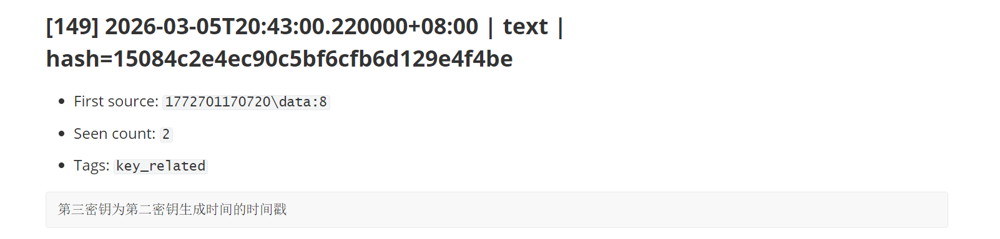

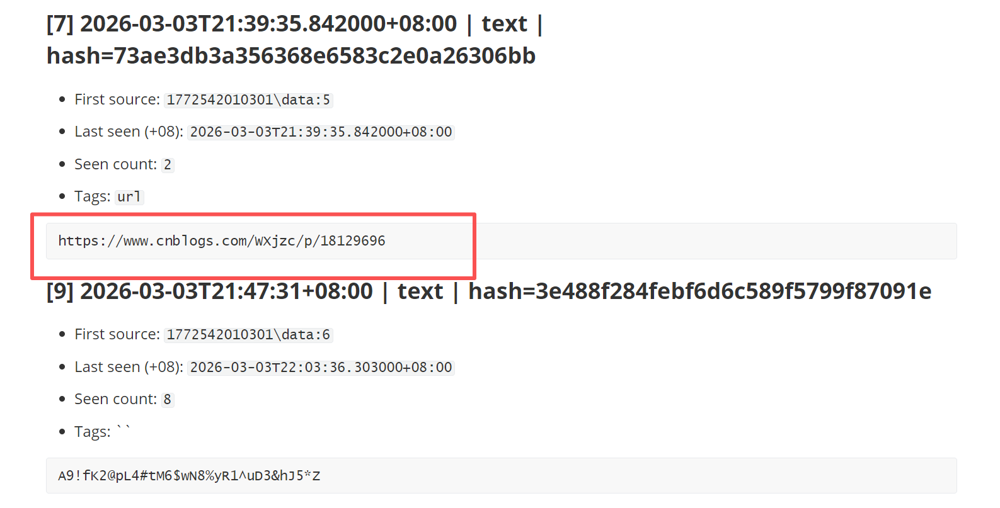

```text
zQt$d3!GIS9l.aR@7ELN
```

4.

得到第二密钥的对话id和时间。请以 UTC+8 时区提供您的答案。（时间格式
YYYY/MM/DDTHH:MM:SS，两个答案以_相连）

```
019cbe60-6803-70fe-8ab5-e0035399980f_2026/03/05T22:25:24
```

这里我当时还用火眼取了一下 但是火眼对于indexedDB普通版的解析不全 最后没看到到底生没生成

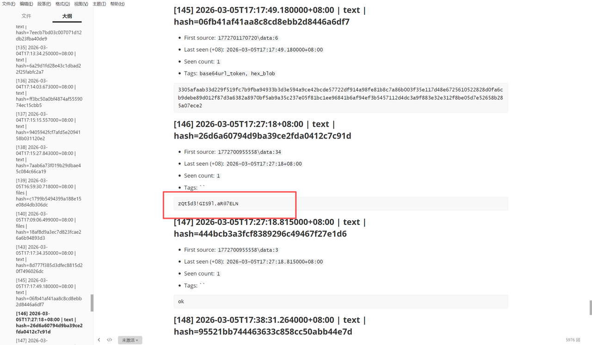

所以就去解析了indexedDB数据库

```text
const fs = require("fs");
const path = require("path");
const v8 = require("v8");

const BLOCK_SIZE = 32768;
const FULL = 1;
const FIRST = 2;
const MIDDLE = 3;
const LAST = 4;
const V8_HEADER = Buffer.from([0xff, 0x0f]);

function isNumericLogFile(name) {
return /^\d{6}\.log$/i.test(name);
}

function listLogFiles(inputPath) {
const resolved = path.resolve(inputPath || ".");
const stat = fs.statSync(resolved);
if (stat.isFile()) {
return [resolved];
}
return fs
.readdirSync(resolved, { withFileTypes: true })
```

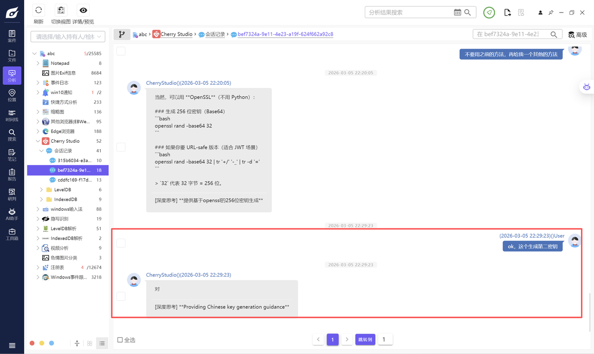

```text
.filter((entry) => entry.isFile() && isNumericLogFile(entry.name))
.map((entry) => path.join(resolved, entry.name))
.sort();
}

function* logicalRecords(buffer) {
let offset = 0;
let chunks = [];

while (offset + 7 <= buffer.length) {
const blockOffset = offset % BLOCK_SIZE;
if (BLOCK_SIZE - blockOffset < 7) {
offset += BLOCK_SIZE - blockOffset;
continue;
}

const length = buffer.readUInt16LE(offset + 4);
const type = buffer[offset + 6];
offset += 7;

if (length === 0 && type === 0) {
offset += BLOCK_SIZE - (offset % BLOCK_SIZE || BLOCK_SIZE);
continue;
}

if (offset + length > buffer.length) {
break;
}

const payload = buffer.subarray(offset, offset + length);
offset += length;

if (type === FULL) {
yield payload;
chunks = [];
} else if (type === FIRST) {
chunks = [payload];
} else if (type === MIDDLE) {
chunks.push(payload);
} else if (type === LAST) {
chunks.push(payload);
yield Buffer.concat(chunks);
chunks = [];
}
}
}

function readVarint32(buffer, state) {
let result = 0;
let shift = 0;

while (state.pos < buffer.length && shift < 35) {
const byte = buffer[state.pos++];
result |= (byte & 0x7f) << shift;
if ((byte & 0x80) === 0) {
return result >>> 0;
}
shift += 7;
}

throw new Error("Invalid varint32");
}

function readSlice(buffer, state) {
const length = readVarint32(buffer, state);
const start = state.pos;
const end = start + length;
if (end > buffer.length) {
throw new Error("Slice exceeds record length");
}
state.pos = end;
return buffer.subarray(start, end);
}

function parseWriteBatch(record, filePath) {
if (record.length < 12) {
return null;
}

const sequence = Number(record.readBigUInt64LE(0));
const count = record.readUInt32LE(8);
const state = { pos: 12 };
const ops = [];

for (let index = 0; index < count && state.pos < record.length; index += 1) {
const tag = record[state.pos++];
if (tag !== 0 && tag !== 1) {
break;
}

const key = readSlice(record, state);
const value = tag === 1 ? readSlice(record, state) : null;

ops.push({

seq: sequence + index,
op: tag === 1 ? "put" : "del",
key,
keyHex: key.toString("hex"),
value,
sourceFile: filePath,
});
}

return { sequence, count, ops };
}

function decodeV8Value(valueBuffer) {
if (!valueBuffer) {
return null;
}

const offset = valueBuffer.indexOf(V8_HEADER);
if (offset < 0) {
return null;
}

try {
return {
offset,
value: v8.deserialize(valueBuffer.subarray(offset)),
};
} catch {
return null;
}
}

function isTopic(value) {
return (
value &&
typeof value === "object" &&
!Array.isArray(value) &&
typeof value.id === "string" &&
Array.isArray(value.messages)
);
}

function isBlock(value) {
return (
value &&
typeof value === "object" &&
!Array.isArray(value) &&

typeof value.id === "string" &&
typeof value.messageId === "string" &&
typeof value.type === "string"
);
}

function cloneJsonSafe(value) {
return JSON.parse(JSON.stringify(value));
}

function normalizeModel(model) {
if (!model || typeof model !== "object") {
return null;
}

return {
id: model.id || null,
name: model.name || null,
provider: model.provider || null,
group: model.group || null,
owned_by: model.owned_by || null,
endpoint_type: model.endpoint_type || null,
supported_endpoint_types: Array.isArray(model.supported_endpoint_types)
? model.supported_endpoint_types
: null,
};
}

function normalizeBlock(record) {
const block = record.value;
return {
id: block.id,
messageId: block.messageId,
type: block.type,
createdAt: block.createdAt || null,
status: block.status || null,
content: typeof block.content === "string" ? block.content : "",
error: block.error ? cloneJsonSafe(block.error) : null,
citationReferences: Array.isArray(block.citationReferences)
? cloneJsonSafe(block.citationReferences)
: null,
knowledgeBaseIds: Array.isArray(block.knowledgeBaseIds)
? cloneJsonSafe(block.knowledgeBaseIds)
: null,
thinking_millsec:
typeof block.thinking_millsec === "number" ? block.thinking_millsec :
null,

seq: record.seq,
sourceFile: record.sourceFile,
live: !!record.live,
};
}

function blockSortKey(block) {
return `${block.createdAt || ""}\u0000${block.seq.toString().padStart(12,
"0")}`;
}

function mergeMessageBlocks(blockIds, blocksById) {
const resolvedBlocks = [];
const missingBlockIds = [];

for (const blockId of blockIds) {
const block = blocksById.get(blockId);
if (block) {
resolvedBlocks.push(block);
} else {
missingBlockIds.push(blockId);
}
}

resolvedBlocks.sort((left, right) =>
blockSortKey(left).localeCompare(blockSortKey(right)));

const byType = {
main_text: [],
thinking: [],
error: [],
unknown: [],
other: [],
};

for (const block of resolvedBlocks) {
if (Object.prototype.hasOwnProperty.call(byType, block.type)) {
byType[block.type].push(block);
} else {
byType.other.push(block);
}
}

const mainText = byType.main_text.map((block) => block.content).join("\n");
const thinkingText = byType.thinking.map((block) =>
block.content).join("\n");

return {
blocks: resolvedBlocks,
missingBlockIds,
mainText,
thinkingText,
errors: byType.error.map((block) => ({
id: block.id,
createdAt: block.createdAt,
status: block.status,
error: block.error,
})),
unknownBlocks: byType.unknown.map((block) => ({
id: block.id,
createdAt: block.createdAt,
status: block.status,
content: block.content,
})),
};
}

function normalizeMessage(message, blocksById) {
const blockIds = Array.isArray(message.blocks) ? message.blocks : [];
const merged = mergeMessageBlocks(blockIds, blocksById);

return {
id: message.id,
role: message.role || null,
topicId: message.topicId || null,
assistantId: message.assistantId || null,
askId: message.askId || null,
createdAt: message.createdAt || null,
status: message.status || null,
modelId: message.modelId || null,
model: normalizeModel(message.model),
usage: message.usage ? cloneJsonSafe(message.usage) : null,
metrics: message.metrics ? cloneJsonSafe(message.metrics) : null,
traceId: message.traceId || null,
blockIds,
missingBlockIds: merged.missingBlockIds,
text: merged.mainText,
thinking: merged.thinkingText || null,
errors: merged.errors,
unknownBlocks: merged.unknownBlocks,
blocks: merged.blocks,
};
}

function buildConversation(topicRecord, blocksById, liveTopicIds) {
const topic = topicRecord.value;
const messages = topic.messages
.slice()
.sort((left, right) => {
const leftKey = `${left.createdAt || ""}\u0000${left.id || ""}`;
const rightKey = `${right.createdAt || ""}\u0000${right.id || ""}`;
return leftKey.localeCompare(rightKey);
})
.map((message) => normalizeMessage(message, blocksById));

return {
id: topic.id,
live: liveTopicIds.has(topic.id),
recoveredFromDeletedState: !liveTopicIds.has(topic.id),
messageCount: messages.length,
firstMessageAt: messages[0]?.createdAt || null,
lastMessageAt: messages[messages.length - 1]?.createdAt || null,
messages,
seq: topicRecord.seq,
sourceFile: topicRecord.sourceFile,
};
}

function collectBlocksById(blockRecords) {
const blocksById = new Map();
for (const record of blockRecords.values()) {
blocksById.set(record.value.id, normalizeBlock(record));
}
return blocksById;
}

function upsertLatestById(store, record) {
const current = store.get(record.value.id);
if (!current || current.seq <= record.seq) {
store.set(record.value.id, record);
}
}

function collectRecoveredState(logFiles) {
const historyTopics = new Map();
const historyBlocks = new Map();
const liveByKey = new Map();
const stats = {
logFiles,
writeBatches: 0,
puts: 0,

deletes: 0,
decodedV8Values: 0,
};

for (const logFile of logFiles) {
const buffer = fs.readFileSync(logFile);
for (const record of logicalRecords(buffer)) {
const batch = parseWriteBatch(record, logFile);
if (!batch) {
continue;
}

stats.writeBatches += 1;

for (const op of batch.ops) {
if (op.op === "del") {
stats.deletes += 1;
liveByKey.delete(op.keyHex);
continue;
}

stats.puts += 1;
const decoded = decodeV8Value(op.value);
if (decoded) {
stats.decodedV8Values += 1;
op.decoded = decoded.value;

if (isTopic(decoded.value)) {
op.kind = "topic";
op.value = cloneJsonSafe(decoded.value);
upsertLatestById(historyTopics, op);
} else if (isBlock(decoded.value)) {
op.kind = "block";
op.value = cloneJsonSafe(decoded.value);
upsertLatestById(historyBlocks, op);
}
}

liveByKey.set(op.keyHex, op);
}
}
}

const liveTopics = new Map();
const liveBlocks = new Map();

for (const op of liveByKey.values()) {

if (op.kind === "topic") {
op.live = true;
upsertLatestById(liveTopics, op);
} else if (op.kind === "block") {
op.live = true;
upsertLatestById(liveBlocks, op);
}
}

return {
stats,
historyTopics,
historyBlocks,
liveTopics,
liveBlocks,
};
}

function buildOutputDocuments(state) {
const liveTopicIds = new Set([...state.liveTopics.keys()]);
const liveBlocksById = collectBlocksById(state.liveBlocks);
const historyBlocksById = collectBlocksById(state.historyBlocks);

const liveConversations = [...state.liveTopics.values()]
.sort((left, right) => left.seq - right.seq)
.map((topicRecord) => buildConversation(topicRecord, liveBlocksById,
liveTopicIds));

const recoveredConversations = [...state.historyTopics.values()]
.sort((left, right) => left.seq - right.seq)
.map((topicRecord) =>
buildConversation(topicRecord, historyBlocksById, liveTopicIds),
);

const recoveredOnlyTopicIds = recoveredConversations
.filter((conversation) => !conversation.live)
.map((conversation) => conversation.id);

const historicalOnlyMessages = recoveredConversations.reduce((count,
conversation) => {
const liveConversation = liveConversations.find(
(candidate) => candidate.id === conversation.id,
);
if (!liveConversation) {
return count + conversation.messages.length;
}

return count + Math.max(conversation.messages.length -
liveConversation.messages.length, 0);
}, 0);

return {
summary: {
...state.stats,
liveTopicCount: liveConversations.length,
recoveredTopicCount: recoveredConversations.length,
liveBlockCount: liveBlocksById.size,
recoveredBlockCount: historyBlocksById.size,
recoveredOnlyTopicIds,
historicalOnlyMessageCount: historicalOnlyMessages,
},
liveConversations,
recoveredConversations,
};
}

function renderMessageMarkdown(message) {
const lines = [];
lines.push(`### ${message.createdAt || "unknown-time"} [${message.role ||
"unknown"}]`);
lines.push(`- messageId: ${message.id}`);
lines.push(`- status: ${message.status || "unknown"}`);
lines.push(`- model: ${message.model?.id || message.modelId || "unknown"}`);

if (message.text) {
lines.push("");
lines.push("```text");
lines.push(message.text);
lines.push("```");
}

if (message.thinking) {
lines.push("");
lines.push("Thinking:");
lines.push("```text");
lines.push(message.thinking);
lines.push("```");
}

if (message.errors.length > 0) {
lines.push("");
lines.push("Errors:");
for (const errorEntry of message.errors) {
const errorText =

errorEntry.error?.message ||
errorEntry.error?.name ||
JSON.stringify(errorEntry.error || {});
lines.push(`- ${errorEntry.id}: ${errorText}`);
}
}

if (message.missingBlockIds.length > 0) {
lines.push("");
lines.push(`Missing blocks: ${message.missingBlockIds.join(", ")}`);
}

return lines.join("\n");
}

function renderMarkdown(title, conversations) {
const lines = [];
lines.push(`# ${title}`);
lines.push("");

for (const conversation of conversations) {
lines.push(`## Topic ${conversation.id}`);
lines.push(`- live: ${conversation.live}`);
lines.push(`- recoveredFromDeletedState:
${conversation.recoveredFromDeletedState}`);
lines.push(`- messageCount: ${conversation.messageCount}`);
lines.push(`- firstMessageAt: ${conversation.firstMessageAt ||
"unknown"}`);
lines.push(`- lastMessageAt: ${conversation.lastMessageAt || "unknown"}`);
lines.push("");

for (const message of conversation.messages) {
lines.push(renderMessageMarkdown(message));
lines.push("");
}
}

return `${lines.join("\n").trim()}\n`;
}

function writeOutput(outputDir, documents) {
fs.mkdirSync(outputDir, { recursive: true });

fs.writeFileSync(
path.join(outputDir, "summary.json"),
JSON.stringify(documents.summary, null, 2),
);

fs.writeFileSync(
path.join(outputDir, "live_conversations.json"),
JSON.stringify(documents.liveConversations, null, 2),
);
fs.writeFileSync(
path.join(outputDir, "recovered_conversations.json"),
JSON.stringify(documents.recoveredConversations, null, 2),
);
fs.writeFileSync(
path.join(outputDir, "live_conversations.md"),
renderMarkdown("Cherry Studio Live Conversations",
documents.liveConversations),
);
fs.writeFileSync(
path.join(outputDir, "recovered_conversations.md"),
renderMarkdown("Cherry Studio Recovered Conversations",
documents.recoveredConversations),
);
}

function main() {
const inputPath = process.argv[2] || ".";
const outputDir = path.resolve(process.argv[3] || "recovered_output");
const logFiles = listLogFiles(inputPath);

if (logFiles.length === 0) {
throw new Error("No numeric LevelDB log files were found.");
}

const state = collectRecoveredState(logFiles);
const documents = buildOutputDocuments(state);
writeOutput(outputDir, documents);

console.log(
JSON.stringify(
{
outputDir,
...documents.summary,
},
null,
2,
),
);
}

main();
```

然而发现并没有。

同时还看到cherry studio同目录下面还有ollama 那很有可能是通过本地模型 ollama命令行生成的密
钥 结合cherry前面的对话记录 能看出对安全性要求比较高 这种可能性就更大了

ollama主要是解析"abc\Users\Administrator\AppData\Local\Ollama\db.sqlite"数据库

```python
from __future__ import annotations

import argparse
import json
import re
import sqlite3
from datetime import datetime
from pathlib import Path
from typing import Any

APP_LOG_PATTERN = re.compile(
r"time=(?P<time>\S+)\s+.*?http.method=(?P<method>\S+)\s+http.path=(?
P<path>\S+)\s+.*?"
r"http.status=(?P<status>\d+)\s+http.d=(?P<duration>\S+)\s+request_id=(?
P<request_id>\d+)"
)

SERVER_LOG_PATTERN = re.compile(
```

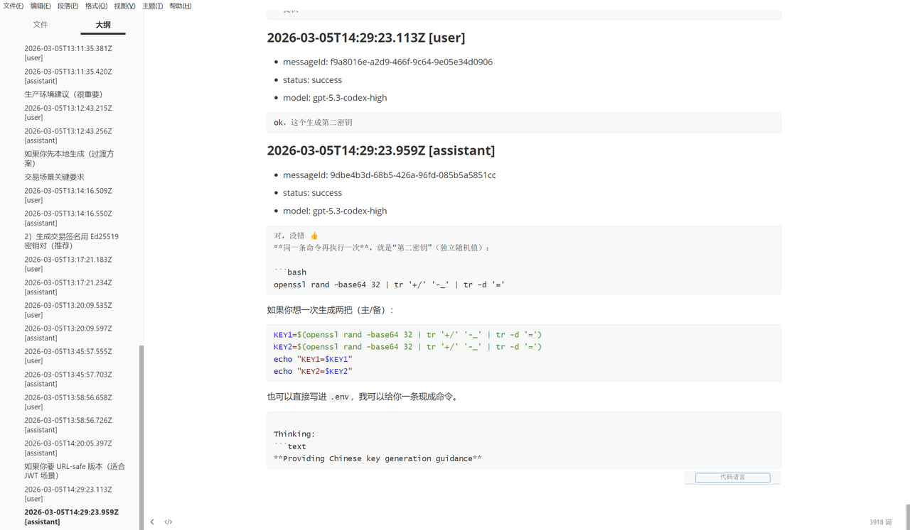

```python
r'^\[GIN\]\s+(?P<time>\d{4}/\d{2}/\d{2}\s+-\s+\d{2}:\d{2}:\d{2})\s+\|\s+'
r'(?P<status>\d+)\s+\|\s+(?P<duration>[^|]+)\|\s+(?P<client>[^|]+)\|\s+'
r'(?P<method>\S+)\s+"(?P<path>[^"]+)"'
)

def file_metadata(path: Path) -> dict[str, Any]:
if not path.exists():
return {
"path": str(path),
"exists": False,
}

stat = path.stat()
return {
"path": str(path),
"exists": True,
"size": stat.st_size,
"modified_at": stat.st_mtime,
"modified_at_iso":
datetime.fromtimestamp(stat.st_mtime).astimezone().isoformat(),
}

def parse_app_log(path: Path) -> list[dict[str, Any]]:
events: list[dict[str, Any]] = []
if not path.exists():
return events

text = path.read_text(encoding="utf-8", errors="replace")
for lineno, line in enumerate(text.splitlines(), start=1):
match = APP_LOG_PATTERN.search(line)
if not match:
continue

path_value = match.group("path")
if "/api/v1/chat" not in path_value and "/api/v1/chats" not in
path_value:
continue

chat_id = None
chat_match = re.search(r"/api/v1/chat/([^/\s]+)", path_value)
if chat_match:
candidate = chat_match.group(1)
if candidate not in {"{id}", "new"}:
chat_id = candidate

events.append(
{

"source": "app.log",
"line": lineno,
"time": match.group("time"),
"method": match.group("method"),
"path": path_value,
"status": int(match.group("status")),
"duration": match.group("duration"),
"request_id": match.group("request_id"),
"chat_id": chat_id,
"raw": line,
}
)

return events

def parse_server_log(path: Path) -> list[dict[str, Any]]:
events: list[dict[str, Any]] = []
if not path.exists():
return events

text = path.read_text(encoding="utf-8", errors="replace")
for lineno, line in enumerate(text.splitlines(), start=1):
match = SERVER_LOG_PATTERN.search(line)
if not match:
continue

path_value = match.group("path")
if path_value not in {"/api/chat", "/api/show", "/api/tags",
"/api/version"}:
continue

events.append(
{
"source": "server.log",
"line": lineno,
"time": match.group("time"),
"method": match.group("method"),
"path": path_value,
"status": int(match.group("status")),
"duration": match.group("duration").strip(),
"client": match.group("client").strip(),
"raw": line,
}
)

return events

def clean_title(title: str) -> str:
title = (title or "").strip()
if title:
return title
return "Untitled"

def infer_title(messages: list[dict[str, Any]]) -> str:
for message in messages:
if message["role"] == "user":
first_line = (message["content"] or "").strip().splitlines()[0:1]
if first_line:
line = first_line[0].strip()
if line:
return line[:80]
return "Untitled"

def safe_name(value: str) -> str:
value = re.sub(r"[<>:\"/\\\\|?*]", "_", value).strip()
value = value.replace(" ", "_")
return value[:80] or "untitled"

def fenced_block(text: str) -> str:
if not text:
return "_empty_"
return f"````text\n{text}\n````"

def load_database(db_path: Path) -> dict[str, Any]:
conn = sqlite3.connect(f"file:{db_path.as_posix()}?mode=ro", uri=True)
conn.row_factory = sqlite3.Row
cur = conn.cursor()

attachments_by_message: dict[int, list[dict[str, Any]]] = {}
for row in cur.execute(
"select id, message_id, filename, length(data) as data_size from
```

attachments order by id"

```sql
):
attachments_by_message.setdefault(row["message_id"], []).append(
{
"id": row["id"],
"filename": row["filename"],
"data_size": row["data_size"],
}
)

tool_calls_by_message: dict[int, list[dict[str, Any]]] = {}
for row in cur.execute(
"""

select id, message_id, type, function_name, function_arguments,
function_result
from tool_calls
order by id
"""
):
tool_calls_by_message.setdefault(row["message_id"], []).append(
{
"id": row["id"],
"type": row["type"],
"function_name": row["function_name"],
"function_arguments": row["function_arguments"],
"function_result": row["function_result"],
}
)

chats: list[dict[str, Any]] = []
chat_rows = cur.execute("select id, title, created_at, browser_state from
chats order by created_at").fetchall()

for chat_row in chat_rows:
messages: list[dict[str, Any]] = []
model_names: set[str] = set()

message_rows = cur.execute(
"""
select
id, chat_id, role, content, thinking, stream, model_name,
created_at, updated_at,
thinking_time_start, thinking_time_end, tool_result
from messages
where chat_id = ?
order by created_at, id
""",
(chat_row["id"],),
).fetchall()

for message_row in message_rows:
model_name = message_row["model_name"]
if model_name:
model_names.add(model_name)

messages.append(
{
"id": message_row["id"],
"chat_id": message_row["chat_id"],
"role": message_row["role"],

"created_at": message_row["created_at"],
"updated_at": message_row["updated_at"],
"stream": bool(message_row["stream"]),
"model_name": model_name,
"thinking_time_start": message_row["thinking_time_start"],
"thinking_time_end": message_row["thinking_time_end"],
"content": message_row["content"],
"content_length": len(message_row["content"] or ""),
"thinking": message_row["thinking"],
"thinking_length": len(message_row["thinking"] or ""),
"tool_result": message_row["tool_result"],
"tool_result_length": len(message_row["tool_result"] or
""),
"attachments":
attachments_by_message.get(message_row["id"], []),
"tool_calls": tool_calls_by_message.get(message_row["id"],
[]),
}
)

chats.append(
{
"chat_id": chat_row["id"],
"title": chat_row["title"],
"clean_title": clean_title(chat_row["title"]),
"inferred_title": infer_title(messages),
"created_at": chat_row["created_at"],
"browser_state": chat_row["browser_state"],
"message_count": len(messages),
"models": sorted(model_names),
"messages": messages,
}
)

summary = {
"chat_count": cur.execute("select count(*) from chats").fetchone()[0],
"message_count": cur.execute("select count(*) from
messages").fetchone()[0],
"attachment_count": cur.execute("select count(*) from
attachments").fetchone()[0],
"tool_call_count": cur.execute("select count(*) from
tool_calls").fetchone()[0],
"thinking_nonempty_count": cur.execute(
"select count(*) from messages where coalesce(thinking, '') <> ''"
).fetchone()[0],
"tool_result_nonempty_count": cur.execute(

"select count(*) from messages where coalesce(tool_result, '') <>
```

''"

```python
).fetchone()[0],
}

conn.close()
return {
"summary": summary,
"chats": chats,
}

def build_report(base_dir: Path) -> dict[str, Any]:
db_path = base_dir / "Users" / "Administrator" / "AppData" / "Local" /
"Ollama" / "db.sqlite"
app_log_path = base_dir / "Users" / "Administrator" / "AppData" / "Local"
```

$$
/ "Ollama" / "app.log"
$$

```python
server_log_path = base_dir / "Users" / "Administrator" / "AppData" /
"Local" / "Ollama" / "server.log"
wal_path = base_dir / "Users" / "Administrator" / "AppData" / "Local" /
"Ollama" / "db.sqlite-wal"

data = load_database(db_path)
app_events = parse_app_log(app_log_path)
server_events = parse_server_log(server_log_path)

chat_event_map: dict[str, list[dict[str, Any]]] = {}
for event in app_events:
chat_id = event.get("chat_id")
if chat_id:
chat_event_map.setdefault(chat_id, []).append(event)

for chat in data["chats"]:
chat["app_log_events"] = chat_event_map.get(chat["chat_id"], [])

return {
"base_dir": str(base_dir),
"evidence_files": {
"db": file_metadata(db_path),
"wal": file_metadata(wal_path),
"app_log": file_metadata(app_log_path),
"server_log": file_metadata(server_log_path),
},
"summary": data["summary"],
"global_app_events": app_events,
"global_server_events": server_events,
"chats": data["chats"],
}

def render_markdown(report: dict[str, Any]) -> str:
lines: list[str] = []
lines.append("# Ollama 对话恢复报告")
lines.append("")
lines.append("## 证据文件")
lines.append("")
for key, meta in report["evidence_files"].items():
lines.append(f"- {key}: `{meta['path']}`")
lines.append(f" - exists: `{meta['exists']}`")
if meta["exists"]:
lines.append(f" - size: `{meta['size']}`")
lines.append(f" - modified_at_epoch: `{meta['modified_at']}`")
lines.append("")
lines.append("## 总览")
lines.append("")
summary = report["summary"]
for key, value in summary.items():
lines.append(f"- {key}: `{value}`")
lines.append("")
lines.append(f"- global_app_event_count:
`{len(report['global_app_events'])}`")
lines.append(f"- global_server_event_count:
`{len(report['global_server_events'])}`")
lines.append("")
lines.append("## Chat 列表")
lines.append("")
for index, chat in enumerate(report["chats"], start=1):
title = chat["clean_title"] if chat["title"] else
chat["inferred_title"]
lines.append(
f"- Chat {index}: `{chat['chat_id']}` | title=`{title}` |
created_at=`{chat['created_at']}` | "
f"message_count=`{chat['message_count']}` | models=`{',
'.join(chat['models']) or 'N/A'}`"
)
lines.append("")

lines.append("## Global Server Timeline")
lines.append("")
for event in report["global_server_events"]:
lines.append(
f"- line `{event['line']}` | time=`{event['time']}` |
method=`{event['method']}` | "
f"path=`{event['path']}` | status=`{event['status']}` |
duration=`{event['duration']}`"
)

lines.append("")

for index, chat in enumerate(report["chats"], start=1):
title = chat["clean_title"] if chat["title"] else
chat["inferred_title"]
lines.append(f"## Chat {index}: {title}")
lines.append("")
lines.append(f"- chat_id: `{chat['chat_id']}`")
lines.append(f"- stored_title: `{chat['title'] or ''}`")
lines.append(f"- inferred_title: `{chat['inferred_title']}`")
lines.append(f"- created_at: `{chat['created_at']}`")
lines.append(f"- message_count: `{chat['message_count']}`")
lines.append(f"- models: `{', '.join(chat['models']) or 'N/A'}`")
lines.append(f"- app_log_event_count: `{len(chat['app_log_events'])}`")
lines.append("")

if chat["app_log_events"]:
lines.append("### App Log Timeline")
lines.append("")
for event in chat["app_log_events"]:
lines.append(
f"- line `{event['line']}` | time=`{event['time']}` |
method=`{event['method']}` | "
f"path=`{event['path']}` | status=`{event['status']}` |
duration=`{event['duration']}`"
)
lines.append("")

lines.append("### Messages")
lines.append("")
for message in chat["messages"]:
lines.append(f"#### Message {message['id']}")
lines.append("")
lines.append(f"- role: `{message['role']}`")
lines.append(f"- created_at: `{message['created_at']}`")
lines.append(f"- updated_at: `{message['updated_at']}`")
lines.append(f"- model_name: `{message['model_name'] or ''}`")
lines.append(f"- stream: `{message['stream']}`")
lines.append(f"- content_length: `{message['content_length']}`")
lines.append(f"- thinking_length: `{message['thinking_length']}`")
lines.append(f"- tool_result_length:
`{message['tool_result_length']}`")
lines.append(f"- thinking_time_start:
`{message['thinking_time_start'] or ''}`")
lines.append(f"- thinking_time_end: `{message['thinking_time_end']
or ''}`")

lines.append(f"- attachment_count:
`{len(message['attachments'])}`")
lines.append(f"- tool_call_count: `{len(message['tool_calls'])}`")
lines.append("")
lines.append("Content:")
lines.append(fenced_block(message["content"]))
lines.append("")
lines.append("Thinking:")
lines.append(fenced_block(message["thinking"]))
lines.append("")
lines.append("Tool Result:")
lines.append(fenced_block(message["tool_result"]))
lines.append("")

if message["attachments"]:
lines.append("Attachments:")
for attachment in message["attachments"]:
lines.append(
f"- id=`{attachment['id']}` |
filename=`{attachment['filename']}` | "
f"data_size=`{attachment['data_size']}`"
)
lines.append("")

if message["tool_calls"]:
lines.append("Tool Calls:")
for tool_call in message["tool_calls"]:
lines.append(
f"- id=`{tool_call['id']}` |
type=`{tool_call['type']}` | "
f"function_name=`{tool_call['function_name']}`"
)
lines.append("Arguments:")
lines.append(fenced_block(tool_call["function_arguments"]))
lines.append("")
lines.append("Result:")
lines.append(fenced_block(tool_call["function_result"]))
lines.append("")

return "\n".join(lines).rstrip() + "\n"

def write_outputs(report: dict[str, Any], output_dir: Path) -> None:
output_dir.mkdir(parents=True, exist_ok=True)
chats_dir = output_dir / "per_chat"
chats_dir.mkdir(parents=True, exist_ok=True)

(output_dir / "ollama_chats_detailed.json").write_text(

json.dumps(report, ensure_ascii=False, indent=2),
encoding="utf-8-sig",
)
(output_dir / "ollama_chats_detailed.md").write_text(
render_markdown(report),
encoding="utf-8-sig",
)

for index, chat in enumerate(report["chats"], start=1):
title = chat["clean_title"] if chat["title"] else
chat["inferred_title"]
filename = f"{index:02d}_{safe_name(title)}_{chat['chat_id']}.md"
chat_only_report = {
"summary": report["summary"],
"evidence_files": report["evidence_files"],
"global_app_events": [],
"global_server_events": [],
"chats": [chat],
}
(chats_dir / filename).write_text(
render_markdown(chat_only_report),
encoding="utf-8-sig",
)

def parse_args() -> argparse.Namespace:
parser = argparse.ArgumentParser(description="Export Ollama chat history
from a recovered Windows directory.")
parser.add_argument(
"--base-dir",
default=".",
help="Workspace root containing the recovered Windows directory tree.",
)
parser.add_argument(
"--output-dir",
default="recovery_reports/ollama",
help="Directory where the exported report files will be written.",
)
return parser.parse_args()

def main() -> None:
args = parse_args()
base_dir = Path(args.base_dir).resolve()
output_dir = Path(args.output_dir).resolve()
report = build_report(base_dir)
write_outputs(report, output_dir)
print(f"Wrote detailed Ollama report to: {output_dir}")

if __name__ == "__main__":
main()
```

对应聊天记录为 `Chat 6: 第二密钥生成尝试`，`chat_id` 是 `019cbe60-6803-70fe-8ab5-e0035399980f`。关键消息的 `updated_at` 为 `2026-03-05 22:25:24.2129715+08:00`，内容说明第二密钥通过如下命令形态生成：

```bash
openssl rand -base64 32 | tr '+/' '-_' | tr -d '='
```

得到第二密钥：

```
4dE23eFgH7kLmNpOqRstUvWxYz012345678901234567890123456789
```

下一条用户消息内容为“行，那我用这个吧”，确认采用该候选密钥。

同时根据第二密钥的生成时间转时间戳 得到第三密钥

```
1772720724
```

5.

最终可以使用的完整密钥的内容。

根据最开始恢复出来的记事本信息得到密钥的拼接顺序是1-4-3-2 同时问过了出题人 中间没有-

```text
zQt$d3!GIS9l.aR@7ELNA9!fK2@pL4#tM6$wN8%yR1^uD3&hJ5*Z17727207244dE23eFgH7kLmNpOq
```

RstUvWxYz012345678901234567890123456789

6.

ollama客户端no such host的时间(时间格式YYYY/MM/DDTHH:MM:SS)。

```
2026/03/05T21:58:17
```

直接爆搜

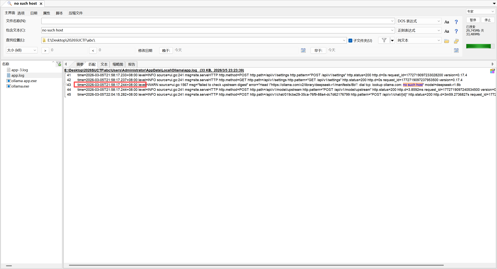

7.

7.为了让本地模型输出固定格式的密钥，嫌疑人最后在某一会话中得到了这个prompt，请提供得到这
个promot的messageid。

```
40854344-3f6e-4464-a07f-b39d42f5adc5
```

其实还是之前cherry里面的对话记录

七个答案拼起来

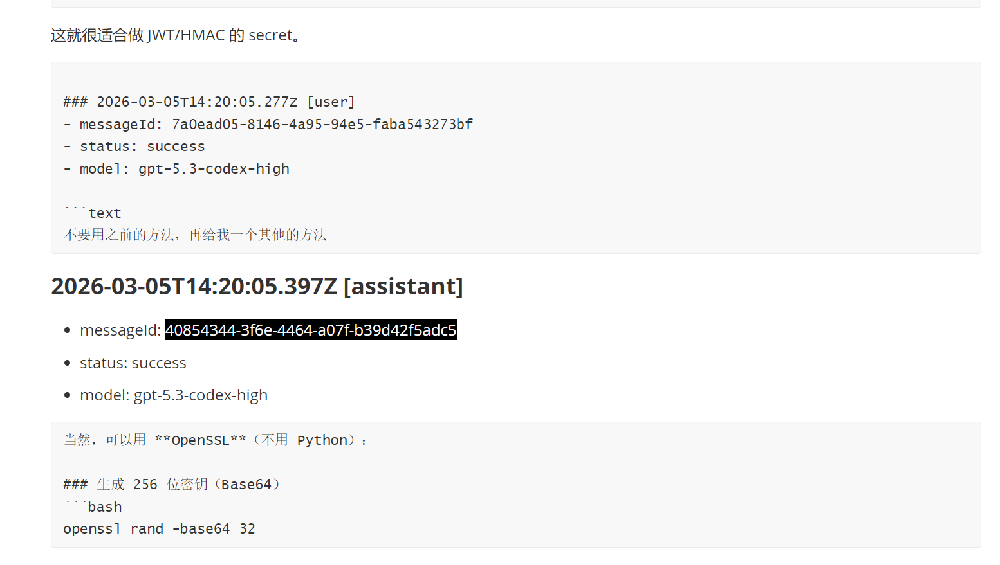

```
SUCTF{39e850db5d740c54df4281e39fb3866d}
```

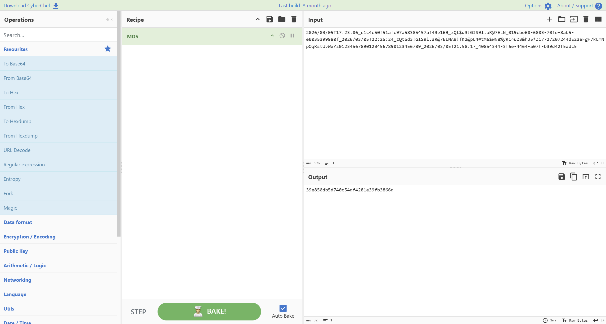

## 方法总结
- 核心技巧：Windows artifact 取证
- 识别信号：镜像中存在 Notepad TabState、事件日志、注册表、应用缓存等多源证据。
- 复用要点：先用 FTK/Imager 导出文件系统，再逐题定位 artifact；每个答案都要附路径、解析方式和校验输出。
