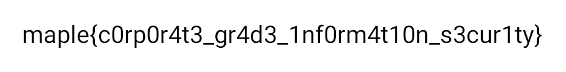

# Redacted

## 题目简述

这是一条三阶段文档取证链：PDF 中的链接被黑色矩形遮挡，链接指向一个带完整 .git 目录的 tar.gz，仓库最新提交又删除了 flag.png。恢复旧版本图片后，文字仍被像素化，需要重采样才能读出最终 flag。

## 解题过程

第一页 PDF 视觉上只有一封带黑色遮挡条的信。遮挡并不是把底层内容真正抹除，而是叠加在页面上的独立对象。用 LibreOffice Draw、PDF 对象编辑器选中并删除黑色矩形，就能看到下面的下载地址。归档仓库已同时保留该地址对应的 loblawatlaw.tar.gz，因此不依赖比赛期外链也能继续。

解压后不要只看当前工作树。Git 历史明确有两个提交：

~~~text
e4a156c Remove flag
b511d7e Compile diligent research on my part
~~~

查看文件状态可见 e4a156c 删除了 flag.png。直接从父提交导出：

~~~powershell
git log --all --name-status
git show b511d7e:flag.png > pixelated-flag.png
~~~

恢复图中的字符被放大成色块，直接逐字猜容易混淆 0/O、1/i：

按像素块尺寸缩小，再用平滑插值放大，或在图像工具中调整采样比例与抗锯齿，可得到更稳定的字符轮廓：

官方校验正则允许几组视觉等价字符；选择仓库测试用例中的规范写法：

~~~text
maple{c0rp0r4t3_gr4d3_1nf0rm4t10n_s3cur1ty}
~~~

## 方法总结

视觉“涂黑”不等于安全脱敏：覆盖对象、可复制文字、图层、批注和历史版本都可能保留原内容。拿到带 .git 的泄漏目录时，应检查全部提交、reflog、删除记录与对象。像素化也不是可靠销毁；若像素块仍与原字符结构对应，缩放和重采样常能恢复可读轮廓。
