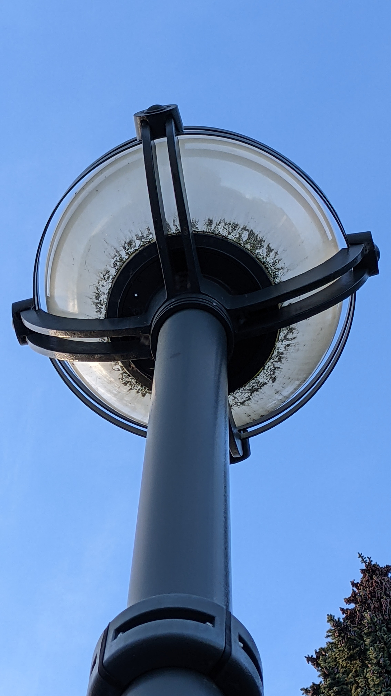

# around-and-about

## 题目简述

附件不是普通图片，而是一份 Android 文件系统镜像。目标是从手机数据中恢复朋友发送的照片，再利用照片的 EXIF 坐标定位现实中的路灯。题目最终要求到指定位置查看实体 flag，因此仓库只能完整记录定位链和平台给出的通配 flag 形式。

## 解题过程

先把镜像以只读方式挂载或用文件系统分析工具展开。QKSMS 短信应用的媒体目录中存在目标照片：

~~~text
/sdcard/QKSMS/Media/b3dvT1dPdXd1VVd1.jpg
~~~

同一 inode 还可从 /storage/emulated/0 与 /storage/self/primary 下访问。照片本身是一盏从下向上拍摄的圆形路灯：

读取原始文件的 EXIF，可得到：

~~~text
Date/Time Original: 2023:01:11 15:10:13-08:00
GPS Date/Time:      2023:01:11 23:09:56Z
Latitude:           49°15'40.90" N
Longitude:          123°14'49.59" W
Altitude:           96.3 m
Device:             Google Pixel 4a
~~~

十进制度坐标约为 49.26136, -123.24711，落在 UBC ICICS 大楼外。照片中的灯具外形用于在现场区分同一区域的路灯，实体 flag 被贴在对应灯柱底部。平台接受格式为：

~~~text
maple{ctf_in_r34l_l1f3_??_?}
~~~

问号代表现场版本中的字符，公开仓库没有给出可离线恢复的完整实体 flag。

## 方法总结

本题的决定性证据是“文件系统路径 → 原始照片 → EXIF 坐标 → 灯具外观”的连续链。提取时应保持镜像只读并保存原图元数据；截图或二次导出会丢失 EXIF。坐标负责缩小区域，照片中的灯具结构负责现场确认，两者缺一不可。
