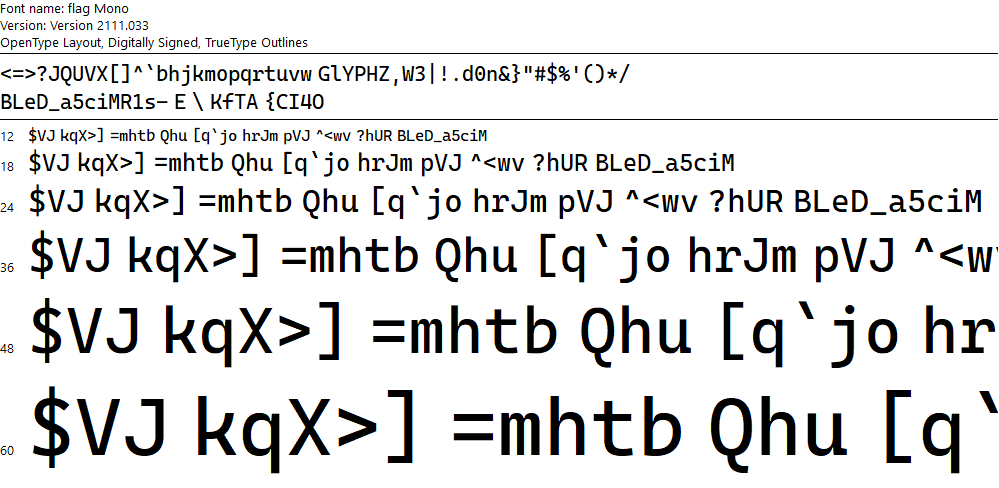
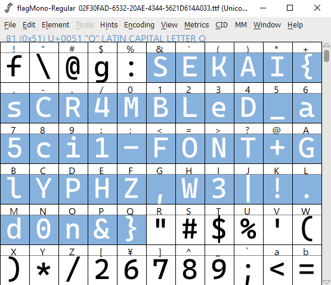

# Broken Converter

## 题目简述

附件 `Assignment-broken.xps` 看似是转换损坏的文档，实际关键内容位于 XPS 包内嵌的混淆字体。XPS 使用 ZIP/OPC 容器，字体资源以 `.odttf` 保存；按照 XPS 规范，用文件名中的 GUID 对前 32 字节异或即可还原 TrueType 字体。

文档显示异常并不是普通编码损坏，而是字体刻意打乱了字符与字形的对应关系。按 Unicode 编码顺序检查字体字形，即可读出 flag。

## 解题过程

XPS 文件本身是 ZIP 容器。直接用压缩软件打开或复制为 `.zip` 后，可以看到：

```text
[Content_Types].xml
FixedDocSeq.fdseq
Documents/1/Pages/1.fpage
Resources/02F30FAD-6532-20AE-4344-5621D614A033.odttf
```

`1.fpage` 中所有 `Glyphs` 元素都通过 `FontUri` 引用该字体：

```xml
<Glyphs
  FontUri="/Resources/02F30FAD-6532-20AE-4344-5621D614A033.odttf"
  UnicodeString="..."
/>
```

ODTTF 不是加密字体。规范要求将文件名 GUID 的 16 字节按规定逆序，重复一次形成 32 字节掩码，只异或字体开头 32 字节。可以直接从 XPS 解包并还原：

```python
from io import BytesIO
from pathlib import Path
from uuid import UUID
from zipfile import ZipFile

xps = Path("Assignment-broken.xps")
entry = (
    "Resources/"
    "02F30FAD-6532-20AE-4344-5621D614A033.odttf"
)

with ZipFile(xps) as archive:
    font = bytearray(archive.read(entry))

guid = UUID(Path(entry).stem)
key = guid.bytes[::-1]

for index in range(32):
    font[index] ^= key[index % 16]

Path("flag-mono.ttf").write_bytes(font)
```

处理前文件头是：

```text
33 a1 14 d6 ...
```

处理后变为 TrueType 标准标识：

```text
00 01 00 00
```

在普通字体预览器中，字符映射仍然是乱序的：



用 FontForge 打开字体并按 Unicode 编码位置查看字形网格，可以把连续编码位上的字形依次读出：



其中有效内容为：

```text
SEKAI{sCR4MBLeD_a5ci1-FONT+GlYPHZ,W3|!.d0n&}
```

## 方法总结

复杂文档格式通常是容器，不应只依赖默认阅读器观察渲染结果。先识别 XPS 的 ZIP/OPC 结构，再追踪页面对资源的引用，就能定位异常字体。ODTTF 的异或仅用于字体嵌入混淆，不提供安全性；还原后还需区分“字符编码”和“字形外观”，按编码顺序检查字体才能绕过刻意打乱的映射。
