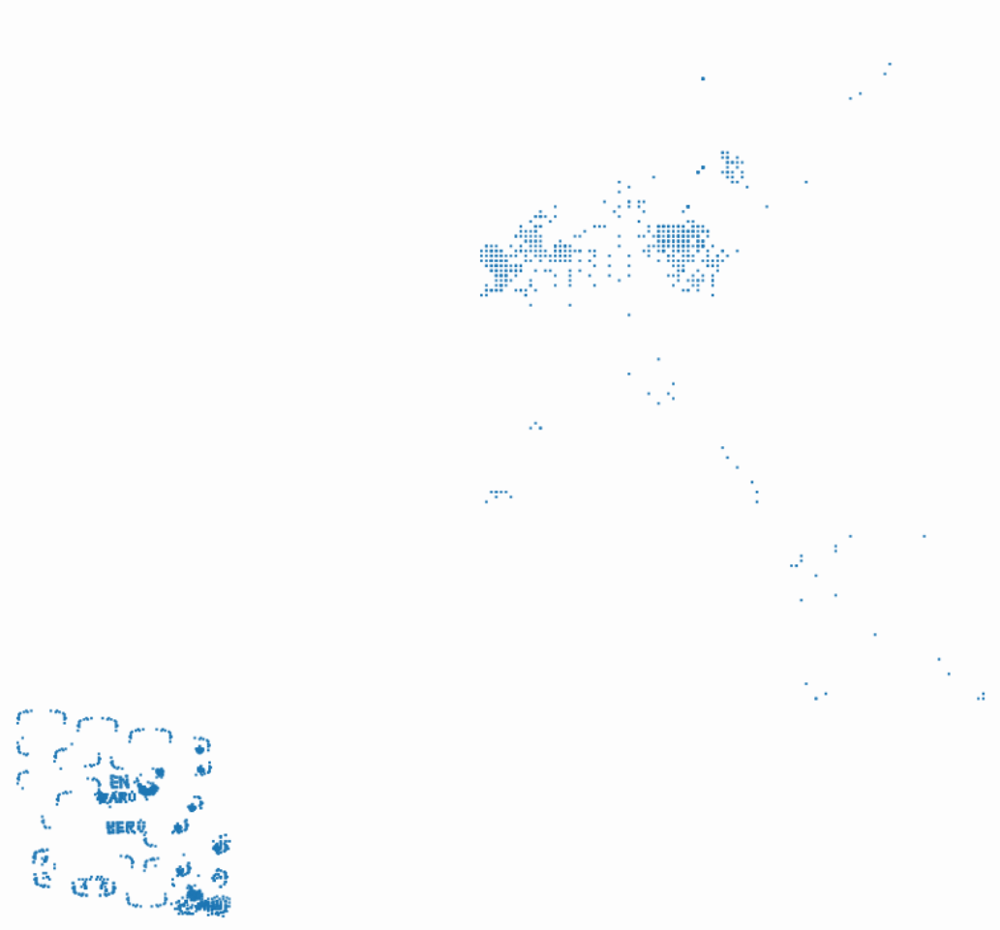

# DeadGame2

## 题目简述

附件是 StarCraft II 的 `.SC2Replay`。回放本质上是带版本化二进制事件流的 MPQ 容器；flag 的明文片段藏在聊天事件中，中段则由地图上的单位坐标排成字。官方 solution 目录给出了协议解析后的 16 条消息 JSON 和一张坐标重建图，但没有自动提取脚本。

## 解题过程

### 解析版本化事件流

可用 Blizzard `s2protocol` 一类工具先读 replay header，再选择相容的 protocol 模块，分别解码 `replay.message.events`、`replay.game.events` 和 tracker events。官方 JSON 采用 `protocol_build: 24944`；其附带统计显示低于 24944 的解码器读不到消息，而 24944 及多个后续兼容版本都能得到 16 条，因此 24944 应理解为该提取结果采用的相容版本，不应仅凭消息数量断言它就是唯一可能版本。

聊天事件按 `gameloop` 排序后，关键内容为：

```text
4662:  SeKaiCTF{lol
7428:  ... everyone's "position" is crucial!
11897: _fl2g_
73100: _
73312: _
73588: _
73864: GG
73931: }
```

其中 “position” 明确提示查看单位坐标，而不是继续在聊天文本中找完整 flag。

### 将单位坐标还原为图像

从 tracker 的单位位置事件中提取地图坐标，把每个位置样本作为散点绘制。StarCraft II 的地图坐标与普通图像纵轴方向相反，显示时需要翻转 $y$ 轴或设置等效坐标方向，并保持横纵比例一致。全图会包含普通建筑、移动路径和零散噪点，但左下角的密集阵列能读出三行大写文字：



```text
EN_TARO_HERO
```

`EN TARO` 是星际系列的典型短语，也与图中字形吻合，不能只凭语境猜出后直接跳过坐标证据。

### 拼接并用哈希消歧

前两段给出 `SeKaiCTF{lol` 与 `_fl2g_`，位置图给出 `EN_TARO_HERO`，末尾给出分隔符、`GG` 和 `}`。聊天末尾连续出现三条 `_`，但题面同时给出最终字符串 MD5；分别测试把它们当成噪声/分隔提示或全部按字面拼入，只有单个分隔下划线的候选命中：

```text
MD5("SeKaiCTF{lol_fl2g_EN_TARO_HERO_GG}")
= 0b95495176f49f2dab8a2d9c26a41ecc
```

得到：

```text
SeKaiCTF{lol_fl2g_EN_TARO_HERO_GG}
```

## 方法总结

回放取证要先保证协议版本相容，再分别处理离散聊天事件和单位坐标证据。只读聊天会缺少中段；只看散点图又不知道 flag 的前后缀与拼接顺序。这里 MD5 不是替代分析的答案 oracle，而是用来裁决末尾重复分隔符的歧义；最终字符串必须同时满足事件时间线、可视化字形、特殊 flag 大小写和给定哈希。
