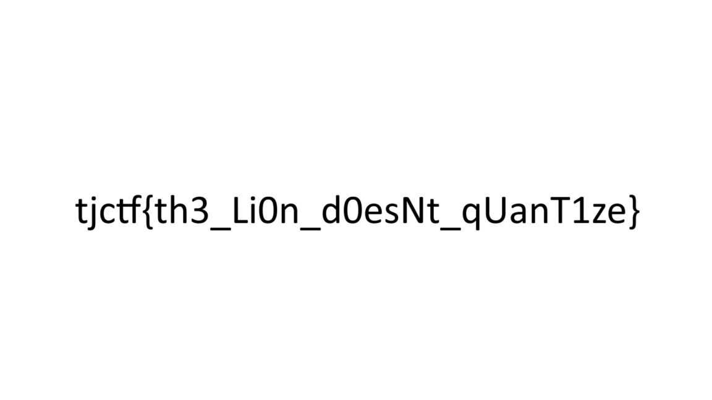

# quant

## 题目简述

附件是结构仍完整但显示为均匀灰色的 JPEG。文件包含两个 `FF DB`（Define Quantization Table）段：亮度表的 64 个量化值被全部清零，色度表也几乎全为零。JPEG 解码时频域系数乘以零量化值后全部消失，所以像素只能回到接近中灰的直流结果。修复任意合理、非零的标准量化表即可重新显现原图。

## 解题过程

十六进制检查可见第一个 DQT 从偏移 20 的 `FF DB 00 43 00` 开始，量化值位于 25–88；第二个 DQT 从偏移 89 开始，量化值位于 94–157。段长 `0x43` 表示一个 8 位、64 项的量化表。


下面使用常见 JPEG 标准亮度表和色度表覆盖两个损坏的 DQT。题目保留了压缩系数，所以量化值不必与原始编码参数完全相同，只要合法且尺度合理就能恢复可读内容。

```python
LUMA = [
    16, 11, 10, 16, 24, 40, 51, 61,
    12, 12, 14, 19, 26, 58, 60, 55,
    14, 13, 16, 24, 40, 57, 69, 56,
    14, 17, 22, 29, 51, 87, 80, 62,
    18, 22, 37, 56, 68, 109, 103, 77,
    24, 35, 55, 64, 81, 104, 113, 92,
    49, 64, 78, 87, 103, 121, 120, 101,
    72, 92, 95, 98, 112, 100, 103, 99,
]
CHROMA = [
    17, 18, 24, 47, 99, 99, 99, 99,
    18, 21, 26, 66, 99, 99, 99, 99,
    24, 26, 56, 99, 99, 99, 99, 99,
    47, 66, 99, 99, 99, 99, 99, 99,
    99, 99, 99, 99, 99, 99, 99, 99,
    99, 99, 99, 99, 99, 99, 99, 99,
    99, 99, 99, 99, 99, 99, 99, 99,
    99, 99, 99, 99, 99, 99, 99, 99,
]

with open("lost.jpg", "rb") as f:
    data = bytearray(f.read())

tables = [LUMA, CHROMA]
position = 0
for replacement in tables:
    marker = data.find(b"\xff\xdb", position)
    if marker < 0:
        raise RuntimeError("DQT marker missing")
    segment_length = int.from_bytes(data[marker + 2:marker + 4], "big")
    table_info = data[marker + 4]
    if segment_length != 67 or table_info >> 4 != 0:
        raise RuntimeError("unexpected DQT layout")
    data[marker + 5:marker + 69] = bytes(replacement)
    position = marker + 2 + segment_length

with open("recovered.jpg", "wb") as f:
    f.write(data)
```



图中文字为：

```text
tjctf{th3_Li0n_d0esNt_qUanT1ze}
```

## 方法总结

- 核心技巧：定位并修复 JPEG DQT 段，使仍然存在的 DCT 系数重新参与解码。
- 识别信号：文件魔数和 Huffman/扫描段正常，但图像全灰；DQT 的 64 项出现非法零值。
- 复用要点：先修复元数据而不要重编码损坏文件；修改后应保留原始熵编码数据，并用十六进制差分确认只动了目标 DQT 区域。
