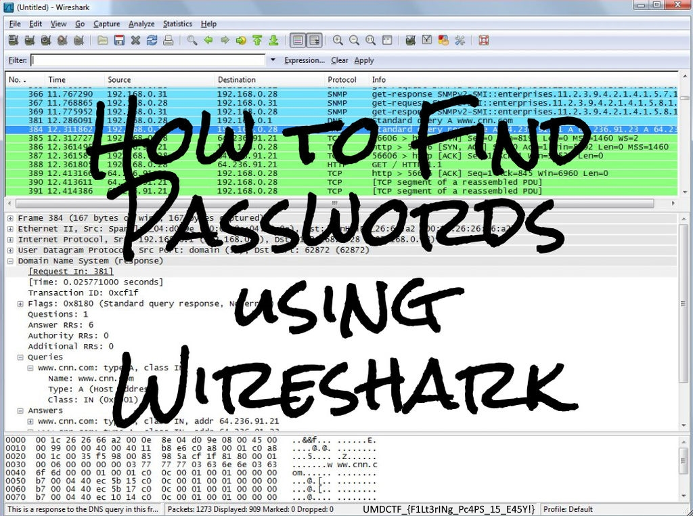

# UMDCTF 2018 - Packet Rapture

## 题目简述

附件是三卷 7-Zip 压缩包，解压后得到约 262 MB 的 `rapture.pcap`。题目称管理员把未完成挑战放在公开 Web 服务器上，需要从大量网络流量中找到下载的附件。

## 解题过程

合并分卷并解压后，PCAP 的 SHA-256 为：

```text
8b76725b0a81bb69e15571565cf8bdb53150b4acefd4b7969b5c68e0339e0671
```

抓包共有 160835 个数据包。按协议和端点统计 HTTP 请求，`104.255.102.102:8000` 是明显异常的服务。对应帧 `108694` 和 `108916` 请求了：

```http
GET /fl4g.zip HTTP/1.1
```

在 Wireshark 中使用 `tcp.stream == 2393`，或直接导出 HTTP 对象，即可恢复 `fl4g.zip`。压缩包内是一张 Wireshark 截图，真正的 flag 位于窗口底部状态栏：



精确读取结果为：

```text
UMDCTF_{F1Lt3rINg_Pc4PS_15_E4SY!}
```

注意该题使用下划线连接 `UMDCTF` 和左花括号，而不是常见的连字符。按此原样计算 SHA-256，才与 `README.md` 的摘要一致。

## 方法总结

大型 PCAP 应先做协议、端点、端口和对象名统计，再深入单个 TCP 流。恢复文件后还要查看完整图像边缘和状态栏；只关注截图主体会错过 flag，而且不能擅自把异常的赛事格式“纠正”为常见写法。
