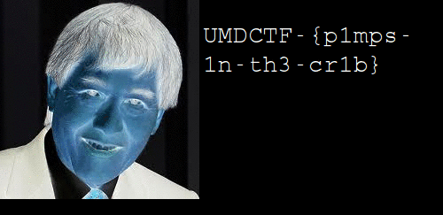

# UMDCTF 2018 - Snoop

## 题目简述

附件包括自定义 FPFF 文件 `snoop.fpff` 和 7 页格式规范 PDF。需要依据规范恢复其中存储的 GIF，并逐帧寻找 flag。

## 解题过程

已逐页视觉核对规范。文件头采用小端序：

```text
uint32 magic      = 0xBEFEDADE
uint32 version    = 1
uint32 timestamp
char   author[8]
uint32 section_count
```

每个 section 依次保存 `uint32 type`、`uint32 length` 和 `length` 字节数据。解析附件得到：

```text
timestamp = 1521996821
author    = outis
sections  = 2
```

第一段是文本 `drop it like it's hot.`；第二段类型为 `10`、长度为 `559635`。规范说明该类型保存去掉 6 字节签名的 GIF，所以应补回 `GIF89a`：

```python
if section_type == 10:
    gif = b"GIF89a" + value
    open("recovered.gif", "wb").write(gif)
```

恢复文件的 SHA-256 与仓库 `dev/snoop.gif` 一致。GIF 一共有 19 帧，第 10 帧（索引 9）包含隐藏文本：



```text
UMDCTF-{p1mps-1n-th3-cr1b}
```

该字符串的 SHA-256 与 `README.md` 中保存的摘要一致。

## 方法总结

自定义文件格式题应严格遵循规范的字节序、固定字段长度和 section 边界，并在解析结束时确认偏移恰好等于文件长度。恢复动画后还必须逐帧检查；只查看默认首帧会遗漏本题 flag。
