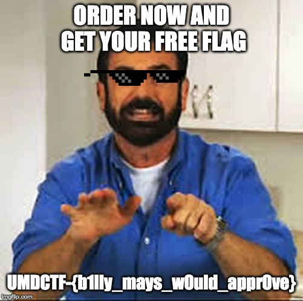

# UMDCTF 2019 - Closed Door Presentation

## 题目简述

附件看起来是一份损坏的 PowerPoint 演示文稿。文件开头不是 Office Open XML 应有的 ZIP 签名 `PK`，因此常规办公软件无法直接打开。

## 解题过程

先检查文件头。附件前两个字节被改成了 `QL`，而 `.pptx` 本质上是 ZIP 容器，正常签名应为 `50 4b 03 04`。把 `QL` 恢复为 `PK` 后即可解压：

```python
from pathlib import Path

path = Path("presentation.pptx")
data = bytearray(path.read_bytes())
data[:2] = b"PK"
Path("repaired.pptx").write_bytes(data)
```

解包后重点检查 `ppt/slides/`、`ppt/slides/_rels/` 与 `ppt/media/`。第 7 张幻灯片通过关系文件引用了一张广告图片，图片中直接写出了 flag：



```text
UMDCTF-{b1lly_mays_w0uld_appr0ve}
```

该结果的 SHA-256 与官方摘要一致。

## 方法总结

现代 Office 文件通常是 ZIP 容器。遇到无法打开的 `.pptx`，应先核对文件头，再解包检查幻灯片关系和媒体资源，而不应只依赖 PowerPoint 的可见页面。关系文件能够把具体幻灯片与媒体对象准确对应起来，也能避免在大量资源中盲目翻找。
