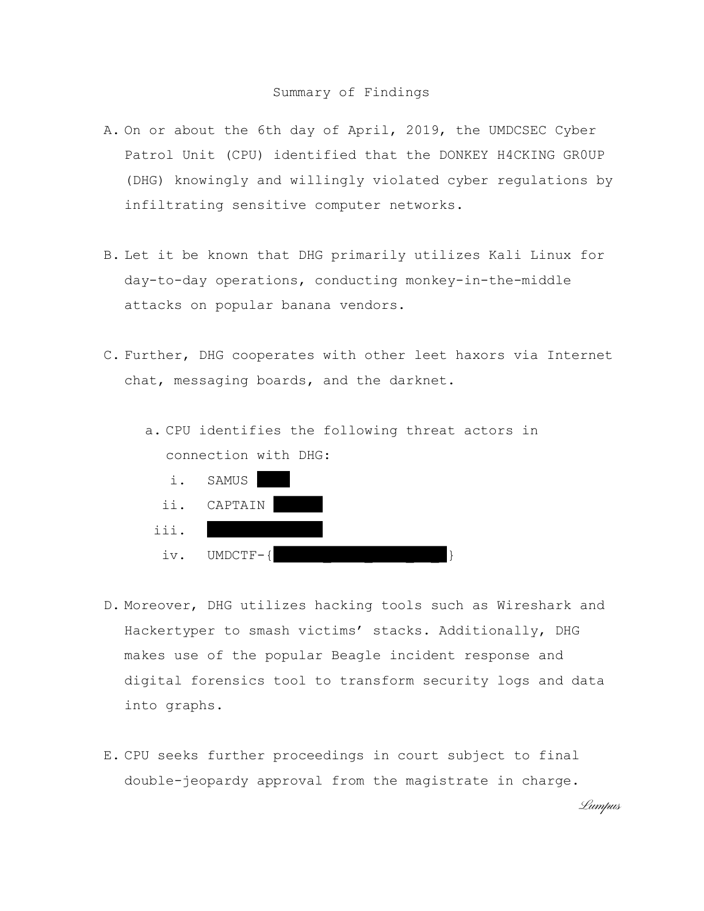

# UMDCTF 2019 - CPU Investigation

## 题目简述

题目提供一份两页的调查报告 PDF。文件存在交叉引用损坏，第二页还有大块黑色“涂黑”区域；目标是恢复被遮挡的原始内容。

## 解题过程

先让 PDF 工具重建对象索引，而不是直接修改正文：

```bash
qpdf investigation.pdf repaired.pdf
pdftotext -layout repaired.pdf report.txt
```

`qpdf` 在重写输出文件时会自动重建可恢复的交叉引用结构。

逐页渲染并与提取文本对照后可以确认：第二页的黑块只是覆盖在文字上方的绘图对象，底层文本并未删除。视觉上看到的是完整的涂黑报告：



文本层仍保存着被遮挡的 flag：

```text
UMDCTF-{d0nkey_k0ng_b3st_up_B}
```

计算 SHA-256 后与仓库中给出的摘要一致。

## 方法总结

PDF 的视觉遮挡不等于数据删除。处理“涂黑”文档时，应同时检查内容流、文本层和页面渲染结果；若文件结构损坏，可先用 `qpdf` 重建交叉引用，再用 `pdftotext` 或同类工具读取底层文本。真正安全的脱敏必须移除原始文本对象，而不是在其上覆盖黑色矩形。
