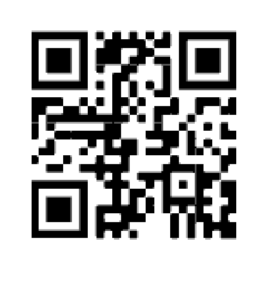

# Sensitive

## 题目简述

附件看似是损坏的 PDF。生成脚本在原文件的每个字节之后插入一个 `0x20`，使文件头、对象和交叉引用表全部错位。恢复原始字节后，页面上还有一枚对比度很低的二维码。



## 解题过程

因为插入规则是“每个原字节后追加一个空格字节”，正确逆变换是保留偶数下标字节，而不是删除所有值为 `0x20` 的字节；原 PDF 本身也可能包含合法空格。

```python
from pathlib import Path

corrupted = Path("sensitive.pdf").read_bytes()
recovered = corrupted[::2]
Path("recovered.pdf").write_bytes(recovered)
```

恢复出的单页 PDF 标题为 UMDCTF 2020，并写有 “This document is highly sensitive.”。提高页面中浅色图案的对比度后扫描二维码，得到：

```text
UMDCTF-{l0v3-me_s0me_h3x}
```

## 方法总结

已知破坏规则时应严格按位置逆转，而不要做按值过滤。PDF 修复完成后仍需进行视觉检查，因为可解析的文档不代表信息已全部提取；本题的最终答案位于低对比度二维码中。
