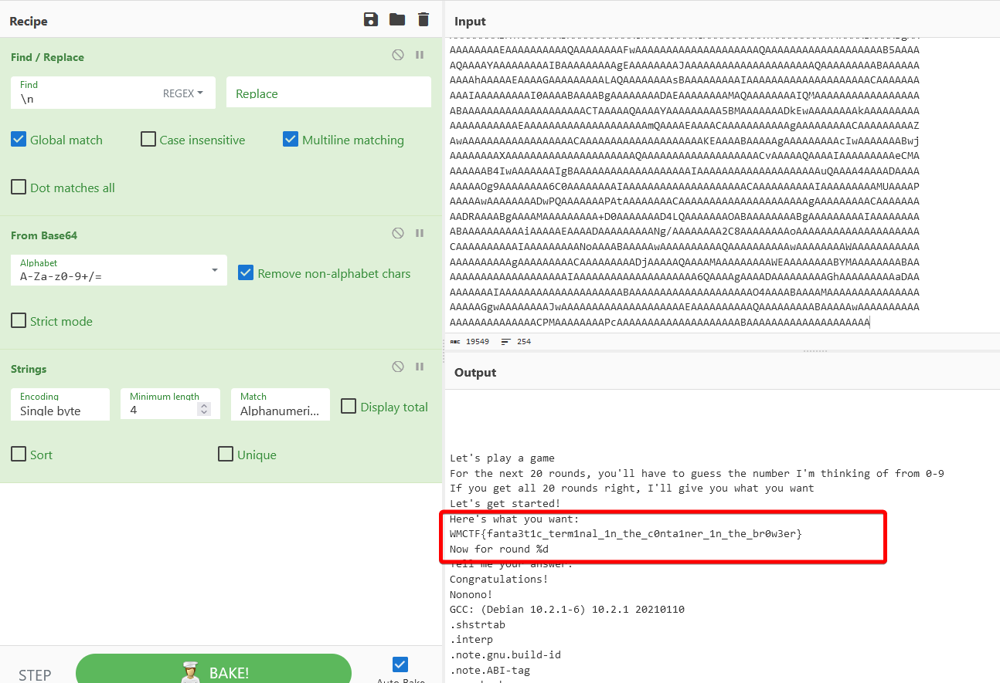
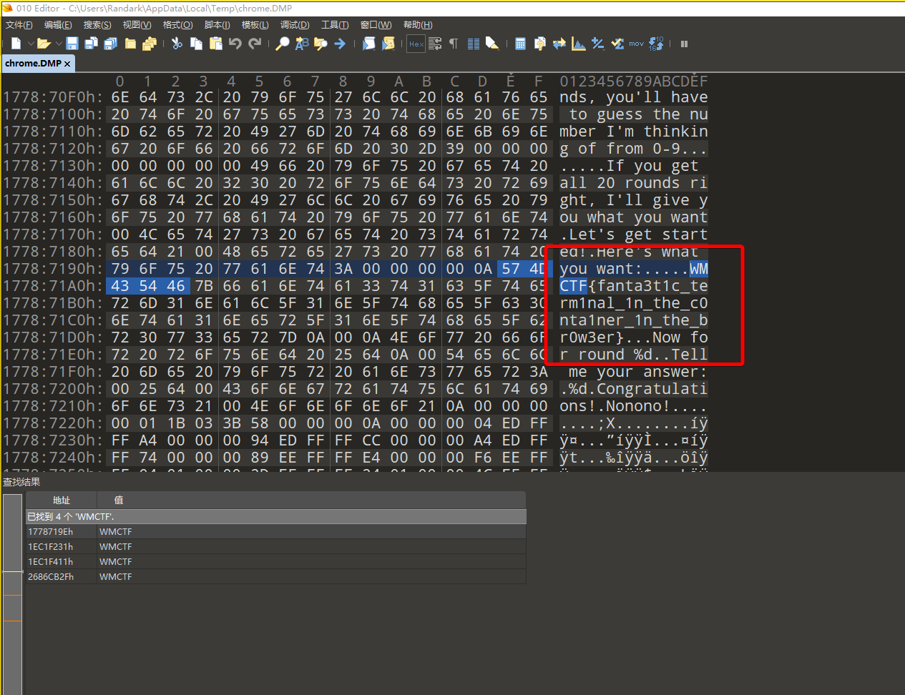

# Fantastic terminal

## 题目简述

题目表面是浏览器中的“终端”交互环境，实际运行形态和 WebAssembly/WASI、Docker、Bochs 相关。解法有两条：一是从终端程序传输的数据中恢复源码或输出，二是从浏览器进程内存中直接寻找运行时留下的 flag。

## 解题过程

### 获取程序源代码并进行分析

终端输出中可以看到连续的大段 base64 字符串，说明程序把源码或结果通过 base64 文本传出。将生成的 base64 编码数据复制出来并解码：

即可获取 flag

### 捕获内存数据进行分析

本题本质上基于 WASI + Docker + Bochs 实现该效果，因此理论上容器的所有数据都会存在于内存中

启动浏览器的任务管理器，定位到该标签页进程的 pid，对该进程进行 dump 后，进入任务管理器进行分析

即可直接获取 flag

## 方法总结

- 核心技巧：对浏览器终端题同时检查通信编码和浏览器进程内存残留。
- 识别信号：终端输入输出中出现大段 base64，或题目把完整运行环境搬到浏览器内时，应考虑解码传输数据和 dump 对应标签页进程。
- 复用要点：如果题目使用 WASI/虚拟机/容器模拟环境，flag 或中间文件可能同时存在于程序输出、传输层和宿主浏览器进程内存中。
