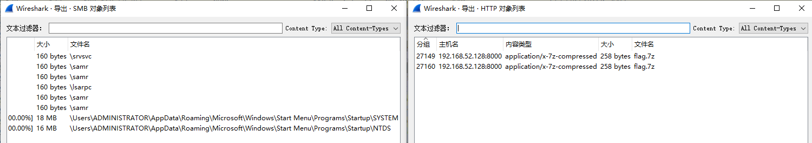
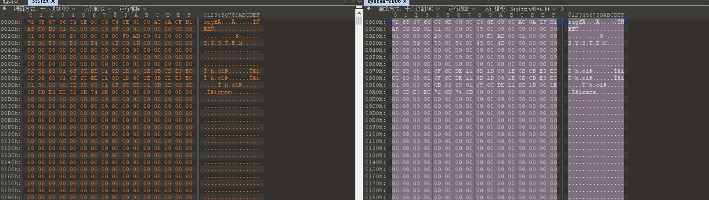
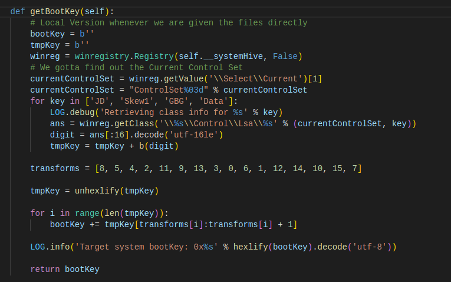
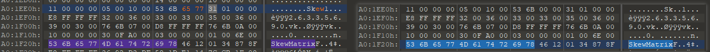
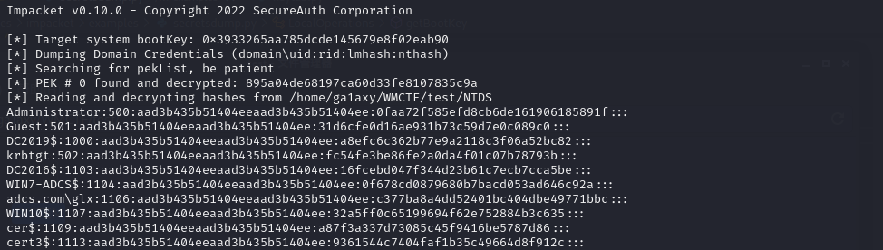
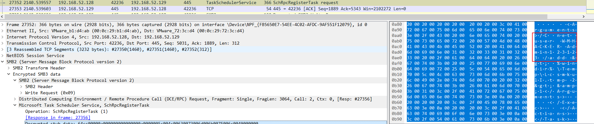
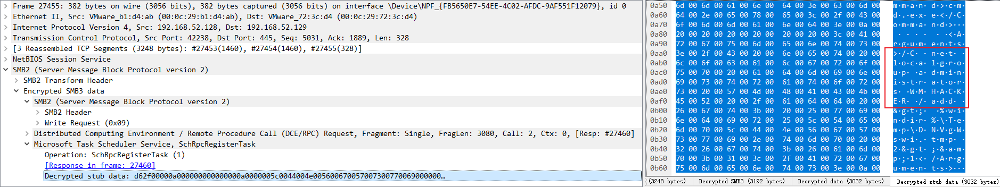
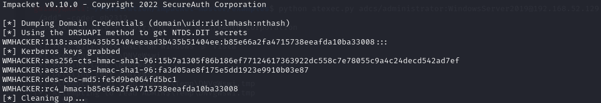
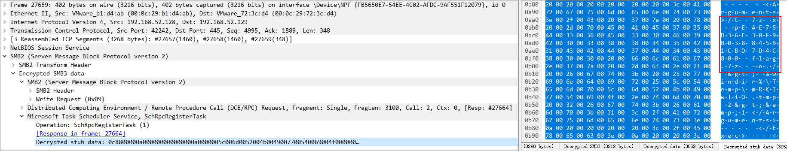

# Ghost

## 题目简述

题目是 Windows 域流量取证。PCAP 中可导出加密的 `flag.7z`、`SYSTEM` 和 `NTDS`；需要修复损坏的 SYSTEM 注册表文件，从中恢复 bootKey，再配合 NTDS 提取域用户哈希并生成 keytab 解密 SMB/Kerberos 流量。后续通过 atexec 计划任务痕迹找到新建用户和压缩包密码，最终解开 flag。

## 解题过程

从流量包中导出 HTTP 对象，你可以得到加密的 flag.7z，导出 SMB 对象，你可以得到 SYSTEM 和 NTDS。



利用 SYSTEM 和 NTDS，你可以创建一个 keytab，[参考文章](https://medium.com/tenable-techblog/decrypt-encrypted-stub-data-in-wireshark-deb132c076e7)

这篇文章的关键点是：Wireshark 可以使用 Kerberos keytab 解密被 Kerberos 保护的 SMB/RPC 流量；只要能从域凭据材料中恢复用户/机器账号的密钥并导入 keytab，就能把原本加密的 stub data 还原成可读的计划任务、命令和文件操作内容。

你无法直接使用导出的这两个文件获取用户哈希，因为 SYSTEM 文件已损坏，SYSTEM 原本是一个导出的注册表文件，而注册表文件具有固定的结构，[参考文章](https://blog.csdn.net/zacklin/article/details/7682582)

注册表结构参考的关键点是：SYSTEM hive 文件开头应有 `regf` 签名的基本块，后面才是若干 hive bin。当前文件缺少第一个基本块，导致工具无法按正常注册表 hive 解析；补入同版本导出的 SYSTEM 基本块后，后续数据才能被解析到。

对比结构可以发现，SYSTEM 文件缺少以 `regf` 签名的基本块（第一个块）。自行导出 SYSTEM 文件并进行对比，可以看到第一个块的大小相同，且其内容不影响脚本对其的解析，因此我们可以自行导出主机的 SYSTEM 注册表，并将其内容添加到第一个块中。



虽然补充后的 SYSTEM 文件可以被解析，但仍然无法获取用户哈希，这表明文件仍然损坏。这涉及到从注册表获取用户哈希的原理，在此部分 impacket 和 mimikatz 的 lsadump 模块原理大致相同，都需要从 SYSTEM 中提取 bootKey，[参考文章](https://www.chuanpuyun.com/article/5597.html)

bootKey 参考的关键点是：Windows 会把启动密钥拆散存放在 `JD`、`Skew1`、`GBG`、`Data` 四个 LSA 子键中，工具解析时依赖这些键名和 class 字段位置。如果相关键名在损坏文件里被改坏，`secretsdump`/`lsadump` 就无法还原 bootKey，自然也无法解 NTDS 中的哈希。

要获取 bootKey，你需要解析位于

 `HKEY_LOCAL_MACHINE\SYSTEM\CurrentControlSet\Control\Lsa\` 注册表路径中的四个键。



打开注册表找到对应目录，可以看到这四个键对应四个名称

```
JD -> Lookup
Skew1 -> SkewMatrix
GBG -> GrafBlumGroup
Data -> Pattern
```
使用十六进制编辑器在 SYSTEM 文件中搜索这四个名称，即可找到这四个键的位置。查看 impacket 源代码（上方），可以看到脚本需要通过这四个键的字符来定位键的位置，因此将 `Sk..1` 修改为 `Skew1` 即可正常解析（需要修改两处）。



修改后，你可以使用 secretsdump 获取所有用户的哈希值。



利用该哈希值可以制作 keytab 文件来解密流量，解密后可以看到原始文件中部分加密的 SMB 流量内容，直接翻阅流量即可发现一些明显的 TaskSchedulerService 流量，结合 tmp 文件的名称，如果熟悉内网，很容易就能判断出使用了 atexec。如果熟悉内网，你可以轻易看出正在使用 atexec。atexec 利用创建计划任务来实现远程命令执行，在流量中可以看到 atexec 生成计划任务所使用的 xml 文件的明文。

在第 27352 条流量条目中，我们可以找到创建新用户 WMHACKER 且密码为 Admin123123 的命令。



后续（27455）还将该用户添加到了本地 administrators 组



然而，最初通过 SYSTEM 和 NTDS 获取的用户哈希并不包含该用户，这意味着生成的 keytab 无法解密该用户交互的流量，且后续流量包中存在大量加密的 SMB 流量，因此想到将该用户的哈希添加到 keytab 中，你需要自行搭建域环境，添加该用户，然后导出用户哈希



使用新的 keytab 解密流量后，也能发现一些 atexec 利用的痕迹，在 27659 中可以看到解压命令，其中包含了 zip 密码



或者直接复制该命令进行解压

```
7z x -pEAE75D36E30F9B038845B1CBD7D4C800 flag.7z -o./
```

## 方法总结

- 核心技巧：修复损坏 SYSTEM hive，提取 bootKey 和 NTDS 哈希，生成 keytab 解密 SMB/Kerberos 流量。
- 识别信号：PCAP 同时包含 `SYSTEM`、`NTDS`、加密 SMB 流量和压缩包时，应考虑域凭据恢复与流量解密，而不是只做文件 carving。
- 复用要点：SYSTEM hive 的 `regf` 头、LSA 四键和 keytab 解密流程都要写入 WP；否则后续只看链接很难复现。
