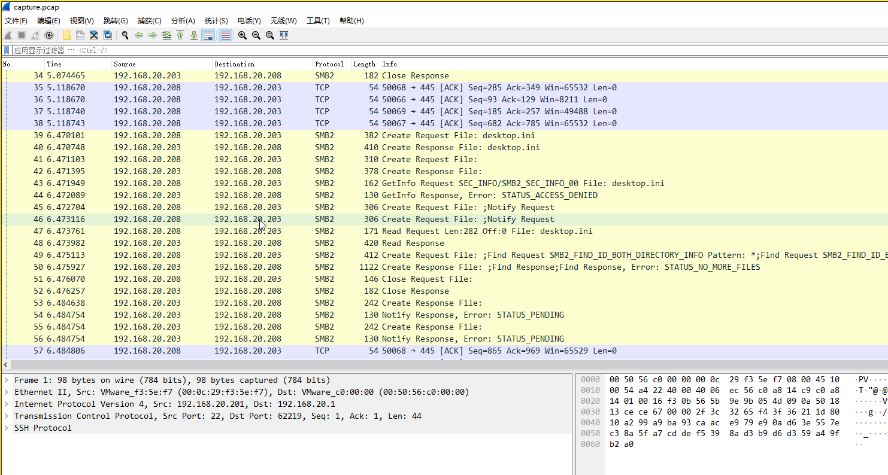
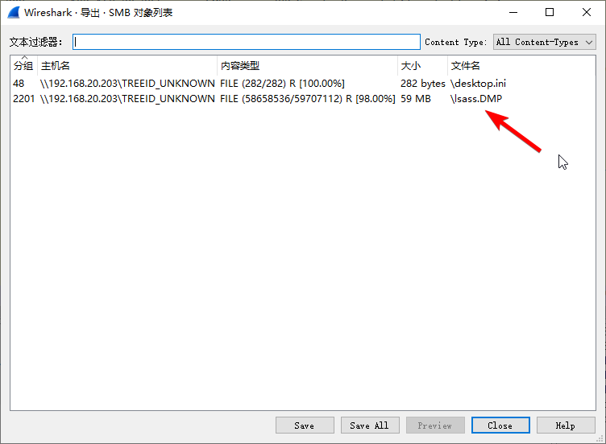
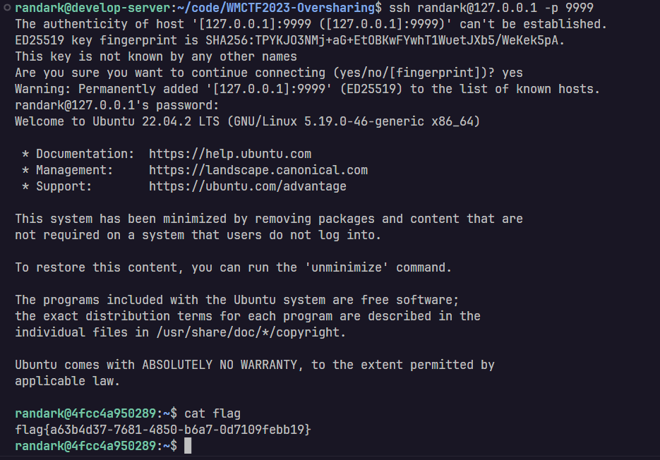

# Oversharing

## 题目简述

题目是 SMB/Windows 凭据取证。PCAP 中包含大量 SMB 流量，可以导出 `lsass.DMP`，再用 `pypykatz` 解析 Credential Manager 中的明文或十六进制密码。得到 SSH 凭据后登录目标主机即可取得 flag。

## 解题过程

检查 pcap 流量包发现存在大量 SMB 流量



因此直接对 SMB 流量进行了分析




发现存在 lsass 服务的内存转储文件，并使用 pypykatz 进行了分析

```shell
pypykatz lsa minidump lsass.DMP
```
可以看到以下敏感信息：

```plaintext
== CREDMAN [4f9b8]==
	luid 326072
	username randark
	domain ssh@192.168.20.202:22/randark
	password 1a05cf83-e450-4fbf-a2a8-b9fd2bd37d4e
	password (hex)310061003000350063006600380033002d0065003400350030002d0034006600620066002d0061003200610038002d00620039006600640032006200640033003700640034006500
```
因此，获取到了一个看起来可疑的 ssh 凭据，并且该凭据的密码已被解码：

```python
import re
a="310061003000350063006600380033002d0065003400350030002d0034006600620066002d0061003200610038002d00620039006600640032006200640033003700640034006500"
a=re.findall(r'.{2}', a)
data=[]
for i in range(0,len(a),2):
    data.append(a[i])
result = ''.join([chr(int(i, 16)) for i in data])
print(result)
# 1a05cf83-e450-4fbf-a2a8-b9fd2bd37d4e
```
只需复制该字符串，猜测它是目标机器的登录密码，然后尝试登录即可。



这样你就拿到了 flag。

## 方法总结

- 核心技巧：从 SMB 流量中导出 LSASS minidump，并用 `pypykatz lsa minidump` 提取凭据。
- 识别信号：PCAP 中出现大量 SMB 文件传输、可导出 `.DMP` 或 `lsass` 相关对象时，应优先尝试 Windows 凭据解析。
- 复用要点：Credential Manager 的 `password (hex)` 常是 UTF-16LE 风格的十六进制内容，解码时注意每两个字节中取有效字符。
