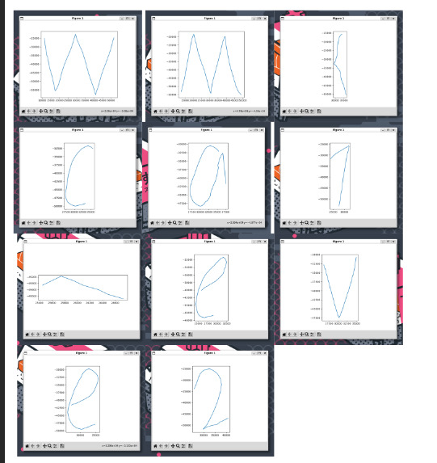
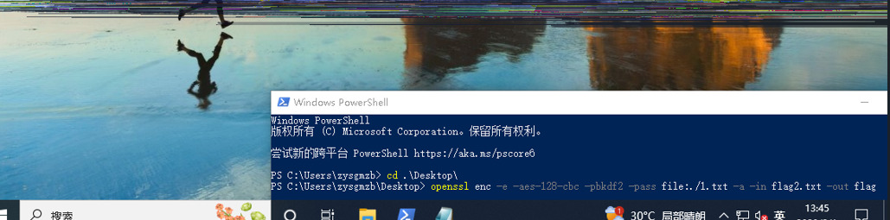

# Truncate

## 题目简述

题目是 Linux 内存取证与截断 PNG 恢复。内存镜像中可以通过 Volatility 查看 shell 历史和恢复文件系统；桌面文件包含鼠标事件数据、base64 PNG 和加密文件。第一段 flag 来自 event2 鼠标轨迹，第二段来自 Acropalypse 类 PNG 截断恢复后得到的 AES 口令。

## 解题过程

发现这是一个 linux 内存镜像，此处使用 volatility2，先进行 profile 操作。

参考 https://heisenberk.github.io/Profile-Memory-Dump/

如果找不到 systemmap，请前往 https://debian.sipwise.com/debian-security/pool/main/l/linux/上面下载对应版本的.

Volatility2 分析 Linux 内存时必须使用与目标内核匹配的 profile。参考文章的关键步骤是：拿到目标内核版本对应的 `System.map` 和调试信息，生成包含内核符号和结构体偏移的 profile；如果本机没有对应 `System.map`，可从发行版安全更新仓库下载相同版本的内核包材料。

profile 完成后，我们就可以开始取证了。

首先，让我们查看命令行日志

```
python2 vol.py -f ../mem --profile=Linuxdebian11-5_10_0-21x64 linux_bash
```

你可以发现整体行为是打开 remmina 并创建一个新的配置文件，然后读取 event2 的数据，接着将图片的 base64 数据存储到 b.txt 中。

因此你可以先恢复文件系统，这样就可以直接查看文件了。

```
python2 vol.py -f ../mem --profile=Linuxdebian11-5_10_0-21x64 linux_recover_filesystem -D ./filesystem
```
恢复后，你可以发现你想查看的文件位于 root 用户的桌面上。

首先查看 a.txt，因为它存储在 event2 数据中，理解原理后直接写脚本就能把鼠标轨迹画出来！

大概每次读取 24 字节，前 16 字节是时间，接着 2 字节是 type，再 2 字节是 code，后面是 value。

这里我们需要注意大小端。

```
import struct
import matplotlib.pyplot as plt
f=open('a.txt').readlines()
ff = ''
for i in f:
    ff += i.replace(' ','')[7:]
ff = bytes.fromhex(ff)

key_x = []
key_y = []

while 1:
    if len(ff) < 24:
        break
    data = ff[:24]
    ff = ff[24:]
    type = int.from_bytes(data[16:18], byteorder='big')
    code = int.from_bytes(data[18:20], byteorder='big')
    value = int.from_bytes(data[20:22], byteorder='big')
    if(type == 1):
        minlen = min(len(key_x), len(key_y))
        key_x = key_x[:minlen]
        key_y = key_y[:minlen]
        fig, ax = plt.subplots()
        ax.plot(key_x, key_y)
        ax.set_aspect('equal')
        plt.show()
        key_x = []
        key_y = []
    elif(type == 3 and code == 0 ):
        key_x.append(value)
    elif(type == 3 and code == 1 ):
        key_y.append(value * -1)
```
运行脚本以获取鼠标轨迹，每两个字符之间会有一条无关紧要的轨迹（可能画得有点潦草）



由此我们得到 flag1

```
flag1: WM{ca7_eve2_
```
接着你可以查看该图片，对 base64 解密后，会发现两个结束块。看到这种结构很容易联想到，这里正是之前被利用的漏洞的截图修复方案 --> https://www.da.vidbuchanan.co.uk/blog/exploiting-acropalypse.html

Acropalypse 文章的关键点是：某些截图/裁剪工具保存 PNG 时没有完全截断旧文件，导致新 PNG 的 `IEND` 后仍残留旧图像的压缩 IDAT 数据。只要知道原始宽高和像素格式，就可以把尾部残留数据接回 zlib 流，重建缺失的像素区域。本题因此需要从 remmina 配置中找出原始 RDP 分辨率。

但要完成修复，你仍然需要原始图像的分辨率。这次需要查看新的 remmina 配置文件，位置在 /root/.local/share/remmina

打开配置文件可以发现，rdp 设置中的屏幕分辨率为 1152x864

因此使用该分辨率来还原 flag.png。由于此处的截图为 32-bit depth，我们需要对原作者提供的脚本部分进行修改，完整脚本如下：

```
import zlib
import sys
import io

if len(sys.argv) != 5:
    print(
        f"USAGE: {sys.argv[0]} orig_width orig_height cropped.png reconstructed.png")
    exit()

PNG_MAGIC = b"\x89PNG\r\n\x1a\n"


def parse_png_chunk(stream):
    size = int.from_bytes(stream.read(4), "big")
    ctype = stream.read(4)
    body = stream.read(size)
    csum = int.from_bytes(stream.read(4), "big")
    assert (zlib.crc32(ctype + body) == csum)
    return ctype, body


def pack_png_chunk(stream, name, body):
    stream.write(len(body).to_bytes(4, "big"))
    stream.write(name)
    stream.write(body)
    crc = zlib.crc32(body, zlib.crc32(name))
    stream.write(crc.to_bytes(4, "big"))


orig_width = int(sys.argv[1])
orig_height = int(sys.argv[2])

f_in = open(sys.argv[3], "rb")
magic = f_in.read(len(PNG_MAGIC))
assert (magic == PNG_MAGIC)

# find end of cropped PNG
while True:
    ctype, body = parse_png_chunk(f_in)
    if ctype == b"IEND":
        break

# grab the trailing data
trailer = f_in.read()
print(f"Found {len(trailer)} trailing bytes!")

# find the start of the nex idat chunk
try:
    next_idat = trailer.index(b"IDAT", 12)
except ValueError:
    print("No trailing IDATs found :(")
    exit()

# skip first 12 bytes in case they were part of a chunk boundary
idat = trailer[12:next_idat-8]  # last 8 bytes are crc32, next chunk len

stream = io.BytesIO(trailer[next_idat-4:])

while True:
    ctype, body = parse_png_chunk(stream)
    if ctype == b"IDAT":
        idat += body
    elif ctype == b"IEND":
        break
    else:
        raise Exception("Unexpected chunk type: " + repr(ctype))

idat = idat[:-4]  # slice off the adler32

print(f"Extracted {len(idat)} bytes of idat!")

print("building bitstream...")
bitstream = []
for byte in idat:
    for bit in range(8):
        bitstream.append((byte >> bit) & 1)

# add some padding so we don't lose any bits
for _ in range(7):
    bitstream.append(0)

print("reconstructing bit-shifted bytestreams...")
byte_offsets = []
for i in range(8):
    shifted_bytestream = []
    for j in range(i, len(bitstream)-7, 8):
        val = 0
        for k in range(8):
            val |= bitstream[j+k] << k
        shifted_bytestream.append(val)
    byte_offsets.append(bytes(shifted_bytestream))

# bit wrangling sanity checks
assert (byte_offsets[0] == idat)
assert (byte_offsets[1] != idat)

print("Scanning for viable parses...")

# prefix the stream with 32k of "X" so backrefs can work
prefix = b"\x00" + (0x8000).to_bytes(2, "little") + \
    (0x8000 ^ 0xffff).to_bytes(2, "little") + b"X" * 0x8000

for i in range(len(idat)):
    truncated = byte_offsets[i % 8][i//8:]

    # only bother looking if it's (maybe) the start of a non-final adaptive huffman coded block
    if truncated[0] & 7 != 0b100:
        continue

    d = zlib.decompressobj(wbits=-15)
    try:
        decompressed = d.decompress(prefix+truncated) + d.flush(zlib.Z_FINISH)
        decompressed = decompressed[0x8000:]  # remove leading padding
        # there might be a null byte if we added too many padding bits
        if d.eof and d.unused_data in [b"", b"\x00"]:
            print(f"Found viable parse at bit offset {i}!")
            # XXX: maybe there could be false positives and we should keep looking?
            break
        else:
            print(
                f"Parsed until the end of a zlib stream, but there was still {len(d.unused_data)} byte of remaining data. Skipping.")
    except zlib.error as e:  # this will happen almost every time
        # print(e)
        pass
else:
    print("Failed to find viable parse :(")
    exit()

print("Generating output PNG...")

out = open(sys.argv[4], "wb")

out.write(PNG_MAGIC)

ihdr = b""
ihdr += orig_width.to_bytes(4, "big")
ihdr += orig_height.to_bytes(4, "big")
ihdr += (8).to_bytes(1, "big")  # bitdepth
ihdr += (6).to_bytes(1, "big")  # true colour
ihdr += (0).to_bytes(1, "big")  # compression method
ihdr += (0).to_bytes(1, "big")  # filter method
ihdr += (0).to_bytes(1, "big")  # interlace method

pack_png_chunk(out, b"IHDR", ihdr)

# fill missing data with solid magenta
reconstructed_idat = bytearray(
    (b"\x00" + b"\xff\x00\xff\xff" * orig_width) * orig_height)

# paste in the data we decompressed
reconstructed_idat[-len(decompressed):] = decompressed

# one last thing: any bytes defining filter mode may
# have been replaced with a backref to our "X" padding
# we should fine those and replace them with a valid filter mode (0)
print("Fixing filters...")
for i in range(0, len(reconstructed_idat), orig_width*4+1):
    if reconstructed_idat[i] == ord("X"):
        #print(f"Fixup'd filter byte at idat byte offset {i}")
        reconstructed_idat[i] = 0

pack_png_chunk(out, b"IDAT", zlib.compress(reconstructed_idat))
pack_png_chunk(out, b"IEND", b"")

print("Done!")
```
恢复后即可得知加密方法



1.txt 的内容即为原图中的文本

```
WMCTF{fake_flag_lol}
```
解密它以获取 flag 2。

```
openssl enc -d -aes-128-cbc -pbkdf2 -pass file:./1.txt -a -in flag -out flag.txt
```

```
flag2: @nd_R3c0v3R_TruNc@t3d_ImaG3!}
```
拼接得到最终 flag

```
WM{ca7_eve2_@nd_R3c0v3R_TruNc@t3d_ImaG3!}
```
结合题目描述获取正确的 flag

```
WMCTF{ca7_eve2_@nd_R3c0v3R_TruNc@t3d_ImaG3!}
```

## 方法总结

- 核心技巧：用 Volatility 恢复 Linux 内存中的命令历史和文件系统，再结合输入事件绘图、PNG 尾部残留恢复和 AES 解密拼接 flag。
- 识别信号：内存镜像中出现 remmina、event2、base64 图片和被截断 PNG 时，应联想到鼠标轨迹恢复与 Acropalypse 类残留数据恢复。
- 复用要点：Linux 内存 profile 必须匹配内核；PNG 恢复必须知道原始分辨率、颜色深度和扫描线布局。
