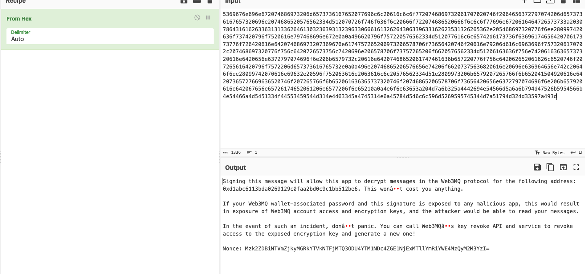
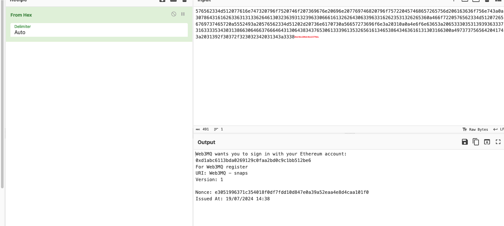
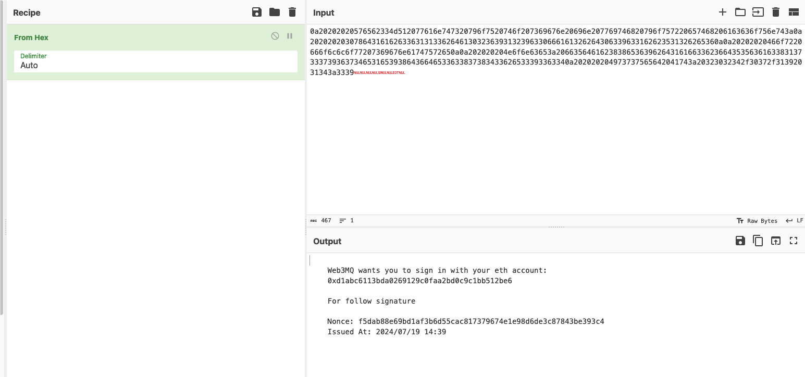
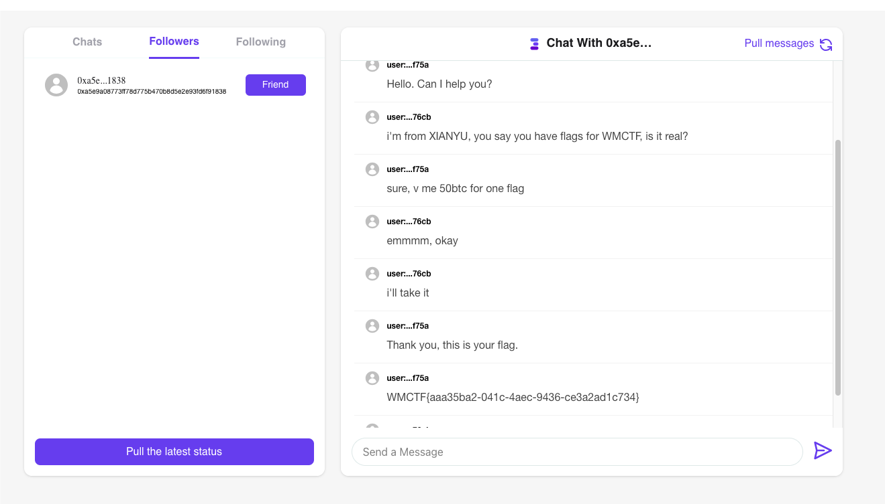

# metasecret

## 题目简述

题目是取证和链上钱包综合题。镜像中存在 Firefox Profile、MetaMask 插件数据、密码字典，以及 Web3MQ Snap 相关消息。目标是恢复 MetaMask 助记词，再进一步恢复 Web3MQ 消息密码并读取聊天记录。

## 解题过程

### 关键机制

Firefox 的 IndexedDB 文件不是直接 JSON，使用 Mozilla 的 Snappy frame + SpiderMonkey StructuredClone 格式。外链 `FirefoxMetamaskWalletSeedRecovery` 的作用是解析 Firefox IndexedDB 中的 MetaMask vault；正文所需关键信息是：先对 idb 文件做 Snappy 解压，再解析出 `vault` JSON。

参考 URL：https://github.com/JesseBusman/FirefoxMetamaskWalletSeedRecovery

MetaMask vault 中关键字段：

```json
{
  "data": "...",
  "iv": "fPymLoml7KKyZ5wdqwylqg==",
  "keyMetadata": {
    "algorithm": "PBKDF2",
    "params": { "iterations": 600000 }
  },
  "salt": "xN8qVOAe6KF+JTti1cOyGNBNdSWTlumu1YQi2A4GcbU="
}
```

由于 MetaMask 新版 vault 使用 PBKDF2 600000 次，普通 hashcat 旧模块可能不支持，需要使用支持 mode `26650` 的 MetaMask 模块。外链 `MetamaskHashcatModule` 的作用就是补新版 MetaMask vault 的 hashcat 模块。

参考 URL：

- https://github.com/flyinginsect271/MetamaskHashcatModule
- https://metamask.github.io/vault-decryptor/

### 求解步骤

1. 在 Firefox Profile 的扩展存储中定位 MetaMask 扩展 id `654e5b4f-4a65-4e1a-9b58-51733b6a2883`。
2. 读取路径类似：

```text
AppData/Roaming/Mozilla/Firefox/Profiles/<profile>/storage/default/
moz-extension+++654e5b4f-4a65-4e1a-9b58-51733b6a2883^userContextId=4294967295/
idb/3647222921wleabcEoxlt-eengsairo.files/492
```

3. 解压并解析 idb，得到 vault 后转 hashcat 格式：

```text
$metamask$<salt>$<iv>$<data>
```

4. 用文档中的 `passwords.txt` 爆破：

```shell
hashcat -a 0 -m 26650 1.txt ./passwords.txt --force
```

得到 MetaMask 密码 `silversi`，解出助记词：

```text
acid happy olive slim crane avoid there cave umbrella connect rain vessel
```

5. 继续分析 idb 中 Web3MQ Snap 消息。Web3MQ 开源代码说明注册签名 nonce 的格式为：

```text
sha3_224("$web3mq" + did_type + ":" + did_value + keyIndex + password + "web3mq$")
```

参考 URL：https://github.com/Generative-Labs/Web3MQ-Snap/blob/fc18f84e653070f8914f5058ab870a6ef04d3ee8/packages/snap/src/register/index.ts#L204

本题中：

```text
did_type = eth
did_value = 0xd1abc6113bda0269129c0faa2bd0c9c1bb512be6
keyIndex = 1
```

因此只需用 `passwords.txt` 爆破未知 password：

```python
import hashlib, base64

def calc(word):
    s = "$web3mqeth:0xd1abc6113bda0269129c0faa2bd0c9c1bb512be61" + word + "web3mq$"
    return hashlib.sha3_224(s.encode()).hexdigest()

target = base64.b64decode(
    "Mzk2ZDBiNTVmZjkyMGRkYTVkNTFjMTQ3ODU4YTM1NDc4ZGE1NjExMTllYmRiYWE4MzQyM2M3YzI="
).decode()
```

爆破得到 `stanley1`。导入钱包并登录 Web3MQ，即可查看聊天记录中的 flag。

Web3MQ 侧保留以下界面证据，分别对应签名请求、注册提示、签名结果和最终聊天记录：









## 方法总结

- 第一段：Firefox IndexedDB -> Snappy/StructuredClone -> MetaMask vault -> hashcat -> 助记词。
- 第二段：Web3MQ Snap nonce 公式 -> `sha3_224` 字典爆破 -> Web3MQ 密码。
- 外链工具不是答案本身，关键是知道各自处理的文件格式和加密参数。
