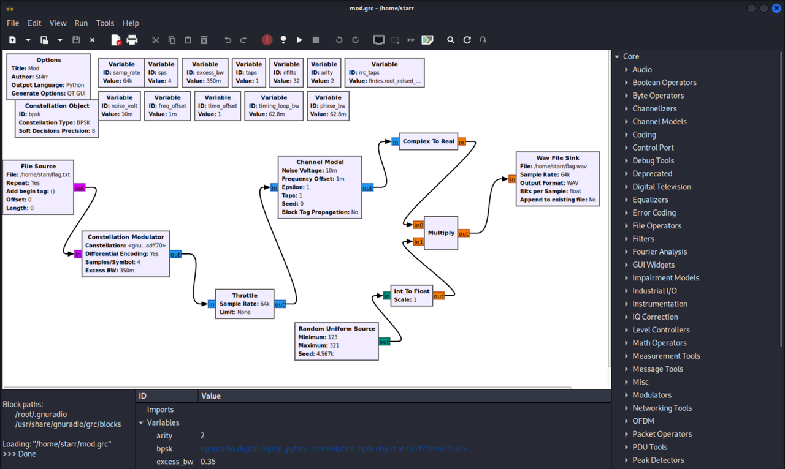
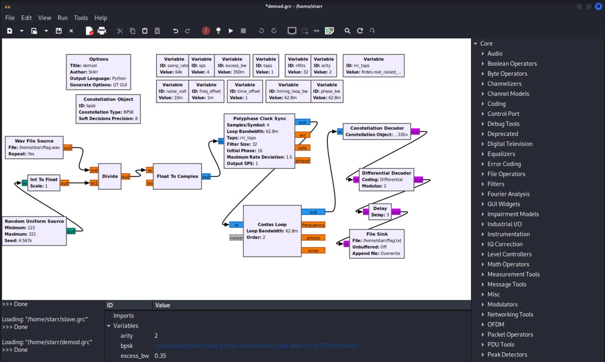

# 神秘电波

## 题目简述

题目提供 `flag.wav` 和 GNU Radio Companion 工程 `mod.grc`。工程把重复读取的 flag 字节经过差分星座调制、信道扰动和随机幅度缩放后写成单声道浮点 WAV。目标是根据工程中的精确参数搭建逆向流程，恢复 0/1 比特流并从多次重复结果中还原 flag。

## 解题过程

### 1. 从 `mod.grc` 提取调制参数

`mod.grc` 是文本格式的 GRC 流图，关键参数包括：

- 采样率 `samp_rate = 64000`；
- 每符号采样数 `sps = 4`；
- 滚降系数 `excess_bw = 0.35`；
- 差分编码开启；
- 信道噪声电压 `0.01`、频偏 `0.001`；
- 输出为单声道 `FORMAT_FLOAT` WAV；
- 调制后的实部还会乘以范围 `123..321`、种子为 `4567` 的确定性随机整数序列。



文件源设置了 `repeat: True`，所以 WAV 中包含许多重复的 flag，这为后续从噪声和同步误差中做交叉校验提供了冗余。

### 2. 搭建逆向解调流程

GNU Radio 官方的 [BPSK 解调示例](https://wiki.gnuradio.org/index.php?title=Simulation_example:_BPSK_Demodulation) 给出了时钟同步、载波同步和星座判决的基础关系。本题需要按附件参数改成文件输入，并先撤销额外的随机幅度缩放。

接收流图按以下顺序连接：

1. `Wav File Source` 读取 `flag.wav`；
2. 使用与发送端完全相同的 `Random Uniform Source`：最小值 123、最大值 321、种子 4567；
3. 将随机整数转成 float，用 `Divide` 对 WAV 样本逐点相除，撤销幅度扰动；
4. `Float To Complex` 把实数样本放到复数实部；
5. `Polyphase Clock Sync` 使用 `sps=4`、32 个滤波器和相同的 RRC taps 恢复符号时钟；
6. 二阶 `Costas Loop` 校正残余载波频偏；
7. `Constellation Decoder` 后接 `Differential Decoder`，模数设为 2；
8. 根据起始瞬态增加约 3 个符号的 `Delay`，最后写入文件。



文件输出的每个字节都是 `0x00` 或 `0x01`，分别表示一个比特。可直接在本地按 8 位一组恢复字节，无需依赖 CyberChef：

```python
from pathlib import Path

symbols = Path("flag.txt").read_bytes()
bits = "".join(
    "1" if value == 1 else "0"
    for value in symbols
    if value in (0, 1)
)

for bit_offset in range(8):
    aligned = bits[bit_offset:]
    decoded = bytes(
        int(aligned[i:i + 8], 2)
        for i in range(0, len(aligned) - 7, 8)
    )
    Path(f"decoded-{bit_offset}.bin").write_bytes(decoded)
```

在对齐正确的输出中可以看到大量重复的 `0xGame{...}`。受开头同步瞬态、噪声和少量判决错误影响，不同副本会有个别乱码；对多个副本的相同位置做比对，并利用题目提示的 UUID 格式，可以稳定恢复：

```text
0xGame{38df7992-6c53-11ef-b522-c8348e2c93c6}
```

## 方法总结

这题不能只根据“看起来像 BPSK”套一个通用解调器，必须从 GRC 文件恢复发送端加入的每一层处理。最容易遗漏的是确定性随机幅度乘法：用相同种子重放随机序列并相除后，时钟同步、Costas 环和差分解码才能得到稳定比特流。重复发送的数据则用于对抗少量误码。
