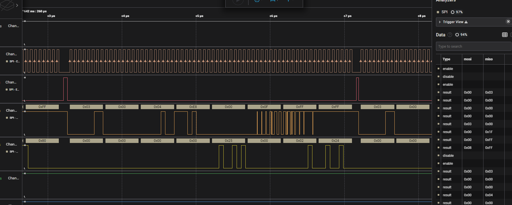

# Sal

## 题目简述

题目提供家用路由器启动时采集的 Saleae 逻辑分析仪工程。CPU 通过 SPI 从 Winbond 25Q128JVSQ 外置 Flash 读取固件；目标是重建 Flash 内容、解包根文件系统，并计算 `/etc/passwd` 的 MD5。

## 解题过程

先在 Logic 2 中配置 SPI 解码器，映射时钟、片选、MOSI 和 MISO。一次典型读取中，片选拉低后，主机在 MOSI 发送 `0x03` 和 3 字节大端地址，Flash 随后在 MISO 返回该地址起始的数据：



把解码结果导出为 CSV，以片选边沿切分事务。对每个 `0x03` 事务取地址并把返回字节放回同一偏移：

```python
flash = bytearray(0x1000000 + 4)

for mosi, miso in transactions:
    if len(mosi) < 4 or mosi[0] != 0x03:
        continue
    address = int.from_bytes(mosi[1:4], "big")
    payload = miso[4:]
    flash[address:address + len(payload)] = payload

open("fs.bin", "wb").write(flash)
```

同时顺序拼接所有返回数据可用于交叉检查，但不能替代按地址重建，因为启动过程可能跳读或重复读取。对 `fs.bin` 执行固件扫描与提取：

```text
binwalk fs.bin
binwalk -e fs.bin
```

提取出的 SquashFS 中包含路由器根文件系统。计算目标文件：

```text
md5sum squashfs-root/etc/passwd
```

得到：

```text
c8ef3ad94c6eb97f4fa94a0f0ed33980
```

最终 flag 为 `byuctf{c8ef3ad94c6eb97f4fa94a0f0ed33980}`。

## 方法总结

本题的决定性障碍是从物理总线采样重建地址空间。要同时理解 SPI 事务边界、Flash 指令格式与字节序；将响应按地址回填后，后续才转化为常规固件取证问题。
