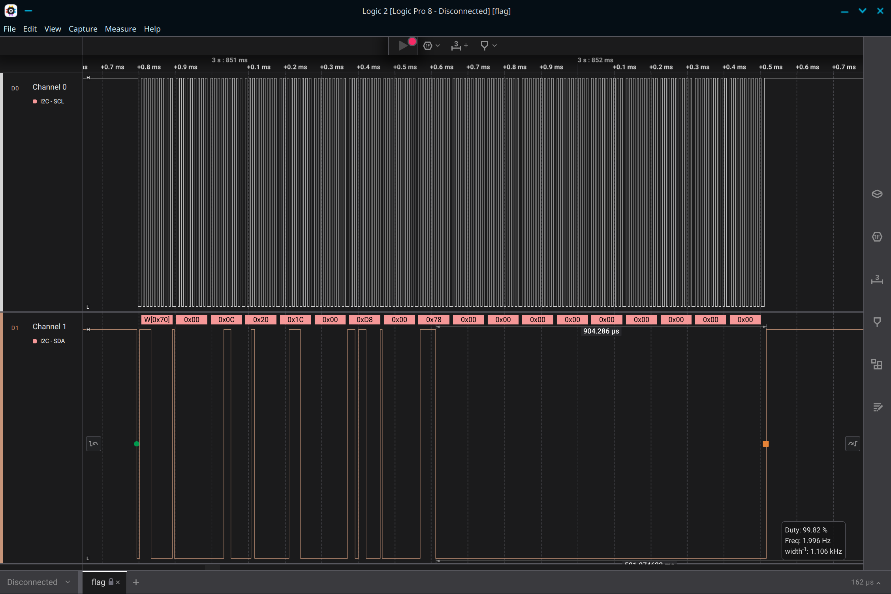

# Alpha

## 题目简述

题目提供 Arduino 程序和 Saleae `.sal` 逻辑分析仪采集文件。程序通过 I2C 驱动四位 14 段显示器，依次显示 flag。每次写事务包含协议/地址控制信息和 16 字节显示 RAM；四个字符各占两个小端字节，其余显示位通常为零。

14 个字母段和小数点分别映射到一个 16 位掩码。显示器内存布局与段定义可从 [HT16K33 显示模块数据手册](https://cdn-shop.adafruit.com/datasheets/2153datasheet.pdf) 及附件使用的 Adafruit 字库实现确认；解题所需映射已在下文完整列出。

## 解题过程

在 Logic 2 中为 SCL/SDA 添加 I2C analyzer。单次写入可看到从设备地址 `0x70`、起始 RAM 地址 `0x00`，以及后续 16 个数据字节：



每两个字节按小端组合：

```python
mask = low | (high << 8)
```

段位定义为：

```text
A=0x0001  B=0x0002  C=0x0004  D=0x0008
E=0x0010  F=0x0020  G1=0x0040 G2=0x0080
H=0x0100  J=0x0200  K=0x0400  L=0x0800
M=0x1000  N=0x2000  DP=0x4000
```

对每帧保留四个有效字形掩码，用 Adafruit `alphafonttable` 建立“掩码到字符”的反向字典，即可每帧恢复四个字符并顺序拼接。官方实现的 `writeDigitAscii()` 直接以 ASCII 码索引该表，因此 `enumerate()` 得到的下标可以直接交给 `chr()`：

```python
decode = {mask: chr(code) for code, mask in enumerate(alphafonttable)}

text = []
for frame in frames:
    ram = frame[-16:]
    for i in range(0, 8, 2):
        mask = ram[i] | (ram[i + 1] << 8)
        text.append(decode[mask])
print("".join(text))
```

这一索引关系可在 [Adafruit LED Backpack 驱动源码](https://github.com/adafruit/Adafruit_LED_Backpack/blob/master/Adafruit_LEDBackpack.cpp) 中核对：字库为 128 项，前 32 项是控制字符占位，随后才是可打印字符。逐帧结果组成：

```text
byuctf{4r3n7_h4rdw4r3_pr070c0l5_c00l?}
```

## 方法总结

- 核心技巧：从 I2C 采样中切分显示 RAM 帧，按小端合并字形位图，再用 14 段字库反查字符。
- 识别信号：逻辑分析文件、SCL/SDA 双线、固定从地址和周期性 16 字节写入，通常指向 I2C 外设寄存器或显示缓冲区。
- 复用要点：先用数据手册和驱动源码确认起始寄存器、端序及段位映射；不要把 I2C 地址/控制字节误当成显示数据。
