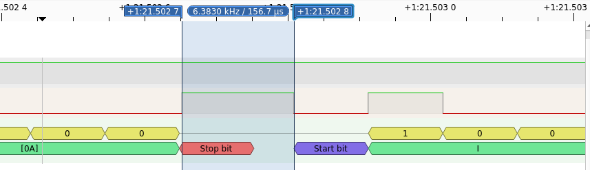

# Birdloader

## 题目简述

题目把 RP2040 的 GPIO 8、GPIO 9 分别接到一块 8 位微控制器的 UART 接收端和发送端，串口速率为 9600 baud。目标是解锁 16 位调试 PIN，再执行受保护的 `f` 命令读取 flag。

固件使用 `strcmp` 比较输入 PIN。它会在比较前发送 `Checking...\r\n`，失败后发送 `Incorrect PIN.\r\n`，因此比较耗时能够通过两段 UART 输出之间的空隙观察出来。

## 解题过程

`strcmp` 从首字节开始逐字节比较，遇到第一个不同字节才返回。候选前缀越长，目标控制器执行的比较越多，从 `Checking...` 末尾到 `Incorrect PIN.` 开头的间隔也越长。目标是 8 MHz 的 8 位控制器，而测量端 RP2040 运行在 125 MHz，时钟差足以放大这个逐字节时序侧信道。

UART 一帧由一个起始位、8 个低位优先的数据位和一个停止位组成。9600 baud 下每位持续约：

$T_{bit}=1/9600\approx104.17\ \mu s$

不能把软件收到两个字符串的时间直接相减，因为缓冲、调度和完整字符传输都会引入噪声。官方求解器把测量窗口固定为 `Checking...\r\n` 最后一个换行字符的停止位上升沿，到 `Incorrect PIN.` 首字符 `I` 的起始位下降沿。下图标出了这两个边沿之间约 $156.7\ \mu s$ 的一次实际测量：



为在连续 GPIO 边沿中定位这个窗口，求解器把 `...\r\nI` 附近高、低电平持续时间量化为 UART 位数，并匹配固定序列：

```c
uint8_t target[20] = {
    1, 2, 1, 2, 3, 1, 1, 2, 1, 1,
    1, 1, 2, 4, 1, 2, 1, 1, 1, 4
};
```

RP2040 的 SysTick 以 125 MHz 计数，所以一个 UART 位约为：

$125000000/9600\approx13020$ 个计数

GPIO 上升沿和下降沿中断只记录当前 SysTick 值，随后用相邻时间戳之差识别上述位宽序列；序列后的那一段就是 `strcmp` 的可比较耗时。

恢复 PIN 时逐位枚举字符 `0` 到 `9`。对每个位置保留当前已知正确前缀，尝试十个候选数字，并选取测量时间最长者：

```c
for (int position = 0; position < 16; position++) {
    uint32_t slowest_time = 0;
    char slowest_char = '?';

    for (int i = 0; i < 10; i++) {
        password[position] = "0123456789"[i];
        uint32_t elapsed = guess_password(password);
        if (elapsed > slowest_time) {
            slowest_time = elapsed;
            slowest_char = password[position];
        }
    }
    password[position] = slowest_char;
}
```

这样得到 PIN `4572381552009517`。发送该 PIN 后调试命令被解锁，再发送 `f` 即可读出 flag。公开固件中写入的是基础文本 `DUCTF{are_kiwis_really_birds_if_they_cant_fly}`；仓库的比赛元数据记录的正式接受值为：

```text
DUCTF{are_kiwis_really_birds_if_they_cant_fly_111cd6d03da4}
```

## 方法总结

本题利用的不是 UART 协议漏洞，而是低速目标上的非恒定时间字符串比较。稳定求解的关键是选取可由电平边沿唯一定位的测量窗口，并把 UART 位宽量化后再搜索，而不是依赖接收 API 的粗粒度时间。若实际环境噪声较大，还应对每个候选重复采样并使用中位数或截尾均值，但官方硬件连接足够直接，单轮最长时间即可逐位恢复 PIN。
