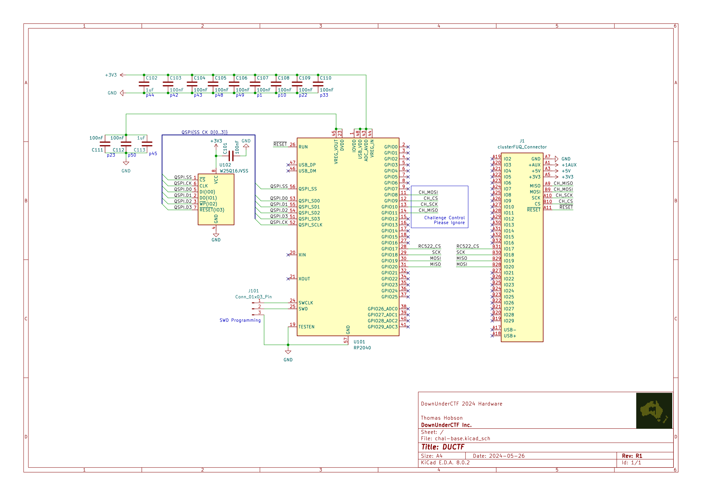

# DUCTF

## 题目简述

题目是一套由 RP2040、MFRC522 RFID 前端和外部 SPI Flash 组成的读卡器。固件尝试使用 AES 版 MIFARE DESFire 认证，认证成功后把 flag 写入卡片。目标是模拟一张卡，并利用读卡器随机数与 CBC 认证流程的缺陷通过认证。



## 解题过程

原理图表明 RP2040 通过 SPI 与 MFRC522 连接。题目说明 PCB 上 SPI 线路存在连接错误，因此官方同时给出 bit-bang SPI 实现；求解端应当模拟 MFRC522 的寄存器接口和 FIFO，而不是试图直接实现射频层。

### 1. 随机数退化为全零

固件把 RP2040 内部环形振荡器调到与系统时钟存在谐波关系，然后直接读取 `rosc_hw->randombit` 生成随机字节：

```c
uint8_t rand_u8(void) {
    uint8_t value = 0;
    for (size_t i = 0; i < 8; i++) {
        value |= rosc_hw->randombit;
        value <<= 1;
    }
    return value;
}
```

RP2040 数据手册对这种时钟关系给出了明确警告：随机位会变成可预测的全零或全一序列。题目实例中读卡器的 `rand_a` 固定为 16 个零字节。于是本应由读卡器提供的新鲜随机挑战完全已知。

### 2. 把读卡器变成 AES-CBC 加密机

DESFire AES 认证的第一步由卡片返回 $E_K(RndB)$。读卡器把这 16 字节密文同时作为下一次 CBC 的 IV，然后加密两块明文：

$C_1=E_K(RndA\oplus IV)$

$C_2=E_K(RndB'\oplus C_1)$

攻击者可以自由控制第一步的“卡片密文”即 $IV$，而 $RndA=0^{128}$ 已知，所以读卡器返回的第一块就是 $E_K(IV)$。这提供了一个可选择明文的 AES 加密原语。

官方求解器分四轮复用该原语：

1. 返回 16 字节全零，取得 $E_K(0^{128})$，记为 `rand_a_enc`。
2. 新一轮认证把 `rand_a_enc` 当作卡片挑战。读卡器解密得到 $RndB=0^{128}$，因此它发送的两块响应满足 DESFire 的旋转检查；同时记录第二块形成的最终 IV。
3. 再以这个最终 IV 作为卡片返回值。由于 $RndA$ 为零，读卡器给出的第一块正好是后续检查所需的加密结果 `final_step_enc`。
4. 最后一轮重新提交 `rand_a_enc`，并在 additional-frame 阶段返回 `final_step_enc`，使读卡器解密后得到正确的 $RndA'$，认证通过。

### 3. 模拟 MFRC522 并接收 flag

求解程序在 SPI 从设备一侧模拟 MFRC522。它至少需要实现以下寄存器行为：

- `VersionReg` 返回 `0x92`，通过芯片版本检查；
- `ComIrqReg`、`DivIrqReg` 和 `ErrorReg` 伪造传输完成、CRC 完成且无错误；
- `FIFODataReg`、`FIFOLevelReg` 保存读卡器写入的帧并返回伪造响应；
- 对 REQA、RATS、PPS 和后续 APDU 返回足以让状态机继续的响应。

当读卡器发送 `0xAA` 时，按上述四阶段认证状态机响应；当它最终发送 DESFire `WriteData` 命令 `0x3D` 时，flag 位于 APDU 的数据区域，求解器直接打印该字段。仓库记录的正式 flag 为：

```text
DUCTF{D3SF1r3_i5_5ecur3_1f_u53d_corr3ct1y}
```

## 方法总结

本题的决定性缺陷是硬件随机源使用条件错误，使 DESFire 认证中的读卡器 nonce 完全可预测。CBC 链接方式又允许恶意卡控制 IV，于是读卡器暴露了可拼接的 AES 加密原语。完整利用还要求在 SPI 层模拟 MFRC522 的关键寄存器和 FIFO，但这些响应只需满足固件实际检查的最小集合，无须实现完整射频协议。
