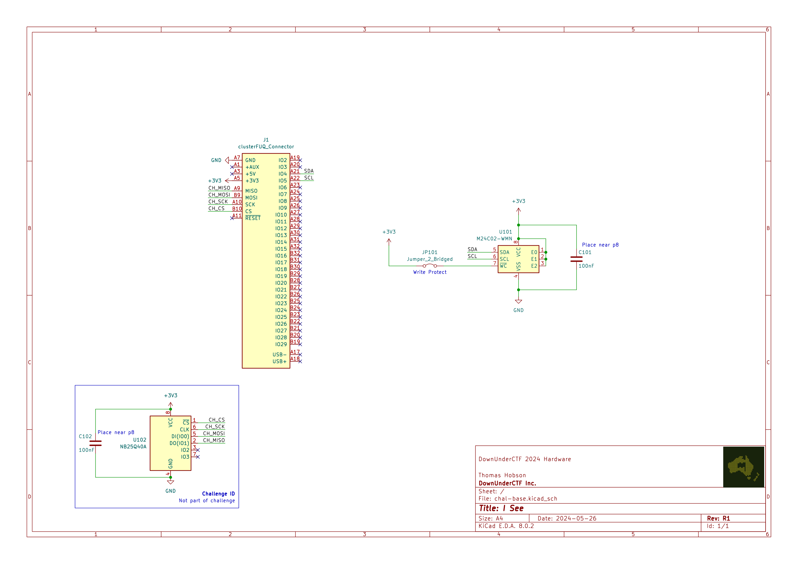

# I See

## 题目简述

题目只提供硬件原理图和一套能够在真实 RP2040 板卡上运行选手固件的接口。目标是从板上的串行 EEPROM 读取 flag，并通过基础设施提供的 UART 通道输出。



## 解题过程

从原理图可以直接确定：

- EEPROM 为 `M24C02`，容量 256 字节；
- `SDA` 接 RP2040 的 GPIO4，`SCL` 接 GPIO5；
- 地址选择脚 `E0`、`E1`、`E2` 均被拉高，所以 7 位从地址为 `0b1010111`，即 `0x57`；
- 写保护脚由跳线控制，但读取不受影响。

官方简短题解把器件写成 `M24C01`、引脚写成 IO24/IO25，这与公开原理图和官方 Rust 求解器不一致；应以二者都能互相印证的 `M24C02`、GPIO4/GPIO5 为准。

在 RP2040 上初始化 I2C0 后，以 400 kHz 连接上述两个 GPIO，再按 M24C02 的顺序读方式从偏移 0 读取完整 256 字节。官方求解器使用 `eeprom24x` 库，关键部分如下：

```rust
let i2c = hal::I2C::i2c0(
    pac.I2C0,
    pins.gpio4.reconfigure(),
    pins.gpio5.reconfigure(),
    400.kHz(),
    &mut pac.RESETS,
    &clocks.peripheral_clock,
);

let address = SlaveAddr::Alternative(true, true, true);
let mut eeprom = Eeprom24x::new_m24x02(i2c, address);

let mut data = [0u8; 256];
eeprom.read_data(0u32, &mut data).unwrap();
uart.write_full_blocking(&data);
```

如果不使用该库，等价的总线流程是向 `0x57` 写入一个字节的起始偏移 `0x00`，发送 repeated START 后连续读取 256 字节，并在最后一个字节回 NACK。把内容原样输出到 UART 后，可以在末尾看到：

```text
DUCTF{I2C_the_flag_now_fcee2acf}
```

## 方法总结

本题考查的是最基础的原理图阅读和 I2C EEPROM 访问。关键不是猜测器件默认地址，而是把型号、GPIO 连线和三个地址脚的电平一起读出来。公开材料之间存在文字笔误时，也应以原理图与可编译求解代码的共同证据为准。
