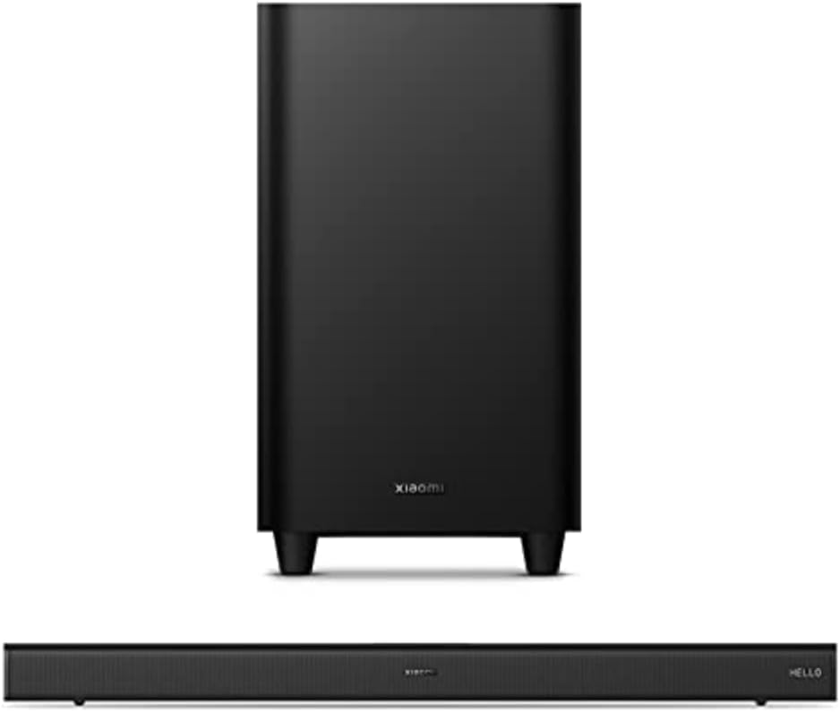

# Sounds Nice

## 题目简述

题目给出一张小米电视音响的产品图，要求依次确定设备使用的蓝牙芯片、无线音频模块、该模块 RX 天线附近耦合电容的容值，以及 I2C 时钟信号所在的引脚。四项答案按顺序拼成 flag。



## 解题过程

先利用图片中的 `Xiaomi` 标识和电视音响外形定位产品，再到 [FCC ID 2AIMRMITVS26 的认证资料](https://fccid.io/2AIMRMITVS26)中交叉核对；其内部照片能看到主板与模块丝印，因此这一步并不是只凭商品名猜芯片型号。

内部照片中的主控丝印为 `ATS2853`。该器件是一颗集成蓝牙功能的音频 SoC，所以第一项为：

```text
ATS2853
```

无线音频子板上的型号为 `ETK51`，第二项因此是：

```text
ETK51
```

继续按模块料号 `Everestek EV01SA` 查找公开认证文档，可以在 [FCC ID Z9G-EDF54 的用户手册原理图](https://fccid.io/Z9G-EDF54/User-Manual/user-manual-4510471.pdf)中确认其射频与控制引脚。RX 天线通路上的耦合电容编号为 `C16`，标称值为 `9 pF`；同一原理图中，`I2C_SCL` 网络连接到 `ETK51` 芯片的 `31` 号引脚。手册的模块连接器定义另把 I2C 时钟列为 18 号端子，不能把模块端子号与芯片封装引脚号混为一谈；题目所问和官方答案采用后者。

四项依次为 `ATS2853`、`ETK51`、`9`、`31`，最终得到：

```text
DUCTF{ATS2853_ETK51_9_31}
```

## 方法总结

这道题的核心是硬件 OSINT：先用产品外观确定候选设备，再用 FCC 内部照片读取芯片与模块丝印，最后转向模块自身的认证原理图查元件值和引脚号。商品页面只能帮助定位产品，真正能闭合答案证据的是内部照片、模块型号和原理图三者之间的对应关系。
