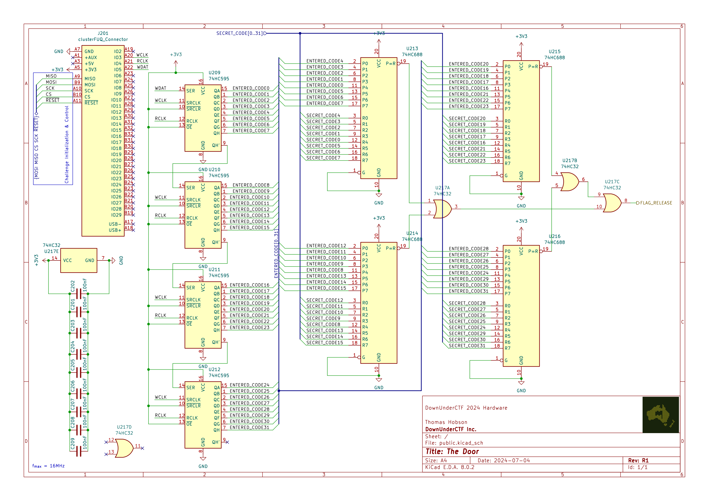

# The Door

## 题目简述

题目是一块 32 位遥控门禁电路。选手可以通过 `WDAT` 输入串行数据，并用 `WCLK`、`RCLK` 推进和锁存；只有移位寄存器中的 32 位输入与隐藏码完全相等，`FLAG_RELEASE` 才会翻转。运行环境限制为 5 分钟，因此不能把每个 32 位候选都从头移入。



## 解题过程

原理图中，四片 74HC595 串接为 32 位串入并出寄存器；其输出分成四组送入 74HC688，与 `SECRET_CODE0` 到 `SECRET_CODE31` 比较。四个比较结果再汇总到 `FLAG_RELEASE`。因此每输入一个新位，原来的 32 位窗口只向前滑动一位。

若对 $2^{32}$ 个候选分别发送 32 位，需要约 $2^{37}$ 次移位。即使按原理图允许的 2 MHz 估算也不合理。二元 $n$ 阶 de Bruijn 环序列 $B(2,n)$ 恰好包含每个 $n$ 位串一次；连续发送 $B(2,32)$ 时，每一个 32 位滑动窗口都会出现，所需数据量降为约 $2^{32}$ 位。

以三位为例，序列 `0001011100` 的连续窗口依次为：

```text
000, 001, 010, 101, 011, 111, 110, 100
```

官方求解器使用 Fredricksen–Kessler–Maiorana 递归算法在线生成二元 de Bruijn 序列，不在内存中保存 $2^{32}$ 位。核心递归为：

```c
void fmk_gen_debrujin(uint8_t t, uint8_t p, uint64_t *a) {
    if (t > 32) {
        if (32 % p == 0) {
            for (int i = 0; i < p; i++) {
                shift_bit((*a >> (i + 1)) & 1);
            }
        }
        return;
    }

    *a = SET_BIT(*a, t, GET_BIT(*a, t - p));
    fmk_gen_debrujin(t + 1, p, a);
    if (GET_BIT(*a, t - p) == 0) {
        *a = SET_BIT(*a, t, 1);
        fmk_gen_debrujin(t + 1, t, a);
    }
}
```

这里还必须处理 5 分钟限制。发送完整 $2^{32}$ 位即使达到 2 MHz 也约需：

$2^{32}/2000000\approx2147\text{ s}\approx35.8\text{ min}$

题目背景暗示秘密码类似遥控器 DIP 开关，通常只有少量 `1`。因此应让全零、单个 `1`、两个 `1` 等低汉明重量窗口优先出现，并在 `FLAG_RELEASE` 变化时立即停止。公开固件设置的秘密码为 `0x18000000`，只有两个相邻的 `1`；按官方 FKM 求解器的实际位序，它在发送第 68 位时便进入移位窗口，远早于完整遍历。官方代码使用较保守的软件延时；若要保证任意秘密码的吞吐，应改用 RP2040 PIO 产生时钟。

命中隐藏码后，基础设施检测到 `FLAG_RELEASE` 边沿，并通过 flag-release 命令返回成功状态。仓库记录的正式 flag 为：

```text
DUCTF{d3bruj1n_s3quenc3s_ar3_fun_22710742}
```

## 方法总结

移位寄存器让相邻候选共享 31 个比特，这是 de Bruijn 序列能把 $32\cdot2^{32}$ 次发送降到约 $2^{32}$ 次的原因。不过降维并不自动满足本题时限；还需要利用低汉明重量的硬件配置先验调整输出顺序，或者使用 PIO 提高时钟。区分理论最坏情况与实例秘密码出现位置，是判断官方求解器为何能在限制内命中的关键。
