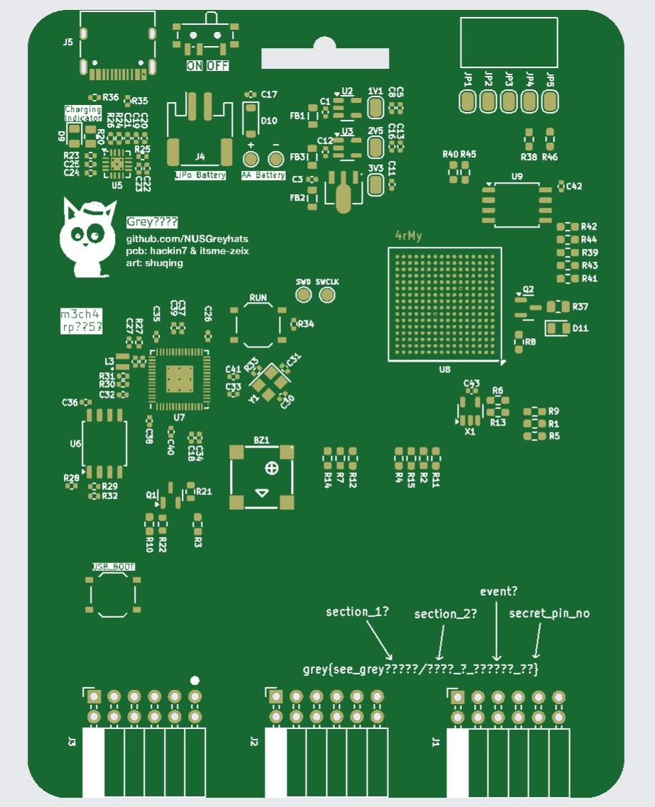
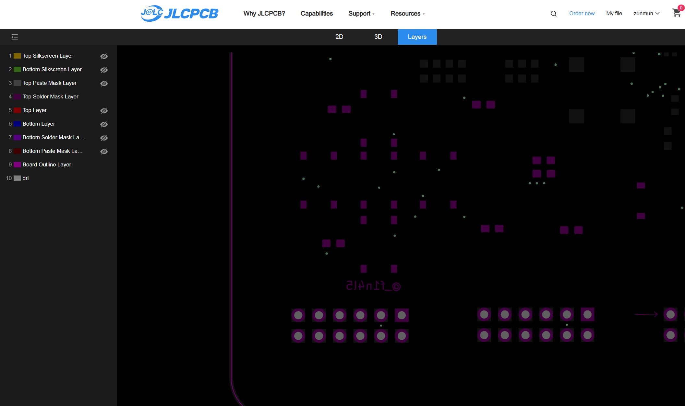

# Secret Development Kit

## 题目简述

题目给出一套 PCB 生产 Gerber 文件，包括正反面铜层、阻焊层、锡膏层、丝印层、板框与钻孔文件。目标是通过分层查看板面文字、被覆盖的图形以及连接器走线，拼出活动名称和秘密引脚编号。

打开全部层时，正面首先呈现大幅“Clown To Clown Communication”丝印图案。它说明文件确实能正常渲染，但也会遮挡其他层中的线索。


## 解题过程

先单独观察背面丝印。板底直接给出 flag 结构 `grey{see_grey??????/????_?_??????_??}`，并在芯片附近标出 `m3ch4` 与 `rp?25?`，在另一封装上方标出 `4rMy`。结合题目所指向的 GreyMecha/Army，可确定前两段为 `m3ch4/4rMy`。



第三段不能只看合成预览。隐藏正面丝印、只显示正面阻焊层后，在连接器上方会出现镜像文字 `@_f1n4l5`；同一层还用箭头标出连接器的起始方向。JLCPCB 或 KiCad 的默认叠层会让该文字被丝印覆盖，因此必须手动切换层可见性。



最后确定秘密引脚编号。`rp?25?` 提示主控为 RP2350；根据箭头确定连接器方向后，从秘密焊盘沿铜层网络追踪到主控，对应 RP2350 的第 25 号引脚。若只剩最后两位未知，题目环境也允许在 00 到 99 中枚举，但走线追踪给出了确定证据。

依次组合可见前缀、三段文字与引脚号：

```text
grey{see_greym3ch4/4rMy_@_f1n4l5_25}
```

## 方法总结

Gerber 题的关键是把 PCB 当成多层数据集，而不是只看默认的 2D 合成图。丝印、阻焊与铜层之间既可能互相遮挡，也承担不同证据：文字用于恢复 flag 片段，焊盘方向和铜线网络用于确认引脚。记录每条线索来自哪一层并独立开关可见性，比反复缩放全层预览更可靠。
