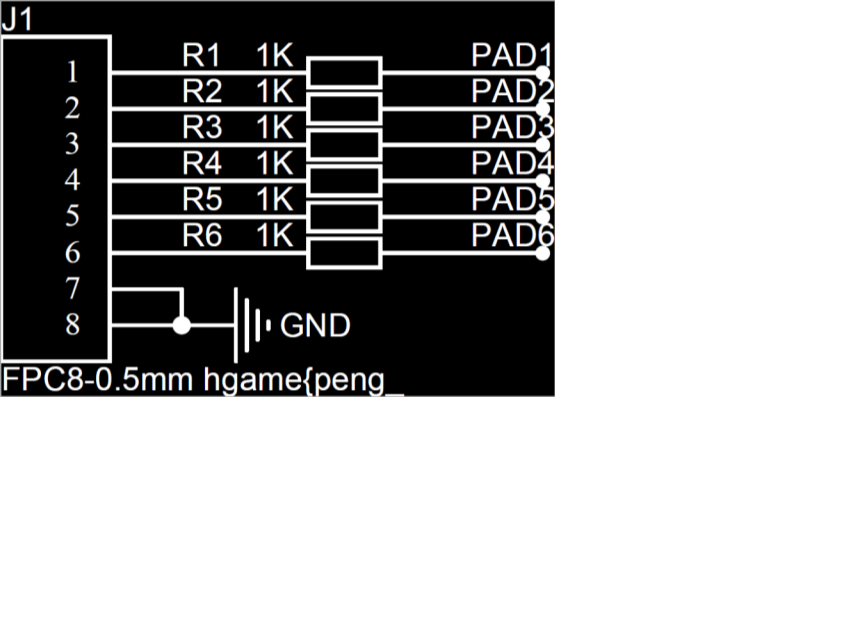

# Pirated keyboard

## 题目简述

附件来自稚晖君开源的瀚文智能键盘项目，但题目对电路图和固件做了修改，并提供一份 USB 流量。需要把附件与上游工程逐项对比：电路图中藏有 flag 前缀，固件改变了 HID 键码映射，流量中则记录了剩余字符。

## 解题过程

根据附件中的项目说明，可以定位到上游的 [HelloWord-Keyboard 开源工程](https://github.com/peng-zhihui/HelloWord-Keyboard)。该仓库包含硬件、固件与结构资料；本题需要的作用是提供未篡改基线，关键差异已在下文列出。

首先比较原版和题目版电路板 PDF。题目版在 FPC8 接口附近多出一段文本，得到 flag 前缀：



```text
hgame{peng_
```

再比较固件中的 `KeyCode_t` 枚举，发现 `H` 和 `I` 的顺序被互换。由于枚举值直接用于生成 USB HID report，这会导致这两个按键在抓包数据中的键码颠倒，解码时必须按题目固件的实际映射纠正。

最后分析 USB 抓包。先用 TShark 提取 `usb.capdata`：

```bash
tshark -r test.pcapng -T fields -e usb.capdata > usbdata.txt
```

标准键盘 report 的第 1 字节是修饰键，第 3 字节开始是普通按键键码。下面的脚本兼容带冒号和不带冒号的输出，并覆盖本题会用到的字母、数字、下划线与花括号：

```python
letters = "abcdefghijklmnopqrstuvwxyz"
digits = "1234567890"

normal = {0x04 + index: char for index, char in enumerate(letters)}
normal.update({0x1E + index: char for index, char in enumerate(digits)})
normal.update({0x2D: "-", 0x2F: "[", 0x30: "]"})

shifted = {code: char.upper() for code, char in normal.items() if char.isalpha()}
shifted.update({0x2D: "_", 0x2F: "{", 0x30: "}"})

output = []
with open("usbdata.txt", encoding="utf-8") as capture:
    for line in capture:
        report = line.strip().replace(":", "")
        if len(report) != 16:
            continue

        modifier = int(report[0:2], 16)
        keycode = int(report[4:6], 16)
        if keycode == 0:
            continue

        table = shifted if modifier & 0x02 else normal
        output.append(table.get(keycode, ""))

print("".join(output))
```

结合固件中 `H`、`I` 键码互换的差异纠正输出，流量部分为：

```text
zihui_NB_666}
```

与电路图前缀拼接得到：

```text
hgame{peng_zihui_NB_666}
```

## 方法总结

这道题把供应链差分、硬件文档和 USB HID 取证串在一起。处理修改版开源项目时，应先找到可信上游版本，再分别比较原理图、PCB 和固件；解析总线流量时也不能盲信标准码表，因为固件本身可能改变协议字段的语义。保留电路图是必要的，因为 flag 前缀的位置与线路布局属于文本无法完整替代的视觉证据。
