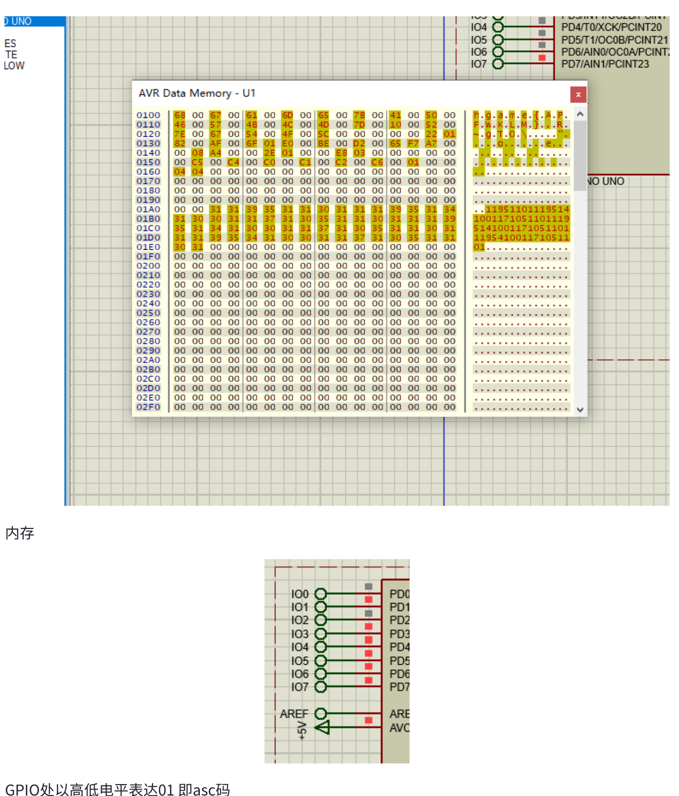

# another UNO

## 题目简述

附件是一份 Intel HEX 格式的 Arduino UNO 固件。Arduino UNO 使用 ATmega328P 与 AVR 指令集；固件把 flag 分成三段，分别通过数据内存、串口和 GPIO 电平暴露。可以把固件烧入真实开发板，也可以在 Proteus 中仿真，还可以直接逆向 AVR 代码恢复三段变换。

决定性信息来自微控制器固件、串口和 GPIO，因此本题归入 Hardware/Embedded。

## 解题过程

### 确认固件与仿真目标

Intel HEX 文件的每行以冒号开头，包含记录长度、地址、类型、数据和校验和。可以直接把 HEX 加载到 Proteus 的 Arduino UNO 元件，也可以先转成原始二进制再交给支持 AVR 的逆向工具：

```bash
avr-objcopy -I ihex -O binary firmware.hex firmware.bin
```

在 Proteus 中给 UNO 加载固件后，打开 AVR Data Memory、虚拟串口终端和 GPIO 逻辑状态。官方题解截图显示：程序运行到相应阶段时，数据内存已经出现第一段可读字符，后续内容仍保持编码状态；D0 至 D7 的高低电平则可按位还原为 ASCII。



截图中的内存以 16 位字显示，所以每个有效字节后会跟一个 `00`。地址 `0x0100` 起始位置可见：

```text
68 00 67 00 61 00 6d 00 65 00 7b 00 41 00
```

去掉高字节零后得到：

```text
hgame{A
```

第二段通过串口发送；第三段把每一位映射到 GPIO 高低电平，高电平记为 `1`、低电平记为 `0`，每 8 位按程序的位序还原一个 ASCII 字节。按动态方法可依次取得 `hgame{A`、`rduino_` 和 `1s_Fun}`。

### 静态逆向恢复全部三段

无需真实硬件也能直接还原。把 `firmware.bin` 作为 AVR 程序载入 IDA、Ghidra 或其他支持 AVR8 的反汇编器，可以找到长度为 21 的常量数组：

```text
4b 44 42 4e 46 58 62  50 46 57 4b 4c 4d 7d  10 52 7e 67 54 4f 5c
```

数组被分成三个连续的 7 字节区间。三个循环的核心分别是：

```text
第 0～6 字节：  value ^= 0x23
第 7～13 字节： value ^= 0x22
第 14～20 字节：value ^= 0x21
```

这也解释了动态观察结果：第一段完成异或后留在 RAM，第二段送往 UART，第三段逐位写入 GPIO。下面的脚本直接模拟三段循环：

```python
encrypted = [
    0x4B, 0x44, 0x42, 0x4E, 0x46, 0x58, 0x62,
    0x50, 0x46, 0x57, 0x4B, 0x4C, 0x4D, 0x7D,
    0x10, 0x52, 0x7E, 0x67, 0x54, 0x4F, 0x5C,
]

plaintext = bytes(
    value ^ (0x23 - index // 7)
    for index, value in enumerate(encrypted)
)
print(plaintext.decode())
```

运行结果为：

```text
hgame{Arduino_1s_Fun}
```

官方简版只描述了三种输出通道，没有写出完整 flag。常量数组、三个异或常量和最终结果可由官方仓库收录的[参赛者 zeroc Week3 题解](https://github.com/vidar-team/HGAME2023_Writeup/blob/main/Week3/Non-HDUer_Writeups/Week3-zeroc.pdf)交叉核验；外部 PDF 中真正影响复现的信息已全部转写到正文。

## 方法总结

本题把同一缓冲区的三段内容放到 RAM、UART 和 GPIO 三个观察面。动态仿真直观展示了嵌入式程序与外设的交互，静态逆向则能一次性识别三段循环及其异或常量。分析微控制器固件时，不应只盯着反汇编：内存窗口、串口波形、端口寄存器和真实引脚状态往往都是同一数据流的不同表现；反过来，若硬件环境难以搭建，也可以沿常量引用和寄存器写入回溯，直接模拟算法。
