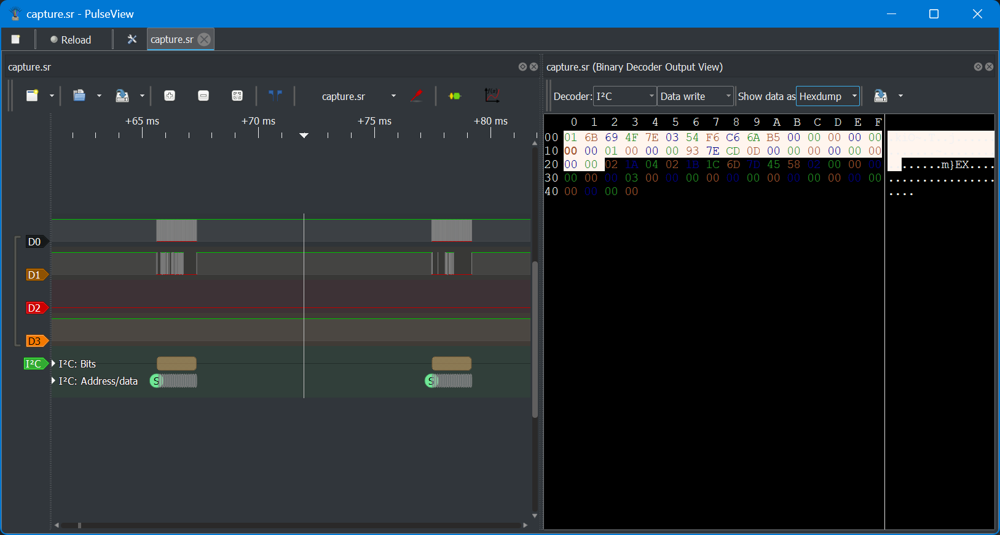
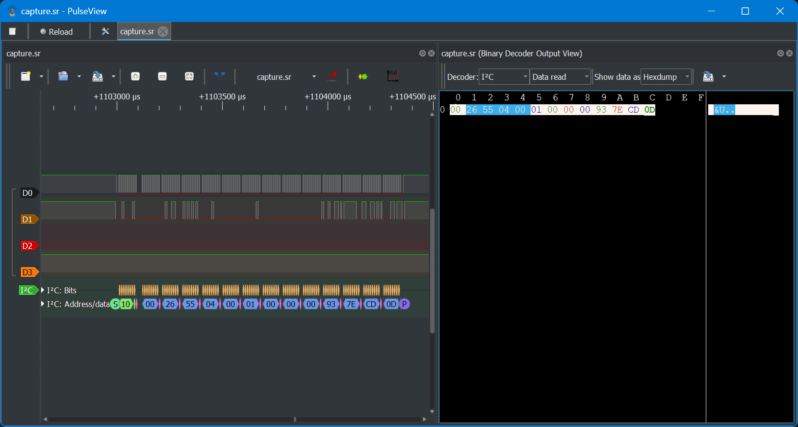

# Two wires

## 题目简述

附件包含 Arduino AVR 固件、I²C 逻辑分析仪捕获和 EEPROM 镜像。固件把一个 64 位计数器与 20 字节密钥组成的状态保存在 EEPROM 中，并通过 I²C 写请求更新状态、通过读请求返回一次性口令。目标是恢复两组状态，在指定计数器位置计算四个 6 位 HOTP，最终拼出 flag。

题目虽然需要固件逆向和密码计算，但决定数据来源与交互语义的是 AVR 外设、I²C 报文和 EEPROM 布局，因此归入 `hardware-embedded`。

## 解题过程

### 恢复 Arduino 与 I²C 语义

在 Ghidra 中按 AVR 小端处理器导入固件，并启用处理器预定义的 I/O 标签。固件保留了调试符号，`setup`、`loop`、`digitalWrite` 等函数名表明它基于 Arduino 框架。对照 [ArduinoCore-avr 的核心声明](https://github.com/arduino/ArduinoCore-avr/blob/master/cores/arduino/Arduino.h)和 [Wire 回调接口](https://github.com/arduino/ArduinoCore-avr/blob/c8c514c9a19602542bc32c7033f48fecbbda4401/libraries/Wire/src/Wire.h#L47-L48)，可以恢复两个用户回调：

- `i2cOnReceive(int count)`：接收写请求；
- `i2cOnRequest(void)`：处理读请求并发送 `msg_send`。

`setup` 先从 EEPROM 反序列化状态，失败时把 RAM 状态清零，随后初始化 I²C。写请求至少包含 17 字节，可整理为：

```c
struct MsgRecv {
    uint8_t type;
    uint8_t data[16];
};
```

`type` 先被映射为内部 `next_action`，再由主循环执行。合并两层状态机后，报文语义如下：

| `type` | 写入/触发的操作 |
| --- | --- |
| `0` | 用 `data[0:8]` 设置 64 位计数器 |
| `1` | 用 `data[0:10]` 设置密钥前 10 字节 |
| `2` | 用 `data[0:10]` 设置密钥后 10 字节 |
| `3` | 重新生成 OTP，并序列化到 `msg_send` 以刷新旧响应 |

读请求固定返回 13 字节：1 字节类型、4 字节 OTP 和 8 字节同步计数器。

### 识别 HOTP 状态

在 `regen_otp` 中，固件先准备 64 字节的 SHA-1 工作区，其中前 20 字节由两个 10 字节字段拼接而成；另一个 8 字节字段作为计数器。该布局符合 [RFC 4226](https://datatracker.ietf.org/doc/html/rfc4226#section-5.3) 的 HOTP：以 20 字节共享密钥对 8 字节大端计数器做 HMAC-SHA1，再执行动态截断。固件最后对 `0xF4240`（即 $1{,}000{,}000$）取模，因此输出为 6 位十进制数。

需要注意，AVR 的 `__udivmodsi4` 在反编译时容易因调用约定恢复错误而把除数或返回值认错；这里应结合寄存器传参和最终模数交叉确认，而不能只相信默认反编译签名。

### 从 I²C 捕获恢复第一组状态

在 PulseView 中为两根数字通道启用 I²C 解码器，按写事务依次读取 `type` 与数据。捕获中恢复出的第一组状态为：

```text
secret  = 6B 69 4F 7E 03 54 F6 C6 6A B5 1A 04 02 1B 1C 6D 7D 45 58 02
counter = 01 00 00 00 93 7E CD 0D  (little-endian)
        = 994590262544039937
```



读响应中的 OTP 与同步计数器可用于验证协议恢复是否正确：初始计数器对应 $X_1=283942$，计数器增加 9 后对应 $X_2=633153$。



### 从 EEPROM 恢复第二组状态并计算

`EepromData::tryUnserialize` 每次读取 32 字节。前 4 字节是有效性标记，校验通过后，剩余 28 字节正好复制为“8 字节计数器 + 20 字节密钥”。从 EEPROM 镜像可直接读出：

```text
secret  = 32 1C 31 D4 94 54 85 42 44 DE 86 CC 4A B6 DD F4 35 42 90 52
counter = 92 05 00 00 17 CD 92 3A  (little-endian)
        = 4220661299467519378
```

下面的脚本完整实现 RFC 4226 动态截断，并显式区分附件中的小端计数器存储与 HOTP 输入要求的大端编码：

```python
import hashlib
import hmac


def hotp(secret_hex: str, counter: int) -> int:
    secret = bytes.fromhex(secret_hex)
    counter_be = counter.to_bytes(8, "big")
    digest = hmac.new(secret, counter_be, hashlib.sha1).digest()
    offset = digest[-1] & 0x0F
    dbc = int.from_bytes(digest[offset:offset + 4], "big") & 0x7FFFFFFF
    return dbc % 1_000_000


secret_1 = "6B 69 4F 7E 03 54 F6 C6 6A B5 1A 04 02 1B 1C 6D 7D 45 58 02"
counter_1 = int.from_bytes(bytes.fromhex("01 00 00 00 93 7E CD 0D"), "little")

secret_2 = "32 1C 31 D4 94 54 85 42 44 DE 86 CC 4A B6 DD F4 35 42 90 52"
counter_2 = int.from_bytes(bytes.fromhex("92 05 00 00 17 CD 92 3A"), "little")

print(hotp(secret_1, counter_1))       # 283942
print(hotp(secret_1, counter_1 + 9))   # 633153
print(hotp(secret_2, counter_2 + 32))  # 431432
print(hotp(secret_2, counter_2 + 64))  # 187457
```

四个结果按题目要求拼接：

```text
hgame{283942_633153_431432_187457}
```

## 方法总结

- 核心技巧：借助 Arduino 符号和 Wire 回调恢复 AVR 固件语义，解析 I²C 状态机与 EEPROM 布局，再按 RFC 4226 计算 HOTP。
- 识别信号：固件同时出现 20 字节密钥、8 字节递增计数器、SHA-1 初始化和模 $1{,}000{,}000$，应优先判断为 6 位 HOTP。
- 复用要点：协议的线传输字节序、MCU 内存字节序和密码算法规定的编码可能不同。本题计数器在 I²C/EEPROM 中按小端保存，但进入 HMAC 前必须编码为 8 字节大端值；逻辑分析结果还应使用读响应中的 OTP 做一次闭环验证。
