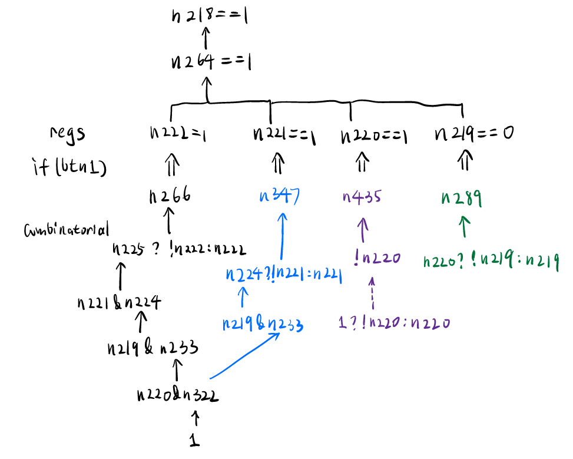
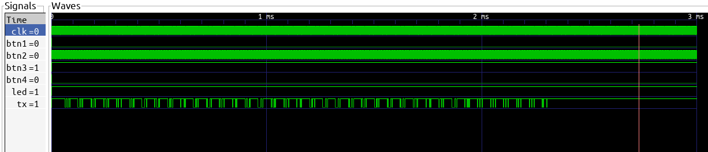

# 外星人的音游掌机

## 题目简述

附件是 Lattice iCE40-HX1K FPGA 的 bitstream 和引脚约束，外部接口包含四个按钮、LED 与 UART。无需真实硬件；iCE40 比特流格式有开源工具链，可以恢复门级 Verilog。目标是从 LED 使能信号反向追踪按钮条件，再仿真同一条件触发 UART 输出。

## 解题过程

### 从 bitstream 恢复 Verilog

Project IceStorm 可先把二进制 bitstream 解包，再结合约束文件给信号恢复名称：

```bash
iceunpack bitstream.bin bitstream.rev.asc
icebox_vlog -p constraint.pcf bitstream.rev.asc > reverse.v
```

与其逆完整 UART 发送器，不如从 `led` 的组合逻辑向输入追踪，因为题面说明 LED 亮起与 flag 发送使用同一触发条件。



### 化简四个按钮条件

LED 逻辑可化为三个条件：

```verilog
n218 == 1
n15 == 1
(n223 ? !btn2 : btn2) == 1
```

其中：

```verilog
assign n15 = btn3 ? !btn4 : 1'b0;
always @(posedge clk) n223 <= btn2;
```

所以 `btn3` 必须恒为 1，`btn4` 恒为 0；`n223` 保存上一周期的 `btn2`，第三个条件要求 `btn2` 每个时钟周期反相。

剩余四个寄存器按 `n222 n221 n219 n220` 排列后恰好构成 4 位二进制累加器。目标状态是 `1101`，因此 `btn1` 需要保持有效 13 个时钟周期。

### 仿真并解码 UART

测试平台设置按钮：

```verilog
reg btn1 = 0;
reg btn2 = 0;
wire btn3 = 1'b1;
wire btn4 = 1'b0;

initial begin
    btn1 = 1;
    #130;       // 覆盖 13 个目标时钟周期
    btn1 = 0;
    #3000000;
    $finish;
end

always @(posedge clk)
    btn2 <= ~btn2;
```

使用 Icarus Verilog 编译题目恢复出的网表和测试平台：

```bash
iverilog -o sim reverse.v simulation.v
vvp sim
```

波形中 LED 变高后，TX 出现连续串口帧：



UART 每帧为一个低电平起始位、8 个数据位和高电平停止位，数据位 LSB 在前。可手工按波特率采样，也可在测试平台连接一个 UART receiver 并用 `$display` 输出字符。恢复结果为：

```text
flag{FpG4_has_F0Ss_t001cha1n_n0Wwwwww}
```

## 方法总结

- 核心技巧：用 IceStorm 从 iCE40 bitstream 恢复门级 Verilog，从 LED 反向切片输入逻辑，再通过 HDL 仿真取得 UART 数据。
- 识别信号：开放格式 FPGA、提供 bitstream 与 PCF、输出使能和可观察 LED 共用条件。
- 复用要点：先围绕单一输出做逻辑锥切片，避免被完整外设网表淹没；时序寄存器要按“上一周期值”解释，UART 还要确认位序与波特率。
