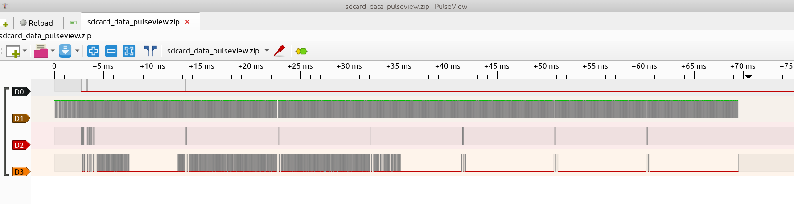
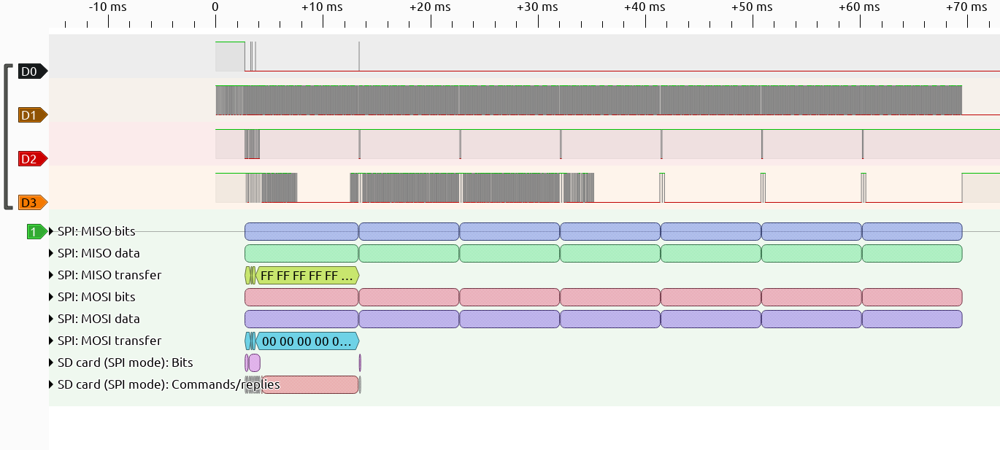

# 片上系统

## 题目简述

附件是逻辑分析仪抓取的 SD 卡 SPI 信号。自制 RISC-V SoC 先从第一个扇区加载引导程序，再由引导程序读取后续扇区中的“操作系统”。第一段 flag 位于引导扇区末尾；第二段 flag 由裸机 RISC-V 固件计算并通过串口输出。

解题必须先解码硬件总线并重组存储内容，随后再逆向固件，因此归入硬件与嵌入式方向。

## 解题过程

### 识别并解码 SD 卡 SPI 信号

用 PulseView 打开采样文件。四路波形的特征很明显：D0 是低电平有效的片选，D1 是连续时钟；D2 只偶尔出现命令数据，D3 有大量返回数据。因此映射为：

- D0：CS；
- D1：CLK；
- D2：MOSI，主机发往 SD 卡；
- D3：MISO，SD 卡发往主机。



在 PulseView 中依次添加 `SPI` 和 `SD card (SPI mode)` 协议解码器，并按上述关系绑定通道。解码后能看到 CMD0、CMD8，以及反复出现的 CMD55/ACMD41 初始化序列；随后出现 CMD17 `Read Single Block`。



CMD17 参数为 0，说明主机正在读取第 0 扇区。导出该次读操作返回的 512 字节，在末尾直接搜索 ASCII `flag{`，得到第一段：

```text
flag{0K_you_goT_th3_b4sIc_1dE4_caRRy_0N}
```

### 手动恢复后续扇区

后续传输没有被 PulseView 的 SD 卡解码器稳定识别，但原始 SPI 字节仍然存在。对每次 CMD17 事务，依据响应、数据起始标志和固定的 512 字节块长度，从 MISO 流中截取数据，再按读取顺序拼接。引导扇区代码表明它会读取扇区 1 至 6，因此把这六块连接起来就是操作系统固件。

可以先反汇编第 0 扇区确认加载逻辑：

```bash
riscv32-unknown-elf-objdump -D -m riscv -b binary first-sector.bin
```

关键指令把每个 512 字节块复制到从 `0x20001000` 开始的内存，地址每轮增加 `0x200`，完成后跳转到 `0x20001000`。这同时给出了后续固件的正确加载基址。

### 逆向 RISC-V 操作系统

把六个扇区作为 RISC-V 小端裸二进制载入 IDA、Ghidra 或 objdump，并设置：

```text
file offset = 0
image base  = 0x20001000
entry point = 0x20001000
```

固件中的 `LED: ON` 和 `Memory: OK` 字符串可用于确认基址。串口状态和数据寄存器分别从常量 `0x93000008`、`0x93000000` 读取或写入。

输出 flag 的逻辑先直接发送 `flag{`，中间三次调用位于 `0x20001018` 的十六进制打印函数，最后发送 `}`。该函数每次把 32 位参数按高位到低位输出八个小写十六进制字符。三次参数分别是：

```text
0x20001018
0x2000106c ^ 0xdeadbeef = 0xfeadae83
0x000000e0
```

拼接即可得到第二段：

```text
flag{20001018feadae83000000e0}
```

官方题解中的 IDA 加载、rebase 和反汇编截图均已转写成上述具体设置、地址和指令含义，不再保留为图片。

## 方法总结

逻辑分析题应分三层处理：先由波形特征确认总线和通道方向，再按协议事务边界恢复原始字节，最后依据引导代码建立固件的加载地址与执行链。自动协议解码失败不等于数据丢失；只要时钟与数据信号完整，仍可利用已知命令格式和固定块长手动重组。逆向裸固件时，正确的架构、端序和 ImageBase 比反编译器本身更重要。
