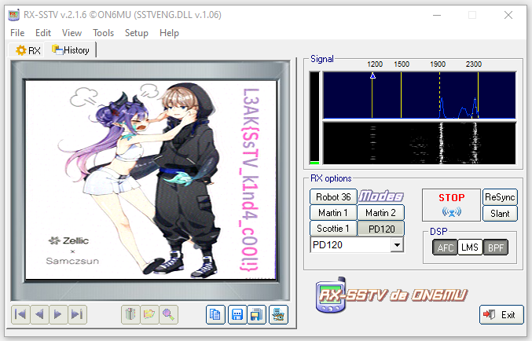

# L3akCTF 2024 Celestial Writeup

## 题目简述

题目只给出一段 48 kHz、16 位、单声道 WAV，时长约 127 秒。音频由连续扫频和周期性同步音组成，而不是语音。频谱中能看到 SSTV（Slow-Scan Television）的典型结构：约 1200 Hz 的行同步音、1500–2300 Hz 的像素亮度/颜色扫描区间，以及开头用于识别模式的控制音。

决定性任务是把音频当作模拟无线图像传输信号解调，而不是在音频元数据中搜索文本。

## 解题过程

先确认文件参数并观察频谱：

```console
ffprobe -v error \
  -show_entries format=duration:stream=sample_rate,channels,bits_per_sample \
  -of default=noprint_wrappers=1 attachment.wav

sox attachment.wav -n spectrogram -o celestial-spectrum.png
```

约两分钟的传输时长、1200 Hz 同步脉冲与 1500–2300 Hz 连续扫频共同指向 SSTV。把 WAV 直接送入 SSTV 解码器即可，不需要采用“扬声器播放、麦克风重录”这种会再次引入噪声的方式。

例如在 RX-SSTV 中选择 WAV 作为输入，让软件自动识别模式；若自动识别失败，可手动选择截图中确认的 `PD120`，并从信号起点重新同步。公开赛后记录使用 RX-SSTV 成功恢复，解码画面如下：



图像右侧的紫色竖排文字为：

```text
L3AK{SsTV_k1nd4_c00l!}
```

解码模式、结果和原始音频特征也可在[公开赛后题解](https://kashmir54.github.io/ctfs/L3akCTF2024/)中交叉验证；即使不访问该链接，识别依据、软件设置和最终结果已经完整写在正文中。

## 方法总结

SSTV 音频常表现为持续的高音调扫描，并夹有规则的 1200 Hz 同步脉冲；它和摩斯电码、普通双音多频的离散短音有明显区别。处理流程应是“检查参数与频谱 → 识别 SSTV → 直接从 WAV 解调 → 必要时手动选择模式和重同步”。恢复出的图像是题目核心视觉证据，因此应保留语义化命名的解码图，而不是只抄写其中的 flag。
