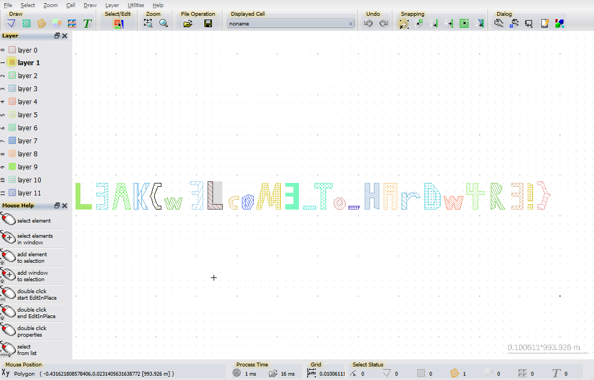

# L3akCTF 2024 Layout Writeup

## 题目简述

附件是一个 GDSII 集成电路版图文件。GDS 不是普通图片，而是按 cell、layer 和几何图元保存芯片版图的层次化格式；题目把 flag 的字符轮廓分别画在多层金属图形中，需要使用版图查看器按正确视野显示。

## 解题过程

使用能够读取 GDSII 的工具打开 `layout.GDS`。官方解答使用 [LayoutEditor](https://layouteditor.com/)，其他能正确显示多层 GDS 的工具同样可行。

打开文件后执行以下操作：

1. 在 cell 列表中选择文件内的顶层 cell；
2. 启用所有可见 layer，避免只显示单层而漏掉字符；
3. 使用“Zoom fit”把全部图元缩放到视野；
4. 保持各层不同颜色显示，便于辨认相邻字形。

画布中的多层多边形直接拼成一行 flag：



逐字符读取为：

```text
L3AK{w3LcoM3_To_HArDw4R3!}
```

图像结果与[公开赛后题解](https://kashmir54.github.io/ctfs/L3akCTF2024/)记录一致。这里保留截图是因为颜色、图层和字形的空间布局本身就是取证证据，无法用纯文本完整替代。

## 方法总结

看到 `.gds`、`.gdsii` 一类文件时，应先想到芯片版图而不是图像隐写。此类题的常见检查顺序是：确定顶层 cell、显示全部 layer、缩放至全部对象，再观察几何图元是否形成文本或图案。只开一个 layer 很容易把跨层绘制的字符误判为噪声。
